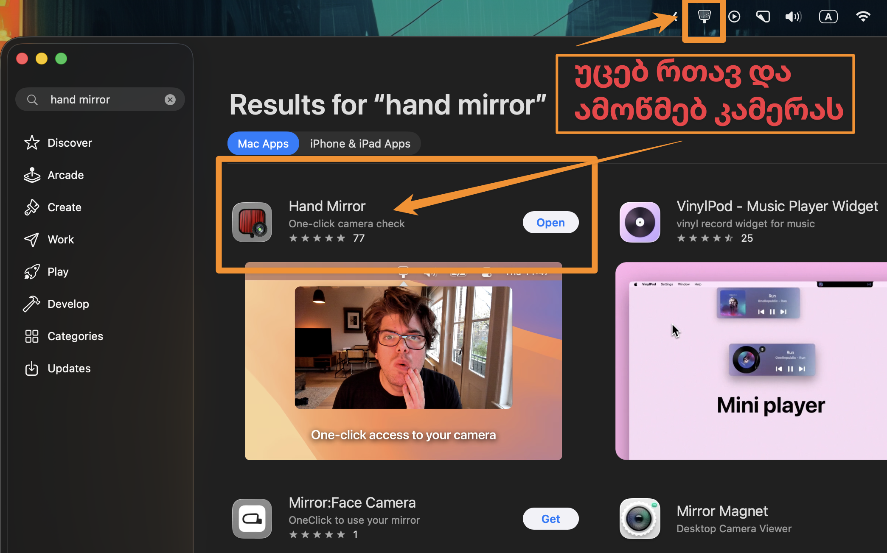
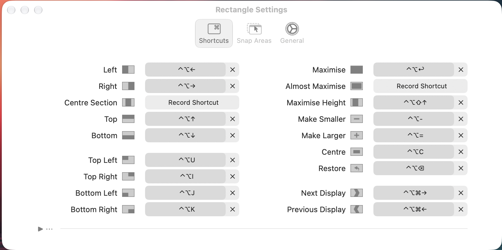

---
aliases:
  - მაკის პროგრამები
  - mac programs
  - macbook apps
  - programebi macbook
  - programebi mac
  - programebi apple
  - mac apps
  - სურათის გაფართოება
  - ფოტოს გაფართოება
  - იმიჯების გადმოსაწერი
  - მაკის გადმოსაწერი პროგრამა
tags:
  - apple
  - homebrew
done: false
created: 2026-01-11
sourse:
---
# macbook programs list

1. **App cleaner** - ( portable ). [4:00 - 5:00](https://www.youtube.com/watch?v=r7nPee-az50) - შლის ყველაფერს , მომყოლ ფაილებსაც
2. **Dropover** ( _ფასიანია_ ; craked ) [5:00 - 6:00](https://www.youtube.com/watch?v=r7nPee-az50) - ფაილებს გაამოძრავებ და კონტეინერი გაიჩითება რომელშც ყრი ფაილებს კალათასავით, რომ მერე სადმე გადაიტანო.
3. **LaunchOS** - ( cracked ) - -  [download](https://appstorrent.ru/4718-launchos.html) , [Tutorial](https://www.youtube.com/watch?v=qLpPPold6oU) ; ამატებს გამქრალ ***launchPad*** - ს. ( ***golden gate*** განახლებიდან არ მუშაობს.)
4. **BuhoLaunchpad** - - - ***golden gate*** -ზე მუშაობს. - [download](https://appstorrent.ru/4056-buholaunchpad.html).
5. **thock** ( უფასოა ) - - -  მექანიკური და სხვანაირი კლავიატურის ხმები ბეჭდვისას.
6. **Aldente** ( დაკრაკული ) - - -  ელემენტს არ აძლევს ნიშნულზე მეტად დატენვის საშუალებას. (ფონში უშვებს  მომყოლ პროგრამა **MSJ**-ის) - ( ბოლო IOS  განახლების მერე, ამას სიტემაში აკუმლატორის სეთინგებში უთითებ უკვე )
7. **NotchNook** ( დაკრაკული ) [7:00 - 8:00](https://www.youtube.com/watch?v=5X_cAWk4wx0) - ზემოთ ამატებს **კუნძულის** ფუნქციონალს. ფაილი აქვე შეგიძლია აიტანო და airdrop ჩაირთვება. და ასევე შიგნით ჩაშენებული აქვს **Dropover** პროგრამის ფუნქციაც. ( რაღაც ***არ დამევასა*,** არც ვიდი და არც მუშაობის სტილი და არ ვხმარობ. )
8. **Alcove** ( cracked ) - - - ესეც  ზემოთ  **კუნძულის** ფუნქციონალი. ეს ნორმალურია.  
9. **Mate translate** -( App Store. free ) - - - ტრეიში ემატება თარჯიმანი
10. **hand mirror** ( free, market) - უცებ რთავ და ამოწმებ კამერას თრეიდან. 
	1. 
11. **alfred** 
12. **PastePal**  ( free ) - [13 Mac Apps -  12:50 - YouTube](https://www.youtube.com/watch?v=OK-UTwVyg5o)  
13. **Pika** ( free ) - [15:25  - YouTube](https://www.youtube.com/watch?v=OK-UTwVyg5o) 
14. **One Switch** - ( ***cracked*** არ მაქვს მუშა ვერსია გადმოწერილი ) [Download](https://appstorrent.ru/400-one-switch.html)  , [Essential Mac Apps for 2025](https://www.youtube.com/shorts/ylDDWYDMO-4) 
15. **TextSniper** - ( ***cracked*** არ მაქვს მუშა ვერსია გადმოწერილი ) [download…](https://appstorrent.ru/448-textsniper.html) ,  
16. **Raycast** ( free; [Raycast - Your shortcut to everything](https://www.raycast.com/?via=colin-rob&gad_source=1&gad_campaignid=23381297737&gbraid=0AAAABBzv0nNmwogTBfzr9i6zhyxnDozqK&gclid=Cj0KCQiA1JLLBhCDARIsAAVfy7iAZouiy_zRbdPUzAn5Tvfke0OIhbtb7BtztCOd18wuqmQNcHqkmBMaAn_EEALw_wcB)  ) - - - [Обзор Raycast](https://www.youtube.com/watch?v=ViTc57_aC7M) ;  [Raycast — приложение](https://www.youtube.com/watch?v=4Rvn_DSG6Dk) ; 
17. **CopyClip** - clipboard history. ( free on App Store ) - ინახავს პანელში ბუფერის ისტორიას. 
18. **DockDoor** (free) - **alt + tab** ის დროს ნახულობ გახსნილ ფაილებს . მთლად კარგად ვერ მუშაობს. ამას `alttab` ჯობია. 
19. **cheatsheet** ( cracked ) - - - ამ პროგრამის მერე სხვა პროგრამა როცა აქტიური გაქვს. რაღაც ღილაკს აწვები და იმ პროგრამის ყველა hotkey გამოაქვს ეკრანზე.   [ 9:46 - YouTube](https://www.youtube.com/watch?v=9F71CrriAus) 
20. გასარჩევია **blip** , ფოტოს compressor... : [Title Unavailable -  Site Unreachable](https://www.youtube.com/watch?v=qrfwEYrs2PU)   
21. გასარჩევია:  [My 14 favorite MacOS apps I use everyday - YouTube](https://www.youtube.com/watch?v=MXTBu6PTU64) 
22. **spark** (free)  - - - ფოსტის კლიენტი.
23. **BetterDisplay pro** - - - ეკრანის და დამატებით მონიტორების ***გაფართოებების რეგულირებისათვის***. (უკეთესი ვერსიაა მოსანახი)
24. **XP pen** ( Deco 640 ) - - - პლანშეტის მუშაობას დრაივერის ხელით დაყენება უნდა . [Deco 640-Drivers Download](https://www.xp-pen.com/download/deco-640.html) 
25. **FineTune** - - - აუდიო მანიპულაციები
26. **cotypist** - - -  [Cotypist](https://cotypist.app/) AI პროგრამა, რომელიც ლოკალურად კომპზე აყენია, უყურებს შენს ეკრანს და ტექსტის კრეფისას გეხმარება აკრეფაში. 
27. **DeskMinder. Reminders & Tasks** ( free on App Store ) - - - ეკრანზე  [ტოჩკაა](https://apps.apple.com/pl/app/deskminder-reminders-tasks/id6740942938?mt=12)  და გაფრთხილებს ლამაზად.
28. **choclift: workflow sweetener** ( free  on App Store ) - - - ტელენოდან პროგრამების გაშვება 

###### chrome extentions:
1. **UnTrap** - - - ***youtube***-ის გვერდს არედაქტირებ [6:19 - YouTube](https://www.youtube.com/watch?v=PbbTinMPDxI) 
2. 

###### utilites:
1. **BalenaEtcher** - - - ***rufus*** -ის პონტი მაკებზე. 
2. **Tuxera** ( cracked ) - - - ***NTFS*** დისკებთან მუშაობა. [tutorial](https://www.youtube.com/watch?v=MlSh1YinSfQ) ; [download](https://appstorrent.ru/59-tuxera-ntfs.html) ;  
3. **CleanMyMac** ( cracked ) - - - [Download Link](https://www.torrentmac.net/cleanmymac-5-3-0/)   
4. **Folder Preview** - ( დაკრაკული ) - პრაბელზე სწრაფად ნახულობ ფოლდერების და არქივების შიგთავს.
5. **keka** - - - კიდევ ერთი **არქივატორი**. სტანდარტულზე ბევრად სწრაფად აარქივებს და ამოარქივებს ფაილებს. 
6. **stats** - - - system info icons  
7. **DaisyDisk** ( cracked )  - - - ვიზუალურად განახებს ***დირექტორიების (folders) ზომებს***.  
8. **OmniDiskSweeper** ( free ) - - - ასევე ნახულობ  ***ფაილების ზომებს***. [Link](https://www.omnigroup.com/more)
9. **hidden bar** ( უფასოა, მარკეტში ) - ზემოთ ტრეიში მალავ ზედმეტობებს [1:44 - 2:13](https://www.youtube.com/watch?v=qLpPPold6oU) . [Homebrew Formulae: hiddenbar](https://formulae.brew.sh/cask/hiddenbar#default) . 
10. **Bartender** ( cracked ) - - - ***golden gate*** განახლებაში მუშაობს. თრეიში იკონკებს მალავს. [download](https://appstorrent.ru/133-macbartender.html).
11. **Alt+Tad** ( მგონი free ) - - - [download](https://alt-tab-macos.netlify.app/) ; `option + tab` -ით **ყველა ჩაკეცილ ფანჯრებს გამოიტანს.**  დეფაულთად Alt + Tab -ს მხოლოდ აქტიური ფანჯრების გამოტანა შეუძლია. 
12. **CleanMyKeyboard** - ( Free on App Store ) - - - ბლოკავს კლავიატურას და შეგიძლია გაწმინდო. ტრექპადი აქტიურია. 
13. **coconutBattery** ( პორტატული ) - ელემენტის მონაცემებს განახებს 
14. **Caffeine**
15. **LinearMouse** ( cracked ) - - - **mac** -ზე ***მაუსის*** "კარგად" დასაკავშირებლად. **setting** -დან კარგად დოშტიკვა შეილება.
16. **Widgetter System Stats Widgets** ( cracked ) - - - ეკრანზე ***ვიჯეტები***. [Download](https://appstorrent.ru/3962-widgetter-system-stats-widgets.html) . 
17. **Vorssaint** { free } - - - ***powertoys***-ის მსგავსია Mac-თვის. [Download](https://github.com/vorssaint/vorssaint-utils) 
18. **macUSB** - - - [Link](https://www.youtube.com/watch?v=f82C2r47-IY) ; [Link2](https://www.macusb.app/) ; ( **იმიჯების გადმოსაწერი** ) ფლეშკაზე რომ ჩაწერო ისოები. მაგრამ რეალურად კაია ის რომ თვითონ იწერს ასარჩევში mac იმიჯებს და ფლეშკაზე დააინსტალირებ. მერე იქიდან დააინსტალირებ იმ mac-ზე რომელსაც აქვს იმ კონკრეტული ვერსიის მხარდაჭერა. 
19. **ghostty**  ( brew )- - - Terminal emulator [Homebrew Formulae: ghostty](https://formulae.brew.sh/cask/ghostty) ; [Ghostty](https://ghostty.org/)  ; 
20. **rectangle** ( brew ) - - - [Homebrew Formulae: rectangle](https://formulae.brew.sh/cask/rectangle#default) , ფანჯრების ეკრანზე განაწილება მაუსით. 
	1. 
21. 

###### Text : 
1. **Word** = = =  Pages
2. **Excel** = = = Numbers - ყველა ეს პროგრამები ჩვეულებრივ დაექსპორტირდება. . .
3. **PowerPoint**  = = = Keynote 
4. **Bear: Markdown Notes** ( free on App Store ) - - - 
5. **PDF gear** ( free on App Store ) - - - ***არედაქტირებს, აკონვერტირებს, ჭრის/კერავს  pdf*** ფაილებს. 
6. **UPDF** ( cracked ) - - - უკეთესად ***არედაქტირებს ფაილებს***, როგორც word-ში
7. **MacWhisper**:  - - - [link](https://www.youtube.com/watch?v=GutdeNtwnps) . Идеальное приложение для перевода голоса из аудио или видео в текст.

###### Photoshop Apps / Media : 

1. **Pixelmator Pro**  ( cracked )  - - - ***photoshop*** -ის ალტერნატივა მაკზე. ასევე გასარჩევი:  [Топ-5 Лучших Фоторедакторов 2023](https://www.youtube.com/watch?v=RX-V7Hjk2uI) 
2. **Affinity** ( free ) - - - like ***photoshop***  - [tutorial - YouTube](https://www.youtube.com/watch?v=fKyEGwiHyvw&t=30s) ; [Download for Mac and Windows](https://www.affinity.studio/download) . 
3. **Skitch** ( free - portal ) - - - შიგნით სურათებს ჩააგდებ და უცებ რამეებით მონიშნავ, დააწერ, დაბლურავ ...
4. **CleanShot X** - ( cracked ) [Один момент…](https://appstorrent.ru/672-cleanshot-x.html)  ***screenshot***-ების კაი პროგრამა. ***შიგნითვე  არედაქტირებ***. , ***სურათიდან ტექსტი ამოაქვს***, ***მთელი გვერდის სქრინებს იღებს.*** ...  [13:36 ](https://www.youtube.com/watch?v=OK-UTwVyg5o) 
5. **upscayl** ( cracked ) - - - სურათს უცვლი ***გაფარათოებას***.  [Link](https://appstorrent.ru/2581-upscayl.html) 
6. T**opaz Video AI:** Программа для улучшения качества плохих видео, стабилизации картинки и плавного замедления кадров.
7. **Topaz Photo AI** ---
8. **VideoProc Converter AI:** - - - [ლინკი](https://www.youtube.com/watch?v=GutdeNtwnps) . Швейцарский нож для сжатия объёмных файлов, конвертации любых форматов и апскейла видео. 
9. 

###### Virtualization / Emulation:

1. **parallels** ( cracked ) - - - ***ვირტუალური მანქანა***.  [Download-File](https://appstorrent.ru/61-parallels-desktop.html) ; [Tutorial](https://www.youtube.com/watch?v=iMyve4UIsIs)
2. **VMwareFusion** - - -  ***ვირტუალური მანქანა***, windows-ის (**ARM** ვერსიები კარგად მუშაობს)  გასაშვებად.
3. **UTM** - - - ***ვირტუალური მანქანა*** , სხვა OS -ების( x86/x64 , მაგრამ **არაოპტიმიზირებულია** ) გასაშვებად. 
4. **Whisky** - - - ( ემულატორი ) windows ***თამაშების*** ემულატორი( ლოკალურად უშვებ exe ფაილებს. ბევრი არ მუშაობს კარგად)
5. **crossover** - - - ( ემულატორი ) რეალურად, აინსტალირებ windows ver steams, და იქიდან უშვებ windows ვერსია ***თამაშებს***.
6. 

###### Remote Apps : 

1. **windows app** ( free on App Store ) - - - ***RDP*** . 
2. **Rustdesk** - ( ***Remote desktop*** ; **free** from github ; Mac , Windows, android ...  ) [RustDesk: Open-Source Remote Desktop with Self-Hosted Server Solutions](https://rustdesk.com/)  ;  [github](https://github.com/rustdesk/rustdesk/releases/tag/1.4.5) ; [Tutorial - YouTube](https://www.youtube.com/watch?v=R5SkQSiUJvM) ; 
3. ***send file***:  - **airdrop** - მხოლოდ Apple სისტემაში 
4. ***send files***: - **Blip** - ( free ) [3:00 - 3:55](https://www.youtube.com/watch?v=5X_cAWk4wx0) [download](https://blip.net/download) - ანდროიდ ტელეფონზე **airdrop**-ის პონტი
5. ***send files*** : - **LocalSend** ( free; Apple, Windows, Linux, Android; ) [download](https://localsend.org/) ; ***შიდა ქსელში*** , ერთმანეთში იგზავნება ფაილები. [tutorial](https://www.youtube.com/watch?v=FMV6Ih0kYJQ) ;
6. 