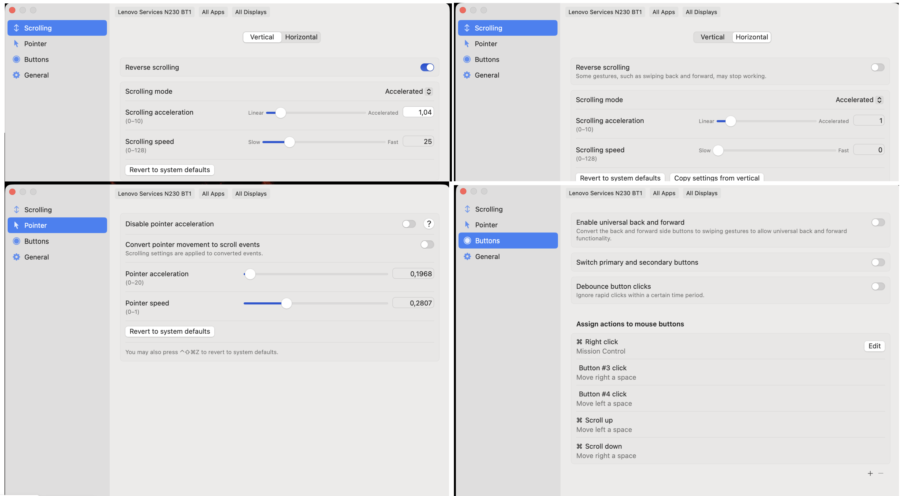

---
aliases:
  - mausi
  - მაუსი
  - მაკის მაუსი
  - აპლის მაუსი
  - mac mause
  - apple mause
tags:
  - apple
done: false
created: 2026-07-22
sourse:
---
# LinearMouse

 
.
> **LinearMouse**: ეს სეთინგები საინსტალაციო ფაილთან კიდე მაქვს შენახული !!!

Mac-ზე მაუსის შუა ღილაკით (scroll wheel) დესკტოპებს შორის გადართვა სტანდარტული პარამეტრებიდან პირდაპირ არ ხდება, რადგან Apple ამისთვის ძირითადად "**Trackpad**"-ის ჟესტებსა და "**Magic Mouse**"-ს იყენებს.

თუმცა, არსებობს რამდენიმე გზა, რომ ჩვეულებრივი მაუსი თქვენს ჭკუაზე "მოათვინიეროთ":

[https://linearmouse.app/](https://linearmouse.app/)

---

### 1. ყველაზე მარტივი გზა: Mac-ის პარამეტრებიდან

თუ თქვენს მაუსს შუა ღილაკის (ბორბლის) გარდა აქვს **გვერდითი ღილაკები**, შეგიძლიათ ისინი პირდაპირ მიაბათ დესკტოპების გადართვას:

1. გახსენით **System Settings** -> **Keyboard** -> **Keyboard Shortcuts**.
    
2. მარცხენა მენიუში აირჩიეთ **Mission Control**.
    
3. ჩამოშალეთ Mission Control-ის სია და იპოვეთ:
    
    - `Move left a space`
        
    - `Move right a space`
        
4. დააწკაპუნეთ არსებულ Shortcut-ზე და შემდეგ დააჭირეთ მაუსის იმ ღილაკს, რომელიც გინდათ რომ გამოიყენოთ.
    

### 2. მესამე მხარის უფასო აპლიკაცია (რეკომენდებული)

თუ გსურთ, რომ მაინცდამაინც **Scroll Wheel** (ბორბალი) გამოიყენოთ (მაგალითად: `Option + Scroll`), დაგჭირდებათ პატარა აპლიკაცია, რომელიც მაუსის შესაძლებლობებს აფართოებს.

**[MacMouseFix](https://www.google.com/search?q=https://mousefix.org/)** ან **[Linearmouse](https://linearmouse.app/)** — საუკეთესო უფასო ხელსაწყოებია:

- შეგიძლიათ დააყენოთ, რომ `Command + Scroll` ან `Middle Click + Scroll` გადადიოდეს სხვადასხვა დესკტოპზე.
    
- ასევე ასწორებს მაუსის ბორბლის "არაბუნებრივ" სქროლვას (Smooth scrolling).
    

### 3. **LinearMouse**

მსუბუქია და ზედმეტი "ხმაურის" გარეშე მუშაობს. მასში დესკტოპების გადართვის (Spaces) ფუნქცია პირდაპირ **Buttons** სექციიდან იმართება.

მიჰყევით ამ ნაბიჯებს:

### 3.1 ღილაკის კონფიგურაცია

1. გახსენით **LinearMouse**-ის პარამეტრები (ზედა მენიუს ზოლში ხატულაზე დაჭერით).
    
2. გადადით ტაბზე **Buttons**.
    
3. დააჭირეთ **+** ღილაკს (ქვედა მარცხენა კუთხეში), რათა დაამატოთ ახალი ბრძანება.
    
4. აირჩიეთ მაუსის ის ღილაკი, რომელიც გინდათ გამოიყენოთ. მაგალითად:
    
    - თუ შუა ბორბალზე დაჭერა გინდათ, დააჭირეთ მას (პროგრამა ამოიცნობს როგორც `Button 3`).
        
    - თუ გვერდითი ღილაკები გაქვთ, დააჭირეთ ერთ-ერთ მათგანს (`Button 4` ან `Button 5`).
        

### 3.2 ფუნქციის მინიჭება

ღილაკის არჩევის შემდეგ, მის გასწვრივ აირჩიეთ მოქმედება (**Action**):

1. ჩამოშალეთ სია და მოძებნეთ **Mission Control**.
    
2. აქ ნახავთ ორ ძირითად ფუნქციას:
    
    - **Move left a space** (წინა დესკტოპზე გადასვლა)
        
    - **Move right a space** (შემდეგ დესკტოპზე გადასვლა)
        

[!TIP] **თუ გსურთ, რომ მხოლოდ შუა ღილაკით (ბორბლით) მართოთ ორივე მხარე:** შეგიძლიათ დაამატოთ "Modifier Key". მაგალითად: დააყენეთ, რომ **Command + Button 4** მიდიოდეს მარცხნივ, ხოლო **Command + Button 5** მარჯვნივ.

---

### 3.3 ალტერნატივა: სქროლვით გადართვა (Scrolling)

თუ გინდათ, რომ რომელიმე კლავიშზე (მაგალითად, **Option**) დაჭერისას ბორბლის დატრიალებით გადავიდეს დესკტოპები:

1. გადადით ტაბზე **Scrolling**.
    
2. იპოვეთ სექცია **Modifiers**.
    
3. აირჩიეთ კლავიში, მაგალითად **Option (⌥)**.
    
4. მის გასწვრივ აირჩიეთ ფუნქცია: **Switch spaces** (ან მსგავსი დასახელება ვერსიის მიხედვით).
    

### მნიშვნელოვანი შენიშვნა

იმისათვის, რომ ამ ფუნქციამ იმუშაოს, დარწმუნდით, რომ Mac-ის სისტემურ პარამეტრებში ჩართულია შესაბამისი Shortcut-ები:

- **System Settings** > **Keyboard** > **Keyboard Shortcuts** > **Mission Control**.
    
- დარწმუნდით, რომ "Move left a space" და "Move right a space" მონიშნულია (ჩართულია).