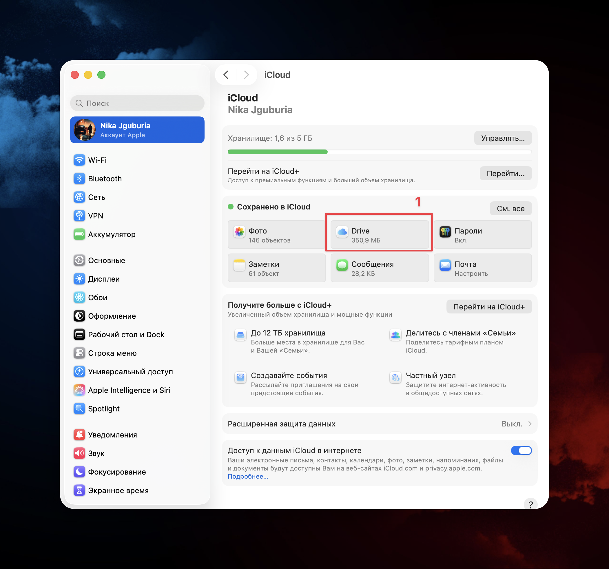
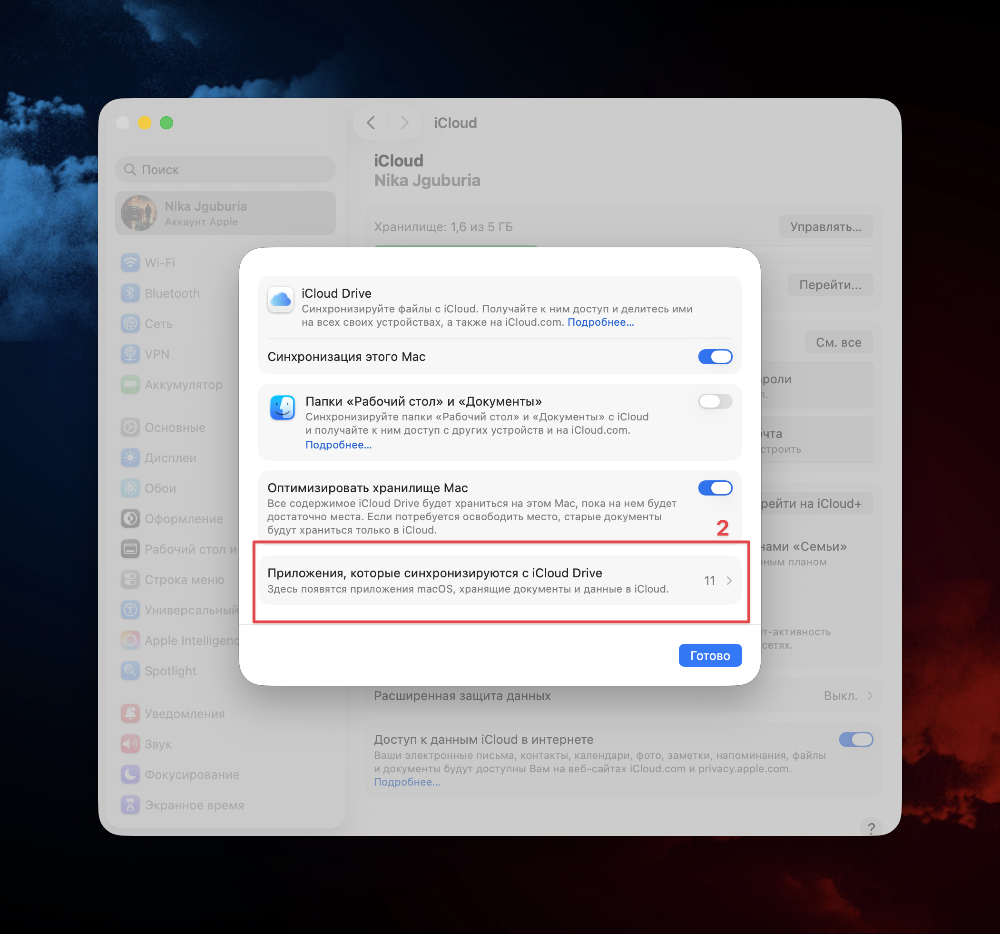
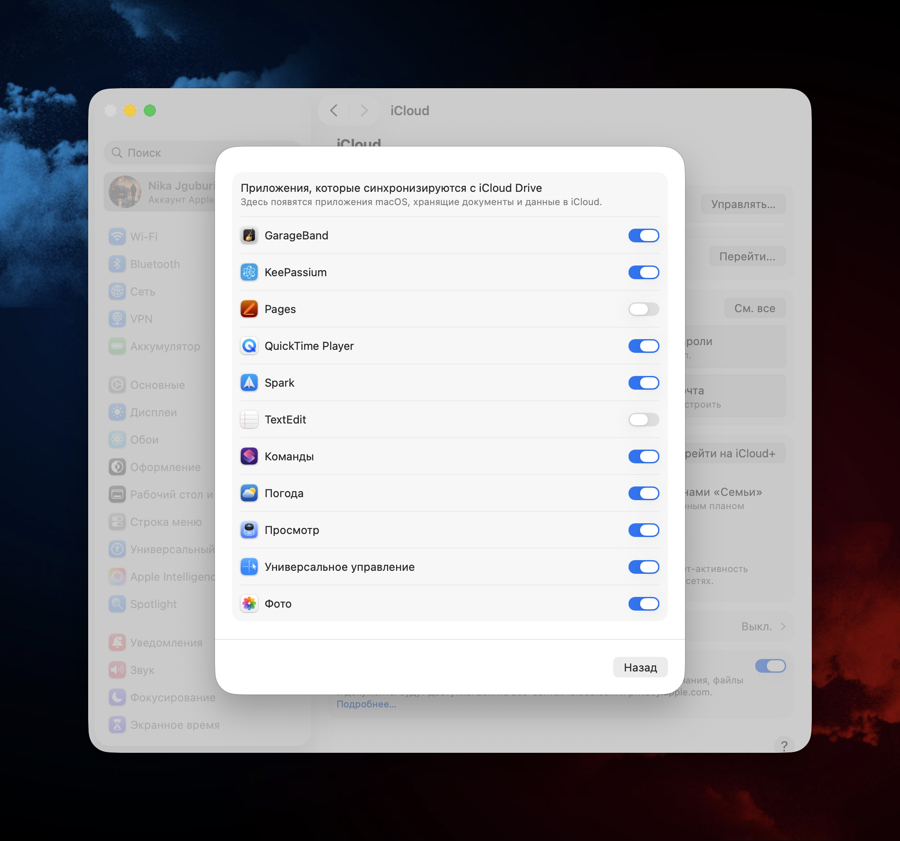

---
aliases:
  - მაკის პროგრამის გახსნა
  - iCloud/Document Picker
  - pirveli gverdi
  - pirveli furceli
  - პირველი ფურცელი
  - პირველი გვერდი
  - პირველი ფანჯარა
  - pirveli fanjara
tags:
  - apple
done: false
created: 2026-03-17
sourse:
---
# Macbook პროგრამის გახსნა

ადრე **macOS**-ზე პროგრამები მართლაც ცარიელი ფურცლით იხსნებოდა, ახლა კი სისტემა გთავაზობს ჯერ არსებული ფაილი აირჩიო ან ახალი შექმნა.

ეს ფანჯარა არის ***iCloud/Document Picker***. მისი მიზანია, რომ პროგრამის გახსნისთანავე გქონდეს წვდომა შენს შენახულ დოკუმენტებზე (განსაკუთრებით iCloud-ში), რათა დრო არ დაკარგო მათ ძებნაში. თუმცა, თუ ძირითადად ახალ ფაილებზე მუშაობ, ეს ზედმეტი ნაბიჯია.

მის მოსაშორებლად და პირდაპირ "**ცარიელ ფურცელზე**" გადასასვლელად, შეგიძლია გამოიყენო ტერმინალი.

## 1. როგორ გავთიშოთ ეს ფანჯარა (ნაბიჯ-ნაბიჯ):

1. გახსენი **Terminal** (შეგიძლია მოძებნო Spotlight-ით).
2. ჩაწერე (ან ჩააკოპირე) შემდეგი ბრძანება : `defaults write -g NSShowAppCentricOpenPanelOnLaunch -bool false` 

```bash
defaults write -g NSShowAppCentricOpenPanelOnLaunch -bool false
```

3. დააჭირე **Enter**.
4. იმისთვის, რომ ცვლილება ძალაში შევიდეს, საჭიროა პროგრამის (მაგალითად, Pages-ის) გადატვირთვა ან სისტემიდან გამოსვლა და თავიდან შესვლა ( **Log out** ).

ამ ბრძანების შემდეგ, პროგრამები ( Pages, TextEdit, Numbers და ა.შ. ) პირდაპირ ახალ დოკუმენტს გახსნიან.

## 2. თუ მოგინდება უკან დაბრუნება:
თუ ოდესმე გადაწყვეტ, რომ ეს ფანჯარა ისევ გჭირდება, ტერმინალში ჩაწერე იგივე ბრძანება, ოღონდ ბოლოში `false`-ს ნაცვლად მიუთითე `true`: `defaults write -g NSShowAppCentricOpenPanelOnLaunch -bool true ` 

```bash
defaults write -g NSShowAppCentricOpenPanelOnLaunch -bool true
```

**პატარა რჩევა:** რადგან Obsidian-ს იყენებ, ალბათ შეამჩნევდი, რომ ის სხვანაირად მუშაობს. ეს იმიტომ, რომ Apple-ის მშობლიური (native) პროგრამები იყენებენ ამ კონკრეტულ სისტემურ ფუნქციას, რომელსაც ზემოთ მოცემული ბრძანება თიშავს.

## 3. iCloud-ის "დოკუმენტების" გათიშვა (თუ ფანჯარა მაინც ჯიუტობს) 

> ამ მეთოდმა ***გაამართლა*** !!!

თუ სურათზე ნაჩვენები ფანჯარა მაინც iCloud-ის საქაღალდეს გიხსნის, ეს ნიშნავს, რომ პროგრამა პრიორიტეტს ღრუბელს ანიჭებს.

1. შედი **System Settings** -> დააჭირე შენს **Apple ID**-ს (სახელს).
2. აირჩიე **iCloud** -> **iCloud Drive**.
3. ნახე **Apps that sync to iCloud Drive** და იქიდან გამორთე **Pages** ან **TextEdit**.


ამის შემდეგ პროგრამა აღარ შეგეკითხება iCloud-ში არსებულ ფაილებზე და პირდაპირ ლოკალურ სამუშაო გარემოს შემოგთავაზებს.

 
.

.

.
