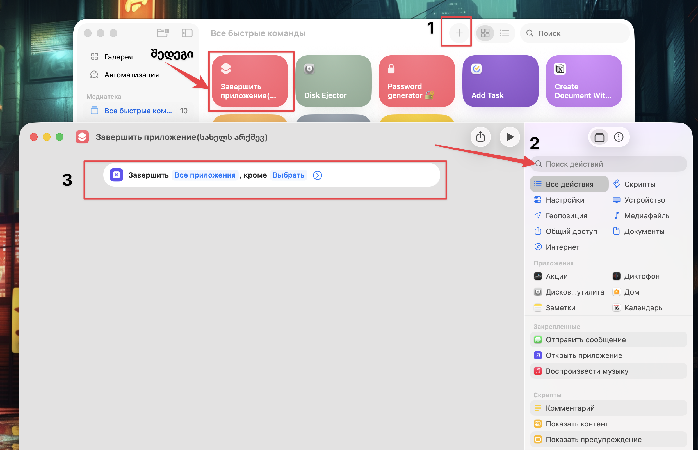

---
aliases:
tags:
  - apple
  - automater
  - shortcuts
done: false
created: 2026-01-15
sourse:
---
# end programs

## automater

**tutorial**:  

 

## shortcuts 

[quit app -  10:00 - YouTube](https://www.youtube.com/watch?v=iLKCwTvGUn0) 

> shortcuts- ებში ამატებ ახალ ბრძანებას და აქედანვე უშვებ: 

.

.
