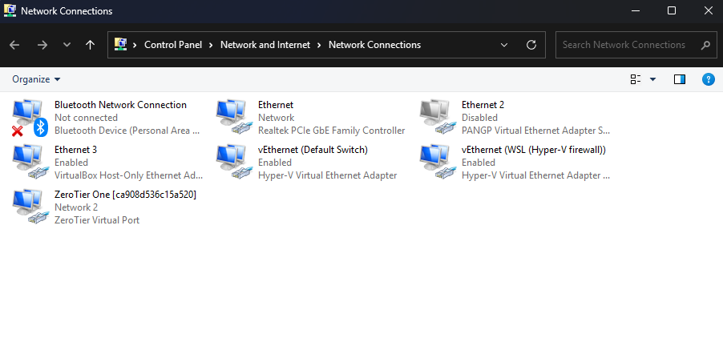

---
aliases:
  - windows tutorial
  - rusuli shrifti
  - backup
  - matherboard
  - ping-ის ლოგების შენახვა
  - ping shenaxva
  - პინგის შენახვა
  - desktopis d diskze gadatana
  - დესკტოპის დ დისკზე გადატანა
tags:
  - windows
  - it
  - cmd
done: false
created: 2025-05-05
sourse:
---
# windows tutorials ( Mini )

##### startup - ის გახსნა cmd -ში:

```bash
run / shell:startup
```

##### user (მომხმარებლის)  ამოშლა  control panel - დან:

```bash
control panel / user accounts / change account type ( ან  delete account )
```

##### BackupDrivers:

```bash
Run Windows PowerShell  ( Open by administrator )
Export-WindowsDriver –Online –Destination D:\BackupDriver
```

##### matherboard CMD verssion:

```bash
CMD:   wmic baseboard get manufacturer
CMD:   wmic baseboard get product
```

##### ping -ის ლოგების შენახვა: 

```bash
on windows powershell :     ping -t 172.20.1.120|Foreach{"{0} - {1}" -f (Get-Date),$_} > D:\ping.txt 
```

##### უზერზე ადმინისტრატორის უფლებების მინიჭება:

```bash
შედიხარ compmgmt.msc    /   group-ში გადადი და administrators-ში ამატებ უზერს
```

##### შიდა ქსელში არსებული ტექნიკის IP მისამართები:

```bash
 cmd  /  arp -a
```

##### Desktop - ის   D:\  დისკზე გადატანა:

```bash
     1. C:\Users\nika.jguburia\Desktop =>  properties
     2. properties  /  Location 
     3. press move  _   ( to destination folder  D:\desktop  )
```

##### ლოკალური  ქსელის   IP  დიაპაზონი:  ( იგივე „სერი IP“ ):

```bash
10.0.0.0     -  10.255.255.255    ( დიდი და საშუალო ქსელები  ძირითადად იყენებენ პროვაიდერები ... )
172.16.0.0   -  172.16.255.255    ( დიდი და საშუალო ქსელები  ძირითადად იყენებენ პროვაიდერები ... )
192.168.0.0  -  192.168.255.255   ( ძირითადად პატარა და სახლის ქსელები  )
```

##### საიტის IP მისამართის გაგება  CMD-ში:

```bash
nslookup google.com
```


##### windows აჩქარება
[windows-ის აჩქარება](windows-ის%20აჩქარება.md) 

##### windows აფდეითების გამორთვა
 [windows update turn off](windows%20update%20turn%20off.md)
  
##### Robocopy to bat file
[ფაილების დაკოპირება window-ში ( robocopy )](ფაილების%20დაკოპირება%20window-ში%20(%20robocopy%20).md) 

```bash
robocopy Destination-A Destination-B /e /purge  (ერთი ერთში აკოპირებს)
robocopy Destination-A Destination-B /e         (ამატებს ახალ ფაილებს და ძველს არ შლის. ჩვეულებრივი ფასთ)
```

##### ჰიბერნაცია 
[ჰიბერნაცია](ჰიბერნაცია%20_%20ჩართვა-გამორთვა.md)

##### თამაშებში ინსტალაციისას რუსული შრიფტი. (Change system locale). win11

```bash
settings/time&language/language&region/administrative language settings/change system locale (აყენებ რუსულ ენას და გადაიტვირთება)
```

##### win11-ზე ძველი თამაშების გაშვება (Error??)

link:  [uplay\_r164.DLL Was not found (Quick fix) - YouTube](https://www.youtube.com/watch?v=TouADpR6p40)

##### ქსელის ადაპტერების გამოძახება windows-ში CMD-დან . ( network connections) :

 
.
```shell
ncpa.cpl
```

