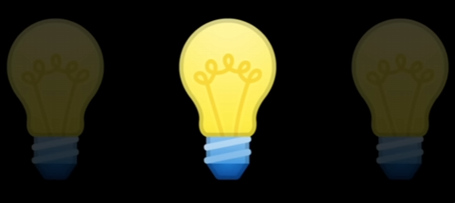
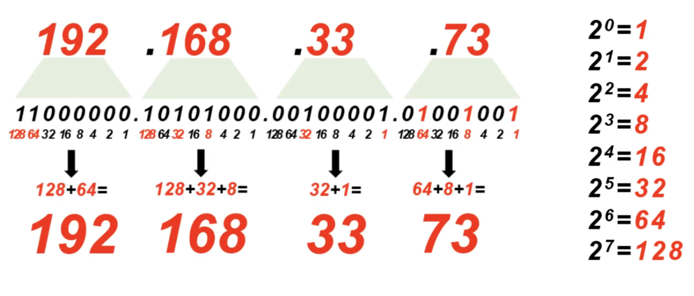
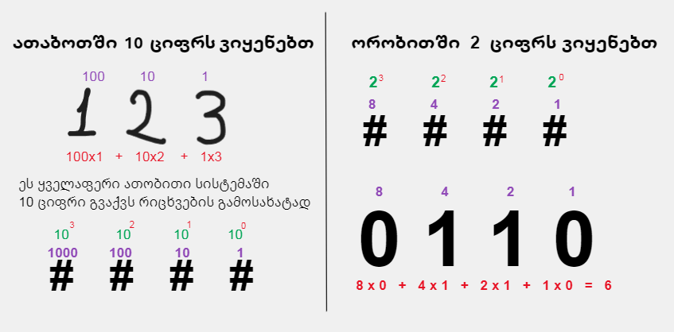
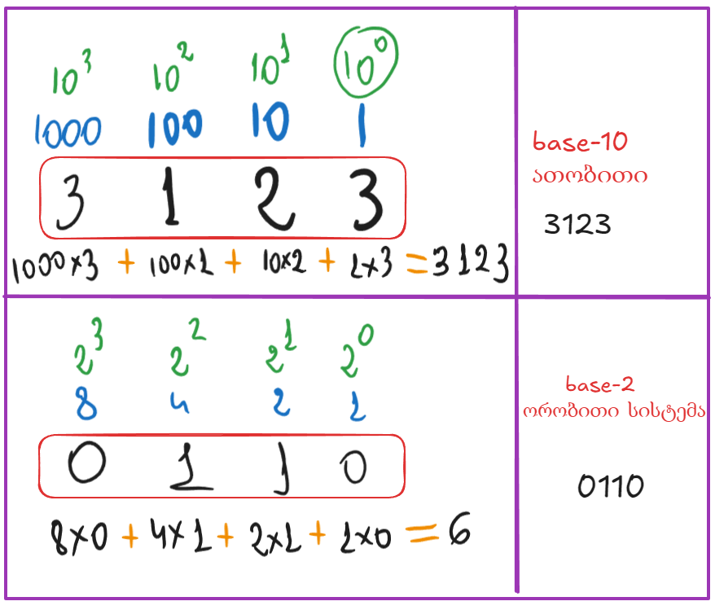
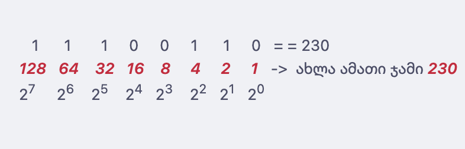
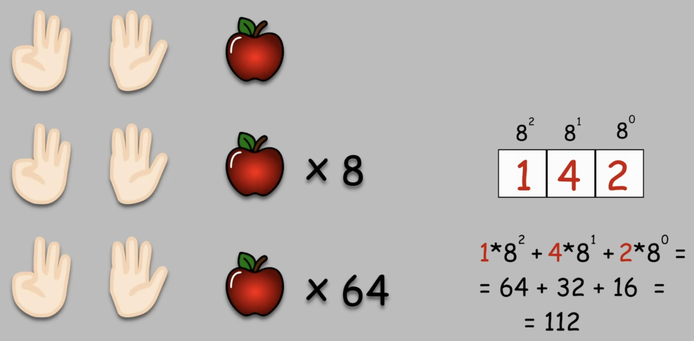
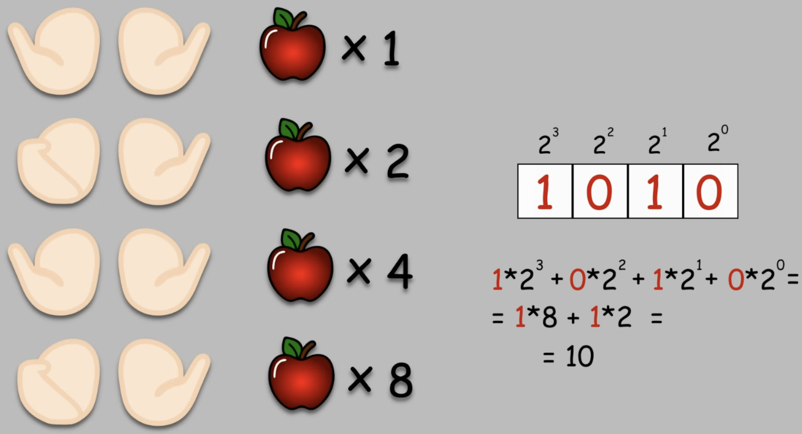
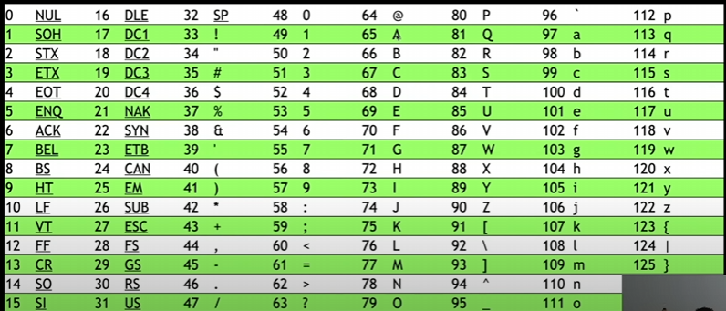

---
aliases:
  - ორობითი სისტემა
  - ბინარული ლისლტემა
  - ბიტი
  - ბაიტი
  - bit
  - bait
  - ათობითი სისტემა
  - atobiti sistema
  - orobiti sistema
  - biti
tags:
  - BitCamp_CS50x
  - it
  - network
---
## Representation 

[CS50x საქართველო - 1:33 - YouTube](https://www.youtube.com/watch?v=PhjJw5Rh8Wc&list=PLinr8mxnrkqtuPr1sTzK89_sMIliDiiZV) 
იგივე რაღაცის **წარმოსახვა**. სიტყვაზე ერთი სიტყვა, რაღაც კონკრეტული განსაზღვრავს რაღაცას და რაღაცეების შიგთავს, რომელიც ერთი სიტყვის ქვეშაა მოქცეული

**რეპრეზენტაციის** ერთერთი საშუალებები: 
- ***unary*** - უნარული თვლის სისტემა  ( ერთობითი, ერთი )
- ***binary*** - კომპიუტერესბი იყენებემ ბინარული თვლის სისტემას ( **0** და **1** ). 
- ***binary digit*** ( ორობითი ციფრი )   -   და ასოები რო ამოვიღოთ დაგვჩება `bi _ t` , აქედან მოდის სიტყვა **bit**. 

## რიცხვის ორიბითში გადაყვანა : 
 
რიცხვის ორიბითში გადაყვანა ხდება  2 მეთოდით:

### 1. არსებული რიცხვის 2-ზე გაყოფით 

არსებული ***რიცხვის 2-ზე გაყოფით***, და მიღებულების ასევე 2 ზე გაყოფით.  სადაც ნაშთი ან `0` ან `1` იქნება, 

#### მაგალითად რისცხვი : ***13 = 00001101*** 

  
**როგორ გამოიყურება 13 *ოქტეტში*:**  

1. შენი გამოთვლილი რიცხვია: **1101** (ეს არის 4 ბიტი).  
2. რადგან ოქტეტში 8 ადგილია, წინ უნდა მივუწეროთ კიდევ 4 ნული: **0000**.  
3. საბოლოო სახე IP მისამართისთვის იქნება: **00001101**.  

**რატომ არის ეს მნიშვნელოვანი?**  
თითოეულ პოზიციას ოქტეტში თავისი "**წონა**" აქვს:  

|128|64|32|16|8|4|2|1|
|---|---|---|---|---|---|---|---|
|0|0|0|0|1|1|0|1|
. . . 

#### მაგალითად რიცხვი  - ***224 = 1100000*** :

|გაყოფა|ნაშთი|
|---|---|
|224 / 2 = 112|0|
|112 / 2 = 56|0|
|56 / 2 = 28|0|
|28 / 2 = 14|0|
|14 / 2 = 7|0|
|7 / 2 = 3|**1**|
|3 / 2 = 1|**1**|
|1 / 2 = 0|**1**|

### 2.  რიცხვის დაშლა 2-ის ხარისხებად

ორობითში გადასაყვანად ყველაზე მარტივია ***რიცხვის დაშლა 2-ის ხარისხებად:***

- $128$ (ანუ $2^7$) — თავსდება 224-ში? **დიახ**. ($224 - 128 = 96$) $\rightarrow$ **1**
- $64$ (ანუ $2^6$) — თავსდება 96-ში? **დიახ**. ($96 - 64 = 32$) $\rightarrow$ **1**
- $32$ (ანუ $2^5$) — თავსდება 32-ში? **დიახ**. ($32 - 32 = 0$) $\rightarrow$ **1**
- $16$ ($2^4$) — თავსდება 0-ში? **არა** $\rightarrow$ **0**
- $8$ ($2^3$) — თავსდება 0-ში? **არა** $\rightarrow$ **0**
- $4$ ($2^2$) — თავსდება 0-ში? **არა** $\rightarrow$ **0**
- $2$ ($2^1$) — თავსდება 0-ში? **არა** $\rightarrow$ **0**
- $1$ ($2^0$) — თავსდება 0-ში? **არა** $\rightarrow$ **0**

ამგვარად, ვიღებთ: ***11100000***.

## bit -  ბიტი ( იგივე ორობით ციფრი )

[1:43 - YouTube](https://www.youtube.com/watch?v=PhjJw5Rh8Wc&list=PLinr8mxnrkqtuPr1sTzK89_sMIliDiiZV)  ; [12:20 - 18:40 --- YouTube](https://www.youtube.com/watch?v=oOiyHq9MiAM) ;  [Binary ორობითი თვლის სისტემა - YouTube](https://www.youtube.com/watch?v=zTOQO8aYkWE)  ; 

***ბინარული*** binary (ორობითი, მანქანის კოდი ) - ორ მაჩვენებლიანი სისტემა. 0 1 

> binary digit ( ორობითი რიცხვი )== `bi t`
  ***ბიტი*** bit- 0 და 1 (ერთი ციფრი)
  0 - ჩამქვრალი ნათურა; 1 - ანთებული
  ***ბაიტი*** byte = 8 ***ბიტი*** = 00000000
  11111111 ბიტი = 255
  1 2 4 8 16 32 64 128
  0 0 0 0 0 0 0 0 0
  00110101 00111011 00010110 11100100 = 32 ბიტი
  რატომ გამოიყენება მხოლოდ ასეთი ათვლის სისტემა, ?? ეს ფიზიკის სამყაროს შედეგია: 

**0** - ***ჩამქრალი*** ნათურა. ანუ მუხტი არ არის, დენი არ არის. ( ***არა*** )
**1** - ***ანთებული***, მუხტი არის.  ( ***კი*** )

**კომპიუტერებში** და პატარა მოწყობილობებში, თავისთავად ნათურის მაგივვრად **ტრანზისტორებია**(ელექტრო მოწყობილობები), რომლის მთავარი ფინქციაა მუხტი მიიღოს(**აინთოს**) და მუხტი გასცეს(**ჩაქრეს**)



***base-2***  __ ორობითი სისტემა (ორი მდგო,არეობა : ჩართული გამორთული)
001 = 1
010 = 2
011 = 3
100 = 4
101 = 5
110 = 6
111 = 7

***base-10*** ___ ათობითი


.
 
.
  

***უფრო გასაგებად:***  



.
 [12:20 - 18:40 --- YouTube](https://www.youtube.com/watch?v=oOiyHq9MiAM) ; 
 
 
.

.
## byte - ბაიტი

**ბაიტი** არის 8 **ბიტის** ერთობლიობა

``` bash
byte = 8 bit = 00000000
11111111 = 256
```

## ასოების გამოსახვა რიცხვებში  *ASCII*

[2:25 - youtube](https://www.youtube.com/watch?v=PhjJw5Rh8Wc&list=PLinr8mxnrkqtuPr1sTzK89_sMIliDiiZV) 
**A** = 65 = 01000001
ამ სტანდარტს სადაც უკვე  ასოებზე მინიჭებულია თავისი მნიშვნელობა ქვია **ASCII (American Standart Code for Information Interchange)**



ეს ყველაფერი ნიშნავს რომ სასურველი სიმბოლოს გამოსახატად კომპიუტერი გადაიყვანს შესაბამის ნულებს და ერთებს. - ამას ქვია ***რეპრეზენტაცია.***

01001000  = 72  =  **h**
01001001 =  73  =   **i** 
00100001 =  33  =   **!** 

## *unicode*

სხვა ენების სიმბოლოებისათვის, სმაილებისთვის და საერთოდ სხვა მილიონობით სიმბოლოებისთვის  შეიქმნა _სტანდარტის ორგანიზაცია_ **UNICODE** .  
მასში  შესაძლებელია   **4036991106**  სიმბოლოს შენახვა. და მეტიც. 

## *სურათების* და *ვიდეოს* რეპრეზენტაცია

იგივე ნაირად რიცხვებთან უკავშჰირდება
ანუ ერთი პიქსელის ფერი არის **RGB** კომბინაცია, რომელიც შესაბამისად აღნიშნულია  **72 73 33**  რიცხვებით.   და ამ ფერების კომბინაციით ირჩევა ფერები.  
>  მოკლედ **ASCII**-ის მსგავსად ფერებზეც შესაბამისი რიცხვებია მინიჭებული და შესაბამისად მინიჭებულ პიქსელებს ანთებს კომპი და ვღებულობთ ფერებს და სურათებს

**ვიდეოც** იგივე პრინციპზეა, შესაბამის კადრებს, პიქსელებს მონაცვლეობით აანთებს ჩააქრობს და ამ სისწრაფებში გამოდის _ანიმაცია/ვიდეო_. 

## *ხმა*
ხმა სამყაროში წარმოდგენილია **სიხშირით(ჰერცებით)** . ზუსტად იგივე პრინციპით ხდება რიცხვებით ხმის რეპრეზენტაცია. 


## *იმპლემენტაციის* დეტალები ( implementation details ) 


ზუსტად დეტალურად რო ვიცოდეთ ალგორითმი როგორ მუშაობს, ყუთში რა არის ამას ქვია _იმპლემენტაციის დეტალები ( implementation details )_. 
_იმპლემენტაცია_ - არის პროცესი , როდესაც მე ჩემი გონებიდან ჩემ ნაფიქრ ლოგიკას ავკრეფ კლავიატურაზე და  დავწერ 
კოდს, რომელიც "კომპიტერისთვისაც" ლოგიკურია და იმას მაძლევს რა შედეგიც მინდა.  


3:05:00  -  **წიგნის ალგორითმი**
ლინკი: [წიგნის ალგორითმი](https://www.youtube.com/watch?v=PhjJw5Rh8Wc&list=PLinr8mxnrkqtuPr1sTzK89_sMIliDiiZV)


## *pseudocode* - ფსევდოკოდი

კომპიუტერისთვის გასაგები კოდი არ არის, მაგრამ ნაბიჯ ნაბიჯ, ადამიანისთვის გასაგებ ენაზე აღწერს ჩვენი _ალგორითმის ლოგიკას_ . 
მაგ: 
```bash
1. Pick up phone book
2. Open to middle of phone book
3. Look at page
4. If person is on page
5.       Call person
6. Else if person is earlier in book
7.       Open to middle of left half of book
8.       Go back to line 3
9. Else if person is later in book
10.     Open to middle of right half of book
11.     Go back to line 3
12. Else
13.     Quit
```


## Scratch

www.scratch.mit.edu
.


