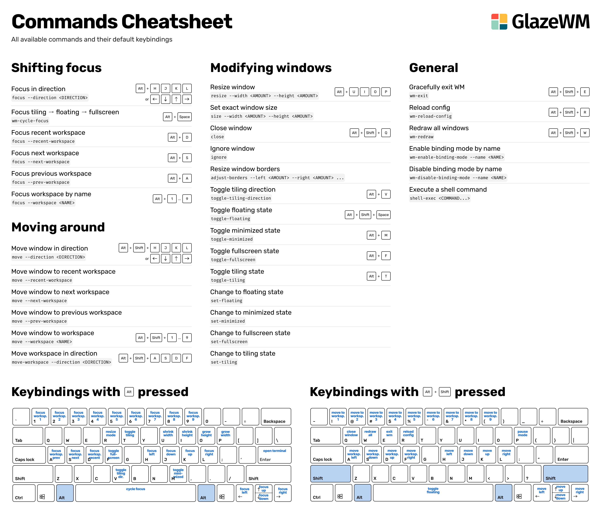
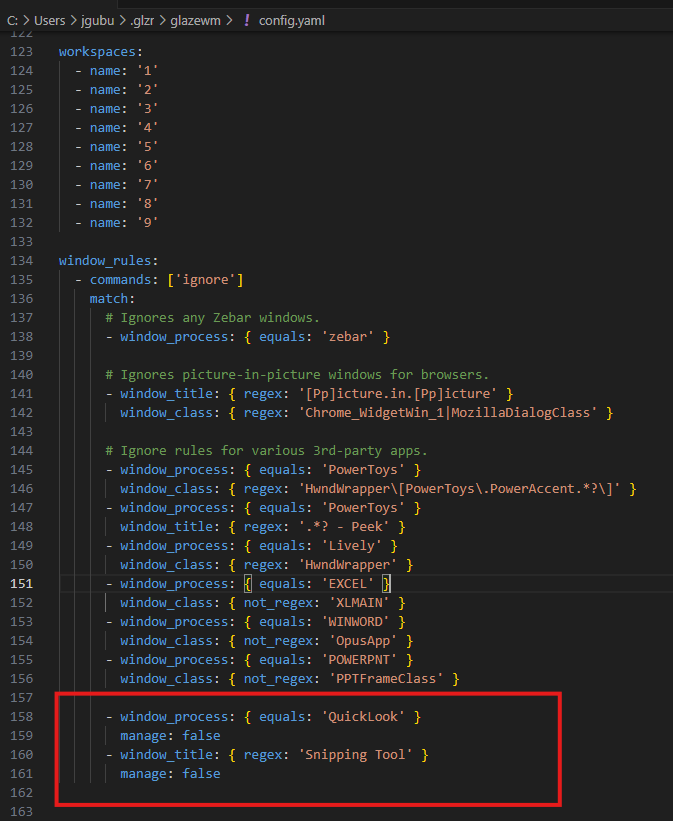

---
aliases:
  - tiling
  - ტაინიგი
  - tailing
  - glasevm
  - glasewm
tags:
  - it
  - windows
done: false
created: 2025-10-28
sourse:
---
# GlazeWM

[GitHub : GlazeWM - tiling window manager](https://github.com/glzr-io/glazewm?tab=readme-ov-file) 
[Arch Windows. Менеджер окон как в Linux - YouTube](https://www.youtube.com/watch?v=EmhWc28iSMI&t=213s) 

**hotkey**: 

***correct***: **focus tiling > floating > fullscreen** : `shift + alt + space` 

.


### რაიმე პროგრამის იგნორირება:

თუ გინდა, რომ GlazeWM **არ მართოს** (დააიგნოროს) კონკრეტული პროგრამა, უნდა დაამატო `manage: false` შესაბამის წესში.

🔧 მაგალითი: ***QuickLook-ის იგნორირება***

```yaml
rules: 
	-window_process: { equals: 'QuickLook' } 
	manage: false
```


ან თუ გინდა, რომ ***მხოლოდ კონკრეტული*** window_class არ იმართოს:

```yaml
rules: 
	-window_process: { equals: 'POWERPNT' } 
	window_class: { not_regex: 'PPTFrameClass' } 
	manage: false
```

  
.
**რჩევები** ***regex***-ის გამოყენებისთვის

- გამოიყენე `regex` როცა:

- ფანჯრის process/class არ ჩანს ან არ ემთხვევა.
- overlay ფანჯარაა (Snipping Tool, clipboard, emoji picker).
- სათაური შეიცავს უნიკალურ ტექსტს, მაგალითად `"New Snip"` ან `"Snip & Sketch"`.
- regex მაგალითები:

```yaml
window_title: { regex: 'Snip.*' } 
window_title: { regex: '.*Sketch.*' }
```

