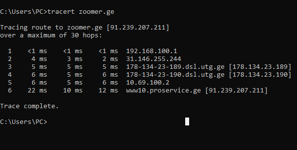

---
aliases:
  - injineria
tags:
  - it
  - network
  - SysAdmin
  - ssh
  - cmd
  - windows
done: false
created: 2026-05-03
sourse:
---
# IT ინჟინრის ინსტრუმენტები(cmd)

***Урок 13 (Инструменты инженера) - YouTube***:

 
.

- `ping` - - - 
- `ipconfig` ; `ipconfig /all`  - - - ( ქსელის ინფორმაციის გამოტანა ) 
- `nslookup` - - - ( უცებ **DNS სერვერის** გაგება )
- `getmac` - - - ( მოწყობილობების mac მისამართბი )- - - 
- `arp-a` - - -  (ასევე **MAC  და IP მისამართბი მთელს ქსელში** ) - - -
- `telnet` ( **SSH** ) - - - თავიდან სიტყვაზე **cisco როუტერზე** ვერ ვუკავშირდებით ქსელში, თავიდან კონსოლ კაბელით ფიზიკურად ვუკავშირდებით, კონფიგურაციას გავაკეთებთ, და ვრთავთ **telnet** მხარდაჭერას, მერე ქსელიდან შესასვლელად.   
- `putty` - - - **windows**-ში **telnet** და **SSH** კავშირის დასამყარებლად
- `tracert` (მოდის სიტყვიდან "კვალი" ) - - -  განახებს რა გზას გადის საიტზე შესვლის პროცესი. 
	- 
