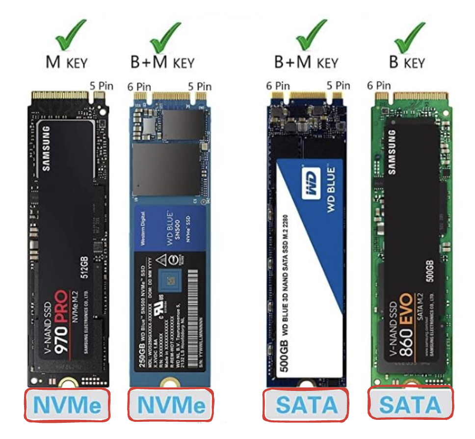
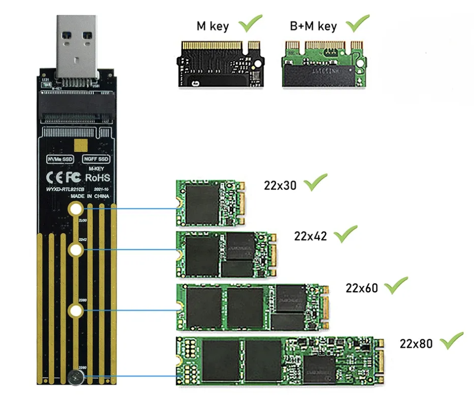

---
aliases:
  - nvme
  - sata
tags:
  - it
done: false
created: 2025-08-11
sourse:
---
# NVME + SATA

## M.2 - **NVMe SSD** 

თანამედროვე მაღალსიჩქარიანი **NVMe SSD-ები ფიზიკურად ყოველთვის ერთჭრილიანია (M-key)** და არა ორჭრილიანი.

M.2 ფორმფაქტორის მიხედვით ძირითადი ტიპები ასე იყოფა:

- **M-Key (ერთჭრილიანი):** ეს არის სტანდარტი თანამედროვე მაღალწარმოებითი NVMe დისკებისთვის, რომლებიც იყენებენ PCIe x4 ინტერფეისს. ჭრილი მდებარეობს მარჯვენა მხარეს. ყველა დღევანდელი სწრაფი NVMe SSD (PCIe 3.0, 4.0, 5.0) წარმოდგენილია ზუსტად ამ ერთჭრილიანი დიზაინით.
    
- **B+M Key (ორჭრილიანი):** ამ ტიპს აქვს ორი ჭრილი (ორივე მხარეს). ის ძირითადად გამოიყენება ძველი ან დაბალი სიჩქარის **SATA** M.2 დისკებისთვის, ან უკვე იშვიათი PCIe x2 NVMe მოდელებისთვის.

ამიტომ, როდესაც საუბარია ჩვეულებრივ NVMe მეხსიერებაზე, ის არის **ერთჭრილიანი (M-keyed)**.

არსებობს გამონაკლისებიც! ზოგიერთი დაბალი ან საშუალო სიჩქარის NVMe დისკი ფიზიკურად სწორედ **B+M Key (ორჭრილიანი)** ფორმფაქტორითაა გამოშვებული. 

ქვემოთ სურათზე მოცემული **WD Blue SN500** (ან მსგავსი ძველი მოდელები, მაგალითად SN520), რომელიც არის **NVMe SSD**, მაგრამ იყენებს PCIe x2 ინფრასტრუქტურას და შესაბამისად აქვს B+M კლავიში (ორი ჭრილი).

**როგორ ხსნის ეს ყველაფერს:**

- **პროტოკოლი (NVMe):** ეს არის პროგრამული ენა/ინტრუქცია, რომლითაც დისკი ოპერაციულ სისტემასთან ურთიერთობს (მნიშვნელოვნად სწრაფია ვიდრე ძველი SATA პროტოკოლი).
    
- **ფიზიკური ჭრილი (Key):** განსაზღვრავს რამდენ PCIe ხაზს (Lane) იყენებს დისკი.

თუ დისკს ჰყოფნის **PCIe x2** გამტარუნარიანობა (როგორც ზოგიერთ ბიუჯეტურ ან ძველ NVMe მოდელს), ის იფიზიკურად მზადდება ორჭრილიანი (B+M Key) ფორმით, მაგრამ შიგნით მაინც სრულფასოვან NVMe პროტოკოლს იყენებს. თუმცა, თანამედროვე მაღალსიჩქარიანი (PCIe x4) დისკები უკვე აბსოლუტურად ყველა ერთჭრილიანია.

## M.2 მოწყობილობის ქეისის (Enclosure)

M.2 მოწყობილობის ქეისის (Enclosure) შერჩევისას ყველაზე მნიშვნელოვანია იმის გარკვევა, თუ რა ტიპის SSD გაქვთ, რადგან ვიზუალური მსგავსების მიუხედავად, ისინი სხვადასხვა ტექნოლოგიაზე მუშაობენ.

აი, როგორ უნდა განასხვავოთ ისინი ერთმანეთისგან:

### 1. გასაღებები (*B* , *M* , *B&M* Key) – ფიზიკური თავსებადობა

ეს არის ჭრილები (Notches) SSD-ის კონექტორზე. ისინი გვეუბნებიან, თუ რომელი ინტერფეისით (SATA თუ NVMe) მუშაობს დისკი.

- ***B* Key (ერთი ჭრილი *მარცხნივ*):** ძირითადად ძველი ***SATA M.2*** დისკებისთვისაა.
    
- ***M* Key (ერთი ჭრილი *მარჯვნივ*):** ეს არის ყველაზე სწრაფი ***NVMe (PCIe x4)*** დისკების სტანდარტი. თუ თანამედროვე და სწრაფი SSD გაქვთ, ის დიდი ალბათობით M-Key იქნება.
    
- ***B+M* Key (ორი ჭრილი):** ეს დისკი უნივერსალურია და ***ორივე ტიპის სლოტში*** ჯდება. თუმცა, სიფრთხილე გმართებთ: B+M Key შეიძლება იყოს როგორც ***SATA***, ასევე ***NVMe (PCIe x2)***.

### 2. ინტერფეისი – მთავარი შეცდომა

ბევრი ყიდულობს NVMe ქეისს SATA დისკისთვის (ან პირიქით) და ისინი ერთმანეთთან არ მუშაობენ.

- **NVMe Enclosure:** მუშაობს მხოლოდ NVMe დისკებზე (ჩვეულებრივ M-Key ან B+M Key).
    
- **SATA Enclosure:** მუშაობს მხოლოდ SATA M.2 დისკებზე (ჩვეულებრივ B+M Key).
    
- **Dual Protocol Enclosure:** ყველაზე კარგი არჩევანია, რადგან მასში ორივე ტიპის (SATA და NVMe) დისკი მუშაობს.
    

### 3. ზომა (Form Factor)

M.2 დისკები სხვადასხვა სიგრძისაა. ყველაზე გავრცელებულია **2280** (22მმ სიგანე, 80მმ სიგრძე). ქეისის ყიდვისას დარწმუნდით, რომ ის მხარს უჭერს თქვენს ზომას. უმეტესობას აქვს სამაგრი ხვრელები ***2230***, ***2242***, ***2260*** და ***2280*** ზომებისთვის.

### 4. სიჩქარე და კავშირი

- **10 Gbps (USB 3.2 Gen 2):** სტანდარტული NVMe ქეისებისთვის. რეალური სიჩქარეა დაახლოებით 1000 MB/s.
    
- **20-40 Gbps (USB4 / Thunderbolt):** ძალიან სწრაფი და ძვირიანი ქეისები პროფესიონალებისთვის.
    
- **კორპუსი:** აუცილებლად შეარჩიეთ **ალუმინის** ქეისი. NVMe დისკები მუშაობისას ძალიან ცხელდება და ლითონის კორპუსი რადიატორის ფუნქციას ასრულებს, რაც დისკს გადახურებისგან იცავს.
 
.

.

.

.