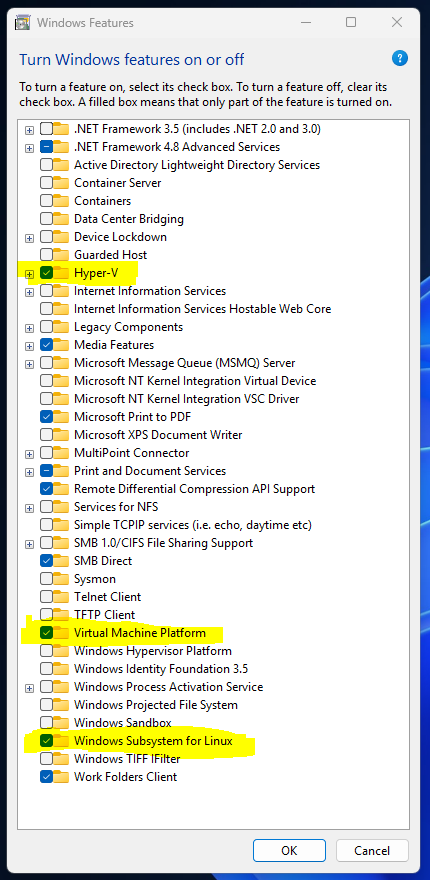

---
aliases:
  - linux on windows
  - ლინუქსი ვინდოუსზე
  - wsl
  - docker
  - doker
tags:
  - it
  - linux
  - windows
done: false
created: 2025-09-08
sourse:
---
# Windows Subsystem for Linux ( WSL )

Полный гайд настройки **Windows + WSL** для разработчика:


### WSL და docker - ის დაყენება ( კონკრეტული ქმედებები ):

[Windows без мусора: 28:24 - 31:30](https://www.youtube.com/watch?v=YkkoSUIKrPU) 

***WSL*** საჭიროა ***docker*** -თვის , ამისათვის თავდაპირვეად **windows** -ში უნდა იყოს ჩართლი შემდეგი სერვისები: 

#### 1. სერვისების ჩართვა

- `control panel / programs and features / Turn windows features on or off` 
.
 
.

#### 2. WSL -ის ინსტალაცია

- **WSL** -ის ***ინსტალაცია*** **power shell** -ში:

```powershell
wsl --install
```

- ინსტალაციის  პროცესში შეიძლება ავტომატურად დააყენოს ***ubuntu*** , რომლის ბოლოს მოგთხოვს დააყენო ubuntu-ს ***user*** და ***password***. 
- თუ არ დააყენა ავტომატურად, შეგიძ₾ია ხელით დააყენო: 
```powershell
wsl --install ubuntu
```

***აქვე ბონუსად*** : დეფაუთად აყენებ wsl -ის ვერსიას: 
```powershell
wsl --set-default-version 2
```

#### 3. docker ინსტალაცია:

**docker** -ის ***ინსტალაცია*** WSL-ში : 
შევდივართ **Linux shell** -ში ( ubuntu-ში ) :

- ჯერ ვაინსტალირებს  ***curl*** -ს (ანუ მერე curl-ით ვაინსტალირებთ. **wget** ; **git clone** - ის ***ალტერნატივა*** ).

```bash
sudo apt install curl
```

- ვაინსტალირებთ ***docker*** - ს :

```bash
curl -fsSL https://get.docker.com/ | sudo sh
```

