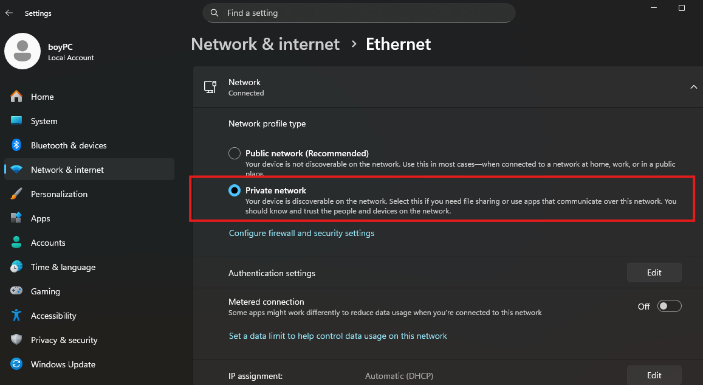

---
aliases:
  - sharing windows11
  - windows11 sharing
  - შარინგი
  - sharing
  - sharing win11
tags:
  - network
  - windows
  - sharing
done: false
created: 2026-02-22
sourse:
---
# sharing windows 11

1. windows 11 **ფაილების გაზიარება**  ლოკალურ ქსელში : 
[Обмен файлами по локальной сети в Windows 11 - YouTube](https://www.youtube.com/watch?v=RhFzPLx8UxE) 
[Обмен файлами по LAN кабелю между двумя ПК ноутбуками - YouTube](https://www.youtube.com/watch?v=AI3rz9hNDcw) 
[Обмен файлами по Wi-Fi между двумя ПК ноутбуками - YouTube](https://www.youtube.com/watch?v=VpJzlHdmlcI) 
[Обмен файлами по Bluetooth между двумя ПК ноутбуками - YouTube](https://www.youtube.com/watch?v=EpDycYFKhyI) 
[Обмен файлами по локальной сети между двумя ПК](https://www.youtube.com/watch?v=0HM1G0EkBE8) 
[Как передавать файлы по локальной сети со скоростью 1 Gbit/s - YouTube](https://www.youtube.com/watch?v=EYybxOVGuYw) 
.
2. folder-ებში შიდა ქსელშ არსებული ფაილების გამოსაჩენად შემდეგი უნდა იყოს მონიშნული. :

.
## შესაძლო პრობლემები გაზიარების დროს: 
### 1. SMB 1.0

[SMB  ( Server Message Block )](../../network/SMB%20%20(%20Server%20Message%20Block%20).md) 

ხანდახან არის შემთხვევა, რომ მაგალითად NASS-დან გაზიარებული **ფაილები არ გამოჩდება** windows - ზე. 
ამის ერთერთი მიზეზი არის ***SMB1*** ( დეფოულთად გამორთულია, რადგანაც ძველი და საფრთხიანი ტექნოლოგიაა ). 
მის ჩასართავად საჭიროა: 
- გახსენით **Control Panel** -> **Programs and Features**.
- მარცხნივ აირჩიეთ **Turn Windows features on or off**.
- მოძებნეთ სიაში **SMB 1.0/CIFS File Sharing Support** და **გაუუქმეთ მონიშვნა ( მონიშნეთ ცარიელი )**.
- გადატვირთეთ კომპიუტერი.

### 2. ძალით დაკავშირება ( Map network drive ) :

Windows-ზე ***SMB1*** -ის ჩართვა კი მაინც ვერ შველის, პრობლემა 99%-ით ***Windows-ის ავტორიზაციის მექანიზმშია***, რომელიც ბლოკავს კავშირს, თუ ის არ ემთხვევა მის უსაფრთხოების სტანდარტებს.

#### 1. გაასუფთავეთ ძველი კავშირის მცდელობები ( *Credentials* )

შესაძლოა Windows-მა დაიმახსოვრა არასწორი მომხმარებელი/პაროლი და აღარ გიშვებთ.

1. გახსენით **Control Panel** -> **User Accounts** -> **Credential Manager**.
2. აირჩიეთ **Windows Credentials**.
3. თუ სიაში ხედავთ  რაც არუნდა იყოს, მაგალითად`192.168.100.15`, წაშალეთ ის (**Remove**).
4. სცადეთ თავიდან შესვლა.

#### 2. აიძულეთ Windows გამოიყენოს კონკრეტული მომხმარებელი

ნუ დაელოდებით, სანამ Windows თავისით "**გამოიჩენს**" ფანჯარას. გააკეთეთ შემდეგი:

1. გახსენით **This PC** (ეს კომპიუტერი).
2. ზედა მენიუში დააჭირეთ ***Map network drive***.
3. **Folder** ველში ჩაწერეთ   მისამართი სადაც გინდა შეცვლა: `\\192.168.100.15\test-folder`.
4. ***აუცილებლად მონიშნეთ(დაპტიჩკეთ):***  `Connect using different credentials`.
5. დააჭირეთ **Finish**.
6. გამოსულ ფანჯარაში ჩაწერეთ  მომხმარებლის სახელი და პაროლი.

#### 3. თუ მაინც გიწერთ "Access Denied" ან ვერ პოულობს:

ZimaOS (და ზოგადად Linux-ზე დაფუძნებული Samba) ხანდახან ითხოვს, რომ მომხმარებლის ***სახელი მიუთითოთ სრულად***. სცადეთ ასე ჩაწერა:

- **Username:** `WORKGROUP\nikaos` ან `.\nikaos`
- **Password:** (თქვენი პაროლი)

#### 4. უსაფრთხოების პარამეტრი (Registry)

რადგან TrueNAS მუშაობს, Windows-ს აშკარად აქვს "Guest" წვდომის პრობლემა გარკვეულ IP-ებზე. თუ Windows 10 Home გაქვთ და წინა პასუხში ნახსენები `gpedit.msc` არ გაგიხსნათ, გააკეთეთ ეს რეესტრიდან:

1. დააჭირეთ `Win + R`, ჩაწერეთ `regedit`.
2. გადადით აქ: `HKEY_LOCAL_MACHINE\SYSTEM\CurrentControlSet\Services\LanmanWorkstation\Parameters`
3. მარჯვენა მხარეს იპოვეთ **AllowInsecureGuestAuth**.
4. დააჭირეთ ორჯერ და მნიშვნელობა (Value) შეცვალეთ **1**-ზე.
5. გადატვირთეთ კომპიუტერი.

#### შეჯამება:

***SMB1 აუცილებლად გამორთეთ***, ის ხელს გიშლით და TrueNAS-თან მუშაობასაც კი შეიძლება დაგიზიანოთ მომავალში. ZimaOS-ის სკრინშოტზე ჩანს, რომ ის თანამედროვე SMB-ს იყენებს.