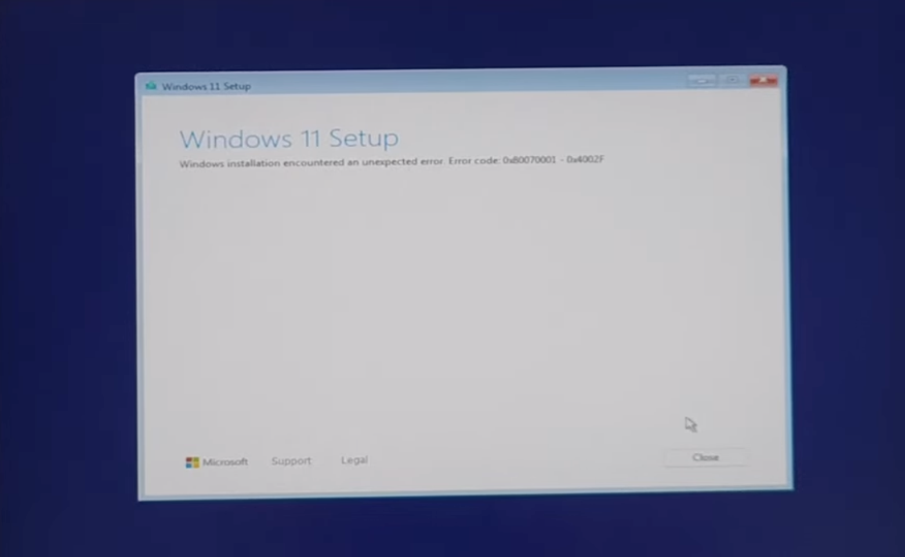
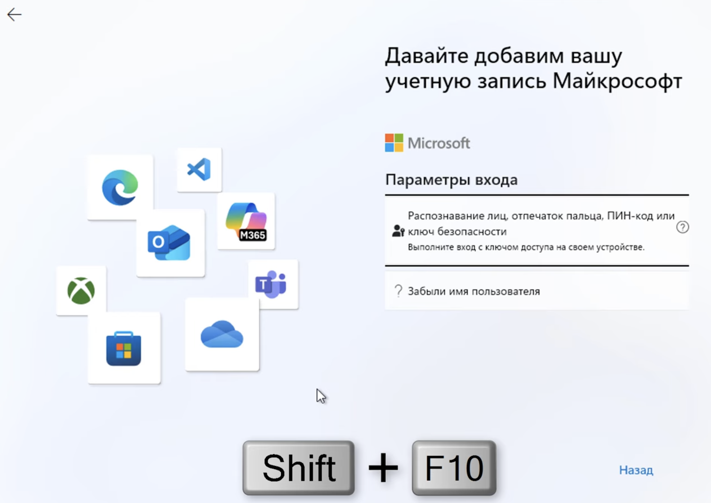

---
aliases:
  - local user
  - windows local user
  - windows11
  - წინდოწს 11 ლოცალ უსერ
  - windows 11 local user
  - win11
  - windows user
tags:
  - windows
done: false
created: 2026-02-13
sourse:
---
# windows 11 install

ინსტალაციისას ბევრი სხვადასხავა პრობლემები აქვს ხოლმე. 
აქ მოყრილია ყველა რასაც შევეჩეხე. 


## 1. windows installation encountered an unexpected error 

[FIX 0x80070001 - 0x4002f ERROR CODE \| Windows 11 Installation Problem - YouTube](https://www.youtube.com/watch?v=0GSnpdIZNU8) 

ინსტალაციის პროცესში ***error*** -ს აგდებს ხოლმე...


.

## 2. windows 11 local user

[Как войти в Windows 11 без учетной записи Microsoft при первом запуске - YouTube](https://www.youtube.com/watch?v=yS-o-PV_EFY)
.
> ზოგადად ამდენი მახინაცია რომ არ გააკეთო, 
> ***რეკომენდირებულია*** :  
> 1. ინსტალაციისას ვაბშე ინტერნეტის კაბელი გამოაძრო
> 2. პროცესში, ეტყვი არ მაქვს ინტერნეტი და დაგაყენებიებს ***ლოკალურ უზერს***. 

.
მიადგები გრაფას შეიყვანე ექაუნთიო . . . 

.
1. **კრეფ კლავიატურაზე**:

```shell
shift + F10
```

2. **გამოსულ ტერმინალში შეგავს შემდეგი**: 

```shell
start ms-cxh:localonly
```

3. გამოვა ***ლოკალური უზერის*** შექმნის გრაფა. 

