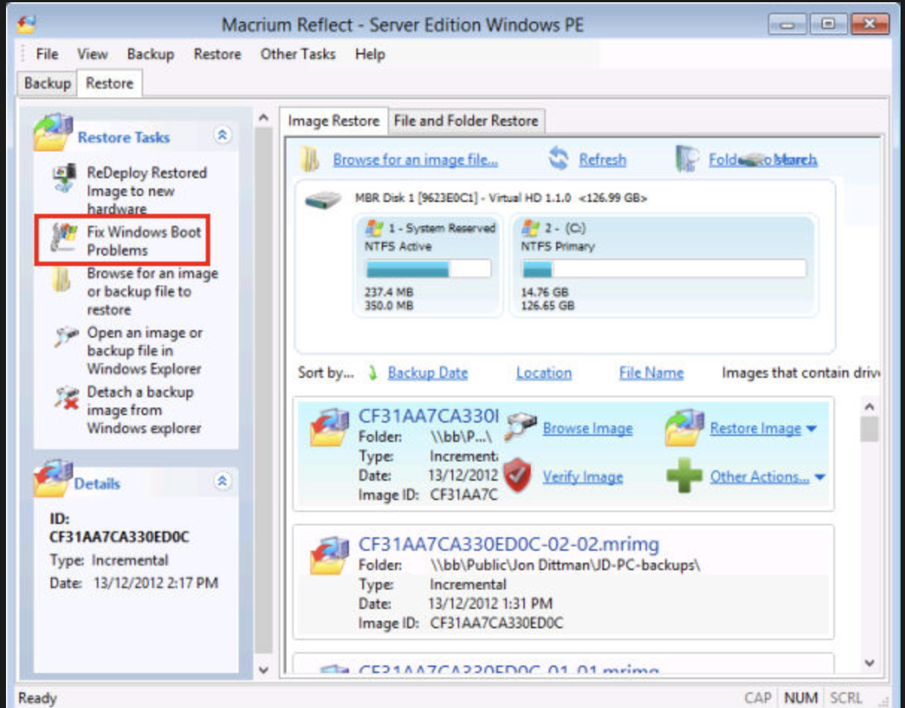
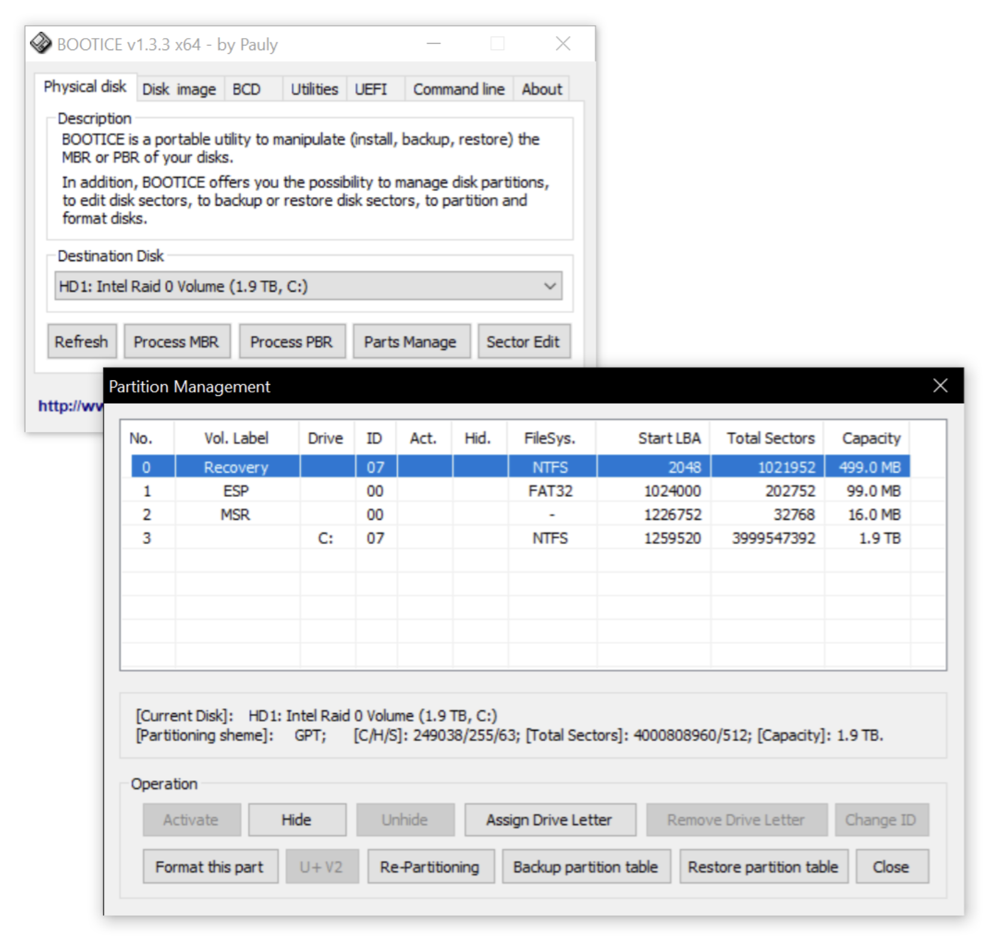

---
aliases:
  - windows ver itvirteba
  - windows ar itvirteba
  - windows არ იტვირთება
  - გამშვები ფაილი
  - წინდოუსის გამშვები ფაილი
  - windows გამშვები ფაილი
tags:
  - windows
  - strelec
done: false
created: 2026-06-03
sourse:
---
# windows ვერ ხედავს გამშვებ ფაილს

კი, ზუსტად მაგ პრობლემისთვის — როცა ბიოსი საერთოდ ვერ ხედავს ჩამტვირთავ ფაილებს და სისტემა არ იწყება — სტრელეცში არის ერთი საუკეთესო და "ყოვლისშემძლე" პროგრამა: **Macrium Reflect**.

მისი ფუნქცია **Fix Windows Boot Problems** ავტომატურად აანალიზებს დისკებს, პოულობს დაზიანებულ ან წაშლილ `boot` ფაილებს და ნულიდან ქმნის მათ სწორ სექციაში (იქნება ეს ახალი UEFI/GPT სისტემა თუ ძველი MBR).

მიჰყევით ამ ნაბიჯებს, რიგითობა კრიტიკულია წარმატებით აღდგენისთვის:

 

მარცხენა მენიუში მონიშნული წითელი ჩარჩო არის ზუსტად ის ფუნქცია, რომელიც გჭირდებათ. Источник: Macrium

1. გახსენით **Macrium Reflect** .-> Start მენიუდან:

გადადით: **Start -> Programs WinPE -> Backup and Recovery -> Macrium Reflect**.

2. გააქტიურეთ ჩამტვირთავის შესწორება -> მარცხენა მენიუ

პროგრამის მარცხენა პანელში, **Restore Tasks**-ის ქვემოთ, მოძებნეთ და დააჭირეთ **Fix Windows Boot Problems**-ს.

3. აირჩიეთ **Windows-ის სისტემა** -> სკანირების ფანჯარა

პროგრამა თავად დაასკანირებს დისკებს და ახალ ფანჯარაში გიჩვენებთ ნაპოვნ ოპერაციულ სისტემებს. მონიშნეთ თქვენი Windows (მაგ. Windows 10/11) და დააჭირეთ **Next**.

4. მიუთითეთ აქტიური/ჩამტვირთავი სექცია . -> Boot Partition

მომდევნო ფანჯარაში პროგრამა ავტომატურად შემოგთავაზებთ დისკის იმ პატარა ნაწილს (Active Partition ან EFI System Partition), სადაც გამშვები ფაილები უნდა ჩაიწეროს. როგორც წესი, პროგრამას სწორად აქვს მონიშნული, უბრალოდ დააჭირეთ **Next**.

5. დაასრულეთ პროცესი. -> Finish

ბოლო ეტაპზე დააჭირეთ **Finish**. პროგრამა რამდენიმე წამში გადაწერს ახალ `BCD` და ჩამტვირთავ ფაილებს. პროცესის დასრულების შემდეგ გადატვირთეთ კომპიუტერი.

### ალტერნატიული მიზეზი: დისკის დამალვა (Bootice) ( ამან იმუშავა )

ხანდახან ფაილები კი არ არის წაშლილი, არამედ ჩამტვირთავი (**EFI/FAT32**) სექციაა გამხდარი ფარული ან დაკარგული აქვს "Active" სტატუსი (ძველ დისკებზე).

თუ ზედა მეთოდმა არ უშველა, გახსენით **Bootice** (**Backup and Recovery -> Boot Repair -> Bootice**):

1. აირჩიეთ თქვენი ძირითადი დისკი (Destination Disk).
2. დააჭირეთ **Parts Manage** ღილაკს.
3. შეამოწმეთ, ხომ არ არის ჩამტვირთავი პატარა სექცია (ჩვეულებრივ 100MB-დან 500MB-მდე) დამალული (`Hidden` სტატუსით). თუ არის, მონიშნეთ და დააჭირეთ **Unhide**-ს, ხოლო ძველ MBR დისკებზე — **Activate**-ს.

 

**Bootice**-ის პანელი, სადაც ჩანს დისკის სექციების მართვა. Источник: jjv360's Blog

გადატვირთვის წინ აუცილებლად გამორთეთ ფლეშკა, რომ დარწმუნდეთ, ბიოსმა დაინახა თუ არა კომპიუტერის მყარი დისკის ჩამტვირთავი.
