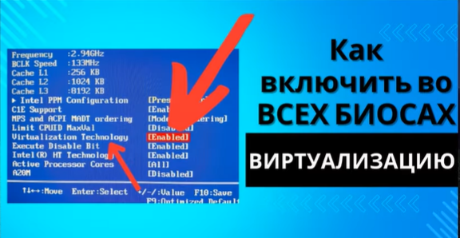
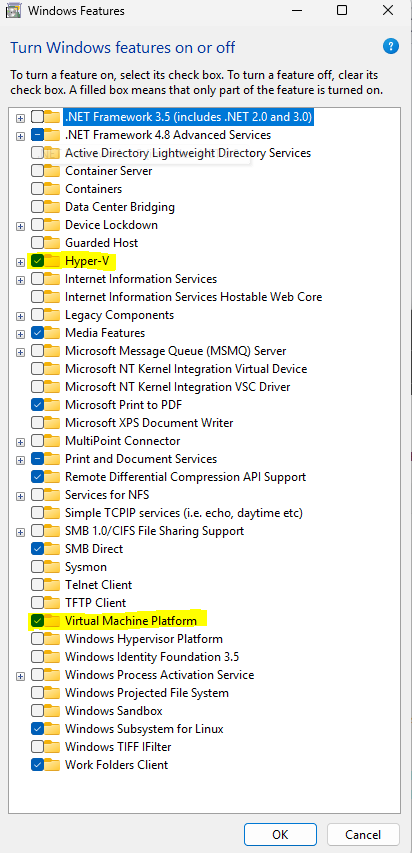
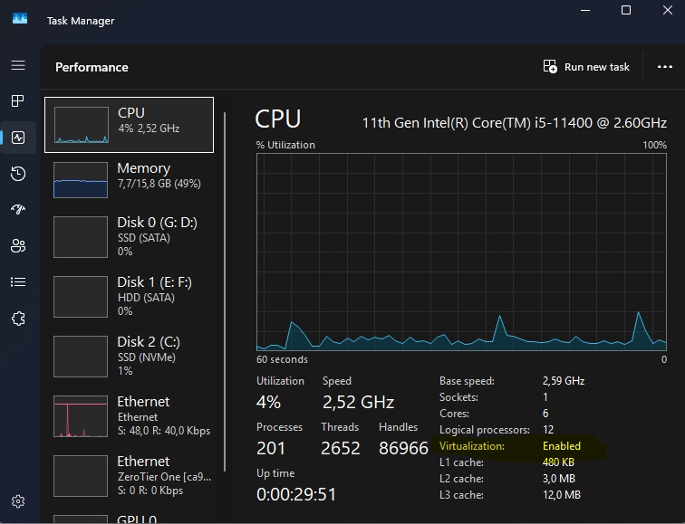

---
aliases:
  - virtualizacia
  - ვირტუალიზაციის ჩართვა
  - virtualizaciis chartva
  - ვირტუალიზაციის შემოწმება
  - virtualizaciis shemowmeba
tags:
  - it
  - linux
  - virtulization
done: false
created: 2026-02-10
sourse:
---
# ვირტუალიზაცია

 
.

### როგორ ჩავრთო ვირტუალიზაცია ? 

1. ბიოსში უნდა იყოს ჩართლი ვირტუალიზაცია:
 
.
2.  `control panel / programs and features / Turn windows features on or off`

 
### როგორ შევამოწმო ვირტუალიზაცია ?

როგორ შევამოწმო **windows**-დან ჩართლი მაქვს თუ არა ??

 
.

