---
aliases:
  - ეკრანის გაფართოება
  - მონიტორის გაფართოება
tags:
  - it
done: false
created: 2025-09-04
sourse:
  - https://www.youtube.com/watch?v=mMQY3eJpFEo
---
# მონიტორი

[Как выбрать монитор в 2024? Как не ошибиться в выборе - YouTube](https://www.youtube.com/watch?v=mMQY3eJpFEo)
[Как выбрать монитор - подробный гайд - YouTube](https://www.youtube.com/watch?v=FIiF5Le7KOY) 
[Выбор Монитора 2025 \| Как выбрать Монитор 2025 \| Лучшие Мониторы 2025 \| Рынок Мониторов 2025 - YouTube](https://www.youtube.com/watch?v=OxtrQOuQO4o)
[Не бери Full HD монитор на 27 дюймов - shorts - YouTube](https://www.youtube.com/shorts/riuZusCYzHk)
[9 Главных Настроек Монитора: Их Нужно Поменять! - YouTube](https://www.youtube.com/watch?v=WUI5IbQAbKc)
### მოკლედ , მონიტორის კომპლექტაცია:

***ღარიბი გეიმერი:*** 
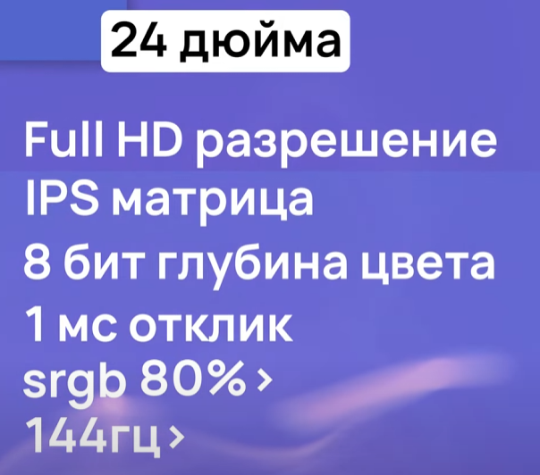

***მდიდარი გეიმერი***:
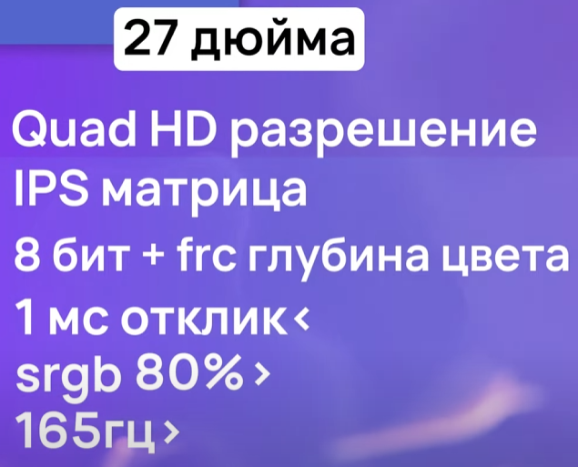

***ვაბშე პიზდეცი გეიმერი:***
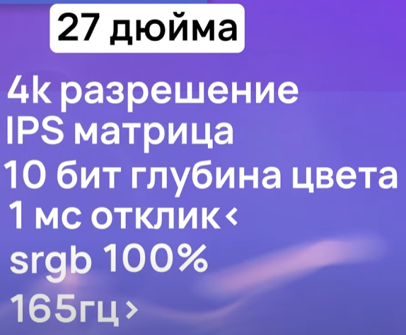

***პროფესიაონალი დიზაინერი:***
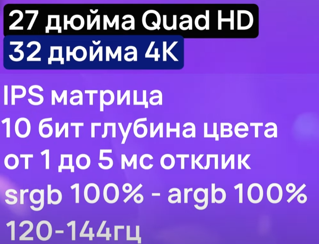

### მატრიცის ტიპები:
[Матрица в мониторе \| VA, IPS и куда исчезла TN?🙄 - YouTube](https://www.youtube.com/watch?v=KDXVgMQp9Bc)
- **TN**
	- უკვე ეს ტექნოლოგია ძან ძველია და უხარისხოა. **ერთადერთი პლიუსი** რაც აქვს  იაფია და მაუსის **კლიკის დრო** პატარა აქვს, გეიმერებისთვისაა გამოსადეგი
	- ***კლიკის დრო***:   
	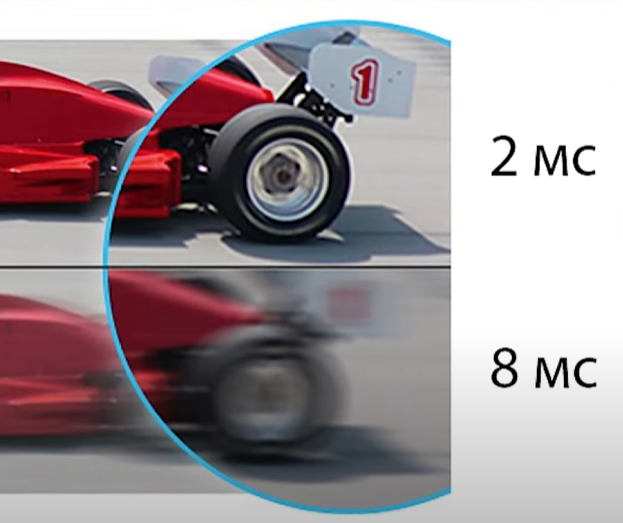
- **VA**
	- ***პლიუსი*** -  ძაან **კარგი ღრმა შავი ფერი** აქვს. და ასევე IPS-თან შედარებით იაფია. 
	- ***მინუსი 1*** - **კლიკის დრო** უარესი აქვს ვიდრე IPS მატრიცას.
	- ***მინუსი 2*** - **ფერთა გამა**, იმის მიუხედავად რომ **კონტრასტი კარგი აქვს**,  ფერთა გადმოცემა ცუდი აქვს ვიდრე IPS მატრიცას. 
	- ***მინუსი 3*** - შეზღუდული ხედვის კუთხე (გვერდებიდან ფერები მკრთალდება)
- ***IPS***
	- ***პლიუსი 1*** - **კარგი ხედვის კუთხე**
	- ***პლიუსი 2*** - **კარგი ფერთა გამა**
	- ***პლიუსი 3*** - **კლიკის დრო**
	- ***მინუსი 1*** - **ძვირია**
	- ***მინუსი 2*** - **შავი ფერი** VA -ზე ცუდი აქვს

.
### დიაგონალი და გაფართოება

გავრცელებული და ხშირი **ფორმატია *16:9*** -ზე. : ***21*** ; ***23,5*** ; ***24*** ; ***27*** ; ***32*** დიუმები. 
ასევე პოპულარობას იძენს **ულტრა ფართოები**: ***21:9*** და ***32:9*** -ზე : ***29*** ; ***34*** დიუმები
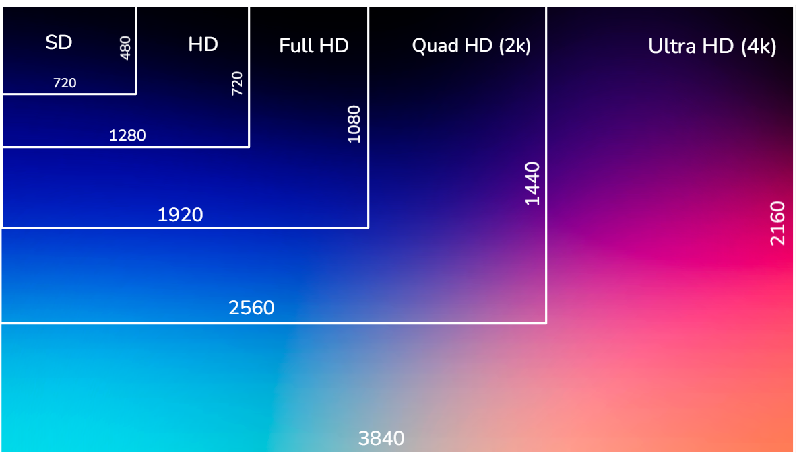
.
### კლიკის დრო

[монитор 3:51 - 5:00](https://www.youtube.com/watch?v=mMQY3eJpFEo) 

### მონიტორის ჰერცები (Hz)
[🤷‍♂️ ЗАЧЕМ нужен игровой монитор на 100 и больше Герц, Есть ли смысл? - YouTube](https://www.youtube.com/shorts/9cE_aVXZh1M)
რაც უფრო მეტია მონიტორის ჰერცები, თვალისთვის მით უკეთესია, უფრო ნაკლებად დამღლელია. 
**განსაზღვრავს:** ***წამში, რამდენჯერ შეუძლია გამოსახულების განახლება***. 
**60hz** - 60-ჯერ განაახლებს წამში.

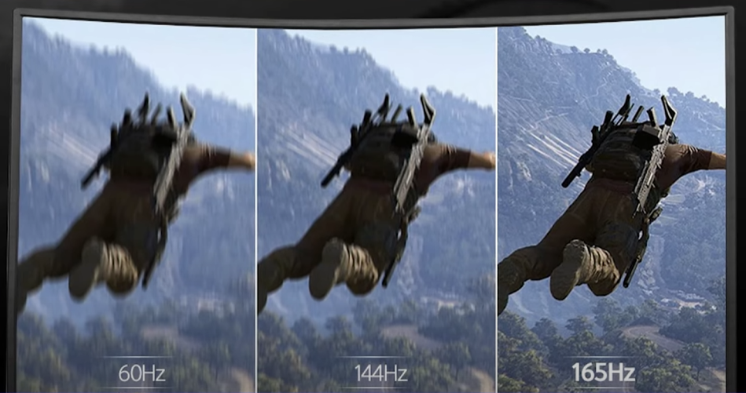

რაც უფრო მეტია ჰერცები, უფრა პლავნი და მკვეთრი იქნება მოძრავი დეტალების გამოსახულება
p.s. **HDMI** კაბელი **მაქსიმუმ *144Hz* გამოაქვს** 

> [!NOTE] ყურადღება!!!
> ***თვალისათვის უკეთესია***: 
> **მაღალი ჰერცის(144)** და შედარებით ცუდი ხარისხის გინდა **VA** და გინდა **IPS** მონიტორი, 
> ვიდრე **60 ჰერციანი** და კაი ხარისხის მატრიცები. 

### ფერთა გამა, ფერთა გამოსახულება

დღესდღობით  **არსებობს 2 სტანდარტი**. 
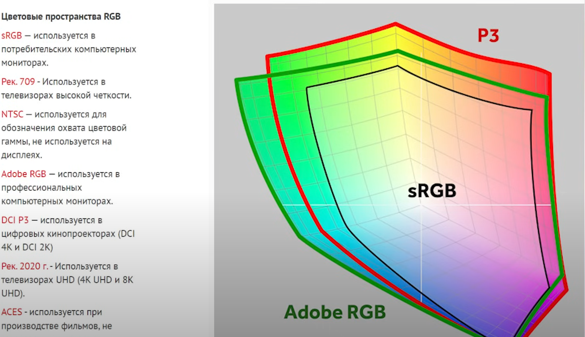
- **sRGB**
	- გამოირჩევა სხვადასხვა პროცენტობით. უბრალოდ **სათამაშოთ მინიმუმ 80%** მისაღებია. **100%** ის შემთვევაში იდეალური **სწორი ფერები** იქნება გამოსახული. **100% ზე მეტის შემთხვევაში** აზრი არააქვს, ფულის გადაყრაა.
	- 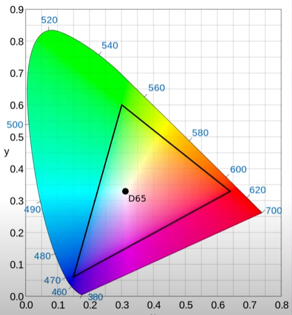
- **Adobe RGB**
	- ეს ფერთა გამის გაფართოებული სტანდარტია. რომელსაც პროფესიონალი ფოტოგრაფები და დიზაინერები იყენებენ. ეს მონიტორები უფრო მეტ ფერთა გამას გამოსახავენ ვიდრე **sRGB**.  ესეც პროცენტებშ შეიძლება იქნეს არჩეული.
	- **მოკლედ**, **უფრო მეტი და ხარისხიანი ფერები აქვს**
	- 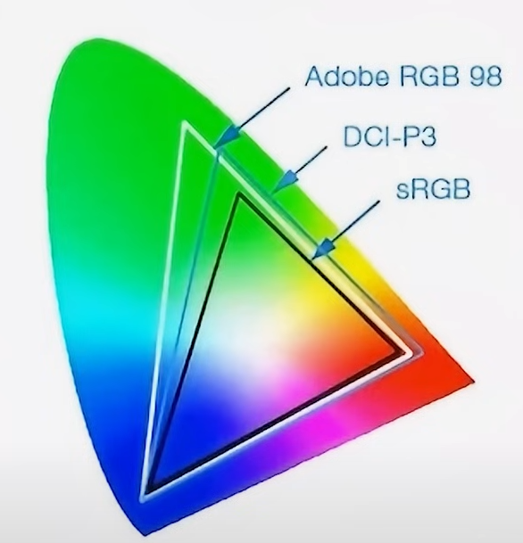

.
### მატრიცის ბიტები

[7:10 - 8:50](https://www.youtube.com/watch?v=mMQY3eJpFEo) 
ფერების კარგობის კიდევ ერთი კომპონენტია ბიტების რაოდენობა:
განსაზღვრავს ფერთა სიღრმეს: არსებობს: 

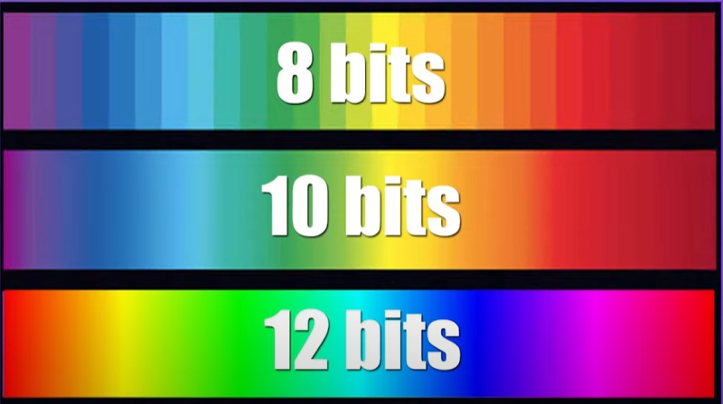

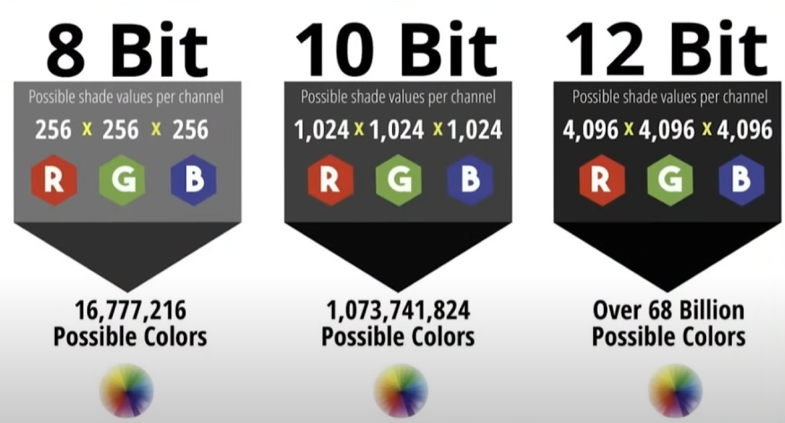

**6 ბიტიანები** დღეს ფაქტიურად არ გამოიყენება.
**12 ბიტიანები** იშვიათ და ძალიან ძვირებია.
**8 ბიტიანი**: - აქვს ***16 777 216*** ფერი და ყველაზე მეტად გავრცელებული ვარიანტია ( გეიმერებისათვის )
**10 ბიტიანი**: - ***1 073 741 824*** ფერი ( ფროფესიონალი დიზაინერები )

არსებობს კიდე **8 bit FRC** - რაც უფრო აუკეთესებს ფერებს ( გეიმერებისათვის )
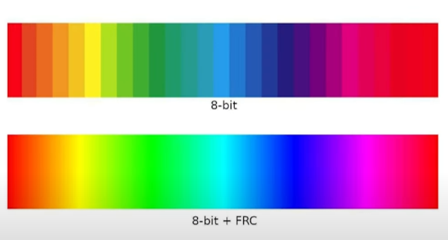

### PPI - პიქსელების სიმჭიდროვე წერტილზე

პირდაპირ **განსაზღვრავს გამოსახულების სიმკვეთრეს**, ლამაზ მოყვანილობაზე. 
რაც **მეტია PPI** , მით ნაკლებად ჩანს **პიქსელები**.
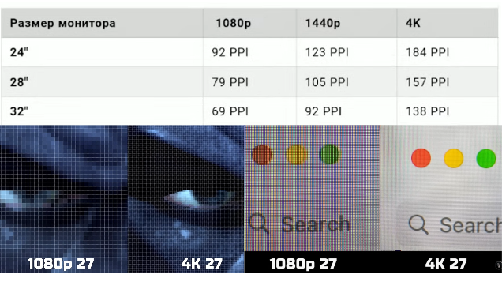

### კონტრასტი

**კდ/მ2** - განისაზღვრება კანდელი მეტრ კვადრატზე. 
ყველაზე იარკები **mini Led** მონიტორებია. 500+
სხვა დანარჩენები მონიტორების სიკაშკაშე 250 - 450 დიაპაზონშია. 

### მონიტორის გაწმენდა

 

