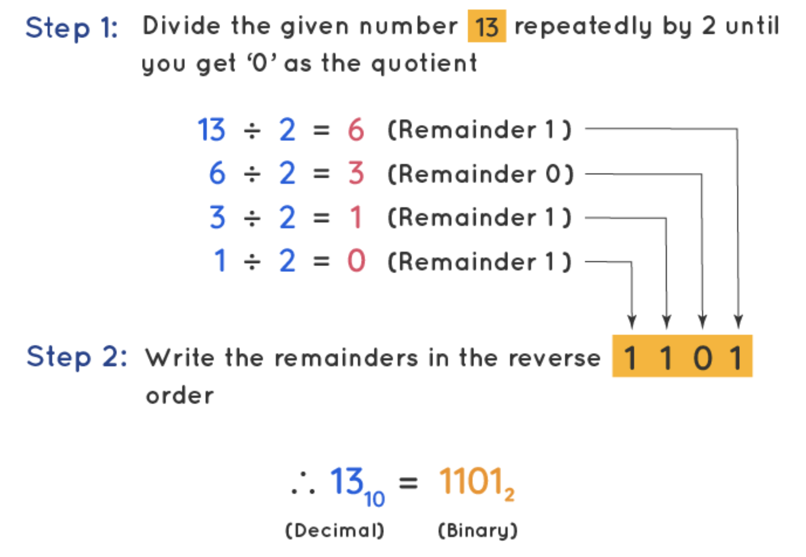
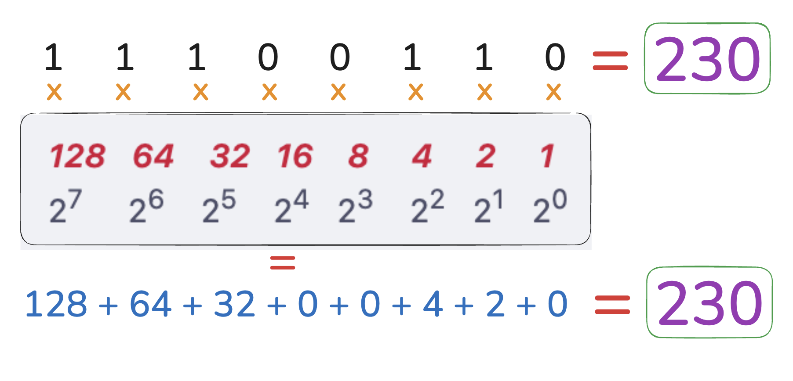

---
aliases:
  - orobiti sistema
tags:
  - it
  - network
done: false
created: 2026-04-28
sourse:
---
# ორობითი სისტემა

## რიცხვის -> ორობითში გადაყვანა :

1. არსებული **რიცხვის 2-ზე გაყოფით**
2. რიცხვის **დაშლა 2-ის ხარისხებად**

### 1. არსებული რიცხვის 2-ზე გაყოფით 

არსებული ***რიცხვის 2-ზე გაყოფით***, და მიღებულების ასევე 2 ზე გაყოფით.  სადაც ნაშთი ან `0` ან `1` იქნება, 

#### მაგალითი1. რისცხვი : ***13 = 00001101*** 

  
**როგორ გამოიყურება 13 *ოქტეტში*:**  

1. შენი გამოთვლილი რიცხვია: **1101** (ეს არის 4 ბიტი).  
2. რადგან ოქტეტში 8 ადგილია, წინ უნდა მივუწეროთ კიდევ 4 ნული: **0000**.  
3. საბოლოო სახე IP მისამართისთვის იქნება: **00001101**.  

**რატომ არის ეს მნიშვნელოვანი?**  
თითოეულ პოზიციას ოქტეტში თავისი "**წონა**" აქვს:  

|128|64|32|16|8|4|2|1|
|---|---|---|---|---|---|---|---|
|0|0|0|0|1|1|0|1|
. . . 
#### მაგალითი2. რიცხვი  - ***224 = 1100000*** :

|გაყოფა|ნაშთი|
|---|---|
|224 / 2 = 112|0|
|112 / 2 = 56|0|
|56 / 2 = 28|0|
|28 / 2 = 14|0|
|14 / 2 = 7|0|
|7 / 2 = 3|**1**|
|3 / 2 = 1|**1**|
|1 / 2 = 0|**1**|

### 2.  რიცხვის დაშლა 2-ის ხარისხებად

ორობითში გადასაყვანად ყველაზე მარტივია ***რიცხვის დაშლა 2-ის ხარისხებად:***

- $128$ (ანუ $2^7$) — თავსდება 224-ში? **დიახ**. ($224 - 128 = 96$) $\rightarrow$ **1**
- $64$ (ანუ $2^6$) — თავსდება 96-ში? **დიახ**. ($96 - 64 = 32$) $\rightarrow$ **1**
- $32$ (ანუ $2^5$) — თავსდება 32-ში? **დიახ**. ($32 - 32 = 0$) $\rightarrow$ **1**
- $16$ ($2^4$) — თავსდება 0-ში? **არა** $\rightarrow$ **0**
- $8$ ($2^3$) — თავსდება 0-ში? **არა** $\rightarrow$ **0**
- $4$ ($2^2$) — თავსდება 0-ში? **არა** $\rightarrow$ **0**
- $2$ ($2^1$) — თავსდება 0-ში? **არა** $\rightarrow$ **0**
- $1$ ($2^0$) — თავსდება 0-ში? **არა** $\rightarrow$ **0**

ამგვარად, ვიღებთ: ***11100000***.

## ორობითდან -> ათობითში გადაყვანა : 

.

.
