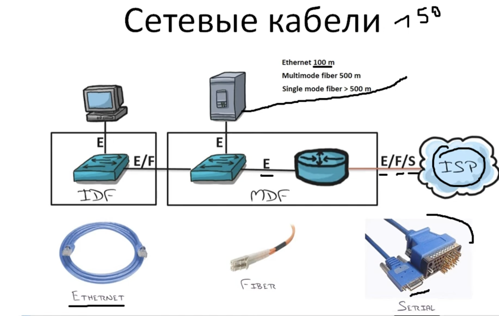
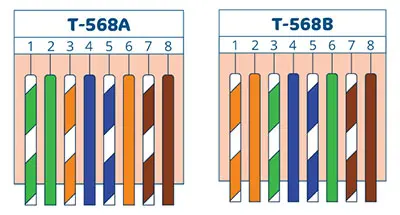
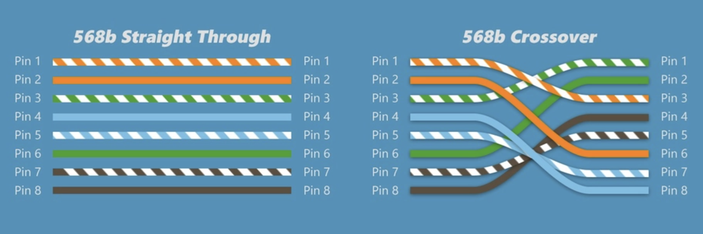

---
aliases:
  - mdf
  - idf
  - qselis kabelebi
  - ქსელის კაბელები
  - ქსელის კაბელის ტიპები
  - rg45
  - rg45 cable
  - T568A
  - T568B
tags:
  - network
  - it
  - ოპტიკა
  - Cables
done: false
created: 2026-05-01
sourse:
---
# ქსელური ინტერფეისები და კაბელები

[Компьютерные уроки/Уроки Cisco/CCNA 200-301 (часть1) Урок 6 (Кабели) - YouTube](https://www.youtube.com/watch?v=Oeb0htyM8cc&list=PL0MV6px_XdxDJLaePIpq7PPllVLdL_kw_&index=4) 
.
 
.

#### 1. ქსელური ინტერფეისები და კაბელები

- **Serial (სერიული):** მოძველებული ინტერფეისი, ადრე გამოიყენებოდა როუტერების ერთმანეთთან ან ინტერნეტთან დასაკავშირებლად. თანამედროვე მოწყობილობებში თითქმის აღარ გვხვდება.
    
- **Ethernet (სპილენძის):** სტანდარტული **RJ-45** კონექტორით.
    
    - **შეზღუდვა:** სიგნალის მაქსიმალური მანძილი **100 მეტრია**. უფრო გრძელ დისტანციაზე საჭიროა სიგნალის გამაძლიერებელი (მაგ. Switch).
        
    - **სიჩქარე:** 100 მბ/წმ სიჩქარისას გამოიყენება მხოლოდ 4 წვერი, ხოლო 1 გბ/წმ (Gigabit) სიჩქარისთვის — რვავე.
        
- **Fiber Optic (ოპტიკურ-ბოჭკოვანი):** მაღალსიჩქარიანი კაბელი. მონაცემების გადაცემა შეუძლია **500 მეტრზე** და მეტზე სიგნალის გაძლიერების გარეშე.
    

#### 2. ქსელური კვანძები (ოთახები)

- **MDF (Main Distribution Frame):** მთავარი საკომუნიკაციო ცენტრი. აქ განთავსებულია ძირითადი სერვერები, როუტერები და მთავარი Switch-ები.
    
- **IDF (Intermediate Distribution Frame):** დამხმარე საკომუნიკაციო წერტილები (მაგალითად, სხვადასხვა სართულზე ან შენობაში), რომლებიც უერთდებიან მთავარ MDF-ს.
    

#### 3. დაერთების (დაწვერვის) სტანდარტები

არსებობს ორი ძირითადი სტანდარტი: ***T568A*** და ***T568B***. პრაქტიკაში ყველაზე გავრცელებული ***B*** სტანდარტია.

##### კაბელის ტიპები:

- ***Straight-through (პირდაპირი)*:** კაბელის ორივე ბოლო დაწვერილია **ერთი და იმავე სტანდარტით** (ორივე B ან ორივე A). გამოიყენება **განსხვავებული** მოწყობილობების დასაკავშირებლად 
	- ( მაგ. ***კომპიუტერი -> Switch*** ).
    
- ***Crossover (ქროსოვერი)*:** ერთი ბოლო არის A სტანდარტი, მეორე — B. გამოიყენება **ერთნაირი** მოწყობილობების პირდაპირი კავშირისთვის 
	- ( მაგ. ***კომპიუტერი -> კომპიუტერი, Switch -> Switch*** ).

გაინტერესებთ რომელიმე კონკრეტული ნაწილის უფრო დეტალური განხილვა, მაგალითად, ფერების თანმიმდევრობა?

### pach-panel -ები 

[pach-panel](../../network/pach-panel.md) 