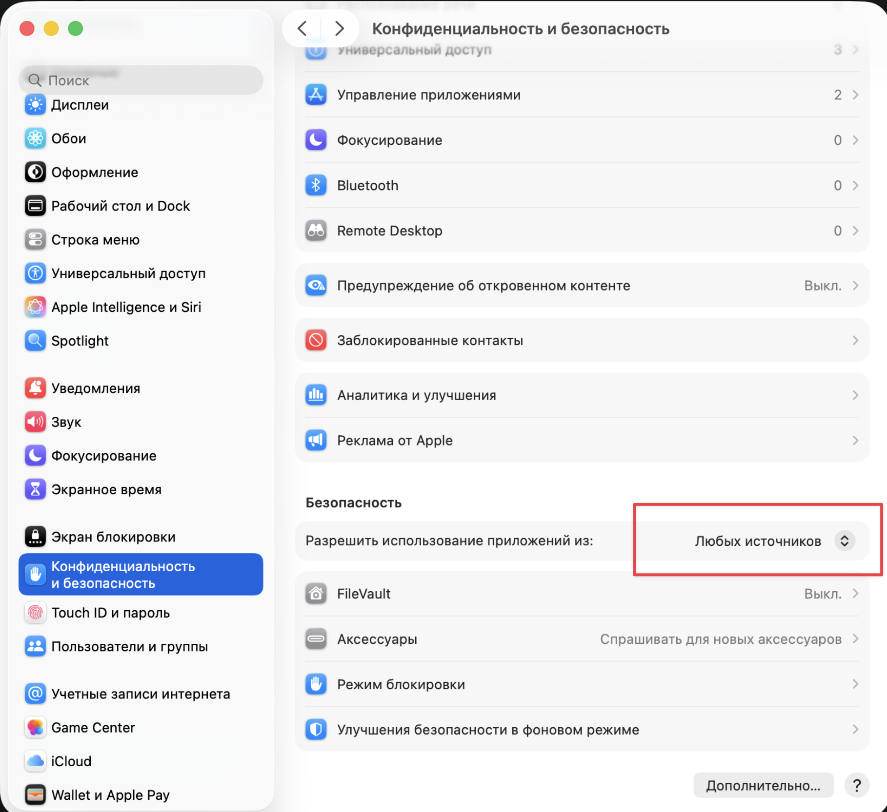

---
aliases:
tags:
  - apple
done: false
created: 2026-09-25
sourse:
---
# 00. Macbook Tutorial & hotkey


1. **Функции macOS, которые вам следует знать! Скрытые функции macOS:** [youtube](https://www.youtube.com/watch?v=yhNZr79U4_Y)
2. ***hotkey* :**    [HotKey Mac - Служба поддержки Apple (RU)](https://support.apple.com/ru-ru/102650) 

`Cmd + ,` - - - ნებისმიერი პროგრამის სეთინგების გამოტანა.
`Cmd + Shift + .` --- დამალული ფაილების გამოჩენა **finder**-ში ( ***hidden folders*** ) .
`Cmd + control + S` - - -  **finder**  ***sidebar***-ის დამალვა / გამოჩენა.
`Cmd + control + I`  - - - ერთზე მეტ ფაილს რომ მონიშნავ, ერთიანად რომ ნახო მათ **properties**. 
`Cmd + control + N` - - - მონიშნულ ფაილებს, ამ კომბინაციით  **გადაიტან ახალ შექმნილ ფოლდერში**.
`Cmd + control + T` - - - მონიშნულ ფოლდერს გადაიტანს გვერდით sidebar-ში. 
`Cmd + control + O` - - - მონიშნული folder-ის ახალ ფანჯარაში გახსნა
`control + shift + Tab` - - - ბრაუზერშ ტაბებში გადაადგილება
`control + k` - - - **ტექსტში კურსორის მარჯვნივ**, აბზაცის ბოლომდე ყველაფერს შლის
`Cmd + control + D` - - -  კურსორი რამე სიტყვაზე გაქვს, -- **გადაგითარგმნის**
 
`Cmd + h` - ჩაკეცვა
`Cmd + q` - გათიშვა

`Cmd + option + esc` --- ***ctrl + alt + delete***

`Cmd + shift + 3` - - - screen foto
`Cmd + shift + 4` - - - ***მონიშნულის*** სქრინი
`Cmd + shift + 5` - - - მონიშნულში ***ირჩევ*** რა გააკეთო( ფოტო, ვიდეო, ვიდეო ხმით თუ უხმოდ...)
`shift + control + Cmd + 4` - - - ***სქრინშოტი ბუფერში***. სურათის შენახვის გარეშე.

`fn + q` - - - **qucke note** -ის სწრაფად გახსნა

`control + Cmd + 0`  - - - **desktop** იკონკების დალაგება/არევა 

`Cmd + c` - - - copy
`Cmd + v` - - - Paste
`Cmd + option + v` - - - ფაილის გადატანა ( **cut** )
`option + TrackPud` - - - ფაილი ტრეკპადით **დაკოპირება გადატანისას**.
`Cmd + option + TrackPud` - - -  ფაილის **იარლიყის გადატანა**. 


`Cmd + y` - -  - **safari**-ის ისტორია
`fn + q` - - - ***note*** -ების სწრაფი გახსნა.
`Cmd + option + d` - - - დოკის დამალვა / გამოჩენა

`delete/backspace` - - - კურსორის მარცხენა სიმბოლოებს შლი
`Cmd + delete/backspace` -  -  -  მონიშნულ ფაილებს წაშლი როგორც **delete**.   ( ჩემ კლავიატურაზე backspace-ს ღილაკს delete აწერია!!! )
`Cmd + shift + delete/backspace` - - - კალათის გასუფთავება
`Cmd + option + delete/backspace` - - - კალათის გარეშე წაშლა
`fn + delete/backspace` - - - ***კურსორის მარჯვენა***  სიმბოლოებს შლი. როგორც **delete**. 

`Cmd + control + space` - - - **სმაილიკების** გამოტანა

`control + ისრები`  - - - ცვლი ეკრანებს როგორც 4 თითის სვაიფით

 
3. ***note*** - ს სეთინგები.  [Three Macbook Productivity Hacks - YouTube](https://www.youtube.com/shorts/Le4OiVmELzM) 

`fn + q` - - -  სწრაფად გახსნა **qucke note**

4. ***დამალული დოკის*, გამოჩენის აჩქარება ტერმინალში:**

```bash
defaults write com.apple.dock autohide-delay -float 0  
​  
killall Dock
```


4. ***ეკრანის შესამოწმებელი საიტი*** :  [Dead-pixel check](https://lcdtech.info/en/tests/dead.pixel.htm) 

5. **Macbook-ის ვარგისიანობის**  [შემოწმება](macbook%20-ის%20შემოწმება.md) **Bios**-დან : `Cmd + d` 

6. ***უსაფრთხოების მოხსნა - 1***. ყველა წყაროებიდან დაინსტალირების ნების დაშვება:

[Fix MacOs Gatekeeper blocking software installation - instal from "Anywhere"](https://www.youtube.com/watch?v=qUkO2NUb32w) 

```bash
sudo spctl --master-disable
```
.

.
 7. ***უსაფრთხოების მოხსნა - 2*** - ***BIOS***-დან უთიშავ უსაფრთხოების ზედმეტ პარამეტრებს. **დაკრაკულები მერე რომ დააინსტალირო**

 [Как снять защиту с Apple M1 для установки программ и плагинов ( BIOS-დან ) - YouTube](https://www.youtube.com/watch?v=ESeIJVzZcBs) 
 
 8. .***Screenshot***- ები:
[16:54 - 20:20](https://www.youtube.com/watch?v=1qknuwb0LGM)

**სწრაფად გადაღებები ლინკში**.
დეფოულთად სქრუნები **png** ფორმატშია. ვიდეოში არის ბრძანება რომ **jpg** (ზომაშ უფრო პატარაა თან.) ში ინახავდეს.

9. ***finder***-ში უცებ ***[New File](Create%20New%20%20File%20on%20finder.md)*** - ის დამატება ***automater*** -ის დახმარებით. ( მიახლოებით )
10. **rs.ge** ვერ დავამატე და **outlook**-ში უცნაურადაა გასაწერი:  [Switch to Old Outlook on Mac, Macbook (2026) - YouTube](https://www.youtube.com/watch?v=1CGqXHW7fc0) 
11. 


