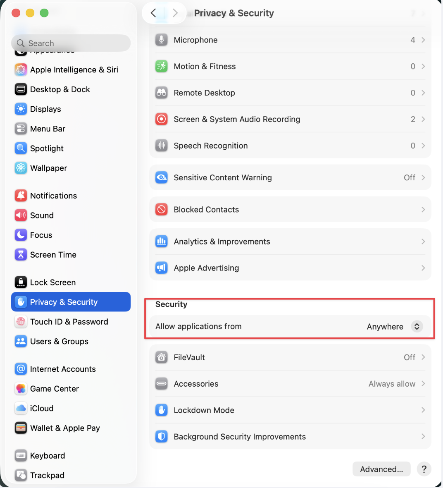

---
aliases:
tags:
  - apple
done: false
created: 2026-09-25
sourse:
---
# Mac Security & MDM

1. **_უსაფრთხოების მოხსნა - 1_**. ყველა წყაროებიდან დაინსტალირების ნების დაშვება:  
	- [instal from "Anywhere" - YouTube](https://www.youtube.com/watch?v=qUkO2NUb32w)  

```bash
sudo spctl --master-disable
```
.

.
2. **_უსაფრთხოების მოხსნა - 2_** - **_BIOS_**-დან უთიშავ უსაფრთხოების ზედმეტ პარამეტრებს. **დაკრაკულები მერე რომ დააინსტალირო** 

[Как снять защиту с Apple M1 для установки программ и плагинов ( BIOS-დან ) - YouTube](https://www.youtube.com/watch?v=ESeIJVzZcBs) 

3. **БУ MacBook**-ის [შემოწმება](macbook%20-ის%20შემოწმება.md)  **Bios**-დან : `Cmd + d` .
	- 
4. [Как получить права ROOT в macOS. - YouTube](https://www.youtube.com/watch?v=MFme46qozu0) 
5. [Все о блокировке MDM-профилем - YouTube](https://www.youtube.com/watch?v=ZHIU1aRTeBU) 
6. 
