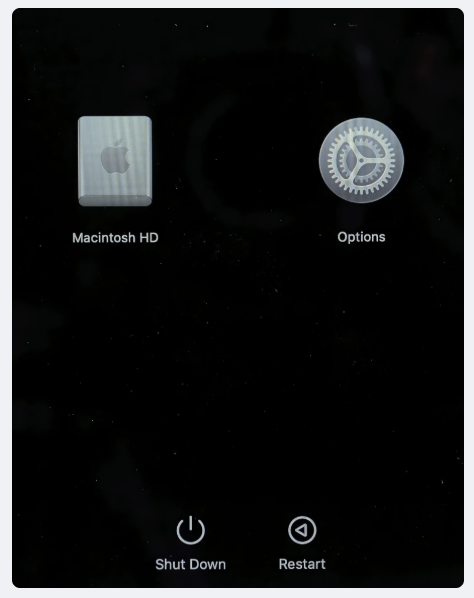
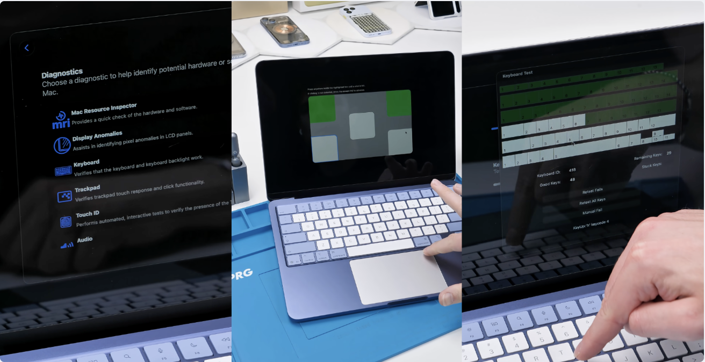

---
aliases:
tags:
  - apple
done: false
created: 2026-09-25
sourse:
---
# macbook -ის შემოწმება

ამოწმებ ლეპტოპის კლავიატურას, ხმას ტრაჩპადს და სხვა მნიშვნელოვან დეტალებს macbook-ის შედა ინსტრუმენტების დახმარებით, ყველანაირი დმატების პროგრამის გარეშე.

- კომპიუტერ გადატვირთავ და ხელის გაჩერებით შედიხმარ "**bios**"-ში
- გამოსულ ფანჯარაში: 
	- 
- აწვები  კლავიშთა კომბინაციას `Cmd + d` და **არ აუშვებ ხელს სანამ** ისევ არ ჩაქრება ფანჯარა და მერე გამოვა მენიუები და დალშე მიხვდები:
	- 
	- 
