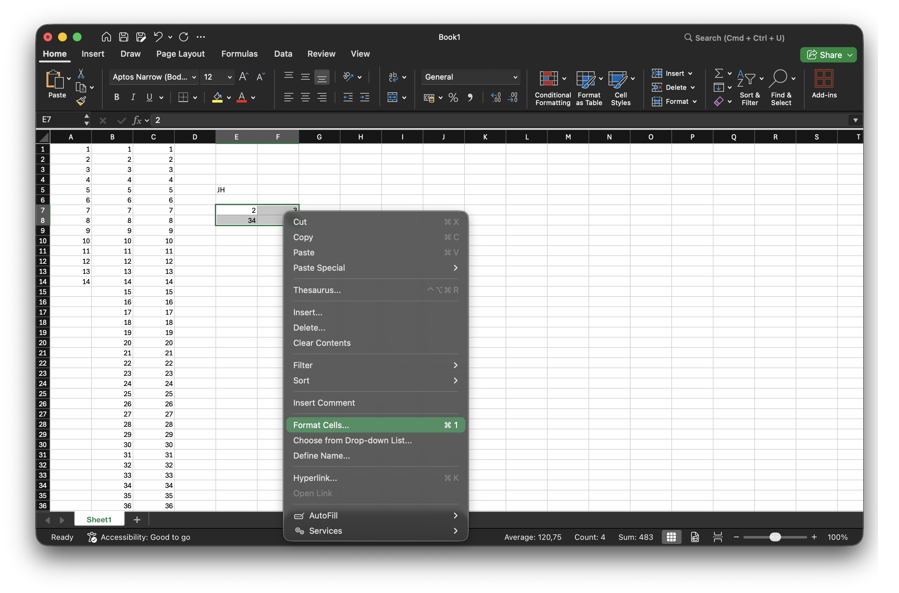
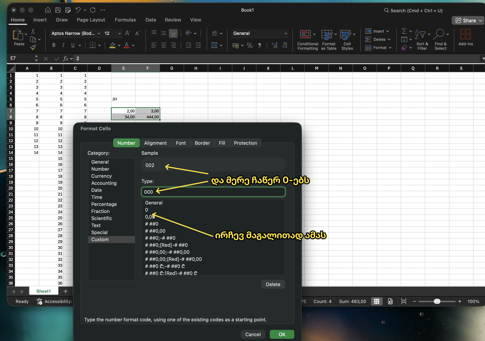

---
aliases:
tags:
  - Excel-ექსელი
  - Excel-რიცხვები-ქსელში
done: false
created: 2026-07-28
sourse:
---
# 0 - ები ექსელში
## 0-ის დაწერა რიცხვის წინ

აირჩევ რიცხვებს და იძახებ **format cells**.:

.
 
.

## კაი რაღაცეები

[Фишки Excel, которые я использую КАЖДЫЙ ДЕНЬ! ЭТО нужно каждому - YouTube](https://www.youtube.com/watch?v=c1PgYqp17VY&t=2s)
