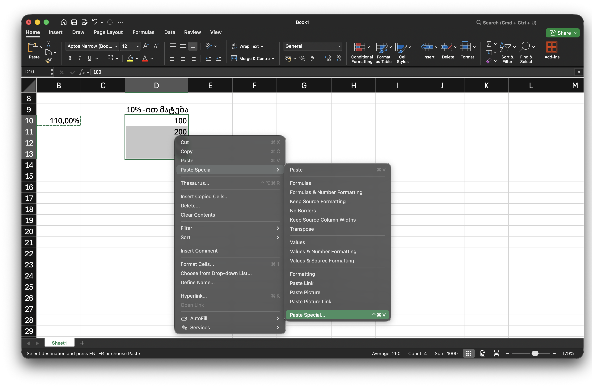
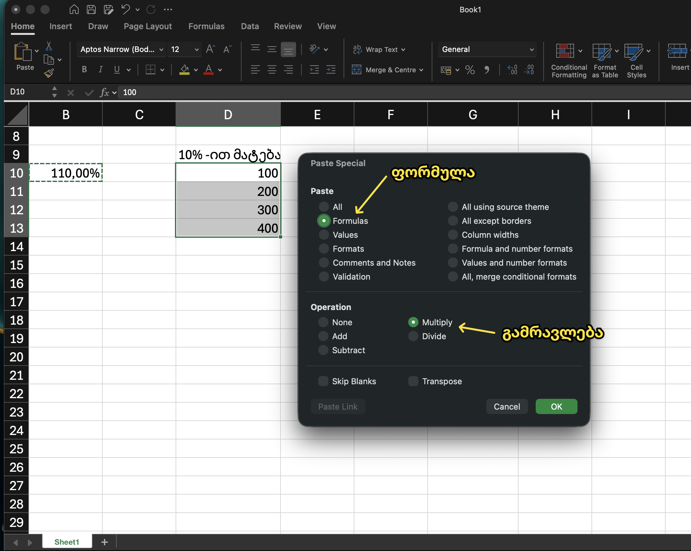

---
aliases:
tags:
  - Excel-ექსელი
  - Excel-რიცხვები-ქსელში
done: false
created: 2026-07-28
sourse:
---
# პროცენტის მიმატება რიცხვზე ექსელში

[Как прибавить процент в Excel - прибавляю 10,20,30 процентов - YouTube](https://www.youtube.com/watch?v=gFMQBQ1pXBg) 

ცალკე უჯრაში წერ ფუნქციას : 

მაგალითად  `=100%+10%` - დათვლის. 
შემდეგ ამ უჯრას აკოპირებ და სვამ იმ უჯრებში რომლის 10 პროცენტის მიმატება გინდა შემდეგ ნაირად:

 
.
 
.
