---
aliases:
tags:
  - git
done: false
created: 2025-01-29
sourse:
---
# GIT - ვერსიათა კონტროლის მართვის სისტემა

[GIT N1. შესავალი, ინსტალაცია (Windows) - YouTube](https://www.youtube.com/watch?v=BWN7Uz8GIUY&list=PLbZtgfvYfOp3l7dZAnFVfY-bMC6dhP-vO) 

***internal aliases*** :  [ლოკალური კონფიგურაცია](#^539311) ;  [Git diff](#^2af04b) 


**ქომითი** - საკონტროლო წერტილი. (ჩექფოინთი).......
**გლობალ კონფიგურაცია**  `Global` - - -  რა უზერსაც და პაროლსაც მიუთთებ ის მიენიჭება ყველა _ქომითებს_. კეთდება ოპერაციული სისტემის დონეზე.
**ლოკალ კონფიგ**   `Local`  - - -   ეს უკვე კონკრეტული პროექტშ, კონკრეტულ საქაღალდეში იქმნება  `sudo pacman -Syuu`

## GIT N2.  გლობალური უზერნეიმის კონფიგურაცია.:

```bash
git config --global user.name "nika jguburia"
git config --global user.email "nj@gmail.com"
```

დეფაულთ ჩაწერის მისამართია: **C:\Users\BOY\ .gitconfig**  ( **P.S.** თუ კომპიუტერში არაა გაწერილი , ან იყო და წაშლილია გლობალური კონფიგურაცია, ეს ფაილი არ იქნება)

ეს გამოიყენება ყველა პროექტისათვის, რომლისთვისაც არ განვსაზღვრავთ local user config-ს.

ფაილის **შიგთავსის** გამოტანა კონსოლში:

```bash
cat C:\\Users\\\boy\\.gitconfig
```

### **ლოკალური კონფიგურაცია**   და  პროექტის ინიციალიზაცია GIT-თვის:

^539311

##### ***ინიციალიზაცია*:**

ბრძანებებით შევდივართ არჩეულ საქაღალდეში:

```bash
cd Desktop/firstproject/
git init  -  მოხდა firstproject საქაღალდის ინიციალიზაცია. 
```

- `git init`: ქმნის სრულიად ახალ, ცარიელ **ლოკალურ Git რეპოზიტორიას მიმდინარე დირექტორიაში**.

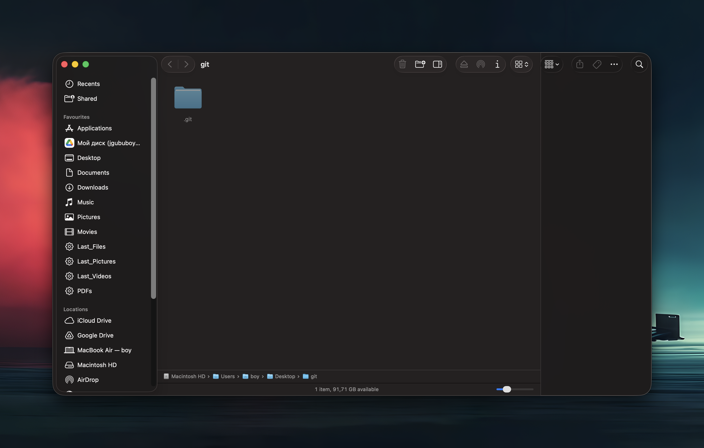
.

##### ***ლოკალ კონფიგურაცია*:**

რომელი საქაღალდის ინიციაციას მოვახდინეთ და რომლისთვისაც გვინდა ლოკალური კონფიგურაცია. იმ საქაღალდეში უნდა შევიდეთ იქ მოვახდინოთ შემდეგი ბრზანებების გაშვება: 

```bash
git config --local user.name "testuser"
git config --local user.email "nj@rs.ge"
```

#### მაგალითი : შევცვალე *ლოკალური* კონფიგურაციის *უზერი* და *მაილი*: 

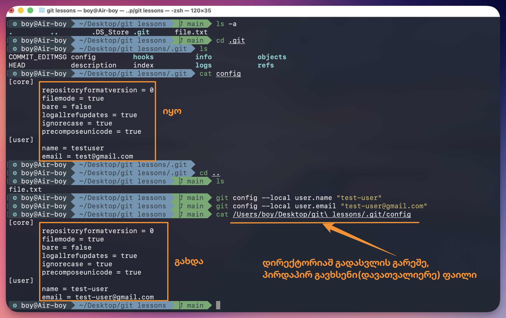

## GIT N3.   add, commit , status , log;   

[GIT N3. საბაზო ბრძანებები და ცნებები (add, commit, status, log) - YouTube](https://www.youtube.com/watch?v=SD5tQ2AFyXY&list=PLbZtgfvYfOp3l7dZAnFVfY-bMC6dhP-vO&index=3) 

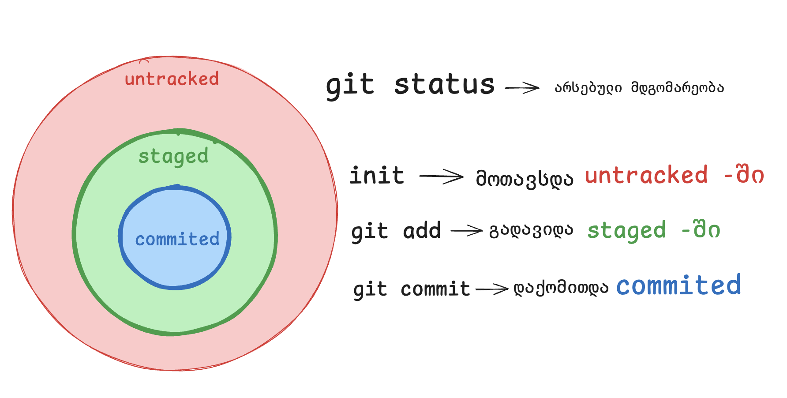  
.

1. `git status `- ფაილები რა მდგომარეობაშია ( **untracked, staged, commited** ) 
2. `git add` - - -  **staged**  ზონაში გადაყვანა.
3. `git add .` - - - *ამზადებს* **ყველა** **შეცვლილ** და **ახალ ფაილს** მიმდინარე დირექტორიასა და მის ქვეპაპკებში,  შემდეგ **კომიტში შესატანად**.
4. `git commit  -m "კომნტარი" `  -  ყველა  დასაქომითებლად გამზადებული( **მწვანე ზონაში მყოფი - staged** ) ფაილები დაქომითდება.

არსებული ფაილის **დარედაქტირების** შემთხვევაში, გადადის **untracked** სტატუსში, ოღონდ როგორც  ***untracked/modifited*** .
და შემდეგ  ისევ  _**git add**_ -ით  გადაგვაქვს **_staged_** -ში  და  მერე ვაქომითებთ **git commit**..

```bash
git add file1 file2 ...
git add .  - - - არსებულ საქაღალდეში ყველას დამატება ( untracked-დან staged-ში )
git add *.py  - - - პითონის გაფართოებებიანი ფაილების დამატება
git add folder/*.py  - - - კონკრეტული საქაღალდიდან პითონის ფაილებიანის დამატება
git add folder/  - - - კონკრეტული საქაღალდიდან ყველა ფაილებიანის დამატება
git add "*.py"  - - -  მთელ პროექტში არშებული პითონის ფაილების დამატება
```


4. `git log` - - კომიტების **ისტორიების/მდგომარეობის** ნახვა. (   [git log -ის გაშვების ჩეპეები:](Git%20Log%20-ის%20პრობლემების%20მოგვარება.md)  )


## GIT N4.   git diff ( differences )  

^2af04b

[GIT N4. ვერსიების ერთმანეთთან დადარების ინსტრუმენტები (git diff) - YouTube](https://www.youtube.com/watch?v=rypBuDn2SnU&list=PLbZtgfvYfOp3l7dZAnFVfY-bMC6dhP-vO&index=4) 

**git diff**  ( ***განსხვავებები*** ) - - -  გვეხმარება , დავადაროთ ცვლილებები სხვადასხვა ვერსიებს შორის  და ავირჩიოთ სასურველი.
აჩვენებს ზუსტ, ხაზობრივ განსხვავებებს არამომზადებულ ცვლილებებსა და ბოლოს შენახულ ვერსიას შორის.

1. `git diff` - - -  **untracked**   ზონაში  არსებულების  ცვლილებების,  **დადარება ბოლო commit** -თან. 
2. `git diff --staged` - - - **staged**  ზონაში  არსებულებს, დადარება ბოლო **commit** -ს. 
3. `git diff [ commit_id ]` - - - **კონკრეტულ commit**-ს  ვადარებთ არსებულ, **ბოლო commit**-ს. 


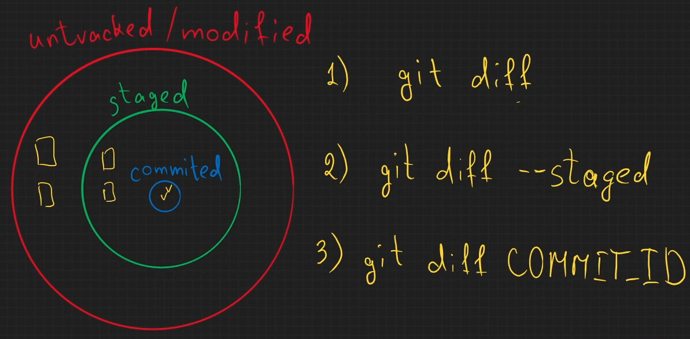

1. `git diff` - - -  **untracked**   ზონაში  არსებულების  ცვლილებების,  **დადარება ბოლო commit** -თან. 
	1. 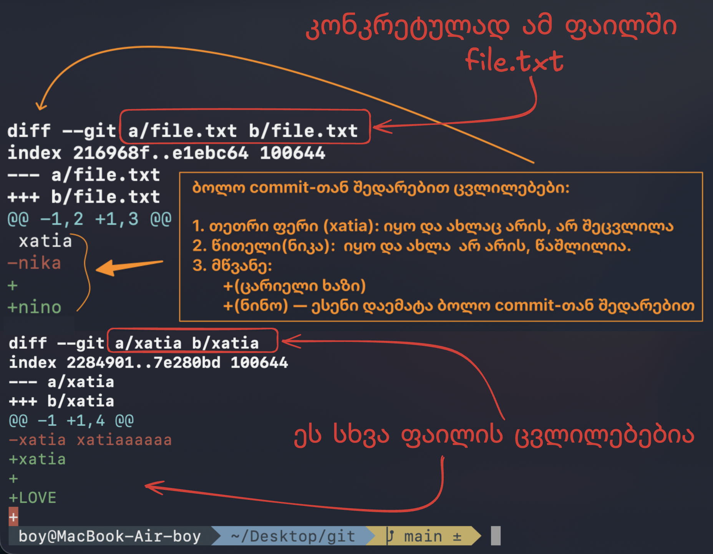


.
2. `git diff --staged` - - - **staged**  ზონაში  არსებულებს, დადარება ბოლო **commit** -ს. 

> ზედა სურათის მონაცემები რომ **stage** ზონაში გადავიყვანო და მერე `git diff --staged` ბრძანებას გავუშვებ, იგივეს მაჩვენებს რადგანაც ყველაფერი ეს ისევ იგივე, ბოლო **commit** -ს ედარება. 

3. `git diff [ commit_id ]` - - - **კონკრეტულ commit**-ს  ვადარებთ არსებულ, **ბოლო commit**-ს. 
	1. ***მაგ***:  ` git diff 308f6f50f5857d996939991e094bb6fb886f8e99 ` 
	2. 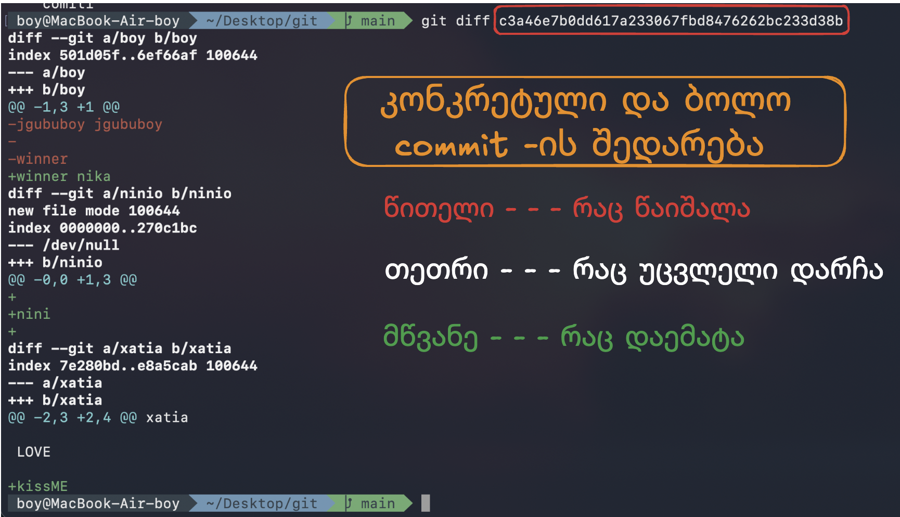


## GIT N5. "ქომიტების" *გაუქმება/წაშლა* ( git reset )

> P.S. შტოებს უძახიან **master** და **main შტოები** , რაც ერთიდაიგივეა.

შესაძლებელია უკან ისტორიაში დაბრუნება, ასევე შეიძლება არასწორმა commit-მა დაგაკარგიოს ინფორმაცია. ამიტომ **ძალზედ საყურადღებოა.** 

**syntax:** - - - `git reset [--soft ; --mixed ; --hard] [commited_ID ; HEAD^^]`

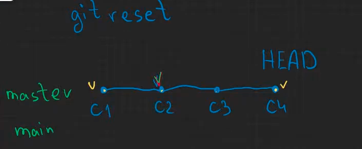
.
- **HEAD** - - - გვიჩვენებს რომელ commit-ზე ვდგავართ ახლა. როგორც წესი ბოლო აქტუაური ქომითია ხოლმე. ზოგადად ამ head-ის გადაადგილება შეიძლება. 
- `... HEAD^` - - - ეს ნიშანი ` ^ ` გულისხმოს  ისტორიაში ერთ ნაბიჟით უკან გადავალთ.  თუ `^^` , მაშინ **2** ნაბიჯით.
- `... HEAD~3` - - -  ასეც ` ~ ` შეიძლება **3** ნაბიჯით უკან გადასვლა.
- ასევე შესაძლებელია _ქომითის_ კონკრეტული   _**ჰეში(ID)**_   მივუთითოთ და იმაზე გადავალთ.

### git reset -ის 3 რეჟიმი:  soft ; mixed ; hard 

>  **untracked** -ში რაც არის **ვერცერთი ვერ იშლება** reset ბრძანებით --- მხოლოდ **clean**-ით !!!!
>  იმ ლოგიკით რომ ეს გარემო თავისი არსით ნიშნავს, **არ არის აყვანილი აღრიცხვაზე**, ანუ git-ისგან კონტროლს არ ექვემდებარება. თუ მაინც reset-ით გვინდა წაშლა,  **modifited** , **untracked/modifited** ან **staged** გარემოში უნდა გადავიყვანოთ(ანუ **git-ის კონტროლ ქვეშ**) და მერე შეიძლება ამოშლა.


- `git reset --soft HEAD^` 
	- **( commit   ==>  staged )**
	- **( staged ==> staged )**
	- **( untracked ==> untracked )**
- `git reset --mixed HEAD^` ან `git reset HEAD^`
	- **( commit , stage   ==>  untracked/modifited )**
	- **( untracked ==> untracked )**
- `git reset --hard HEAD^`
	- **( commit, stage      ==>  delate )**
	- **( untracked ==> untracked )**
- `git reset `
	- **(  stage    ==>   untracked )**

#### 1. **--soft**

```bash
git reset --soft HEAD^
```

გადავიდეთ იმდენით რამდენიც არის მითითებული **HEAD**-ით. 
სანამ გადავიდოდით, ბოლო commit-ზე რაც  **დაქომიტებული** იყო, ყველაფერი გადავა _**staged**_ გარემოში და თავად **ფაილები არ წაშლება**.   
ხოლო ბოლო commit-ის დროც რაც  **Untracked** გარემოში იყო ,  ისედაც **untracked** -ში დარჩება. 

  - **( commit   ==>  staged )**
  - **( staged ==> staged )**
  - **( untracked ==> untracked )**

#### 2. **--mixed** ( default - ად ეს აყენია )

```bash
 git reset --mixed HEAD^
 იგივეა: 
 git reset HEAD^
```

`--mixed ` გასაღების მითითებით მოხდება ისევე HEAD-ით უკან გადასვლა და ფაილები იგივე ლოგიკით ოღონდ **untracked** სივრცეში.  
( **default**-ად ასეა, შეგიძლიად არ დაწერო ხოლმე და **იგივეა** :  ` git reset HEAD^ `  )
 ფაილები  აქაც **არ წაიშლება.** 

   (შეიძლება არ დაიწეროს,     დეფაულთზეა  )   - დარჩენილი ფაილები  არ წაიშლება და გადავა_**untracked/modifited**_   სივრცეში.    

  -  **( commit , stage   ==>  untracked/modifited )**
  - **( untracked ==> untracked )**
  
#### 3. **--hard**

```bash
  git reset --hard HEAD^
```

  ​არცერთ სტატუსში არ გადაანაცვლებს ფაილებს.  
  
  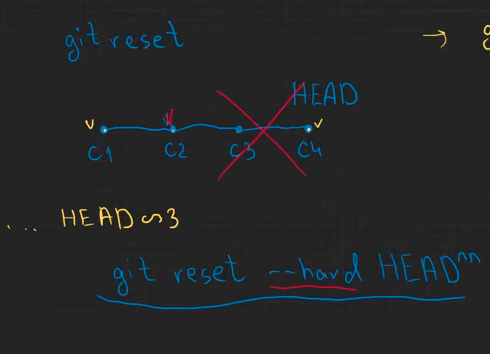
  .
  როგორც სურათზეა , **C2**-ზე ასე გადასვლის შემთხვევაში  დანარჩენი ფაილები ყველაფერი წაიშლება. 
  **საყურადღებოოოოააააა!!!!!**
 > იშლება ყველაფერი ( **დაქომითბული**   და   **stage**  -ში   არსებული ფაილებიც ), გარდა    **untrackted**  ფაილებისა.
 
- **( commit, stage      ==>  delate )**
- **( untracked ==> untracked )**

#### 4. **მხოლოდ " reset "**

```bash
  git reset    
```

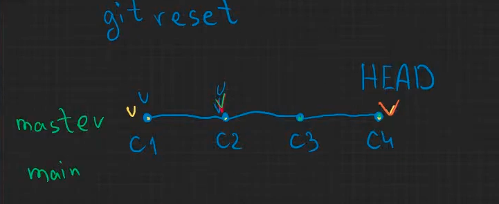
.
სიტყვაზე ვიმყოფებით, **ბოლო აქტუალურ head-ში (C4)**, ამ შემთხვევაში ისევ **იგივე HEAD-ზე ვრჩებით**, და ფაილები **staged** გარემოდან  გადადიან   **untrckted**-ში. 

- **(  stage    ==>   untracked )**
.

#### 5. რა ემართება თვით **log**-ებს.

> **P.S.** რომელ **ID** -თან დგას **( HEAD -> master/main )** -  ამ მომენტში ეს არი **ბოლო აქტუალური შტო**.

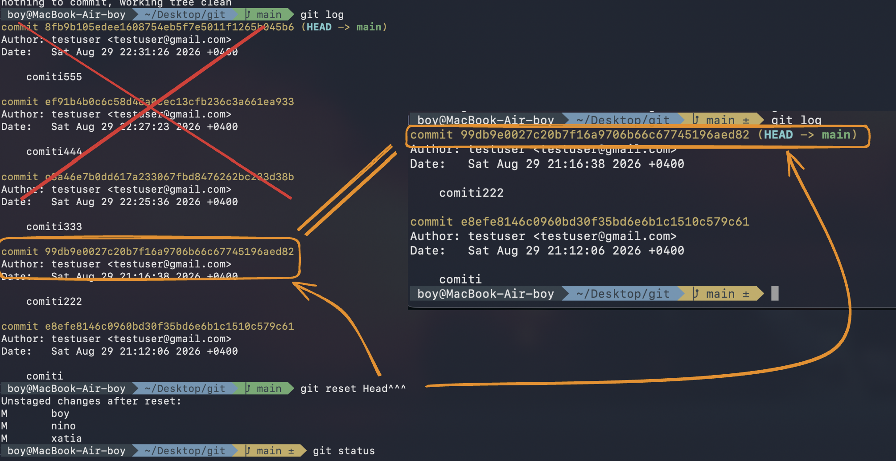
.
ანუ უკან რომელიმე commit-ზე გადასვლის შემდეგ, **უკან მოტოვებული log-ები იშლება.** 

---  

```bash
git reset --soft HEAD^^ 
git reset --mixed HEAD~3  --ან იგივეა--  git reset HEAD~3
git reset --hard 9f718e27e83710e2d331506b3e4e5885f06f9650
git reset
```

## GIT N6. "ქომიტების" ისტორიასთან მუშაობა ( *git checkout* )

[GIT N6. "ქომიტების" ისტორიასთან მუშაობა (git checkout) - YouTube](https://www.youtube.com/watch?v=BmBaoxaFgVM&list=PLbZtgfvYfOp3l7dZAnFVfY-bMC6dhP-vO&index=7)

>[!important] მუშაობის ალგრითმი:   
> 1. `git checkout COMMIT_ID`   ---  **master** შტოდან გადავდივართ რომელიმე კონკრეტულ **კომიტში** ფაილების დასათვალიერებლად
> 2. `git checkout master`   ---  ვბრუნდები **master**   შტოში
> 3. `git checkout COMMIT_ID -- file.txt`   ---  კოკრეტული ქომითიდან გადმოგვაქვს კანკრეტული ფაილი ან ფაილები **master** შტოში,   რომელიც არის **stage** გარემოში

###  1. წინა ქომითებში გადასვლა     და   *დათვალიერება*:

**ქომიტებს** შორის გაადგილება, მათი **განადგურების გარეშე**. გარდა ამისა შესაძლებებლია ფაილების სხვადასხვა **ვერსიებთან** და **შტოებთან** მუშაობაც.

**git checkout** :
1. _**commit**_-ებს შორის გადდადგილება
2. კონკრეტული ფაილების ვერსიების ამორჩევა
3. _**შტოებთან მუშაობა**_ - **(**ამას მოგვიანებით უფრო ვრცლად განვიხილავთ**)**

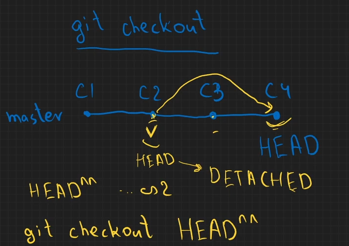

იგივე პრინციპია რაც **reset**-ის შემთხვევაში, იმის განსხვავებით რო **არ შლის**. 
**checkout** ბრძანებით ხდება **commit**-ებს შორის გადაადგილება **დასათვალიერებლად**.   
მაგრამ   სანამ   უკან   არ დავბრუნდებით **git checkout master**-ით ის ფაილები იმალება(არ იშლება). 

```bash
git checkout HEAD^^
git checkout HEAD~3
git checkout COMMIT_ID
git checkout master (master მთავარ შტოზე დაბრუნება)
```
.

> [!important] **შენიშვნა:**
> **checkout**-ით ისტორიაში გადმოსვლასთან ერთად, არსებული ფაილებიც დროებით "იშლება, იმალება" და თუ გადმოსულ, მაგალითად როგორც ნახატზე **C2** -კომითზე დავიწყებთ ახალი **კომითბის** კეთებას, ისინი არ შეინახება, არ იქნება აღქმული როცა დავუბრუნდებით **მასტერ** შტოში.
> .
> **მართალია** მაინც   **შესაძლებელია**    ქომითს  გაკეთება  და  შენახვა, მაგრამ ამისთვის საჭიროა _**ახალ შტოზე**_ გადართვა და ამას მერე ვისწავლით
> ანუ : 
> ახლა გადმოსული ვართ  commit-ზე(**C2**) და **HEAD** იქნება ამ წერტილზე, მაჩვენებელი იმისა რომ ამ წერტილზე ვართ. ამ მდგომარეობაში ეს წერტილი არის **DETACHED** რეჯიმში, რაც ნიშნავს რომ **მოწყვეტილია/არაა აქტუალურ master commit-ზე** (ანუ გვაქვს უფრო ახალი/აქტუალური კომიტებიც). **ამაზე შესაბამის ლექციაზე ვისაუბრებთ.**

.
**checkout** -ით გადასულ რომელიმე **commit**-ზე , მითითებულია **log**-ებში რომ:
**detached** რეჟმშიაო და ასევე **head**-რომელ commit-ზეცაა master/main არაა. 

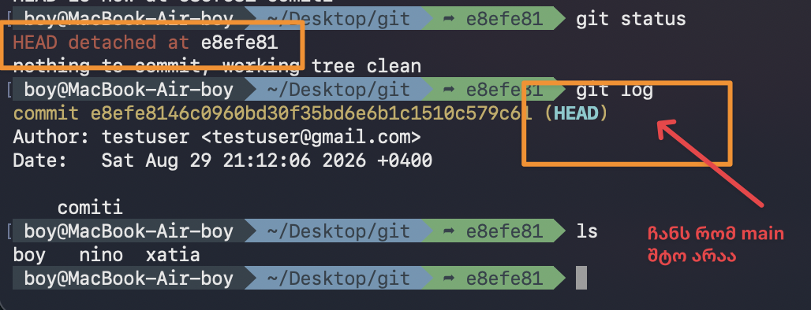
.
უკან, ისტორიიდან ბოლო აქტუალურ **C4** _**ქომითზე**_(master) გადმოსასვლელად შეგვიძლია მივუთითოთ _**brench(შტოს)**_ -ს სახელი (ჩვენ შემთხვევაში _**master**_):

```bash
git checkout master
```


### 2. ქომითში გადასვლა, და *ფაილის  წამოღება*, 

[16:20 - YouTube](https://www.youtube.com/watch?v=BmBaoxaFgVM&list=PLbZtgfvYfOp3l7dZAnFVfY-bMC6dhP-vO&index=7) 

> შეგვიძლია, უკან რომელიმე commit-ში გადავიდეთ და იქიდან წამოვიღოთ რომელიმე ერთი ან რამდენიმე ფაილი master , ბოლო აქტუალურ commit-ზე. 

```bash
git checkout [commited_ID ; Head^^] -- file1 file2
```

> **ანუ რა მოხდა**:  `git checkout 234234181348 -- FileName`
> გადავედით უკან კონკრეტულ **commit**-ზე(234234181348) და იქიდან **HEAD/master** შტოზე წამოვიღეთ(**გადმოვაკოპირეთ**) ფაილი სახელით "**FileName**", რომელიც აქ იქნება **stage / modified**  მდგომარეუბაში. 
> .
> ანუ **ძველ commit**-ში მხოლოდ "**ჩავიხედეთ**", იქიდან ავიღეთ ფაილი და გადმოვიტანეთ(გადმოვაკოპირეთ) **HEAD/master** შტოზე.
> **P.S.** - - რათქმაუნდა  მანამდე გადასული ვიყავით `git checkout [commited_ID ; Head^^]`-ით და დათვალიერებული გვქონდა იქაური ფაილები. 


`git checkout commited_id -- .` - - - კონკრეტული ქომითიდან   **ყველა ფაილების**   წამოღება(გადმოკოპირება), რომლებიც  **HEAD/master** შტოზე(ახლა სადაც ვართ)  იქნება **stage** სივრცეში.

- `git checkout -- . ` - - - 
	- **სიტუაცია 1**: როცა რომელიმე commit-დან გადმოვიტანეთ რაიმე ფაილი და ახლა  არსებულ **master head**-ში ვართ, ყველა **გადმოტანილი ფაილი** სანამ **stage** გარემოშია ნულდება.
	- სიტუაცია 2: როცა არსებულ main commit-ზე ხარ, ანუ მუშაობ ჩვეულებრივ. და შეგეშალა.... ანუ გაანულებს ყველა ცვლილებას რაც მხოლოდ **"modifited"** გარემოშია


## GIT N7. "git commit" ბრძანების შესაძლებლობები. "*git clean*" ბრძანება

### commit-ის სპეციალური გასაღებები/ალმები : 

მხოლოდ  **untracked/modifited**(დარედაქტებული) და **stage** ფაილები **პირდაპირ ქომითდება** და არა **untracked** ფაილები. ( **გამოტოვო** `git add .`)

```bash
git commit -a -m  "edit file"
```

`-a `- - - (**all**) ყველა modifited ფაილის დაკომიტება
`-m `- - - კომენტარს/სახელს რომ ვუწერთ (ახლა "**edit file**") მაგისთვისაა

**ბოლო  ქომითების  კომენტერების  რედაქტირება :**

```bash
git commit --amend -m "new coment"
```

`--amend `- - - ჩაანაცვლებს ბოლო კომენტარს კომიტზე. 


#### **unstracked**   ფაილების  წაშლა:

**reset**-ით **untracked** ***ფაილებს ვერ ვშლით***, ვერ ვეხებით. 
**untracked   git**  -თვის ნიშნავს უკონტროლოს.   ამისთვის არსებობს   **clean** თავისი გასაღებებით.

```bash
git clean -n     - - -    -n გასაღბი გვაჩვენებს untracted ფაილების სიას, რომლის წაშლას აპირებს:

Would remove file3   - - - ბრძანება გამოაქვს. "ეს ფაილია ასეთი და გინდა წაშალოო?"  
                                                         ( ანუ ჯერ არ წაუშლია)  
```

```bash
git clean -f      - - -  -f(force) ყოველგვარი გაფრთხილების გარეშე შლის ყველა untracked ფაილებს.

Removing file3    - - -  გამოიტანა შეტყობინება რა ფაილებიc წაშალა.
``` 

```bash
git clean -f file.name    - - -   untraked ფაილებიდან კონკრეტულის  წაშლა
Removing file.name
```


## GIT N8. GitHub  ( push )

[GIT N8. GitHub-ზე მომხმარებლის და რეპოზიტორის შექმნა - YouTube](https://www.youtube.com/watch?v=BJjNOeo2XeQ&list=PLbZtgfvYfOp3l7dZAnFVfY-bMC6dhP-vO&index=8) 

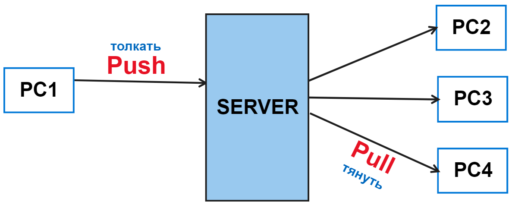

```bash
git remote -v     - - - განახებს მიბმულია თუ არა სერვერზე.(github ... )
                         თუ არაფერი გამოიტანა ე.ი. არსად არ ვარ მიბმული
```

### 1. **ლოკალური მანქანა** მიბმულია თუ არა რაიმე რემოუთზე

```bash
git remote add [remote_name] [URL]
```

`remote_name` - - - სახელი რაც გვინდა მივამაგროთ რემოუთ რეპოზიტორის.( ხშირად არქმევენ : **origin** )
`URL` - - -  რეპოზიტორის მისამართ რომლის დამატება გვინდა. 

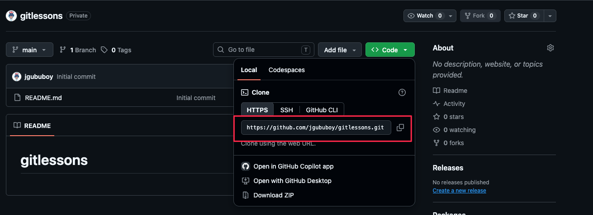


`git remote add origin https://github.com/jgububoy/gitlessons.git` - - - **ანუ**: გავუშვით ბრძანება სადაც origin სახელზე დავამატეთ ეს მისამართი. 

ახლა თუ გავუშვებთ ბრძანებას: 
```bash
$ git remote -v   

- - - ამის გაშვების მერე გამოიტას შემდეგს(ანუ ხედავს რემოუთ რეპოზიტორის რომელზეც მიბმულია):
  
origin  https://github.com/jgububoy/gitlessons.git (fetch) - - -   pull  ის მსგავსია
origin  https://github.com/jgububoy/gitlessons.git (push)  - - -   ხოდა დაფუშვაო
```


### 2. სხვა მისამართზე მიბმა:

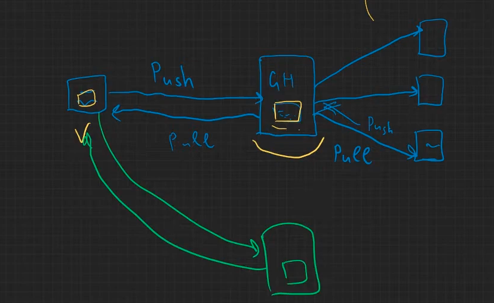
.
  ლოკალური მანქანის(ჩვენი კომპის) სხვა რეპოზიტორისთან **ქონექთის** გასაკეთბლად (ოღონდ **სხვა სახელით** -  origin სახელზე უკვე ერთ ლინკი(remoute repository ) მიბმულია ) : 
  ხდება იგივე ნაირად: 
  - `git remote add [remote_name] [URL]` - - -სახელს სხვას ვუთთებთ და URL-საც რომელსაც ვუერთდებით

##### თუმცა ჯობია, რომელიც გვინდა(მაგ. ძველი) ამოვშალოთ:
  
```bash
git remote remove [name(ამ შემთხვევაში origin)]
```

ანუ სისტემას ვეუბნებით:  " **ამ სახელზე(origin) რა არის მიმაგრებული წამიშალე.** "
ეს გულისხმობს რომ გაწყდა კავშირი ლოკალურ მანქანასა და სერვერს შორის 
( და არა იმას რომ სერვერზე რამე წავშალეთ )

### 3. ლოკალური მანქანიდან სერვერზე ატვირთვა:

```bash
git push origin master
```

**remote server**-ზე პროექტის **ატვირთვა**:
- _push_ - ატვირთე ;  
- _origin_ - სახელზე, რომლის უკან ლინკია ნაგულისხმევი რომელიც უკვე მივუთითე.
- **ლოკალური პროექტის**(რეპოზიტორიის) **master** შტოდან( _branch_)   **დაქომითებული ფაილები**.

### 4. მნიშნვნელოვალი დეტალი: 

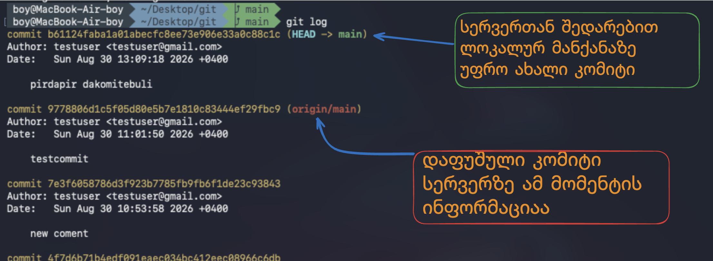
.
ამ სურათზე არსებული მომენტის მერე რომ დავფუშავ( `git push origin main `) ,  **ლოკალური მანქანის და სერვერის კომიტები** ***შეესაბამებოდეს*** იქნება ერთმანეთს. 

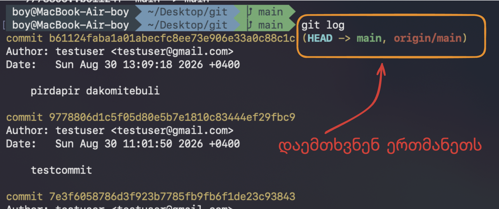
.


## GIT N9. SSH გასაღების მიბმა GitHub-ზე. რეპოზიტორის კლონირება

[GIT N9. SSH გასაღების მიბმა GitHub-ზე. რეპოზიტორის კლონირება - YouTube](https://www.youtube.com/watch?v=7UtcvLcwX_4&list=PLbZtgfvYfOp3l7dZAnFVfY-bMC6dhP-vO&index=9) 

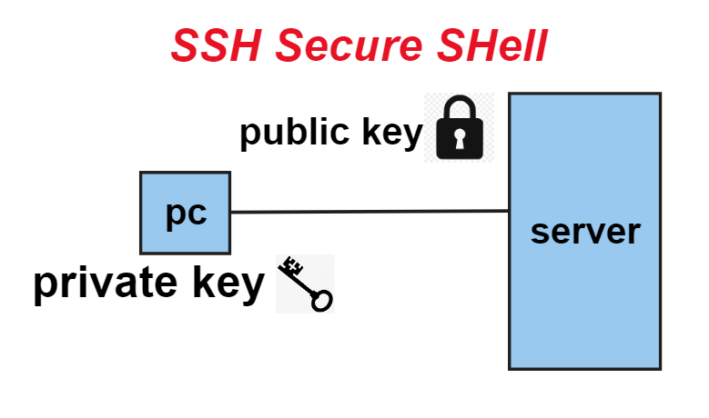

**SSH** - ქსელური პროტოკოლია, კომუნიკაციის წესი და გვაძლევს საშუალებას რემოუთ ოპერეციების მართვისა.
ასევე მისი დახმარებით იშიფრება კომუნიკაცია და ძალზედ უსაფრთხოს ხდის. 

> P.S.   ssh გასაღებები ინახება მისამართზე:  ` ~/.ssh `

**გასაღებები(key)** :  [👥  SSH  Public & Private Key - მონახვა, შექმნა, წაშლა... ( ssh_ 0.2 )](../../network/👥%20%20SSH%20%20Public%20&%20Private%20Key%20-%20მონახვა,%20შექმნა,%20წაშლა...%20(%20ssh_%200.2%20).md) 
ლოკალურად , ჩვენ კომპში ვქმნით **private** და **public** გასაღებებს.
public key-ის ვაგზავნით სერვერზე, და ჩვენი private key-ის დახმარებით სწრაფად ვახდენთ კავშირს სერვერთან. 

> წინად github-ზე რომ დავუკავშირდით, დავქონექთდით, ვიყავით HTTPS პროტოკოლით. 
 იგივე სერვერს რომ დავუკავშირდეთ იგივე origin სახელით უნდა გავწყვიტოთ კავშირი. - - - ნუ რამდენს ვწერ პატარა ბავშვივით.

```shell
git remote remove origin  - - - გავწყვიტეთ კავშირი 
git remote -v             - - -  შევამოწმეთ კავშირი

მერე github-ზე დავამატოს საიტზე კომპში გენერირებული publix key. და მერე საიტზე რომ დაგენერირდება ის ssh გასაღები უნდა გადავცეთ: 

git remote add origin git@github.com:jgububoy/gitlessons.git - - დავუკავშრდით SSH-ით
```

---

```shell
git clone (url or ssh)
```

ასე ახალ კომპში/პაპკაში ხდება github-დან ფაილების ცლონირება/ჩამოტვირთვა. 
**შენიშვნა**: ასეთ დროს არ ჭირდება პაპკაც წინასწარ ინიციალიზაცია და რაიმე სახის მომზადება. 


## GIT N10. განშტოებების ცნება - "Branching" და "Merge" ოპერაცია

[GIT N10. განშტოებების ცნება - "Branching" და "Merge" ოპერაცია - YouTube](https://www.youtube.com/watch?v=uzkXi48ChdI&list=PLbZtgfvYfOp3l7dZAnFVfY-bMC6dhP-vO&index=10) 

> შტოების დამატება/წაშლა    და   მათზე  გადასვლა/გადმოსვლა. 
> მთავარ შტოზე შემოტანა:   fast-forward  და  აუტო commit. 

**branch** - ეს არის შტო, ხაზი. 
**master** ან **main** - - -  ძირითადი შტო
**განშტოება** - - - შეგიძლია ნებისმიერი სახელი დაარქვა, პრაქტიკაშ ძირითადად **feature**- ს არქმევენ. ან კონტექსტის მიხედვით შესაბამისი სახელი. 

> **განშტოება** - - -აზრი ისაა რომ ან შენ ან გუნდი მუშოაბთ, ტესტავთ აკომიტებთ... მთავარია მუშაობს ყველაფერი  გატესტილია და მერე ამას გადაიყვან **master** - სტაბილური ვერსიების შტოში. 

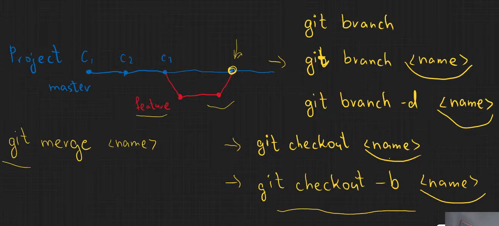

```bash
git branch             - ყველა შტოს სია რაც გვაქვს. და რომელზეც დგახარ იქვე მინიშნებულია.
git branch <name>      - ახალი name შტოს დამატება
git branch -d <name>   - name სახელის შტოს წაშლა. (სხვაზე უნდა იდგე)
git checkout <name>    - name შტოზე გადასვლა. როგორც commit-ების შემთხვევაში გადადიოდი/გადმოდიოდი
git checkout -b <name> - თან შექმნა და თან გადასვლა ახალ შტოზე.

git merge <name>       - დამატებითი(პირობითად feature იყო) შტოდან ცვლილებების გადმოტანა მთავარ
                       შტოში.მაგრამ უნდა ვიდგეთ მთავარ შტოზე. 
                       ანუ ვეუბნებით გადმოიტანოს name შტოდან ინფორმაცია. 
```

**მაგალით რაც გავაკეთე ამ მონაცემებით:**
1. შევქმენეი ფაილი **file.txt** და დავაკომიტე როგორც წესია **master  შტოში**. 
2. დავამატე **future შტო** და ამ შტოში მყოფმა გავხსენი იგივე file.txt
	1. ამ ფაილში ცვლილებები შევიტანე (რაღაცა წავშალე, რაღაცა დავამატე.) 
	2. ესეც ჩვეულებრივ დავაკომითე. და **future შტოში** მყოფს  **log** -ში მაქვს : 
	3. 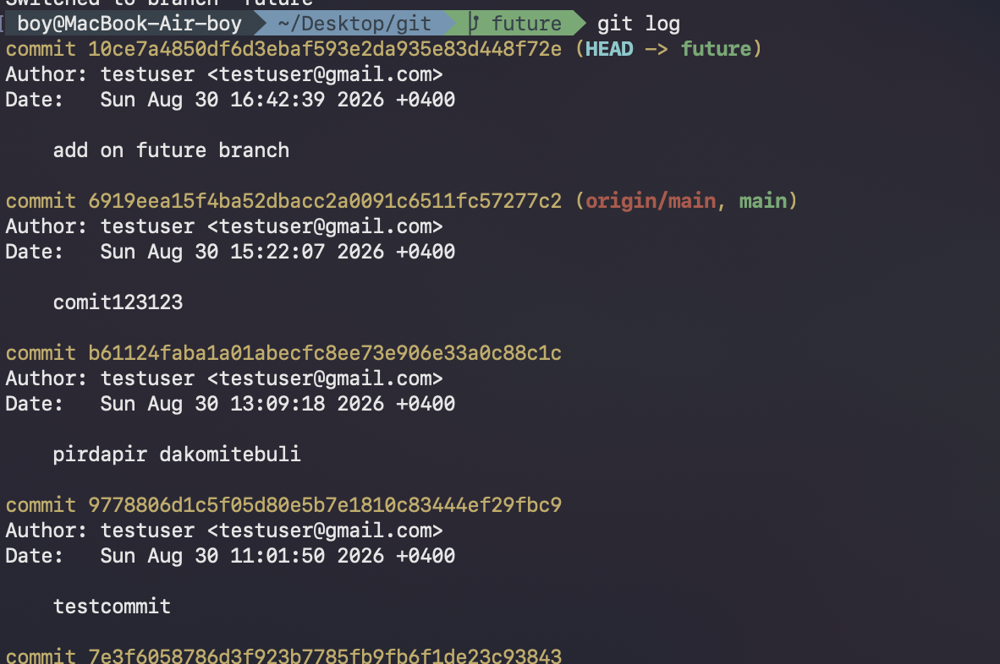
	4. ანუ დაფუშული , main-ში რაც იყო ის უკვე უფრო ძველია. ნუ ეს ცნობისათვის. 
	5. მაგრამ მთავარი ნიუანსი ახლა იქნება , ისევ **master შტოში** რომ გადავალთ.
3. გადმოვედით checkout-ით master შტოში...
4. ახლა აქ რომ გავხსნი იგივრ **file.txt** -ს, შეტანილი ცვლილებები არ გამომიჩდება, რადგანაც ის ცვლილებები სხვა შტოზე ყოფნისას შევიტანე. 
5. master შტოში გადმოსატანად იმ ცვლილებისა უნდა დავმერჯო: 
6. `git merge future` - - - **future** შტოდან გადმოიტანე ცვლილებებითქო.  და აქ იჩითება ახალი **fast-forward**. 
7. ასევე რომ დავმერჯე, **master**-ში გადმოვიტალე. ლოგებშ შემდეგი სურათია
	1. 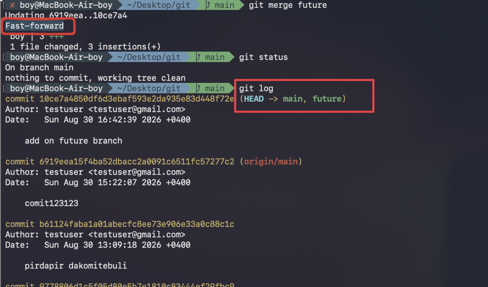
	2. **main**(იგივე **master**) და **future შტოები** ერთწერტილში მოექცა, დასინქრონებულია,  გათანაბრდა, გაუსწორდა ერთმანეთს, როვნადაა.
8. 

### 1. **fast-forward** -ინგი

 > " **fast-forward** - ინგი " - განშტოებიდან მთავარ შტოზე "მარტივი" **შემოტანის წერტილი**.
 
 როდესაც ვწერთ : `git merge <name>`  ე.ი. გვინდა განშტოებიდან(ამ შემთხვევაში **Future** დავარქვით) მთავარ(**master**) შტოში ცვლილებების შემოტანა... 
 
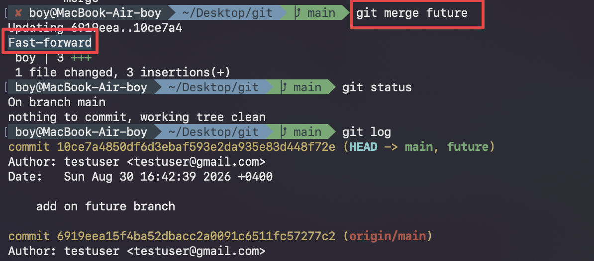
.
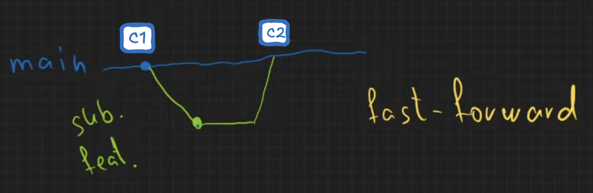

თუ  ფაილების **future** შტოდან,  **მთავარ(master) შტოზე გადატანამდე** ,  მთავარ შტოში არ მომხდარა რაიმე ცვლილება( **არ მომხდარა არაფრის დაქომითება**.),  მაშინ ***მარტივად მოხდება შერწყმა/ჩასხმა***  და ამიტომ **შერწყმის ადგილას(C2)** არ ხდება და არც ჭირდება  ახალი დაქომითება. მოხდა  **fast-forward** - ინგი. 


### 2. **დამერჯვამდე** master-ში commit :

[29:26 - YouTube](https://www.youtube.com/watch?v=uzkXi48ChdI&list=PLbZtgfvYfOp3l7dZAnFVfY-bMC6dhP-vO&index=10) 

როდესაც  **დამერჯვამდე**   მოხდა   მთავარ  შტოზე   რაიმეს  **დაქომითება** :  

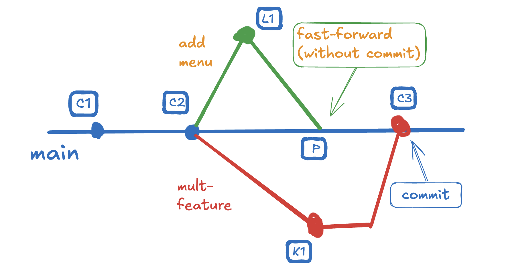
.
**ანუ!!!**:  სურათის მაგალითზე. 
- **C2** commit-ზე(მომენტში) ახალი განშტოება **mult-feature** გავაკეთეთ.
	- ვჩალიჩობთ(ვანახლებთ, ვტესტავთ, ვაკომიტებთ... ) **mult-feature განშტოებაში**. . .
- ამ ჩალიჩის პერიოდში სანამ ეს სიახლეები **main შტოზე** გადავიტანეთ, მანამდე **სხვა შტო გამოეყო**, როგორ სურათზე ჩანს ( იქაც წავიდა მუშაობა...). 
	- ამ **add-menu შტო** "ჩვეულებრტივ" **fast-forward** პრინციპით გადმოვიტანეთ მარტივად **main** შტოზე. 
- ამ ყველაფრის მერე **mult-feature** შტოდან როდესაც დავმერჯავთ( წერტილი **C3** ) , ანუ შემოვიტანთ სიახლეებს **main** შტოზე, გამოიტანს შემდეგ ბრძანებას:

- " როგორ დავარქვა ამ დამატებით **ქომითსო** " ??? ( ასეთ შემოტანის დროს აუცილებლად **აკომიტებს** )
	- 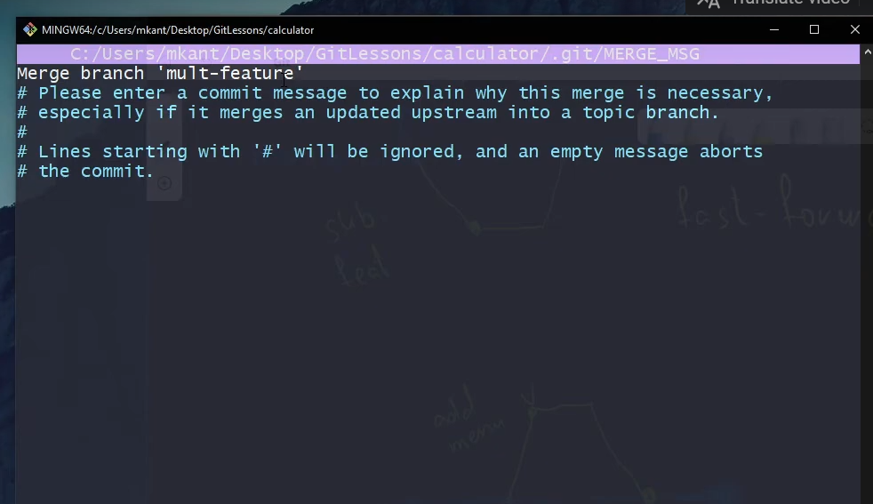
.
- **ანდა** შეიძლება არც გკითხოს , შემოიტანს **untrackted/modifited** გარემოში რომელიც მერე ჩვეულებრივ უნდა **დააქომითო**: 
	- 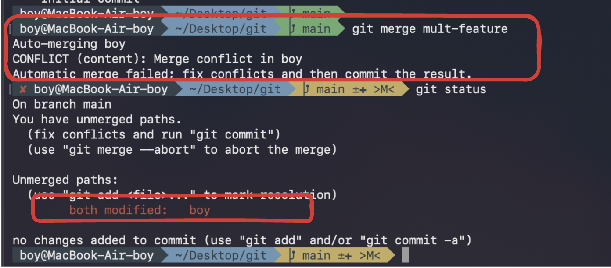
.
ბოლოს ყველაფერი რომ გადმოვიტანე main შტოზე, შემდეგი სახე დარჩა git log -ში. 
(p.s. **github**-ზე ატვირთვა, **push** დარჩა. )

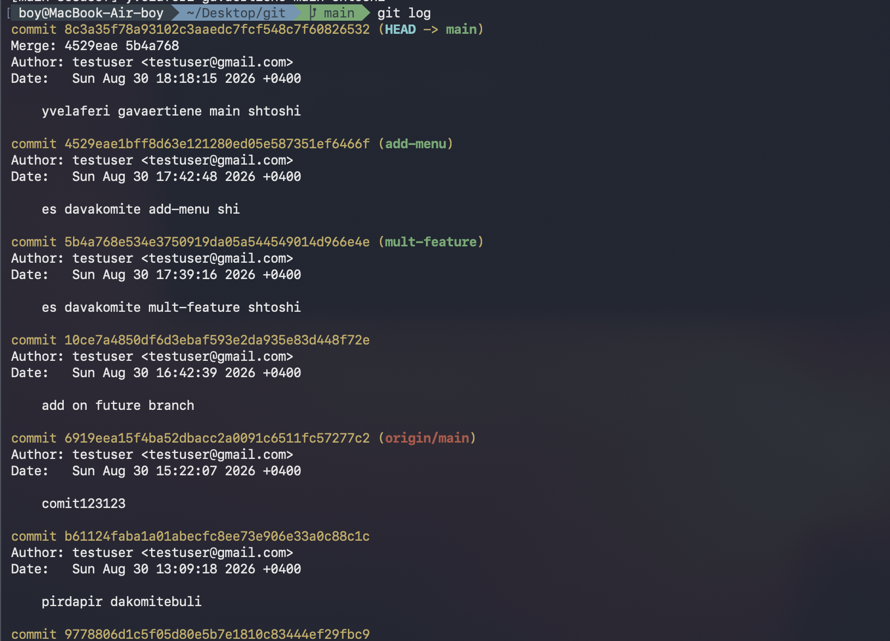
.
დაფუშვის მერე, ავტვირთე **github**-ზე: 

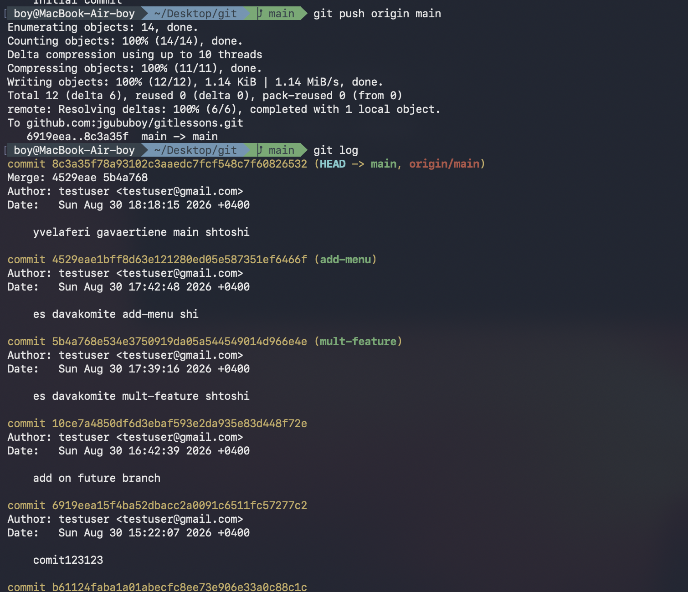
.


## GIT N11. "git pull" ბრძანების მექანიზმი ( *git fetch , merge* )

[GIT N11. "git pull" ბრძანების მექანიზმი (git fetch, merge) - YouTube](https://www.youtube.com/watch?v=JOHLQudafXw&list=PLbZtgfvYfOp3l7dZAnFVfY-bMC6dhP-vO&index=11) 

- `git pull`- - - (**ჩამოქაჩვა**) ( გულისხმობს `fetch`-ს და `merge`-ს ერთად ), **ქაჩავს** განახლებებს დისტანციური რეპოზიტორიიდან და ავტომატურად აერთიანებს(**მერჯავს**) მათ თქვენს მიმდინარე ლოკალურ განშტოებაში.
* `git fetch`- - - **ჩამოტვირთავს** ისტორიასა და განახლებებს დისტანციური სერვერიდან და მხოლოდ **ანახლებს origin/master** შტოს.  
	* თქვენს ლოკალურ ფაილებში ცვლილების ან **შერწყმის გარეშე**( ***დამერჯვის გარეშე*** ). 

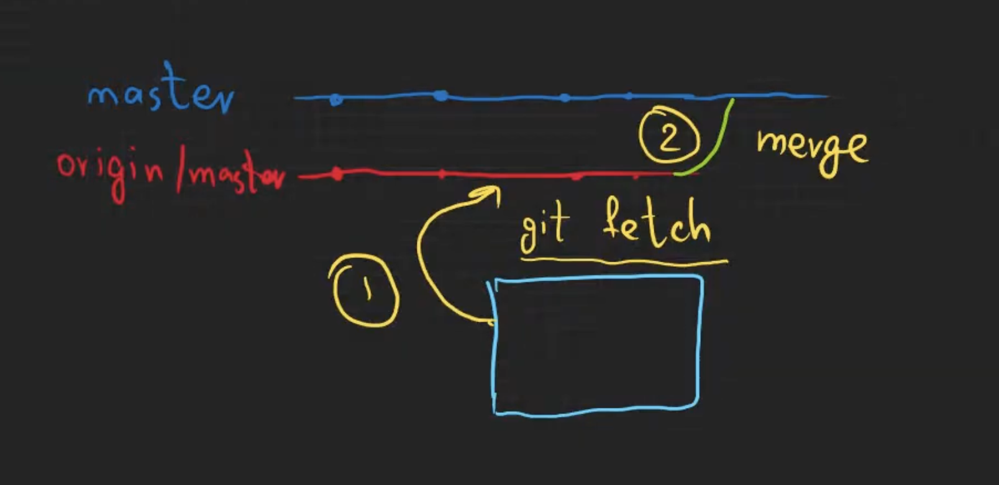

- `-r` ნიშნავს **remotes**-ს
- **რას აკეთებს:**  - -- ჩამოთვლის ყველა იმ ბრენჩს, რომლებიც ინახება შორეულ სერვერზე (მაგ: `origin/main`, `origin/dev`), თუმცა ეს არის ბოლო ცნობილი მდგომარეობა შენს კომპიუტერში არსებული ქეშიდან.

- `git branch` - - -  აჩვენებს მხოლოდ შენს ადგილობრივ (local) ბრენჩებს.
- `git branch -r` - - -  აჩვენებს მხოლოდ დისტანციურ ბრენჩებს.
- `git branch -a` - - -  აჩვენებს როგორც ადგილობრივ, ისე დისტანციურ ბრენჩებს ერთად.

**პ.ს.** 
ეს ყველაფერი ასევე განშტოებებზეც ისევ ისე მუშაობს: 

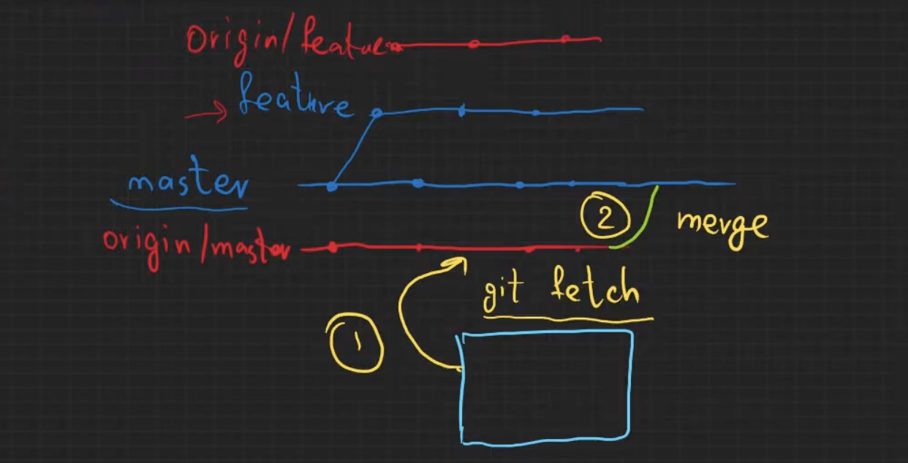
.

 

.
