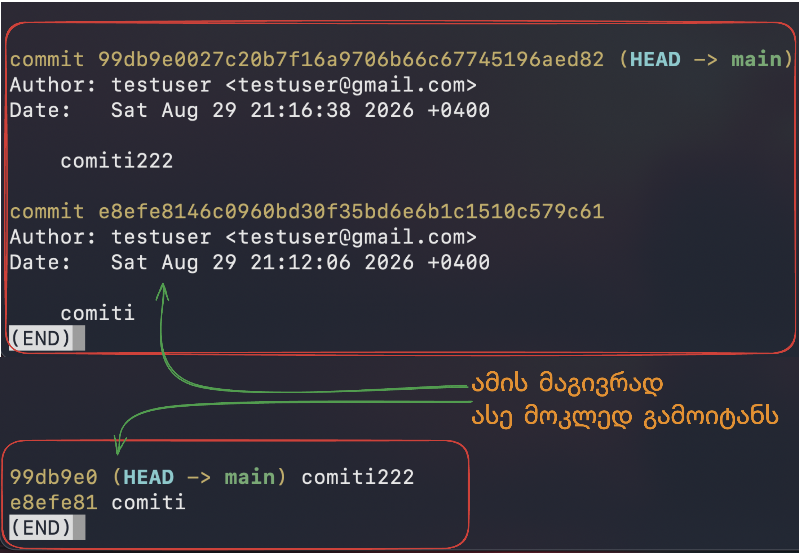

---
aliases:
  - git
tags:
  - git
done: false
created: 2026-01-13
sourse:
---
# git log

**Git** ნაგულისხმევად იყენებს პროგრამას, რომელსაც ეწოდება **Pager** (ჩვეულებრივ, ეს არის `less` ან `vim`-თან მიმსგავსებული გარემო), რათა გრძელი ტექსტი (ლოგები) ერთიანად არ დაიყაროს ტერმინალში და მისი სქროლვა შეძლო.

თუმცა, `Ctrl + Z` არ არის გამოსვლის სწორი გზა — ეს ბრძანება პროცესს კი არ თიშავს, არამედ "**აჩერებს**" (**Suspend**) და ფონურ რეჟიმში ტოვებს, რაც მოგვიანებით ტერმინალს გიჭედავს.

## როგორ გამოვიდეთ სწორად?

როდესაც `git log`-ს გახსნი, გამოიყენე კლავიატურის ეს ღილაკები:

- **`q` ღილაკი:** (Quit) — ეს არის ყველაზე მთავარი. უბრალოდ დააჭირე `q`-ს და მაშინვე დაბრუნდები ტერმინალის ჩვეულებრივ რეჟიმში.
- **Space (ჰარამხანა):** გადადის შემდეგ გვერდზე.
- **ისრები (ზევით/ქვევით):** ნელი სქროლვა.
- **`/` (Slash):** თუ რამეს ეძებ ლოგებში, დააჭირე `/`, ჩაწერე სიტყვა და დააჭირე **Enter**.

## როგორ ავირიდოთ ეს "ცალკე ფანჯარა"?

თუ გინდა, რომ `git log`-მა ინფორმაცია პირდაპირ ტერმინალში დაგიბეჭდოს და აღარ გადაგიყვანოს იმ "უცნაურ" რეჟიმში, შეგიძლია გამოიყენო რამდენიმე გზა:

1. **ერთჯერადი გამოსავალი**: დაამატე `--no-pager` ბრძანების წინ:

```bash
git --no-pager log
```

2. თუ გინდა, რომ **Git**-მა ტერმინალში **სამუდამოდ პირდაპირ  დაბეჭდოს** ყველაფერი, გაუშვი ეს ბრძანება:

```bash
git config --global core.pager "cat"
```

ამის შემდეგ `git log` ჩვეულებრივი ტექსტივით დაიბეჭდება, როგორც მაგალითად `ls` ბრძანება.


3. **უფრო ლამაზი შემოკლებული ლოგი**: ეს ბრძანება ლოგების დიდ სახელს ამოკლებს ვიზუალურად:

```bash
git log --oneline
```


.

## Git - ის ერთ-ერთი ყველაზე პოპულარული " საიდუმლო "

> ეს რაღაც ვერ ავამუშავე!!! **მერე ვნახოთ**


ეს არის Git-ის ერთ-ერთი ყველაზე პოპულარული "საიდუმლო". ჩვენ შევქმნით ე.წ. **Alias**-ს (მეტსახელს), რომლის ჩაწერის შემდეგ Git დაგიხატავს პროექტის ისტორიას ფერადი ხაზებითა და სიმბოლოებით.

გაუშვი ეს გრძელი ბრძანება შენს ტერმინალში ერთხელ (შეგიძლია პირდაპირ დააკოპირო):

```bash
git config --global alias.adog "log --all --decorate --oneline --graph"
```

### ახლა ნახე რა მოხდა:

ამიერიდან, ნაცვლად მოსაწყენი `git log`-ისა, აკრიფე:

```bash
git adog
```

**რას დაინახავ ეკრანზე:**

- **`--graph`**: მარცხენა მხარეს დაინახავ ფერად ხაზებს, რომლებიც აჩვენებს, სად გაიყო "ტოტები" (Branches) და სად შეერთდა.
    
- **`--oneline`**: თითოეული commit დაიკავებს მხოლოდ ერთ ხაზს.
    
- **`--all`**: დაინახავ ყველა ბრენჩის ისტორიას ერთდროულად.
    
- **`--decorate`**: Git გაჩვენებს, თუ სად დგახარ ახლა (HEAD) და რომელი commit რომელ ბრენჩს ეკუთვნის.

### კიდევ ერთი სასარგებლო "ხრიკი" (Shortcuts)

თუ ხშირად გიწევს მუშაობა, შეგიძლია სხვა ბრძანებებიც შეამოკლო, რომ ნაკლები წერო:

1. `git status`-ის მაგივრად იქნება **`git s`** :

    ```bash
git config --global alias.s "status -s"
    ```

(`-s` ნიშნავს short-ს, ანუ ძალიან მოკლედ და კონკრეტულად გეტყვის რა ხდება).


2. `git commit -m`-ის მაგივრად  **`git c`**:

    ```bash
    git config --global alias.c "commit -m"
    ```

ამის შემდეგ დაწერ ასე: `git c "ჩემი მესიჯი"`.

### როგორ წავშალოთ Alias, თუ აღარ გვინდა?

თუ რომელიმე შემოკლება აღარ მოგეწონება, შეგიძლია მარტივად წაშალო:

```bash
git config --global --unset alias.adog
```

ამ ეტაპზე Git-ის სხვა რომელ ბრძანებას იყენებ ყველაზე ხშირად? შემიძლია იმისთვისაც გასწავლო რაიმე "Shortcut".