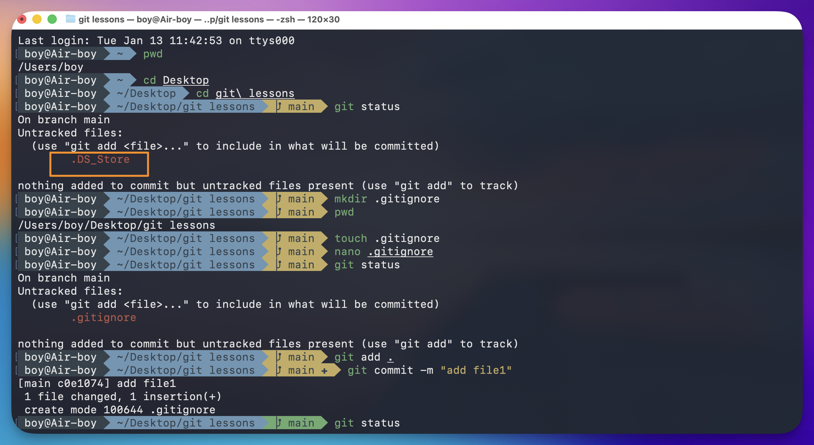

---
aliases:
  - .DS_Store
  - ds-store
  - ds store
  - dsstore
tags:
  - git
  - apple
  - linux
done: false
created: 2026-01-13
sourse:
---
# .DS_Store

 


***DS_Store*** (Desktop Services Store) არის ***macOS***-ის სისტემური ფაილი, რომელიც ავტომატურად იქმნება ყველა იმ ფოლდერში, რომელსაც **Finder**-ით ხსნი.

მარტივად რომ ვთქვათ:

- **რას აკეთებს:** ის ინახავს ინფორმაციას იმის შესახებ, თუ როგორ გაქვს მოწყობილი ეს კონკრეტული ფოლდერი (მაგალითად: ხატულების ზომა, მათი განლაგება, ფანჯრის პოზიცია, ფონის ფერი და ა.შ.).
    
- **რატომ არის პრობლემა Git-ში:** ვინაიდან ეს ფაილი macOS-ისთვისაა და სხვა სისტემებს (Windows, Linux) ის არ სჭირდებათ, Git-ში მისი "დაქომითება" ***ცუდ ტონად ითვლება***. ის მხოლოდ ნაგავს ამრავლებს რეპოზიტორიაში.

### როგორ მოვიქცეთ?

თუ ხედავ, რომ `.DS_Store` ამოგიხტა **Untracked** ფაილებში, ყველაზე კარგი გზაა მისი  ***.gitignore***  ფაილში ჩამატება.

1. შექმენი (თუ არ გაქვს) ფაილი სახელით `.gitignore` პროექტის მთავარ დირექტორიაში.
2. შიგნით ჩაწერე მხოლოდ ერთი ხაზი : 

```bash
.DS_Store
```

### თუ უკვე დაქომითებული გაქვს:

თუ **შეცდომით** უკვე გაქვს გაგზავნილი ეს ფაილი **Git-ის ისტორიაში**, გამოიყენე ეს ბრძანება მის წასაშლელად ისე, რომ შენს კომპიუტერში დარჩეს, მაგრამ რეპოზიტორიიდან გაქრეს:
```bash
git rm --cached .DS_Store
```

შემდეგ კი ჩაამატე `.gitignore`-ში, რომ მომავალში აღარ შეგაწუხოს. 

### .DS_Store  - კომპიუტერის ყველა ფოლდერიდან წაშლა.

#### 1. მიმდინარე პროექტიდან ამოშლა (Recursive)

თუ გსურს, რომ შენი პროექტის **ყველა ქვესაქაღალდიდან** წაშალო უკვე არსებული `.DS_Store` ფაილები, გამოიყენე ეს ბრძანება ტერმინალში:
```bash
find . -name ".DS_Store" -delete
```
.

>ეს ბრძანება იპოვის და წაშლის ყველა ასეთ ფაილს მიმდინარე საქაღალდეში.

#### 2. Git-ის ინდექსიდან ამოშლა

თუ ეს ფაილები უკვე "დაtrekილია" (Tracked) Git-ის მიერ, გამოიყენე ეს ბრძანება, რომ Git-მა მათი იგნორირება დაიწყოს:
```bash
git rm -r --cached .DS_Store
```

.

> ამის შემდეგ აუცილებლად გააკეთე ერთი `commit`, რომ ცვლილება შენარჩუნდეს.

---

#### 3. გლობალური იგნორირება (ყველაზე ეფექტური გზა)

იმისათვის, რომ **არცერთ პროექტში** აღარ შეგაწუხოს ამ ფაილმა, შეგიძლია Git-ს უთხრა, რომ `.DS_Store` ყოველთვის დააიგნოროს, მიუხედავად იმისა, გაქვს თუ არა `.gitignore` ფაილი კონკრეტულ საქაღალდეში:

1. **შექმენი გლობალური ignore ფაილი:**
```bash
echo ".DS_Store" >> ~/.gitignore_global
```

2. უთხარი Git-ს, რომ ეს ფაილი გამოიყენოს:
```bash
git config --global core.excludesfile ~/.gitignore_global
```

**რჩევა:** ამის გაკეთების შემდეგ, აღარასდროს დაგჭირდება თითოეულ პროექტში `.DS_Store`-ზე ნერვიულობა.


### შეჯამება

ამ ფაილების წაშლა ჰგავს მაგიდიდან მტვრის გადაწმენდას — არაფერი გაფუჭდება, უბრალოდ გარემო უფრო სუფთა იქნება.

ერთადერთი "ზიანი" ისაა, რომ თუ ფოლდერში ფონად სურათი გქონდა დაყენებული (რასაც დღეს იშვიათად აკეთებენ), ის სურათი გაქრება და მოგიწევს თავიდან დაყენება.