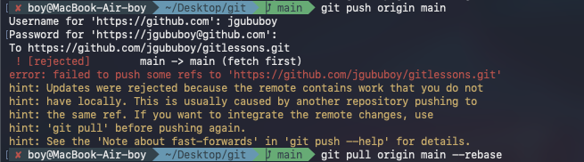

---
aliases:
  - პაროლი გითი
  - გითი პაროლი
  - პაროლი გითზე
  - გითჰაბის პაროლი
tags:
  - git
done: false
created: 2026-08-30
sourse:
---
# github push error

## 1. ვერ push-ავ, ვერ ვტვირთავ, github-ზე რამეს. პაროლს ითხოვს: 

> ეს მეთოდი დამეხმარა. 

GitHub-მა უსაფრთხოების მიზნებით **გააუქმა ექაუნთის ჩვეულებრივი პაროლით** ტერმინალიდან კოდის ატვირთვა (push). როდესაც კონსოლი მომხმარებლის სახელს და პაროლს გთხოვს, პაროლის ნაცვლად უნდა მიუთითოთ სპეციალური წვდომის კოდი — **Personal Access Token (PAT)**.

პრობლემის მოსაგვარებლად მიჰყევით ამ ნაბიჯებს:

**1. შექმენით Personal Access Token (PAT)**

- შედით თქვენს GitHub ექაუნთში ბრაუზერში.
    
- მარჯვენა ზედა კუთხეში მიაჭირეთ თქვენი პროფილის ფოტოს და აირჩიეთ **Settings**.
    
- გადადით ბოლოში, მარცხენა მენიუდან აირჩიეთ **Developer settings**.
    
- გახსენით **Personal access tokens** და აირჩიეთ **Fine-grained tokens** (ან Classic).
    
- მიაჭირეთ **Generate new token**.
    
- მიეცით სახელი (Token name), აირჩიეთ ვადის გასვლის დრო და **Repository access** განყოფილებაში მონიშნეთ `All repositories` (ან კონკრეტული პროექტი).
    
- **Repository permissions**-ში მიეცით **Contents** უფლებაზე `Read and write`.
    
- ბოლოში მიაჭირეთ **Generate token** ღილაკს.
    
- **მნიშვნელოვანია:** დააკოპირეთ გენერირებული კოდი (ის მხოლოდ ერთხელ გამოჩნდება!).
    

**2. გამოიყენეთ ტერმინალში**

- ახლიდან ჩაწერეთ `git push` ბრძანება.
    
- მომხმარებლის სახელის (Username) მოთხოვნისას ჩაწერეთ თქვენი **GitHub-ის მეილი ან იუზერნეიმი**.
    
- პაროლის (Password) მოთხოვნისას ჩაწერეთ არა თქვენი ექაუნთის პაროლი, არამედ ახლახן **დაკოპირებული Token**.
    

_შენიშვნა: იმისათვის, რომ ყოველ ჯერზე ამ კოდის ჩაწერა აღარ მოგიწიოთ, შეგიძლიათ დააყენოთ Git Credential Manager, ან პროექტის ლინკი გადაიყვანოთ SSH პროტოკოლზე._


## შეცდომა 2. 



[obsidian git <- -> git obsidian  ( --rebase )](obsidian%20git%20<-%20->%20git%20obsidian%20%20(%20--rebase%20).md)

ეს შეცდომა (`fetch first` / `updates were rejected`) იმის გამო ხდება, რომ GitHub-ზე არსებული რეპოზიტორია შეიცავს ისეთ ცვლილებებს, რომლებიც თქვენს კომპიუტერში (ლოკალურად) არ გაქვთ. ეს ხშირად ხდება მაშინ, როდესაც GitHub-ზე პირდაპირ რამე შეიცვალა (მაგალითად, შექმენით `README.md` ან `.gitignore` ფაილი საიტის შექმნისას) ან სხვა ადგილიდან აიტვირთა კოდი.

პრობლემის მოსაგვარებლად ჯერ უნდა გადმოქაჩოთ (pull) სერვერზე არსებული ცვლილებები და შემდეგ ისევ სცადოთ ატვირთვა:

1. **გადმოიწერეთ და შეაერთეთ ცვლილებები:**
```bash
git pull origin main --rebase

```
*(თუ რაიმე კონფლიქტია, გიტი გეტყვით და მოგვარებას მოითხოვს, თუმცა უმეტეს შემთხვევაში ავტომატურად ერთდება).*

2. **ხელახლა ატვირთეთ კოდი:**
```bash
git push origin main

```