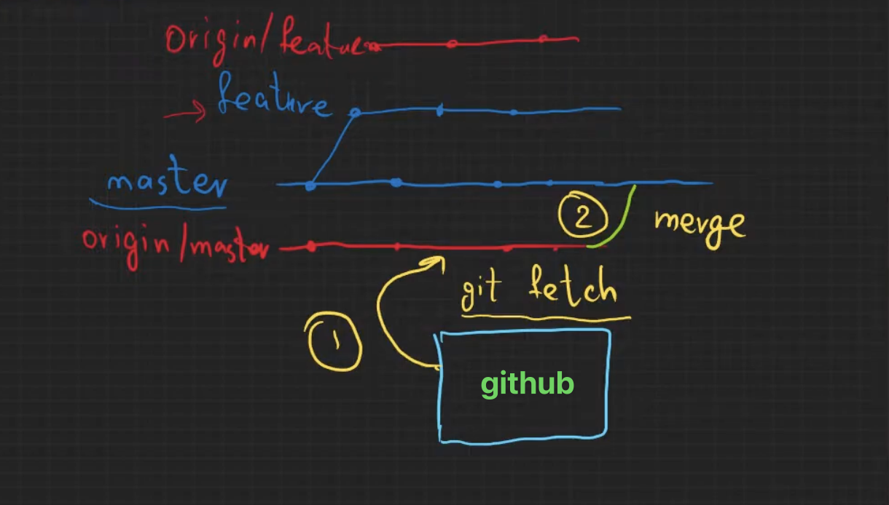

---
aliases:
tags:
  - git
done: false
created: 2026-08-31
sourse:
---
# git push , pull , petch , merge

## კითხვა 1: 

>githubTan მუშაობისასს, ლოკალურ მანქანაში გვაქვს მასეტერ შტო რომელზეც ვმუშაობთ. **push** გავაკეთეთ ყველაფერი კარგადაა.  ავკრიფეთ და გამოიტანა: 
>**git branch** -> **master** ; 
>**git branch -r** -> **origin/master** . 
>რა არის ეს და რას ნიშნავს თავისი შინაარსით?

ეს ტერმინები აღნიშნავს კავშირს შენს ლოკალურ კომპიუტერსა და GitHub-ს (Remote სერვერს) შორის. განსხვავება მდგომარეობს იმაში, თუ სად მდებარეობს და რას აკონტროლებს თითოეული მათგანი.

* **`master` (ლოკალური შტო):** ეს არის შენი სამუშაო შტო, რომელიც ფიზიკურად შენს კომპიუტერში არსებობს. როდესაც კოდს წერ, აკეთებ `commit`-ებს და შემდეგ `push`-ს, ცვლილებები ჯერ ამ შტოში ხორციელდება. 
* **`origin/master` (Remote-Tracking შტო):** ეს არის შენი კომპიუტერის შიგნით არსებული **მეხსიერება/ასლი**(შპარგალკა), რომელიც ინახავს ინფორმაციას იმის შესახებ, თუ რა მდგომარეობაშია `master` შტო GitHub-ზე (`origin`).  ის განახლდება მაშინ, როცა აკეთებთ `git fetch`-ს ან `git pull`-ს.

**რატომ არსებობს `origin/master` და რას ნიშნავს შინაარსობრივად?**

Git არის დეცენტრალიზებული სისტემა. იმისათვის, რომ მუდმივად ინტერნეტში არ იყო ჩართული GitHub-თან შესადარებლად, შენი კომპიუტერი ინახავს სერვერის ბოლო ცნობილი მდგომარეობის ასლს.

* როცა აკეთებ `git push`-ს, შენი ლოკალური `master`-ის ცვლილებები იგზავნება GitHub-ზე და ავტომატურად იახლდება `origin/master`-ც, რადგან ახლა შენი კომპიუტერი ხვდება, რომ სერვერი და ლოკალური გარემო ერთმანეთს დაემთხვა.
* ბრძანება `git branch` აჩვენებს მხოლოდ შენს **ლოკალურ** შტოებს, ხოლო `git branch -r` (**-r** --remote) აჩვენებს **სერვერიდან გადმოტანილ/დამახსოვრებულ** შტოებს (`origin/master`).

ეს მექანიზმი გეხმარება იმის დანახვაში: 
- ხარ თუ არა სერვერზე არსებულ მდგომარეობაზე **წინ** (თუ გაქვს `push`-სასაჩუქრე ცვლილებები) 
- ან **უკან** (თუ სხვამ ატვირთა რამე და გჭირდება `git pull`).

## კითხვა 2: 

>კარგი ახლა დამებადა კითხვები: 
>1. origin/master - ეს იგივე ისეთივე მთავარი შტოა როგორც ჩემ კომპიუტერშ , ოღონდ ეს სერვერზეა, და მუშაობისას , კომპში მხოლოდ ასლია,("შპარგალკაა") შესადარებლად. 
>2. ვერ გავიგე აზრობრივარ როგორ ხდება ის, რომ დავუშვათ **pull** გავაკეთე, ვმუშაობ... სანამ  **push**-ს გავაკეთებ  მანამდე სხვამ შეიტანა ცვლილებები სერვერზე. მე რომ **push**-ს ვაკეთებ, სანამ ოპერაცია შესრულდება ,  ამ დროს ხდება ჩემ კომპიუტერში არსებული **origin/master** -სა (ასლი რომელიც სერვერისაა)   და სერვერზე **არსებულ შტოს შედარება**? და ამ კონკრეტულ შემთხვევაში გამოდის მეტყოდა რომ ცვლილებაა მომხდარიო და ამიტომ ჯერ **pull** გააკეთე და მერე გააკეთე **push** 

ორივე კითხვაში ზუსტად მიხვდი სისტემის ლოგიკას! მოდი, თითოეულს დეტალურად გავყვეთ:

### 1. `origin/master` — არის თუ არა ეს სერვერის შტო კომპიუტერში?

**კი, ზუსტად ასეა.**

* `master` არის შენი რეალური, მუშა შტო კომპიუტერში.
* `origin/master` არის სერვერზე არსებული `master` შტოს **ასლი (ანუ ზუსტად „შპარგალკა“, როგორც თქვი)**, რომელიც შენს კომპიუტერში ინახება.
* როცა ინტერნეტი არ გაქვს ან უბრალოდ ბრძანებებს უშვებ (`git status`), შენი კომპიუტერი ეყრდნობა ამ „შპარგალკას“, რომ მიხვდეს, რა ხდება სერვერზე რეალურად, ყოველ ჯერზე GitHub-თან ფიზიკურად დაკავშირების გარეშე.

### 2. რა ხდება `push`-ის დროს, თუ სერვერზე ვინმემ რამე შეცვალა?

შენს მიერ აღწერილი სცენარი **არის ზუსტად ის მექანიზმი, როგორც Git-ი მუშაობს და იცავს კოდს წაშლისგან!** მოდი ვნახოთ ნაბიჯ-ნაბიჯ, ზუსტად რა ხდება ამ დროს:

1. **შენ აკეთებ `pull`-ს:** შენი `origin/master` და ლოკალური `master` ეწევა სერვერს და ყველაფერი განახლებულია.
2. **სხვამ ატვირთა კოდი:** ვიღაც სხვა დეველოპერმა თავისი ცვლილებები `push`-ით გაუშვა სერვერზე. ამ მომენტში **სერვერზე** `master` შეიცვალა, მაგრამ შენს კომპიუტერში არსებულ `origin/master`-მა (იმ შპარგალკამ) ჯერ არ იცის ამის შესახებ, რადგან **GitHub**-თან ახალი კონტაქტი არ გქონია.
3. **შენ აკეთებ `push`-ს:** შენც დაწერე კოდი, გააკეთე `commit` და უშვებ `git push`-ს.

**რა ხდება ამ დროს კულისებში?**
იმისათვის, რომ შენმა კომპიუტერმა სერვერს „თავისი სიმართლე“ ძალით არ დააჭედოს და სხვისი დაწერილი კოდი არ წაშალოს, `push`-ის პროცესში Git აკეთებს შემდეგს:

* სანამ ფიზიკურად გაшავდეს შენი კოდი სერვერზე, Git ამოწმებს: *„რა არის სერვერზე რეალურად ახლა?“* და ადარებს მას შენს `origin/master`-ს (შპარგალკას).
* თუ აღმოჩნდა, რომ შენს შპარგალკაში რაც წერია, სერვერზე არსებულ რეალობას აღარ ემთხვევა (ანუ სერვერზე კოდი წინ წასულა/შეცვლილა), Git ხვდება, რომ სერვერზე **შენთვის უცნობი ცვლილებებია**.
* ამიტომ, Git **წყვეტს ოპერაციას** და გეუბნება ზუსტად იმას, რაც იკითხე: *„Reject-ი დაიწერა, სერვერზე შენს უკან არსებულ მდგომარეობაზე ახალი კოდია, ჯერ გააკეთე `git pull`, გააერთიანე (**merge**) და მერე სცადე push თავიდანო“*.

### რატომ არის ეს საჭირო?

ეს არის ძალზე მნიშვნელოვანი უსაფრთხოების მექანიზმი. წარმოიდგინე, ეს შემოწმება რომ არ არიყოს, შენ დაარეპორტებდი (**push**) შენს კოდს და ავტომატურად წაშლიდი იმას, რაც სხვამ შენს მერე ატვირთა. `origin/master` და ეს შემოწმების პროცესი კი ზუსტად იმისთვის არსებობს, რომ კონფლიქტები დროულად აირიდო თავიდან.

## კითხვა 3: 

>ეს კარგი და მაშინ , ის მომენტი როგორ ხდება, რომ მე ლოკალურად შევიტანე ცვლილებები ჩემ კომპიუტერში.  და ახლა სანამ **push**-ს გავაკეთებ, **pull** უნდა გავაკეთო, ანუ განახლებული უნდა ჩამოვტვირთო, ამ დროს ჩემ ლოკალურ მანქანაზე რაც ცვლილებები მაქვს ის რატომ არ იცვლება(იშლება) ???

.

**Stash / Merge / Rebase მექანიზმი** - - - არის ის მთავარი ჯადოქრობა, რომელიც იცავს შენს დაწერილ კოდს წაშლისგან `pull`-ის დროს. როდესაც შენ ლოკალურად გაქვს შეტანილი ცვლილებები და აკეთებ `git pull`-ს (რაც გულისხმობს `fetch`-ს და `merge`-ს), **Git** არ შლის შენს დაუსრულებელ ნამუშევარს, არამედ აერთიანებს ორ სხვადასხვა სამყაროს:

1. **ინტელექტუალური შერწყმა (Merge):** თუ სერვერიდან ჩამოტვირთული ახალი კოდი და შენი ლოკალური ცვლილებები კოდის **სხვადასხვა ადგილას არის**, Git ავტომატურად აერთიანებს მათ. შენი დაწერილი ფაილები რჩება დაემატება მხოლოდ სერვერიდან წამოღებული ახალი ხაზები.
2. **კონფლიქტის მართვა:** თუ შენც და სერვერმაც **ერთსა და იმავე ფაილში, ზუსტადერთსა და იმავე ხაზზე** შეიტანეთ განსხვავებული ცვლილება, Git შეჩერდება, არაფერს წაშლის და გეტყვის: ***„მეგობარო, აქ კონფლიქტია, მე ვერ ვწყვეტ რომელი კოდი დავტოვო და შენ თვითონ აირჩიეო"***. ამის შემდეგ შენ ხსნი ამ ფაილს, არჩევ სასურველ ვარიანტს და აგრძელებ მუშაობას.

**რა ხდება იმ შემთხვევაში, თუ შენი ცვლილებები ჯერ არ გაქვს დაკომიტებული (`commit`)?**
თუ კოდი უბრალოდ მიწერილი გაქვს და `commit` არ გაგიკეთებია, ზოგჯერ `git pull` შეიძლება დაიფიცოს და შეგაჩეროს კიდეც შეტყობინებით: *„Your local changes would be overwritten by merge“*. ამ დროს Git გაფრთხილებს, რომ შენი დაუცველი კოდი შეიძლება წაიშალოს და გთხოვს, რომ ჯერ დააკომმიტო (`git commit`) ან დროებით შეინახო ბრძანებით **`git stash`**, გააკეთო `pull`, და შემდეგ ისევ დაიბრუნო შენი შენახული კოდი (`git stash pop`).
