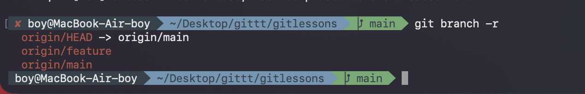
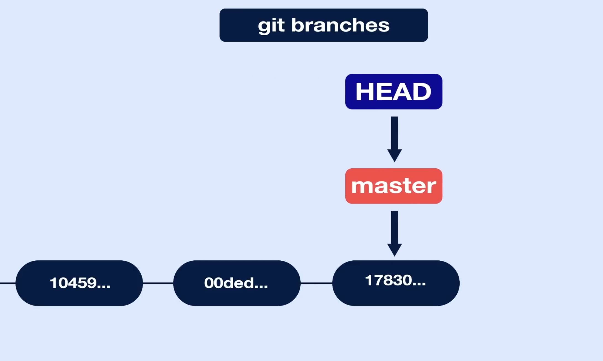
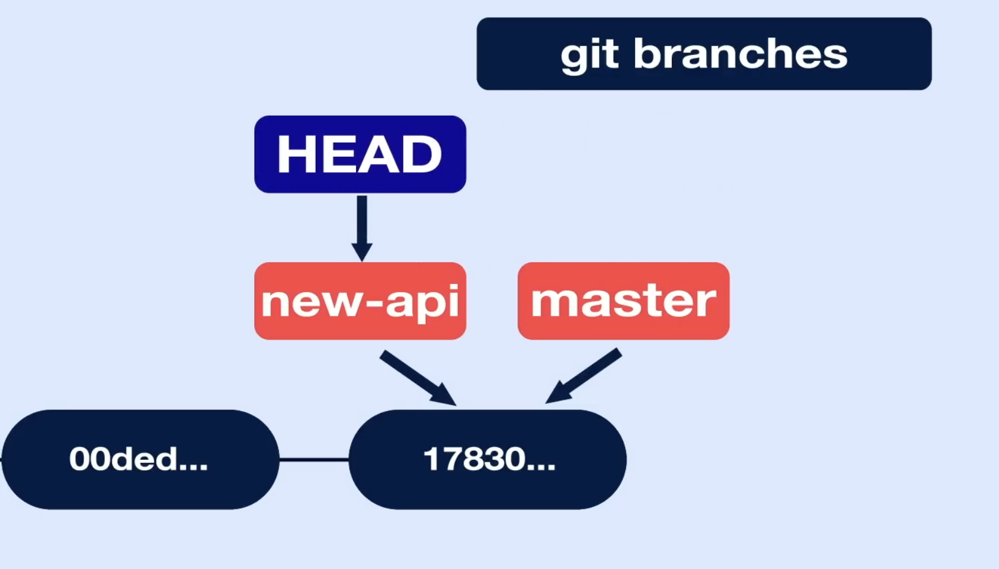

---
aliases:
tags:
  - git
done: false
created: 2026-08-31
sourse:
---
# origin_main && origin_HEAD

.
სურათზე წერია **`origin/main`** (და არა mine) და **`origin/HEAD`**, რომლებიც სერვერის (GitHub-ის) მდგომარეობას აჩვენებს. ზუსტი განსხვავებები:

[Git. 37:00 - YouTube](https://www.youtube.com/watch?v=SEvR78OhGtw) 

* **`origin/main` (Remote Branch):**
ეს არის თქვენი კომპიუტერის მეხსიერებაში შენახული **ასლი** იმისა, თუ რა ხდება სერვერზე (`origin`) არსებულ `main` ბრენჩზე. ის განახლდება მაშინ, როცა აკეთებთ `git fetch`-ს ან `git pull`-ს.
* **`origin/HEAD` (Remote Symbolic Reference):**
ეს არის უბრალოდ მაჩვენებელი (ფოინთერი), რომელიც სერვერზე ეუბნება Git-ს, თუ რომელი ბრენჩია ძირითადი (Default Branch). ვინაიდან GitHub-ზე მთავარი ბრენჩი არის `main`, `origin/HEAD` უბრალოდ მიუთითებს `origin/main`-ზე.
* **`HEAD -> main` (ლოკალური მხარე):**
რაც შეეხება სურათში მარცხნივ მითითებულ `HEAD -> main`-ს, ეს მიუთითებს თქვენს **ამჟამინდელ ლოკალურ პოზიციაზე**: საიდანაც მუშაობთ (რადგან ის მიუთითებს `main`-ზე, ესე იგი ამჟამად ზიხართ თქვენი კომპიუტერის `main` ბრენჩზე).

---

`git checkout new_api` - - - გადავედით **new_api**  შტოზე: 

.
