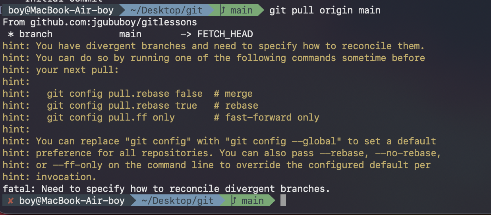

---
aliases:
tags:
  - git
done: false
created: 2026-08-31
sourse:
---
# კომპშიც და სერვერზეც(github) სხვადასხვა ცვლილებები შეიტანე

ახლა **pull** -ის დროს შეცდომას გიგდებს: 


.

ეს სიტუაცია ნიშნავს, რომ შეიქმნა **განშტოებული (divergent) ისტორია**: GitHub-ზეც გააკეთეთ ცვლილება და კომპიუტერშიც (დააკომიტეთ), შედეგად ორმა სხვადასხვა ვერსიამ აიღო გზა სხვადასხვა მიმართულებით. **Git**-მა არ იცის, რომელი ვერსია უნდა ჩათვალოს მთავარად და გთხოვთ აირჩიოთ შერწყმის (reconcile) მეთოდი.

პრობლემის მოსაგვარებლად გამოიყენეთ ერთ-ერთი შემდეგი ბრძანება:

## ვარიანტი 1: მერჯით შერწყმა (სტანდარტული მიდგომა)

ეს შექმნის სპეციალურ "merge commit"-ს, რომელიც ერთმანეთს დააკავშირებს GitHub-ის და თქვენი კომპიუტერის ისტორიებს:
```bash
git pull origin main --no-rebase

```

- აქ შეიძება VIM -ში გაიხსნას და გამოსასვლელად: 
	- დააჭირეთ კლავიატურაზე **`Esc`** ღილაკს (რომ გამოხვიდეთ ვიზუალური ბლოკის რეჟიმიდან).
	- კრიფეთ ზუსტად ეს სიმბოლოები: `:wq` 
	- დააჭირეთ **Enter**-ს.
	- იმისათვის რომ არ გაიხსნას  [vim](vim%20-ში%20რომ%20არ%20გაიხსნას.md)   -ში. 

## ვარიანტი 2: rebase-ით შერწყმა ( უფრო სუფთა, წრფივი ისტორია )

ეს დროებით აიღებს თქვენს ლოკალურ ქომითებს, თავიდან ჩასვამს GitHub-ზე არსებული ახალი ცვლილებების თავზე : [--rebase](--rebase.md) 

```bash
git pull origin main --rebase

```

თუ ამის შემდეგ ამოვარდა კონფლიქტი (მაგალითად, იმავე ფაილზე იყო ცვლილებები), Git მიგითითებთ რომელი ფაილია გასასწორებელი. ფაილის ხელით გასწორების და შენახვის შემდეგ კი დაგჭირდებათ:

```bash
git add .
git rebase --continue # (თუ --rebase აირჩიეთ)

```

ან მერჯის შემთხვევაში სტანდარტული `git commit`-ის დასრულება, რის შემდეგაც შეძლებთ `git push origin main`-ის გაშვებას.

