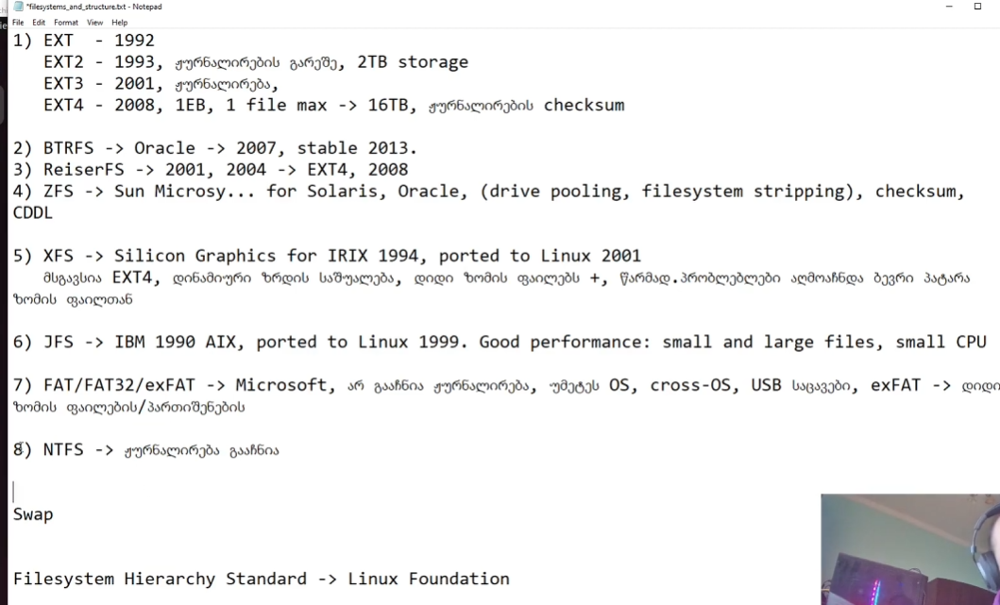

---
aliases:
  - ლინუქსის საფუძვლები
  - ლინუქს ადმინისტრირება
  - ლინუქსსადმინისტრირება
tags:
  - linux
done: false
created: 2025-12-10
sourse:
---
# Linux ადმინისტრირება

### Linux ადმინისტრირება N1

 
.

### N3. ფაილებისა და დირექტორიების სტრუქტურა


.
[Linux File System Structure Explained: From / to /usr \| Linux Basics - YouTube](https://www.youtube.com/watch?v=ISJ44S5sZu8) 
.
***გაკვეთილში განხილულია:***

- ფაილური სისტემის ზოგადი ცნება;
- ბლოკური ტიპის საცავები;
- სხვადასხვა ფაილური სისტემის ზოგადი მიმოხილვა :  **EXT/EXT2/EXT3/EXT4, BTRFS, ReiserFS, ZFS, XFS, JFS, FAT/FAT32/exFAT, NTFS;**
- ჟურნალირების და **Swap**-ის ცნება;
- **Linux**-ისთვის კრიტიკული და ადმინისტრირებისთვის საჭირო საქაღალდეების მიმოხილვა: **/boot, /bin, /sbin, /lib** და ა.შ.;
.
 
.
ზოგადი ახსნა: [ფაილური სისტემები](../00.%20IT%20_%20&%20_%20%20Windows/ფაილური%20სისტემები.md) . 
[Linux-ის ჟურნალირება და ლოგები ფაილურ სისტემებში](Linux-ის%20ჟურნალირება%20და%20ლოგები%20ფაილურ%20სისტემებში.md) 
[2. Linux-ის სტრუქტურა ფაილებისა და დირექტორიების](2.%20Linux-ის%20სტრუქტურა%20ფაილებისა%20და%20დირექტორიების.md) 


### Linux ადმინისტრირება N4. ფაილების ტიპები

 
.
ლინუქსში ფაილის ტიპები ფუნდამენტური კონცეფციაა, რომელიც განსაზღვრავს, თუ როგორ ამუშავებს სისტემა ფაილის შიგთავსს. აქ მოცემულია ძირითადი ტიპები, რომლებსაც ყველაზე ხშირად შეხვდებით:

## 🐧 ძირითადი ფაილის ტიპები ლინუქსში

| **ფაილის ტიპი**            | **აღწერა**                                                                                                                           | **ls -l სიმბოლო** |
| -------------------------- | ------------------------------------------------------------------------------------------------------------------------------------ | ----------------- |
| **რეგულარული ფაილი**       | შეიცავს მონაცემებს (ტექსტი, სურათები, ორობითი პროგრამები და ა.შ.). ეს არის ფაილის ყველაზე გავრცელებული ტიპი.                         | `-`               |
| **დირექტორია**             | შეიცავს სხვა ფაილებისა და დირექტორიების ჩამონათვალს. გამოიყენება ფაილური სისტემის ორგანიზებისთვის.                                   | `d`               |
| **სიმბოლური ბმული(ლინკი)** | პოინტერი (მაჩვენებელი) სხვა ფაილის ან დირექტორიისკენ. ეს არის მალსახმობების (shortcuts) ექვივალენტი.                                 | `l`               |
| **მოწყობილობის ფაილები**   | გამოიყენება I/O მოწყობილობებთან (პრინტერები, დისკები, ტერმინალები და ა.შ.) კომუნიკაციისთვის.                                         |                   |
| ბლოკური                    | გამოიყენება მონაცემების ბლოკებად გადასაცემად (მაგ. მყარი დისკები).                                                                   | `b`               |
| სიმბოლური                  | გამოიყენება მონაცემების ბაიტ-ბაიტ გადასაცემად (მაგ. ტერმინალები).                                                                    | `c`               |
| **სახელობითი არხი (FIFO)** | გამოიყენება ორ პროცესს შორის კომუნიკაციისთვის. მონაცემები იკითხება ზუსტად იმ თანმიმდევრობით, რომლითაც დაიწერა (First-In, First-Out). | `p`               |
| **სოკეტი (Socket)**        | გამოიყენება პროცესთაშორისი კომუნიკაციისთვის, რომელიც ხშირად გამოიყენება ქსელური კომუნიკაციისთვის.                                    | `s`               |

---

### როგორ ამოვიცნოთ ფაილის ტიპი

შეგიძლიათ გამოიყენოთ ბრძანება **`ls -l`** ფაილის ტიპის დასადგენად. შედეგის პირველი სიმბოლო მიუთითებს ფაილის ტიპზე, როგორც ეს ნაჩვენებია ზემოთ მოცემულ ცხრილში.

**მაგალითი:**

```bash
$ ls -l
-rw-r--r-- 1 user group 1024 Dec 12 17:00 my_file.txt  # რეგულარული ფაილი (-)
drwxr-xr-x 2 user group 4096 Dec 12 17:05 my_folder    # დირექტორია (d)
lrwxrwxrwx 1 user group    9 Dec 12 17:07 link_to_file -> my_file.txt  # სიმბოლური ბმული (l)
```

ასევე შეგიძლიათ გამოიყენოთ ბრძანება **`file`**, რომელიც უფრო დეტალურ ინფორმაციას იძლევა ფაილის შიგთავსის შესახებ.


```bash
$ file my_file.txt
my_file.txt: ASCII text
```
