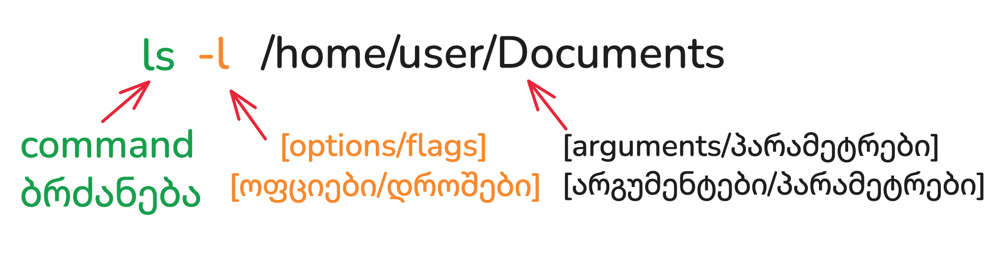
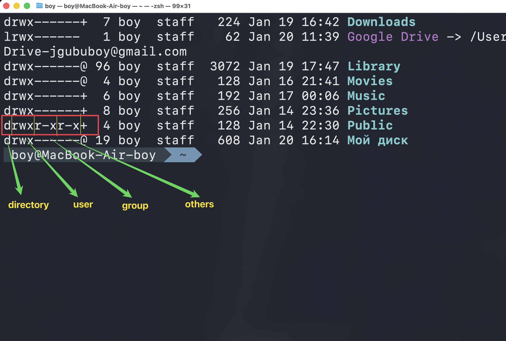

---
aliases:
  - rwx
  - unix brdzanebebi
  - linux terminal
  - terminal on linux
  - ლინუხ ტერმინალ
  - მინუსები
  - ტირეები
  - flags
  - options
  - command
  - arguments
  - ფლაგები
  - დროშები
  - ტერმინალის ინსტრუქციების წაკითხვა
  - ტერმინალის წაკითხვა
tags:
  - linux
  - unix_Users-Groups
  - apple
  - Console-Terminal
done: false
created: 2025-12-14
sourse:
---
# Linux ბრძანების  სინტაქსი

**Linux**-ის თითქმის ყველა ბრძანება ერთსა და იმავე ზოგად სტრუქტურას მისდევს.

## ძირითადი სტრუქტურა - გასაღები / დროშების ჩაწერა
[[NAT & Bridge ( ვირტუალურ მანქანებში )]] 



.
```bash
ls -l /home/user/Documents 

`ბრძანება [ოფციები/დროშები] [არგუმენტები/პარამეტრები]` - - -  ბრძანების სტრუქტურა
`command [options/flags] [arguments/პარამეტრები]`

```

| **ნაწილი**                        | **აღწერა**                                                                                                                                                                |
| --------------------------------- | ------------------------------------------------------------------------------------------------------------------------------------------------------------------------- |
| **` ( ბრძანება )` (Command)**     | პროგრამის ან ფუნქციის სახელი, რომლის გაშვებაც გსურთ. (მაგ.: `ls`, `cd`, `mkdir`, `cp`).                                                                                   |
| **`[ ოფციები ]` (Options/Flags)** | ისინი **ცვლიან ბრძანების სტანდარტულ ქცევას.** <br>განსაზღვრავენ  ***როგორ***  უნდა შეასრულოს ბრძანებამ თავისი საქმე.   <br>***იწყება*** ერთი (`-`) ან ორი (`--`) დეფისით. |
| **`[ არგუმენტები ]` (Arguments)** | ობიექტები ( **ფაილები, დირექტორიები, მომხმარებლები და ა.შ**.), ***რომლებზეც ბრძანება მოქმედებს.***                                                                        |
## ფრჩხილების მნიშვნელობა:

ეს არის ყველაზე მნიშვნელოვანი ნაწილი სინტაქსის გასაგებად:

- `[ ]` (Optional): - - - ეს ნაწილი ***არასავალდებულოა***. შეგიძლია დაწერო, შეგიძლია — არა.
    
    - ***მაგ***: `mkdir [OPTION] DIRECTORY` — აქ ოფცია არ არის აუცილებელი, პირდაპირ სახელის დაწერაც შეიძლება.
        
- `< >` (Required): - - - ეს არის ***სავალდებულო*** ცვლადი. შენ უნდა ჩაანაცვლო ის რეალური მნიშვნელობით.
    
    - _მაგალითი:_ `ping <hostname>` — აქ აუცილებლად უნდა ჩაწერო მისამართი (მაგ. `google.com`).
        
- `{ }` (Choice): - - -  ნიშნავს **არჩევანს**. ჩამონათვალიდან ერთ-ერთი ***აუცილებლად უნდა აირჩიო***.
    
    - _მაგალითი:_ `git {push|pull}` — ნიშნავს, რომ უნდა დაწერო ან `push`, ან `pull`.
        
- `|` (OR): - - -  ნიშნავს "***ან***". გამოიყენება ფრჩხილებში არჩევანის გამოსაყოფად.
- `...` (Repeat) - - - ნიშნავს, რომ შეგიძლია მიუთითო **რამდენიმე** ასეთი ელემენტი ზედიზედ.
	- აგალითი:_ `rm <file>...` — ნიშნავს, რომ შეგიძლია წაშალო ერთი, ორი ან ათი ფაილი ერთდროულად.
- 

| **სიმბოლო**        | **მნიშვნელობა**                                            | **სავალდებულოა?**        |
| ------------------ | ---------------------------------------------------------- | ------------------------ |
| `[ ]`              | Optional (არასავალდებულო)                                  | არა                      |
| `< >`              | Placeholder (ცვლადი  უნდა  ჩაანაცვლო რეალური მნიშვნელობით) | კი                       |
| `{ }`              | Exclusive OR (აირჩიე ერთ-ერთი)                             | კი                       |
| `                  | `                                                          | Separator (ან ეს, ან ის) |
| `...` **(Repeat)** | Multiple (შეგიძლია ბევრი მიუთითო) <br>`rm <file>...`       | -                        |

#### პრაქტიკული მაგალითის გარჩევა

ავიღოთ ტიპური ბრძანება:

`tar -c [-f <filename>] [-v] <directory>`

**მოდი დავშალოთ:**

1. `tar`: ბრძანების სახელი.
2. `-c`: სავალდებულო გასაღები (არ არის ფრჩხილებში).
3. `[-f <filename>]`: კვადრატულშია, ესე იგი **არასავალდებულოა**. მაგრამ თუ გამოიყენებ `-f`-ს, მაშინ `< >`-ში მოქცეული ფაილის სახელი **აუცილებლად** უნდა მიაწერო.
4. `[-v]`: სრულიად ნებაყოფლობითი "verbose" რეჟიმი.
5. `<directory>`: ფრჩხილების გარეშეა (ან კუთხოვანში), ესე იგი **აუცილებლად** უნდა მიუთითო დასახელება.

## ფლაგები (Flags):  `-`  `--`

**ლინუქსში**( ზოგადად ტერმინალის ბრძანებებში) სიმბოლოებით: 
 - `" - "` (ერთი ტირე) და `" -- "` (ორი ტირე) დაწყებული წარწერები არის ე.წ. **ფლაგები (Flags)**,  **პარამეტრები (Options)**.  რომლებიც  განსაზღვრავენ  -  ***როგორ***  უნდა შეასრულოს ბრძანებამ თავისი საქმე. 
	 - **ორი დეფისით (`--signal` , `--all` )** წერ სრულ, გასაგებ სახელს (ე.წ. ***Long flag***).
	 - **ერთი დეფისით და ერთი ასოთი (`-s`, `-l` , `-a` )**  მის შემოკლებულ ვარიანტს (ე.წ. ***Short flag***)  (`-d`  ---> იგივეა რაც `--detach`  ). ასევე მათი დაჯგუფება შესაძლებელია.
		 - **მაგალითი:** `ls -l -a` იგივეა, რაც `ls -la`.
		 - ორივე მათგანი **ერთსა და იმავე საქმეს აკეთებს**, უბრალოდ შემოკლებული (`-s`) უფრო სწრაფია ასაკრეფად, ხოლო სრული (`--signal`) — უფრო ადვილად საკითხავი და გასაგები კოდში.
 - ფლაგს (**განსაკუთრებით ორტირეიანს** ან **ზოგიერთ ერთტირეიანს**, რომელიც მნიშვნელობას მოითხოვს) აუცილებლად მოსდევს თავისი **მნიშვნელობა (Value)**.  
	 - მაგ: ` --name my-web-app` --- დაერქვას სახელი `my-web-app` -თქო. 
	 - `-p 8080:80` --- `-p` არის **ფლაგი**, ხოლო `8080:80` არის მისი **მნიშვნელობა**.

.
მაგალითად, ორივე ბრძანება ზუსტად ერთნაირად იმუშავებს:

- `docker kill --signal SIGTERM my_container`
- `docker kill -s SIGTERM my_container`

.
##### P.S.

ასევე შეიძლება "**პრაბელი**" სივრცე **"="**-ით ჩაიწეროს ერთიდაიგივეა:
**ორივე ეს ჩაწერა მუშაობს ზუსტად ერთნაირად:**

- `docker kill --signal SIGTERM my_container` (სივრცით)
- `docker kill --signal=SIGTERM my_container` (ტოლობით)

უბრალოდ, ზოგიერთი ადამიანი (ან პროგრამა) ტოლობას ამჯობინებს იმისთვის, რომ ვიზუალურად უფრო მკაფიოდ გამოჩნდეს, თუ რა მნიშვნელობას ატანს ამა თუ იმ პარამეტრს.

.
## 📂 ფაილებთან და დირექტორიებთან მუშაობის ძირითადი ბრძანებები

ეს არის ყველაზე ხშირად გამოყენებადი ბრძანებები ფაილურ სისტემაში ნავიგაციისთვის და მართვისთვის.

| **ბრძანება** | **სინტაქსი**                         | **მნიშვნელობა**                                                                               |
| ------------ | ------------------------------------ | --------------------------------------------------------------------------------------------- |
| **`pwd`**    | `pwd`                                | **P**rint **W**orking **D**irectory. ბეჭდავს მიმდინარე დირექტორიის სრულ გზას.                 |
| **`ls`**     | `ls [ოფციები] [გზა]`                 | **L**i**s**t. ჩამოთვლის ფაილებსა და დირექტორიებს მითითებულ გზაზე (ან მიმდინარე დირექტორიაში). |
| **`cd`**     | `cd [დირექტორიის_გზა]`               | **C**hange **D**irectory. ცვლის მიმდინარე დირექტორიას.                                        |
| **`mkdir`**  | `mkdir [ოფციები] დირექტორიის_სახელი` | **M**a**k**e **Dir**ectory. ქმნის ახალ დირექტორიას.                                           |
| **`rmdir`**  | `rmdir დირექტორიის_სახელი`           | **R**e**m**ove **Dir**ectory. შლის ცარიელ დირექტორიას.                                        |
| **`touch`**  | `touch ფაილის_სახელი`                | ქმნის ახალ, ცარიელ ფაილს (ან ანახლებს არსებული ფაილის დროს).                                  |
| **`cp`**     | `cp [ოფციები] წყარო დანიშნულება`     | **C**o**p**y. აკოპირებს ფაილებს ან დირექტორიებს.                                              |
| **`mv`**     | `mv წყარო დანიშნულება`               | **M**o**v**e. გადააქვს ან **ცვლის** ფაილის/დირექტორიის სახელს.                                |
| **`rm`**     | `rm [ოფციები] ფაილი/დირექტორია`      | **R**e**m**ove. შლის ფაილებს ან დირექტორიებს (`-r` ოფციით).                                   |
| **`cat`**    | `cat [ფაილის_სახელი]`                | **C**onca**t**enate. ბეჭდავს ფაილის შიგთავსს ტერმინალში.                                      |

### `ls` ბრძანების მნიშვნელოვანი ოფციები

- **`-l`** (**Long**): აჩვენებს დეტალურ ინფორმაციას (ნებართვები, მფლობელი, ზომა, თარიღი).
- **`-a`** (**All**): აჩვენებს ყველა ფაილს, მათ შორის დამალულს (რომლებიც იწყება წერტილით `.`).
- **`-h`** (**Human-readable**): ზომას აჩვენებს ადამიანისთვის ადვილად აღსაქმელ ფორმატში (K, M, G).

### 🔒 ნებართვები და მფლობელობა

ფაილის ნებართვების მართვა Linux-ის ფუნდამენტური ნაწილია.

| **ბრძანება** | **სინტაქსი**                   | **მნიშვნელობა**                                                                                           |
| ------------ | ------------------------------ | --------------------------------------------------------------------------------------------------------- |
| **`chmod`**  | `chmod [mode] ფაილი`           | **Ch**ange **Mod**e. ცვლის ფაილის ნებართვებს <br>( **წაკითხვა** `r`, **ჩაწერა** `w`, **შესრულება** `x` ). |
| **`chown`**  | `chown [მფლობელი:ჯგუფი] ფაილი` | **Ch**ange **Own**er. ცვლის ფაილის ან დირექტორიის მფლობელსა და ჯგუფს.                                     |
| **`sudo`**   | `sudo ბრძანება`                | **S**uper **U**ser **Do**. ასრულებს ბრძანებას სუპერმომხმარებლის (root) პრივილეგიებით.                     |

### ნებართვების ფორმატი (`ls -l`-ის მაგალითზე)


**`-rwxr-xr--`**

- **პირველი სიმბოლო (`-`):** ფაილის ტიპი ( `-` = ფაილი, `d` = დირექტორია).
- **ჯგუფი 1 (`rwx`):** მფლობელის (**User**) ნებართვები.
- **ჯგუფი 2 (`r-x`):** ჯგუფის (**Group**) ნებართვები.
- **ჯგუფი 3 (`r--`):** სხვების (**Others**) ნებართვები.

გამოდის რომ ჩვენ ფაილებზე,  უფლების მხრივ არის **3 ტიპის ადამიანები**.  თავისი უფლებებით.  
**user, group, others.**
 მაგალითად: 
 


### 🔎 IV. დახმარება და ძებნა

Linux-ში თვითდახმარების საუკეთესო საშუალება:

| **ბრძანება** | **სინტაქსი**                        | **მნიშვნელობა**                                                                                                   |
| ------------ | ----------------------------------- | ----------------------------------------------------------------------------------------------------------------- |
| **`man`**    | `man ბრძანება`                      | **Man**ual. აჩვენებს ბრძანების სრულ სახელმძღვანელო გვერდს (დააჭირეთ `q` გასასვლელად).                             |
| **`--help`** | `ბრძანება --help`                   | აჩვენებს ბრძანების ოფციების მოკლე სიას.                                                                           |
| **`grep`**   | `grep [ოფციები] ნიმუში ფაილი`       | **G**lobal **R**egular **E**xpression **P**rint. ეძებს ტექსტის ნიმუშებს ფაილებში ან სხვა ბრძანებების გამომავალში. |
| **`find`**   | `find [გზა] [პირობები] [მოქმედება]` | ეძებს ფაილებს დირექტორიების იერარქიაში (როგორც წინა პასუხში აღვწერე).                                             |

### 🛠️ მაგალითები:

| **მოქმედება**                                      | **ბრძანება**               |
| -------------------------------------------------- | -------------------------- |
| დირექტორიის შიგთავსის დეტალურად ჩვენება            | `ls -lha`                  |
| `/etc` დირექტორიაში `.conf` ფაილების მოძებნა       | `find /etc -name "*.conf"` |
| ფაილის `config.txt` შიგნით სიტყვა "error"-ის ძებნა | `grep "error" config.txt`  |
| მიმდინარე დირექტორიაში ახალი დირექტორიის შექმნა    | `mkdir ახალი_პროექტი`      |
