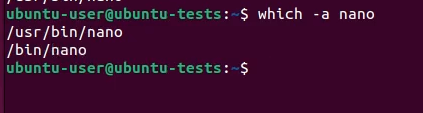
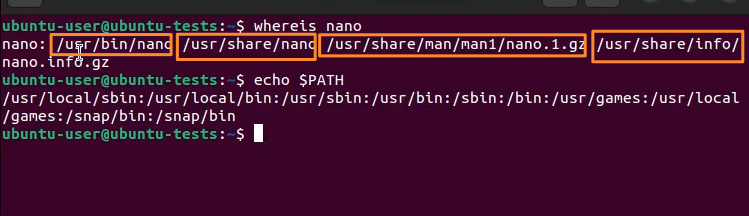
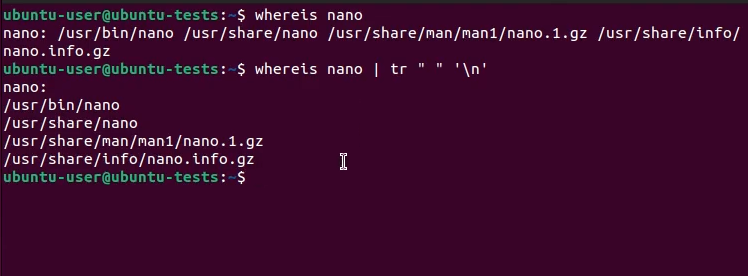
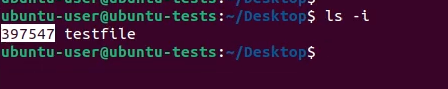
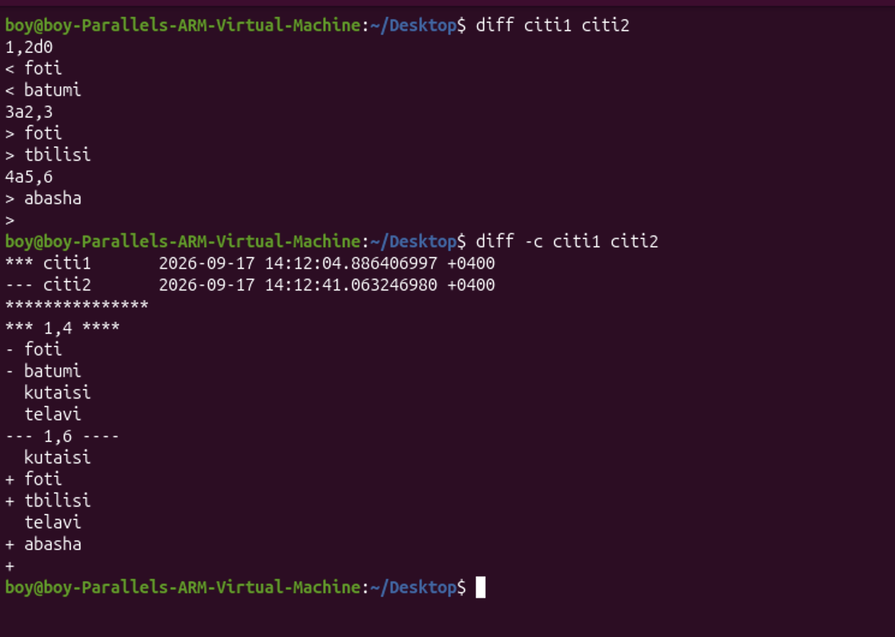
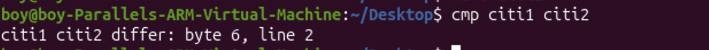

---
aliases:
  - bash
  - terminalis brdzanebebi
  - ტერმინალის ბრძანებები
  - ტერმინალი
  - terminal on linux
  - console comands
  - txt file
tags:
  - linux
  - it
  - Console-Terminal
  - Bash_ZSH
done: false
created: 2025-05-05
sourse:
---
# Top  Bash  Commands

**Quick note:**   ყველაფერი რაც კვადრატულ ფრჩხილებშია მოთავსებული  `[  ]`  , ნიშნავს რომ ***არ არის აუცილებელი*** გამოყენება.  ზოგიერთი ბრძანებების გამოყენება დამატებითი პარამეტრების გარეშეც შეიძლება.

- [20% of Linux Commands You'll Use 80% of the Time (Real-World Example) - YouTube](https://www.youtube.com/watch?v=CLh2ACdXNbc) 
- [70 Linux Commands you NEED to know (in 10 minutes) - YouTube](https://www.youtube.com/watch?v=nWu_T4ClYrU)
- [60 Linux Commands you NEED to know (in 10 minutes) - YouTube](https://www.youtube.com/watch?v=gd7BXuUQ91w)

## ping და მსგავსი: 
- `ip a` - - - ip მისამართის გამოტანა

## system info:

- სისტემის ვიზუალური ინფორმაციის სანახავად - - - `fastfetch` ან `neofetch` 
- `uname -a`      ---   **სისტემის** სახელი და ინფო
- `uname -s`      ---   **ბირთვის** სახელი
- `uname -r`      ---   ბირთვის გამოშვების თარიღი
- `uname -v`      ---    ბირთვის ვერსია
- `hostname`    ---   კომპ სახელი
- `uptime`      ---     სისტემის მუშაობის დრო
- `who`          ---    რომელი **უზერია** ახლა აქტიური
- `w`              ---    უფრო **გავრცობილი** ინფო
- `last`        ---   **ბოლოს** რომელი უზერი იყო აქტიური
- `whoami`    ---   ვინ ვარ მე 
- `getent passwd user1`       ---    **ინფორმაცია** უზერზე
- `id `           ---    უზერის სახელის ჩვენება, ჯგუფის ... აშშ
- `finger user1`       ---     ინფორმაცია უზერზე თუ არსებობს
- `top`             ---     ლინუქსის **task manager**
- `free -h`    ---     **RAM** - ს განახებს
- `lscpu` - - - აპარატურული დეტალების და პროცესორის სანახავად
- `ps`              ---     **პროცესები** არსებულ უზერზე ( გასაღებები: a(all), u(user), x )
- `ps –u boy`     ---    boy  უზერის  ყველა  **მიმდინარე პროცესი**  
- `df`       ---     გვიჩვენებს **დისკების ზომას**


## სხვადასხვა პარამეტრით ფაილების და ინფო *ძებნა*: 

### find

**Syntax:**
```
find [საძიებო_ გზა სად ეძებოს] [კრიტერიუმი] [მოქმედება]
```

- **რას შვება / როგორ მუშაობს:** გამოიყენება ფაილებისა და დირექტორიების საძებნელად რეალურ დროში, ფაილური სისტემის სოციალური სკანირებით. ის ეძებს მითითებულ საქაღალდეში სხვადასხვა კრიტერიუმის (სახელი, ტიპი, ზომა, ცვლილების დრო და ა.შ.) მიხედვით.
- find რეგისტრზე სენსიტიურია. ანუ ასოებს მნიშვნელობა აქვს. 
- **მაგალითები:**
    - ***სახელით*** ძებნა: `sudo find /home/user -name "document.txt"` 
	    - მონახე ფაილი სახელით **document.txt** , **/home/user** მისამართზე. 
	    - **find** რეგისტრზე სენსიტიურია. ანუ ასოებს მნიშვნელობა აქვს.
	- ასოების ზომის იგნორირება: ***-iname*** :  `sudo find /home/user -iname "document.txt`
    - ***ტიპის*** მიხედვით ძებნა (მხოლოდ დირექტორიები): `find /etc -type d`
    - ***log*** გაფართოების ძებნა: `sudo find / -type f "*.log` - - - `/` ყველგან მონახე **log** გაფართოების  ფაილებითქო.   
    - მონახე **boy** ***უზერის შექმნილი*** ფაილები: `sudo find /home/ -type f -user boy` 
    - ***დროის*** (ბოლო დღეში შეცვლილი) მიხედვით: `find /var/log -mtime -1`

### 2. locate — Locate a specific file or directory 

- **რას შვება / როგორ მუშაობს:** ძებნის სწრაფი ინსტრუმენტია. განსხვავებით `find`-ისგან, ის ფაილურ სისტემას პირდაპირ არ სკანირებს, არამედ იყენებს წინასწარ გენერირებულ მონაცემთა ბაზას (Index Database), რის გამოც შედეგი მომენტალურად მოაქვს.
- ახალ ვერსიებში ubuntu-ში არ არის ხოლმე და ჩავწეროთ: `sudo apt install plocate`
**Syntax**: 
```
locate [option] file_name
locate -i file_name         - - - - ასოების რეგისტრს მნიშვნელობა არ აქვს
```
- Common options: **-q, -n, -i**
- *(შენიშვნა: იმისათვის, რომ ბაზა განახლებული იყოს, გამოიყენება ბრძანება - - - `sudo updatedb`)*

### 3. which  - ( $PATH )

* **რას შვება / როგორ მუშაობს:** ეძებს და აჩვენებს კონკრეტული **შესასრულებელი (executable)** ბრძანების ან პროგრამის სრულ **მისამართს (path)**, რომელიც იმყოფება ***მხოლოდ სისტემური*** `PATH` ცვლადის დირექტორიებში. ( `echo $PATH` )
* **სინტაქსი:**
```
which [ბრძანების_სახელი]
```

* **მაგალითი:**
```
which python3
# პასუხი გამოიტანა მისამართი: /usr/bin/python3
```

**მინუსი** ის აქვს რომ გამოაქვს პირველივე შედეგი და ძებნას არ აგძელებს. 
ამიტომ ყველას გამოსატანად ემატება გასაღები `-a` :
- `which -a nano`

.
### 4. whereis

* **რას შვება / როგორ მუშაობს:** ***ყველგან ეძებს*** ბრძანების შესაბამის ფაილებს: მის ბინარულ (executable) ფაილს, საწყის კოდს (source) და მანუალის (man page) დოკუმენტაციას.
* **სინტაქსი:**
```
whereis [ბრძანების_სახელი]
```

* **მაგალითი:** `whereis nano`

.
ამ სიის უფრო ლამაზად გამოსატანად შეიძლება ასე: 
```
whereis nano | tr " " `\n`
```
**tr (translate)** 
**ანუ ვეუბნებით**: ყველა სიცარიელე `" "`  თარგმნე  შემდეგ ხაზზე გადატანაში `\n` : 

.
### 5. whatis

* **რას შვება / როგორ მუშაობს:** აჩვენებს სისტემური სახელმძღვანელოდან (man page) ბრძანების მოკლე, ერთსტრიქონიან აღწერას.
* **sინტაქსი:**
```
whatis [ბრძანება]
```

* **მაგალითი:**
```
whatis tar
# პასუხი: tar (1) - an archiving utility
```

### 6. type

* **რას შვება / როგორ მუშაობს:** აგენერირებს ინფორმაციას იმის შესახებ, თუ როგორ განმარტავს ან ასრულებს შეყვანილ ბრძანებას თელი (Shell) — არის თუ არა ის ჩაშენებული ბრძანება (shell builtin), ალისი (alias) თუ ცალკე მდგომი პროგრამა.
* **სინტაქსი:**
```
type [ბრძანება]
```

* **მაგალითი:**
```
type cd
# პასუხი: cd is a shell builtin
```

## ls — List directory contents

`ls`   Команда  позволяет ` быстро ` просмотреть все файлы в указанном каталоге.

- Syntax: `ls` [option(s)] [file(s)]
- Common options: **-a, -l**
  - `ls -a`      ---   список скрытых файлов
  - `ls -R`      ---  Также перечисляет файлы в подкаталогах
  - `ls -la`    ---  Список файлов и каталогов с подробной информацией, такой как разрешения, размер, владелец и т. Д.
  - `ls -l`      ---     чтобы показать тип файла и разрешение на доступ

ფაილის ზომების ნახვა: 
- `ls -lh` - - - ფაილების ზომებს ადამიანურად განახებს
- `ls -i` - - - გამოიტანს ფაილის უnიკალურ **აინოდებს(inode)** 
	- 
- 

## echo — Prints text to the terminal window
выводит текст в окно терминала и обычно используется в сценариях  оболочки и пакетных файлах для вывода текста состояния на экран или в  компьютерный файл. **Echo** также особенно полезно для отображения значений  переменных среды, которые сообщают оболочке, как вести себя, когда  пользователь работает в командной строке или в сценариях.

- **Syntax**: `echo [option(s)] [string(s)]`
- Common options: **-e, -n**
  - `echo "nika jguburia"`     ---   გამოიტანს სიტყვა nika jguburia-ს
  - `echo "nika jguburia" > text.txt`    ---   სიტყვა nika jguburia ჩაიწერება text.txt ტექსტურ ფაილში არსებული ტექსტის მაგივრად.
  - `echo $PATH`


## მიმდინარე მისამართის გამოტანა

`echo ${PWD}` - - -(დიდი ასოებით!!!)  მიმდინარე საქაღალდის სრული  მისამართი  bash-ში


## diff  ( *differance* )
##### ***ფაილების დადარება:*** 

ანუ აჩვენებს მხოლოდ განსხვავებებს და არა საერთოებს!!!
**syntax:**  
- `diff file1 file2`
- `diff -c file1 file2`
- ***keys***: `-a` ; `-c` ; `-d` 


.
მოკლედ რო ვთქვათ განახებს რა სადაა და რა სად არ არის. 

##### *folder -ების დადარება*

ანალოგიურად ადარებს **დირექტორიებს**, ანუ ***განახებს განსხვავებებს***. : 
`diff folder1 folder2` 


.

## cmp  ( *განსხვავებები ბაიტებში* )
განახებს განსხვავებას ფაილებს შორის ბაიტებში: 

`cmp citi1 citi2` :


,

---
## Read , create and concatenate *txt files* :
### touch — Creates a file

`Touch` - მარტივად ***ქმნი ახალ ფაილს***.  
ასევე შეიძლება ფაილის ან დირექტორიის შექმნის თარიღის შესაცვლელად. 
- **თუ ფაილი არ არსებობს:** ქმნის ახალ, ცარიელ ფაილს.
- **თუ ფაილი უკვე არსებობს:**  ფაილის შიგთავსი არ შეიცვლება. თუმცა მისი **შექმნის/შეცვლის დრო** შეიცვლება მიმდინარე დროით. 
- 
- **Syntax**: `touch [option] <file_name>`
  - `touch file1.txt`      ---    **შექმნა** ფაილი. მაგრამ  **არსებული**  ფაილის  შემთხვევაში, ფაილი იგივე რჩება, იცვლება მხოლოდ ამ ფაილის შექმნის თარიღი. ასევე იცვლება თარიღი დირექტორიის შემთხვევაში

Common options: **`-a`**, **`-m`**, **`-r`** და **`-d`** **გასაღებები (ფლაგები)** გამოიყენება ფაილების დროის ნიშნულების (Timestamps) სამართავად.

1. `-a` (Access time)
	* **რას აკეთებს:** ცვლის მხოლოდ **წვდომის დროს** (როდის გაიხსნა ან წაიკითხა ფაილი ბოლოს) მიმდინარე დროით. მოდიფიკაციის დრო უცვლელი რჩება.
	* **მაგალითი:** `touch -a file.txt`
2. `-m` (Modification time)

	* **რას აკეთებს:** ცვლის მხოლოდ **მოდიფიკაციის დროს** (როდის შეიცვალა ფაილის შიგთავსი ბოლოს) მიმდინარე დროით. წვდომის დრო უცვლელი რჩება.
	* **მაგალითი:** `touch -m file.txt`

3. `-r` (Reference file)

	* **რას აკეთებს:** იღებს დროის ნიშნულს სხვა, მითითებული **საცნობარო ფაილიდან** და გადააწერს სამიზნე ფაილს.
	* **მაგალითი:** `touch -r source.txt target.txt`
*(ეს ბრძანება `target.txt`-ის დროს გახდის ზუსტად ისეთს, როგორიც `source.txt`-ია).*
4. `-d` (Date string)

	* **რას აკეთებს:** საშუალებას გაძლევს მიუთითო **კონკრეტული თარიღი და დრო** ტექსტური ფორმატით მიმდინარე დროის ნაცვლად.
	* **მაგალითი:** `touch -d "2026-06-15 14:30:00" file.txt`
*(ეს ბრძანება ფაილის დროს დააყენებს მითითებულ თარიღზე).*


> **შენიშვნა:** თუ არცერთ ამ გასაღებს არ გამოიყენებ, `touch` ავტომატურად განაახლებს როგორც წვდომის, ისე მოდიფიკაციის დროს მიმდინარე მომენტით.

### cat  - ( Прочитать файл, создать файл и объединить файлы )

`cat` - ერთერთი უნივერსალური ბრძანება, სამი ფუნქციით:  
- ***ფაილის შექმნა***, 
- ***შიგთავსის გამოჩენა, ტერმინალშივე ამოკითხვა***  
- ***გაერთანება***
Common options: **-n**

- `cat > filename` - - -   ფაილის **შექმნა** და ეგრევე ინფორმაციის ჩაწერა. 
	- **Ctrl + D** - - - ტექსტის აკრეფის შემდეგ ფაილის შესანახად და გამოსასვლელად.
- `cat >> filename` - - -  არსებული **ფაილის ბოლოში ამატებს ტექსტს** ძველი შიგთავსის წაშლის გარეშე.
	- ოღონდ ახალი ტექსტისას ძველი არ გიჩანს. ამისათვის ჯობია **nano** 
- `cat filename`          ---      ***ამიკითხვა***
- `cat file1 file2 > file3`    ---   ფაილების გაერთიანება (file1, file2) და ინახავს შიგთავსებს ერთ ფაილში (file3)

### nano - რედაქტორი :

- `nano filename.txt`- - -  **ხსნის** არსებულ ფაილს ან **ქმნის** ახალს, თუ ასეთი არ არსებობს.
- `nano +5 filename.txt` - - - ხსნის ფაილს და კურსერს ავტომატურად აყენებს ზუსტად მე-5 ხაზზე.
- `nano -v filename.txt` - - - ხსნის ფაილს მხოლოდ წაკითხვის რეჟიმში (`View mode`), რათა შემთხვევითი ცვლილებები არ შეიტანოთ.
- `nano -w filename.txt`- - -  თიშავს გრძელი ხაზების ავტომატურ გადატანას (`No wrap`), რაც ძალიან მოსახერხებელია კონფიგურაციის ფაილებთან მუშაობისას.
- `nano -B filename.txt` - - - ფაილის შენახვისას ავტომატურად ქმნის მის სარეზერვო (`backup`) ასლს ძველი ვერსიით.

### less — view the contents of a text file 

`less` ნახულობ ფაილის მთლიან შიგთავს ან რაღაც ნაწილს. ჩქარია. ფაილის შიგთავსის შეცვლა არ შეუძლია.

- **Syntax**: `less file_name`
- Common options: **-e, -f, -n**

Команда `less` позволяет перемещаться по переданному файлу или куску текста, причём в обоих направлениях.

```clike
$ less test.txt
$ ps aux | less
```

Подробнее о назначении символа | будет рассказано ниже в разделе команды `history`.

| Обычные сочетания клавиш | Описание                                                     |
| ------------------------ | ------------------------------------------------------------ |
| `G`                      | Перемещает в конец файла                                     |
| `g`                      | Перемещает в начало файла                                    |
| `:50`                    | Перемещает на 50 строку файла                                |
| `q`                      | Выход из less                                                |
| `/searchterm`            | Поиск строки, совпадающей с ‘searchterm’, ниже текущей строки |
| `/`                      | Перемещает на следующий подходящий результат поиска          |
| `?searchterm`            | Поиск строки, совпадающей с ‘searchterm’, выше текущей строки |
| `?`                      | Перемещает на следующий подходящий результат поиска          |
| `up`                     | Перемещает на одну строку выше                               |
| `down`                   | Перемещает на одну строку ниже                               |
| `pageup`                 | Перемещает на одну страницу выше                             |
| `pagedown`               | Перемещает на одну страницу ниже                             |

ასევე კაი ფუნქცია აქვს ამ ბრძანებას: 
`sudo less +F /var/log/syslog` - - - ანუ ლაივში კითხულობა ფაილში მიმდინარე პროცესებს. (+F) ეს არის გასაღები რითაც ლაივში  ნახულობ. 

---
## mkdir — Create a directory

`mkdir` - полезная команда, которую вы можете использовать для создания  каталогов. Одновременно можно создать любое количество каталогов, что  может значительно ускорить процесс.

- `mkdir dir`     ---     **dir**  დირექტორიის  შექმნა  
  - `mkdir dir1/dir2`      ---  შეიქმნა dir2 დირექტორია, არსებულ dir1 დირექტორიაში
  - `mkdir -p dir3/dir4`     ---   შეიქმნა  dir3 და მასში შიგნით dir4
  - `rmdir dir1`     ---    dir1-ი  დირექტორიის  წაშლა  როცა  დირექტორია  ცარიელია
  - `rm -R dir1`     ---   **ყველაფრიანად**  წაიშალოს  დირექტორია  dir1


## man — Print manual or get help for a command

`man`  - очень полезна когда вам нужно выяснить, **что делает команда**. Например,  если вы не знаете, что делает команда  rmdir,  вы можете использовать  команду man, чтобы узнать это.

- Syntax: `man [option(s)] keyword(s)`
- Common options: **-w, -f, -b**

## pwd — Print working directory

`pwd` используется для печати текущего каталога, в котором вы находитесь.

- Syntax: `pwd [option]`
- Common options: параметры обычно не используются с pwd

## cd — Change directory

`cd` изменит каталог, в котором вы находитесь.

- Syntax: `cd [option(s)] directory`
- Common options: options aren’t typically used with cd
  - `cd` or `cd~`    ---  Перейдите в HOME каталог
  - `cd ..`     ---   Перейти на один уровень вверх
  - `cd /`          ---    Перейти в *корневой* каталог
  - `cd /home/user1/mydir`      ---   გამოიყენეთ აბსოლუტური გზა
  - `cd ../../dir1`     ---     2 დირექტორიით ზემოთ და მერე dir1-ში
  - `cd ~user2`        ---   User2-ის home კატალოგში გადასვლა
  - `cd -` - - - წინამორბედ დირექტორიაში დაბრუნება
  - `:/` - - - root დირექტორია
  - `:~` - - - უსერის დეფაულთ საქაღალდე


## sort
terminal-ში გამოიტანს კონკრეტული ფაილის , ალფავიტის მიხედვით **დალაგებულ შიგთავს/ტექსტს**. 
ამ დროს რეალურად ფაილში **შიგთავსი არ იცვლება**. 

**syntax**: 
- `sort file_name` - - - ტერმინალში  გამოიტანს სორტირებულ ჩანაწერს ( **შიგთავსი არ იცვლება** )
- `sort -r file_name` - - - უკუღმა, რეკურსიულად გამოიტანს. 

**თუ სორტირების *შედეგის შენახვა გვინდა***: 

- `sort file_name > sorted_file` - - - დალაგებული შიგთავსი შევინახე ახალ **sorted_file** ფაილში.
- `sort -r file_name > sorted_file`


## mv — გადატანა და სახელის გადარქმევა

`mv` используется для перемещения или переименования каталогов. Без этой  команды вам пришлось бы индивидуально переименовывать каждый файл, что  утомительно. `mv` позволяет выполнять командное переименование файлов, что может сэкономить массу времени.

- Syntax: `mv [option(s)] argument(s)`
- Common options: **-i, -b**
  - `mv file_name "new_file_path"`  ( mv file1 Desktop/ )---   Перемещает файлы в новое место
  - `mv Desktop/myfile2 Desktop/myfile22` - - - **myfile2** რომელიც Desktop-ზე არის, გადავრქვი სახელი **myfile22** 
  - 


## rm  @  rmdir  — Remove directory

`rmdir` - - - შლის  ***მხოლოდ ცარიელ*** დირექტორიას. 
`rm` - - - ***შლის ყველაფერს***.  ფაილებს და დირექტორიებს ცარიელსაც და არაცარიელსაც. 

- Syntax: `rmdir [option(s)] directory_names`
 
  - `rmdir folder`   - - -    წაშლის მხოლოდ **ცარიელ დირექტორიას/კატალოგს**
  - `rm myfile*` - - - წაშლის დირექტორიაში ყველა ფაილს რომელიც იწყება `myfile`-ით
  - `rm -r <folder_name>`   - - -    წაშლის **ყველანაირ კატალოგს/დირექტორიას შიგთავსიანად**.
  - `rm file_name`    - - -    წაშლის  **მხოლოდ ფაილს**   დასტურის გარეშე 
  - `rm -rf` - - - სისტმურსაც, **მნისვნელოვან საქაღალდეებსაც ამოშლის დასტურის გარეშე**. 


## apt on ubuntu

- ***apt*** - - - მხოლოდ ამის შეყვანით, გამოვა სია რა ბრძანებების გაშვებაც შეგიძლია
 - ***apt upgrade*** - - - **განაახლებს** მხოლოდ სისტემას და მასში არსებულ პროგრამებს. და მხოლოდ აუცილებლობის შემთხვევაში დააყენებს ახალს.  **არასდროს შლის** არსებულ პაკეტებს
- ***apt dist-upgrade*** / ***apt full-upgrade*** - - -  **მართავს დამოკიდებულებებს (Dependencies):**  `dist-upgrade` (ან `dist-update`) ინტელექტუალურად წყვეტს კონფლიქტებს. თუ რომელიმე პროგრამის განახლება მოითხოვს ახალი დამოკიდებულების (ბიბლიოთეკის) დამატებას ან ძველის წაშლას, ეს ბრძანება ამას ავტომატურად აკეთებს. საჭიროების შემთხვევაში მას შეუძლია დააყენოს ახალი პაკეტები ან წაშალოს ძველი კონფლიქტური ფაილები, რათა განახლება წარმატებით დასრულდეს.
	- აერთიანებს სისტემურ განახლებებს - - - ხშირად გამოიყენება ოპერაციული სისტემის ძირითადი კომპონენტების (მაგალითად, Linux-ის ბირთვის — Kernel) განსაახლებლად, სადაც იცვლება პაკეტების დამოკიდებულებები.
-  ***apt install პაკეტის_სახელი*** - - - პროგრამის ინსტალაცია და ამოწმებს მის ხელმისაწვდომ ვერსიას და თუ საცავებში უფრო ახალი ვერსია არსებობს, **ავტომატურად ანახლებს** მას.
- ***apt install --reinstall პაკეტის_სახელი*** - - - ამოშლა და ხელახალი ინსტალაცია
- ***apt search პაკეტის_მიახლოებითი_სახელი*** - - - როცა პროგრამის ზუსტი სახელი არ იცი, გამოიტანს მსგავსი სახელის პაკეტებს და ვერსიებს. საჭიროს მონახავ და install -ით დააყენებ. 
- ***apt remove პაკეტის_სახელი*** - - -  "მხოლოდ" პკეტების (პროგრამის წაშლა). 
- ***apt purge პაკეტის_სახელი*** - - - პაკეტის(პროგრამის) და მისი **კონფიგურაციული** ფაილის ერთად წაშლა.
- ***apt autoremove*** - - - არასაჭირო პაკეტების ამოშლა. როცა პროგრამას მოყვება სხვა დამოკიდებულებები, და მერე ამ პროგრამას წაშლი, მისი დამოკიდებულებები რჩება. **ამ არასაჭირო პაკეტების წაშლა**.
-  ***apt autoclean*** - - - ასევე ძველი არქივების წაშლა ( **p.s**.  ძლიერ კომპებს ესენი დიდად არ ჭირდება )
- ***apt install -f*** ( `-f` ნიშნავს`--fix-broken`) - - - გამოიყენება **გატეხილი ან დაზიანებული დამოკიდებულებების (dependencies) გამოსასწორებლად**.
	- როდესაც პაკეტის ინსტალაცია ან განახლება შეწყდა შუა გზაზე, ან სისტემას **აკლია საჭირო ბიბლიოთეკები,** ეს ბრძანება აანალიზებს პრობლემას, ავტომატურად ჩამოტვირთავს და აყენებს აუცილებელ დაკარგულ დამოკიდებულებებს ან შლის კონფლიქტურ პაკეტებს, რომ სისტემა ისევ მუშა მდგომარეობაში დააბრუნოს.
- `lsb_release -a` - - - იმის გასაგებად, დისტრიბუტივის რომელი ვერსია გიყენია. ასევე ფაილში ***etc/os/release*** . ან უტილიტა neofetch. 
- 

## head — Read the start of a file
По умолчанию команда `head` отображает первые **10 строк** файла.  Бывают  случаи, когда вам может потребоваться быстро просмотреть несколько строк в файле, и заголовок позволяет вам это сделать. Типичный пример  использования `head` - это когда вам нужно проанализировать журналы или  текстовые файлы, которые часто меняются.

- Syntax: `head [option(s)] file(s)`
- Common options: **-n**

## tail — Read the end of a file

По умолчанию команда `tail` отображает последние **10 строк** файла. Бывают  случаи, когда вам может потребоваться быстро просмотреть несколько строк в файле, и хвост позволит вам это сделать. Типичный пример  использования `tail` - это анализ часто изменяющихся журналов или  текстовых файлов.

- Syntax: `tail [option(s)] file_names`
- Common options: **-n**
## chmod 
[🔥 შესრულებადი(исполняемый , Executable) ფაილი](🔥%20შესრულებადი(исполняемый%20,%20Executable)%20ფაილი.md) 
[🔥 უფლებების მართვა Linux-ში](🔥%20უფლებების%20მართვა%20Linux-ში.md) 

Вы можете столкнуться с ситуациями, когда вы или ваш коллега попытаетесь загрузить файл или изменить документ и получите сообщение об ошибке,  потому что у вас нет доступа. Быстрое решение этой проблемы -  использование `chmod.` Права доступа могут быть установлены с помощью  буквенно-цифровых символов  **(u, g, o)**  и могут быть назначены  их  права  доступа с помощью   **w, r, x.**   И наоборот, вы также можете использовать  восьмеричные числа   **(0-7)**   для изменения разрешений. Например,   **`chmod` 777  `my_file`** - - - ყველას აძლევს ყველაფრის უფლებას

- **Syntax**: `chmod [option] permissions file_name`
- Common options: **-f, -v**
- `sudo chmod a+x script1.sh`  - - -   სკრიპტზე უფლების მინიჭება. ( **“ a ”** _ ყველას მიეცა  **x** ( **exute** )  უფლება )
- `sudo chmod +x script1.sh`   - - -    სკრიპტზე უფლების მინიჭება არსებული უზერისათვის რაგდან   **a**  არ მივუთითეთ.

## exit — Exit out of a directory

Команда выхода закроет окно терминала,  завершит выполнение сценария оболочки или выведет вас из сеанса  удаленного доступа **SSH.**

- Syntax: `exit`
- Common options: **n/a**

## history — list your most recent commands

აკრეფილი ბრძანებების ისტორიას განახებს

- Syntax: `history`
- Common options: **-c, -d**

## clear — Clear your terminal window

Эта команда используется для очистки всех предыдущих команд и вывода из  консолей и окон терминала. Это сохраняет ваш терминал в чистоте и  убирает беспорядок, чтобы вы могли сосредоточиться на последующих  командах и их выводе.

- Syntax: `clear`
- Common options: **n/a**
- hot key: **ctrl + l**
- 

## cp - - -  copy files and directories

Используйте эту команду, когда вам нужно сделать **резервную копию** ваших файлов.

- Syntax: `cp [option(s)] current_name new_name`
- Common options: **-r, -i, -b**
  - `cp test.txt ~/Desktop/`          ---    გადაკოპირდა  test  ფაილი  **ეკრანზე**
  - `cp test.txt ~/Desktop/ -v`   ---    გაჩვენებს  კოპირების **პროცესს**
  - `cp file1.txt file2.txt`         ---    შეიქმნება file1.txt-ს   კოპი  file2.txt ფაილი 
  - `cp file1.txt dir1`                   ---     გადაკოპირდეს **კატალოგში**
  - `cp -v file1.txt dir1`          ---       `-v`    აჩვენებს  კოპირების  პროცესს. 
  - `cp -R dir1 dir2`     ---     **კატალოგის**  კოპირებისას  საჭიროა **( -R )** P.S.  თუ dir2 პაპკა არ არსებობს, თან შეიქმნება პაპკა და შიგ ჩაკოპირდება.
  - `cp tes*.*`                  ---     გადაკოპირდა ყველა ფაილი  რომელიც  იწყება  **«tes»** - ით
  - `cp tes?.txt`              ---     გადაკოპირდეს  ყველა  **tes**  ფაილი, რომლებიც დამატებით შეიცავენ *მხოლოდ კითხვის ნიშნის ადგილას* სიმბოლოს

## kill — terminate stalled processes

- `kill`  --- эта команда служит для принудительного завершения процесса. нужна вести `kill PID_процесса.` **PID** процесса можно узнать, введя **TOP**
- `xkill`   ---   введите ее, затем щелкните по тому окну, которое нужно закрыть.
- `killall`   ---   убивает процессы с определённым именем. например  `killall firefox`
- `top`        ---       ლინუქსის **task manager**


### SIGTERM ( Signal Terminate ) :

არის სტანდარტული სიგნალი, რომელიც ლინუქსსა და იუნიქსის მსგავს ოპერაციულ სისტემებში გამოიყენება პროცესისთვის **მშვიდობიანი გაჩერების** მოსათხოვად.

როდესაც პროცესი იღებს `SIGTERM` სიგნალს, მას ეძლევა შანსი:

- დაასრულოს მიმდინარე დავალებები (მაგალითად, შეინახოს მონაცემები ფაილში ან დახუროს გახსნილი კავშირები ბაზასთან).
- გაასუფთავოს დაკავებული რესურსები და სწორად, ოდნავ მოგვიანებით გამოირთოს.

> **პატარა შედარება:** `SIGTERM` არის თხოვნა — _"გთხოვ, ნელ-ნელა დაასრულე მუშაობა და გაითიშე"_. მის საპირისპიროდ არსებობს **SIGKILL** (ანუ `kill -9`), რომელიც არის ძალისმიერი მეთოდი — _"ეგრევე გაჩერდი, აზრს არ გეკითხები"_, რამაც შეიძლება მონაცემების დაკარგვა გამოიწვიოს.

დოკერშიც, როცა იყენებ ბრძანებას `docker stop`, ის ჯერ უგზავნის კონტეინერს `SIGTERM`-ს, აცდის რამდენიმე წამს (ნაგულისხმევად 10 წამს) რომ თავისით ჩაიხშოს, და თუ ამ დროში არ გაითიშა, შემდეგ უკვე ძალისმიერად (`SIGKILL`) თიშავს.


## sleep — delay a process for a specified amount of time (отложить процесс на указанное время )

`sleep` - это обычная команда для управления заданиями,  которая в основном используется в *сценариях оболочки*. Вы заметите, что в синтаксисе есть  суффикс; суффикс используется для указания единицы времени, будь то **s  (секунды)**, **m (минуты)** или **d (дни)**. Если не указано иное, единицей  времени по умолчанию являются секунды.

- Syntax: `sleep number [suffix]`
- Common options: **n/a**

## TTY

- `ctrl+alt+f3 (f4, f5)`     ---   ( tty ) გრაფიკული ინტერფეისიდან მთლიანად კონსოლში
- `ctrl+alt+f1`       ---     გრაფიკულ რეჟიმში დაბრუნება
- `Ctrl+Alt+F7`      ---   переключается на X сессию
- `clear`       ---       გასუფთავება

## user and groups

### Команды управления:

- Syntax: `useradd [options] username`
- Common options: -m და სხვა.  (დეტალურად განხილულია სალკე თემაში)
  - `useradd –m boy`    ---     boy უზერის დამატება და **home** კატალოგის შექმნა
  - `adduser`     ---  ასეც შეიძლება
  - `userdel boy`           ---    boy უზერის წაშლა და მისი **home** დირექტორიის დატოვება
  - `userdel –r boy`    ---     უზერის ყველაფრიანად წაშლა
  - `passwd boy`      ---     boy - ის  პაროლის დაყენება
  - `groupadd Programmers`     ---   programmers ჯგუფის შექმნა
  - `groupdel programers`        ---    ჯგუფის წაშლა
  - `usermod –aG programmers boy`   ---  უზერი boy დაემატება programmer-ების გრუპაში
  - `usermod –aG sudo boy`   ---    უზერ boy-ს მიენიჭება ადმინის უფლება
  - `deluser boy programmers`   ---    boy-ს programmers ჯგუფიდან ამოშლა
    - `sudo su`            ---    მომხმარებელს ენიჭება ადმინის ( **root** )  უფლებები.
    - `sudo passwd`    ---    *sudo su*-ს მერე შეიძლება **root**-ზე პაროლის დაყენება შემდგომში პირდაპირ **root**-ით  დასალოგინებლად.

სანამ უფლებებს გავცემთ, ჯერ სუბიექტები უნდა შევქმნათ. ( ***გადასახარისხებელია ზემოთ ქვემოთ***)

- **`useradd` / `adduser`**: ახალი მომხმარებლის შექმნა.
    - _მაგალითი:_ `sudo adduser giorgi` (შექმნის მომხმარებელს და მოგთხოვთ პაროლის დაყენებას).
- `userdel`  / `deluser` - მომხმარებლის წაშლა
	- *მაგალითი*: `sudo userdel giorgi` (წაშლის მომხმარებელს).
- **`usermod`**: მომხმარებლის მონაცემების/პარამეტრების შეცვლა (მაგალითად, ჯგუფში დამატება).
    - _მაგალითი:_ `sudo usermod -aG family giorgi` (დაამატებს გიორგის "family" ჯგუფში).
- `passwd`  - მომხმარებლის პაროლის შექმნა
	- *მაგალითი*: `sudo passwd giorgi` (შეცვლის ან დაუყენებს პაროლს მომხმარებელს).
- **`groupadd`**: ახალი ჯგუფის შექმნა.
    - _მაგალითი:_ `sudo groupadd family`
- `groupdel` : - удаление группы.
	- *მაგალითი*: `sudo groupdel family` (წაშლის მითითებულ ჯგუფს).
- `gpasswd` : - ჯგუფზე პაროლის დაყენება
	- *მაგალითი*: `sudo gpasswd family` (დაუყენებს პაროლს ჯგუფს).
- `groupmod` : - изменение параметров группы.
	- *მაგალითი*: `sudo groupmod -n new_family family` (შეუცვლის სახელს ჯგუფს).


## shutdown && reboot
**სისტემის გამორთვა, გადატვირთვა, გაჩერება** 
[Linux ადმინისტრირება N12. სისტემის გამორთვა, გადატვირთვა, გაჩერება - YouTube](https://www.youtube.com/watch?v=T7GJzelkeLw&list=PLbZtgfvYfOp2wzQoifSshcIxzajImRvsJ&index=12) 

- **shutdown** - - - 1 წუთში გათიშავს
- **shutdown now** - ეგრევე
- **shutdown 20:00** - - - კონკრეტულ დროს გათიშავს
- **shutdown +10** - - - 10 წუთში გათიშავს
- **shutdown -r now** - - - დაარესტარტე ახლავე (**reboot**)
- **shutdown -p** - - - ვირტუალური მანქანის გათიშვა
- **shutdown -H**  - - - პროცესევის გაჩერება
- **shutdown -c** - - -  როცა რომელიმე ზედა ბრძანება გაქვს გათიშვაზე გაშვებული, **აჩერებს გათიშვას**
- **poweroff** - - -  სისტემას ეგრევე თიშავს როგორც  "shutdown now"
- **poweroff --half** - - -  სისტემის გაჩერება


## Scripts Linux Bash: 

- `.sh`                          ---        სკრიპტის დაბოლოება
- `nano , vim …`           ---        კრიპტის **რედაქტირება** ხდება ნებისმიერი  ტექსტური რედაქტორით
- `#!/bin/bash`         ---        ყველა  სკრიპტის  წერა რედაქტორში  აუცილებლად ასე იწყება
- `Bash script.sh`      ---    გაშვება  ( როცა   **exute**   უფლება  ყველას ***არააქვს*** ).  
- `./script.sh`          ---      გაშვება როცა *უფლება მინიჭებულია* ყველასათვის
- `sudo chmod a+x script1.sh`      ---     სკრიპტზე უფლების მინიჭება. ( **“ a ”** _ ყველას მიეცა  **x** ( **exute** )  უფლება )

## ეკრანის გაფართოება:

- `sudo xrandr`    ---   ეკრანის გაფართოებების სია
- `Sudo xrandr --output Screen0 --mode 1920x1080`     ---   ეკრანის გაფართოების მინიჭება 

## Network

- `ifconfig`   ---  отображает информацию о сети
- `iwconfig`     ---   отображает информацию о беспроводной сети
- `iwlist scan`     ---  перечисляет точки беспроводного доступа
  - /etc/rd.d/network ifup interface
  - /etc/rd.d/network ifdown interface
  - /etc/rd.d/iptables {start|stop|restart}

## работа с разделами

- `lsblk`  ---  показывает разделы и диски системы. также отображает имена разделов и нокопителей, в формате   *sda1, sda2* ...
- `mount`   ---  монтирует накопители, устройство или файловые системы линукс.  можно подключить што угодно: *диски*, *внешние накопители*, *разделы* и даже  *ISO*  образы.   эту команду нужна выполнить с **правами суперпользывателя**.  введите :  `mount sdX`
- `unmount`   ---  демонтирует 
- `dd`   ---   эта команда *копирует* и *преобразовывает* файлы и разделы.  например:
  - `dd if=/dev/sda of=/dev/sdb`    ---   сделает точную копию раздела  **sda**  на разделе **sdb**
  - `dd if=/dev/zero of=/dev/sdX`   ---  затереть содержимое указанного носителя нулями, чтобы информацию было невозможно восстановить.  
  - `dd if=~/Downloads/ubuntu.iso of=/dev/sdX bs=4m`     ---  сделает **загрузочный носитель**  из  скачанного образа с дистрибутивом.

## sudo -  supper user do. 

- `sudo`   ---   даст вам права суперпользователя.
- `sudo su`   ---   после этой команды все команды будут исполн ация от имени суперпользывателя, пока не закройте терминал. 
- `sudo gksudo`   ---  команда для запуска с **правами администратора приложения** с графическим интерфейсом.  например , если хотите переместить или изменить системные файлы, введите:  `sudo gksudo nautilus` 
- `sudo !!`    ---    запустить ранее введенную команду с правами администратора.  

## wget

Команда `wget` скачивает файлы из Сети и помещает их в текущий каталог.

```bash
$ wget https://github.com/mikeizbicki/ucr-cs100
```

## grep

**grep** ბრძანება მუშაობს მითითებულ ფაილში **გადაცემული სტრიქონის ძიებაზე**:

```clike
$ cat users.txt
  user:student password:123
  user:teacher password:321
$ grep 'student` file1.txt
  user:student password:123
```

`grep` ბრძანებას **Linux/Unix** სისტემებში გააჩნია მრავალი სასარგებლო **არგუმენტი (ფლაგი)**, რომლებიც ძიების პროცესს არეგულირებენ. 
ზოგადი სტრუქტურა ასეთია : `grep [არგუმენტები] [შაბლონი] [ფაილი]`.

**მაგალითი**: 
ვთქვათ, გვაქვს ტექსტური ფაილი სახელად **`users.txt`**, რომელშიც წერია ადამიანების სახელები და მონაცემები. გვინდა ვიპოვოთ სიტყვა `"admin"` ისე, რომ ბრძანებამ ავტომატურად გამოიტანოს იმ სტრიქონის ნომერიც, სადაც ის მდებარეობს, და არ მიაქციოს ყურადღება დიდი და პატარა ასების სხვაობას.

**ბრძანება ტერმინალში** :  `grep [არგუმენტები] [შაბლონი] [ფაილი]`

```clike
grep -i -n "admin" users.txt
```

### განმარტება:

- **`grep`** — თავად პროგრამა/ბრძანება.
- **`-i` და `-n`** — **არგუმენტები** (ფლაგები):
    - `-i` — არ განასხვავებს დიდ და პატარა ასებს (იპოვნის `Admin`, `ADMIN`, `admin` და ა.შ.).
    - `-n` — შედეგს უმატებს სტრიქონის ნომერს ფაილში.
- **`"admin"`** — საძიებო **შაბლონი** (რომელსაც ვეძებთ).
- **`users.txt`** — მიზნობრივი **ფაილი**, რომელშიც ძიება მიმდინარეობს.

---

ქვემოთ მოცემულია ყველაზე **ხშირად გამოყენებული და პრაქტიკული არგუმენტები**:

### ძირითადი და ძიების მართვის არგუმენტები

- **`-i` (`--ignore-case`)** — არ განასხვავებს დიდ და პატარა ასებს 
- **`-v` (`--invert-match`)** — აბრუნებს შედეგს ამობრუნებულად — პოულობს და აჩვენებს იმ სტრიქონებს, რომლებიც **არ შეიცავს** მითითებულ შაბლონს.
- **`-w` (`--word-regexp`)** — ეძებს მხოლოდ სრულ სიტყვებს (და არა სიტყვის ნაწილებს ან ქვეარაკებს).
- **`-o` (`--only-matching`)** — მთლიანი სტრიქონის ნაცვლად აჭრის და აჩვენებს მხოლოდ ზუსტად დამთხვეულ ფრაგმენტს.
### გამოტანისა და ვიზუალიზაციის არგუმენტები

- **`-n` (`--line-number`)** — აჩვენებს იმ სტრიქონების ნომრებს, რომლებშიც მოიძებნა შაბლონი.
- **`-c` (`--count`)** — აბრუნებს მხოლოდ დამთხვეული სტრიქონების რაოდენობას (და არა თავად ტექსტს).
- **`-l` (`--files-with-matches`)** — თუ ძიება მიმდინარეობს მრავალ ფაილში, აბრუნებს მხოლოდ იმ ფაილების სახელს, რომლებშიც შაბლონი მოიძებნა.
- **`--color`** — მონიშნავს (გააფერადებს) ნაპოვნი სიტყვებს ტერმინალში.

### რეკურსიული და ფაილური ძიება

- **`-r` ან `-R` (`--recursive`)** — რეკურსიულად ეძებს შაბლონს მითითებული დირექტორიის ყველა ქვეფაილსა და საქაღალდეში.
- **`-e` (`--regexp`)** —საშუალებას გაძლევთ მიუთითოთ რამდენიმე განსხვავებული საძიებო შაბლონი ერთდროულად.
- **`-f` (`--file`)** — კითხულობს საძიებო შაბლონებს არა ბრძანების სტრიქონიდან, არამედ მითითებული ფაილიდან (თითო ხაზზე თითო შაბლონი).

### კონტექსტის კონტროლი (გარშემო მყოფი ხაზები)

- **`-A NUM` (`--after-context=NUM`)** — ნაპოვნი სტრიქონის გარდა, აჩვენებს მომდევნო რამდენიმე (`NUM`) ხაზსაც.
- **`-B NUM` (`--before-context=NUM`)** — ნაპოვნი სტრიქონის გარდა, აჩვენებს წინა რამდენიმე (`NUM`) ხაზს.
- **`-C NUM` (`--context=NUM`)** — აჩვენებს როგორც წინა, ისე მომდევნო `NUM` რაოდენობის ხაზებს ნაპოვნი შედეგის გარშემო.

## sed

Команда `sed` — это потоковый редактор, преобразующий входные текстовые данные. Обычно её используют для замены выражений так: `s/regexp/replacement/g`. Например, следующий код заменит все слова «Hello» на «Hi»:

```clike
$ cat test.txt
  Hello World
$ sed 's/Hello/Hi/g' test.txt
  Hi World
```

Также вы можете ознакомиться с [руководством по sed](https://github.com/mikeizbicki/ucr-cs100/tree/2015winter/textbook/using-bash/sed).

## awk
Команда `awk` находит и заменяет текст в файлах по заданному шаблону: `awk 'pattern {action}' test.txt

## git

`Git` — это популярная система контроля версий. Также можно ознакомиться с [руководством по git](https://github.com/mikeizbicki/ucr-cs100/tree/2015winter/assignments/lab/lab1-git) и [нашими материалами](https://tproger.ru/tag/git/).


## console-დან პროგრამის გაშვება (ubuntu)
```shell
firefox            - - -  გაეშვება, მაგრამ კონსოლს თუ დახურავ ისიც გაითიშება

firefox &   
ან
nohup firefox &    - - -  გაეშვება ფონში და კონსოლი თავისუფალი იქნება. დახურვაც შეიძლება
```