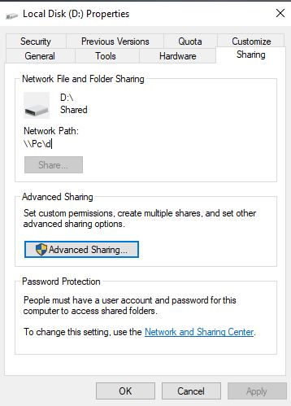
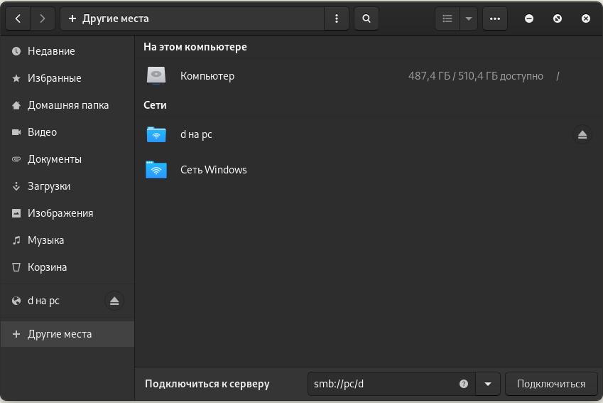
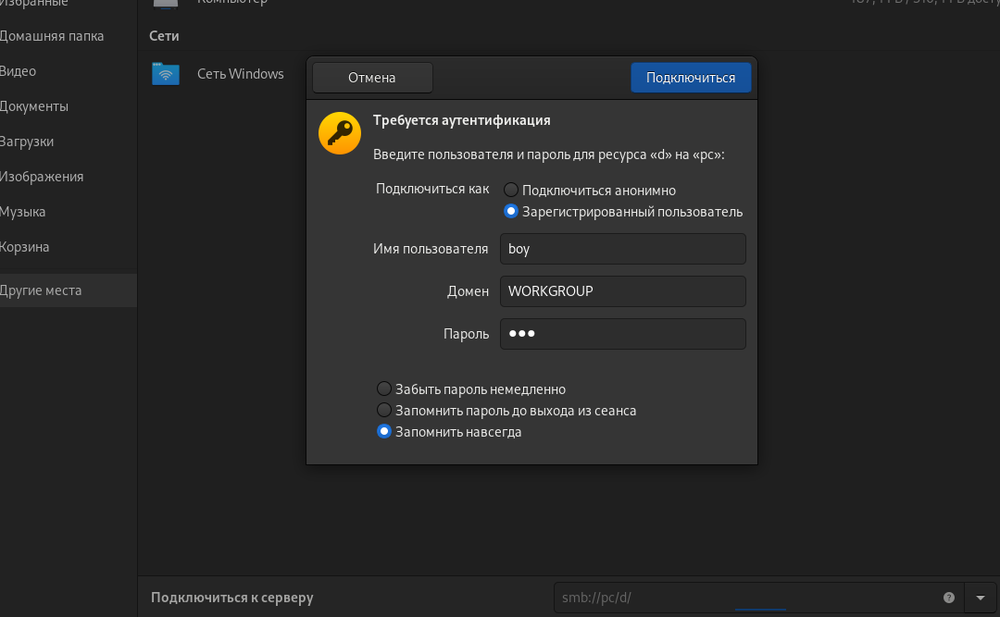

#linux  #it 
# share files to Linux & Windows

sourse: https://www.youtube.com/watch?v=2DbNNffkuuo ,  https://www.youtube.com/watch?v=p1VhczDB6FA , 

1. **windows**-ში ჩვეულებრივ აკეთებ ფაილის **share**-ს, პერმიშენებს და ყველაფერს.
2. **Linux**-ში  გადადიხარ ფაილ მენეჯერში  და  **_smb_**  პროტოკოლით უკავშირდები დაშეარებულ ფაილს.

მაგ:

`smb://pc/d`  -   **pc/d**  - არის დაშეარებული პაპკის მისამართი.  სადაც `PC` არის კომპის სახელი და `d`  d დისკი   
 

 

 

3. პირველად დაკავშირებისას მოითხოვს **windows** მომხმარებლის პაროლს.  
	* windows უზერის სახელი
	* win სამუშაო ჯგუფი (ამ შემთხვევაში WORKGROUP)
	* და უზერის პაროლი.   _P.S._  windows უზერს აუცილებლად უნდა ქონდეს პაროლი.

