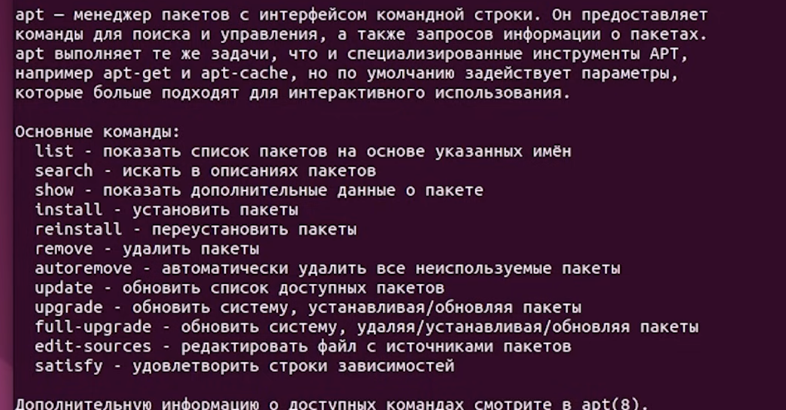

---
aliases:
tags:
  - ubuntu
  - Console-Terminal
  - linux
done: false
created: 2026-09-08
sourse:
---
# ubuntu console commands

- ***apt*** - - - მხოლოდ ამის შეყვანით, გამოვა სია რა ბრძანებების გაშვებაც შეგიძლია
	- 
- ***apt upgrade*** - - - **განაახლებს** მხოლოდ სისტემას და მასში არსებულ პროგრამებს. და მხოლოდ აუცილებლობის შემთხვევაში დააყენებს ახალს.  **არასდროს შლის** არსებულ პაკეტებს
- ***apt dist-upgrade*** / ***apt full-upgrade*** - - -  **მართავს დამოკიდებულებებს (Dependencies):**  `dist-upgrade` (ან `dist-update`) ინტელექტუალურად წყვეტს კონფლიქტებს. თუ რომელიმე პროგრამის განახლება მოითხოვს ახალი დამოკიდებულების (ბიბლიოთეკის) დამატებას ან ძველის წაშლას, ეს ბრძანება ამას ავტომატურად აკეთებს. საჭიროების შემთხვევაში მას შეუძლია დააყენოს ახალი პაკეტები ან წაშალოს ძველი კონფლიქტური ფაილები, რათა განახლება წარმატებით დასრულდეს.
	- აერთიანებს სისტემურ განახლებებს - - - ხშირად გამოიყენება ოპერაციული სისტემის ძირითადი კომპონენტების (მაგალითად, Linux-ის ბირთვის — Kernel) განსაახლებლად, სადაც იცვლება პაკეტების დამოკიდებულებები.
-  ***apt install პაკეტის_სახელი*** - - - პროგრამის ინსტალაცია და ამოწმებს მის ხელმისაწვდომ ვერსიას და თუ საცავებში უფრო ახალი ვერსია არსებობს, **ავტომატურად ანახლებს** მას.
- ***apt install --reinstall პაკეტის_სახელი*** - - - ამოშლა და ხელახალი ინსტალაცია
- ***apt search პაკეტის_მიახლოებითი_სახელი*** - - - როცა პროგრამის ზუსტი სახელი არ იცი, გამოიტანს მსგავსი სახელის პაკეტებს და ვერსიებს. საჭიროს მონახავ და install -ით დააყენებ. 
- ***apt remove პაკეტის_სახელი*** - - -  "მხოლოდ" პკეტების (პროგრამის წაშლა). 
- ***apt purge პაკეტის_სახელი*** - - - პაკეტის(პროგრამის) და მისი **კონფიგურაციული** ფაილის ერთად წაშლა.
- ***apt autoremove*** - - - არასაჭირო პაკეტების ამოშლა. როცა პროგრამას მოყვება სხვა დამოკიდებულებები, და მერე ამ პროგრამას წაშლი, მისი დამოკიდებულებები რჩება. **ამ არასაჭირო პაკეტების წაშლა**.
-  ***apt autoclean*** - - - ასევე ძველი არქივების წაშლა ( **p.s**.  ძლიერ კომპებს ესენი დიდად არ ჭირდება )
- ***apt install -f*** ( `-f` ნიშნავს`--fix-broken`) - - - გამოიყენება **გატეხილი ან დაზიანებული დამოკიდებულებების (dependencies) გამოსასწორებლად**.
	- როდესაც პაკეტის ინსტალაცია ან განახლება შეწყდა შუა გზაზე, ან სისტემას **აკლია საჭირო ბიბლიოთეკები,** ეს ბრძანება აანალიზებს პრობლემას, ავტომატურად ჩამოტვირთავს და აყენებს აუცილებელ დაკარგულ დამოკიდებულებებს ან შლის კონფლიქტურ პაკეტებს, რომ სისტემა ისევ მუშა მდგომარეობაში დააბრუნოს.
- `lsb_release -a` - - - იმის გასაგებად, დისტრიბუტივის რომელი ვერსია გიყენია. ასევე ფაილში ***etc/os/release*** . ან უტილიტა neofetch. 

## console-დან პროგრამის გაშვება: 
ubuntu-ს კონსოლიდან (ტერმინალიდან) **Firefox**-ის ან სხვა **გრაფიკული აპლიკაციის გასაშვებად** საკმარისია ტერმინალში ჩაწერო მისი სახელი და დააჭირო Enter-ს:

```shell
firefox
```

* **ფონურ რეჟიმში გაშვება (`&`):** - - - თუ გინდა, რომ ბრაუზერი გაიხსნას, მაგრამ ტერმინალი თავისუფალი დარჩეს (არ დაიბლოკოს და კვლავ შეძლო სხვა ბრძანებების შეყვანა), ბოლოს მიაწერე ამპერსანდი:
```shell
firefox &
```

* **ტერმინალის დახურვა:** - - -  თუ ტერმინალს პირდაპირ დაკეტავ `firefox` ბრძანების მუშაობისას, თავად ბრაუზერიც დაიხურება. ფონური გაშვების (`&`) შემთხვევაში ან `nohup firefox &` ბრძანებით ტერმინალის დახურვა ბრაუზერზე გავლენას არ იქონიებს.

- - - 