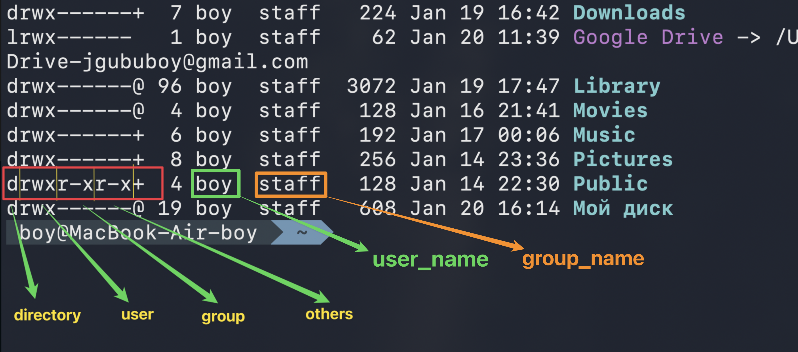
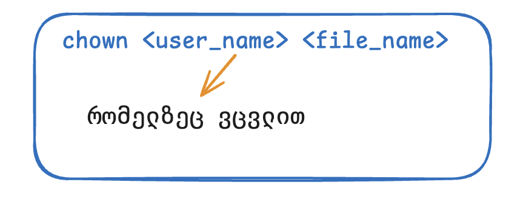
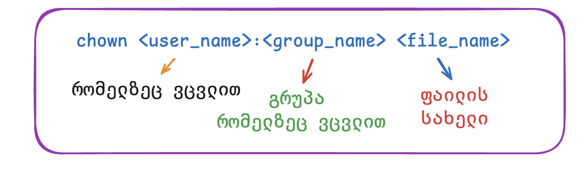
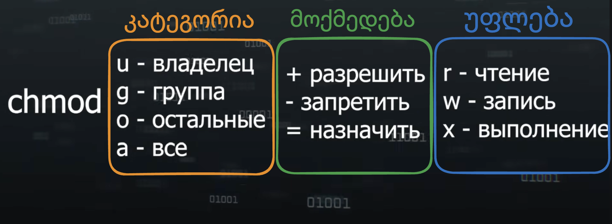
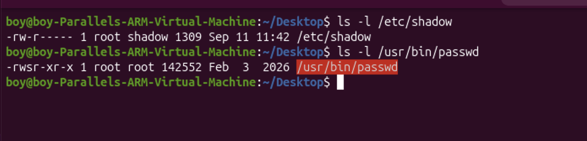

---
aliases:
  - ნებართვები და უფლებები
  - ფაილური სისტემის უფლებების მართვა Linux-ში
  - users on inux
  - linux users
  - მომხმარებლები და მათი უფლებები
  - მომხმარებლების ტიპები ლინუქსში
  - უფლებები ლინუქში
  - users on linux
  - მომხმარებლების მართვა
  - failze dashveba
  - prava dostupa
  - права доступа
  - ნებართვები და მფლობელობა
  - Linux ნებართვები და უფლებები
  - ნებართველი ლინუქშ
  - Linux ნებართვები
  - linux groups
  - chmod
  - chown
tags:
  - linux
  - unix_Users-Groups
  - NAS
  - trueNAS
done: false
created: 2026-09-08
sourse:
---
# ნებართვები და უფლებები

[16:00 - Часть 2 - YouTube](https://www.youtube.com/watch?v=5INZghkqzjA)
## ფაილური სისტემის უფლებების მართვა Linux-ში
UNIX - ის სისტემებში წვდომის უფლებების მართვა არ არის "ჯადოქრობა", არამედ წინასწარ გათვლილი ლოგიკური სისტემაა.
**ფაილებისა** და **კატალოგების** უფლებების განაწილება Linux-ის ერთ-ერთი ყველაზე ეფექტური უსაფრთხოების ფუნქციაა, რომელიც ზუსტად განსაზღვრავს, თუ ვის რა ტიპის წვდომა აქვს კონკრეტულ ობიექტზე. 
გამონაკლისს წარმოადგენს `root` მომხმარებელი, რომელსაც სრული წვდომა აქვს სისტემის ყველა ფაილზე, მიუხედავად დაწესებული შეზღუდვებისა.
## **უფლებების ძირითადი ტიპები: rwx**

1. ***Read (r) — კითხვა***

- **ფაილებისთვის:** შინაარსის ნახვა, ზომის და თარიღის გაგება.
- **საქაღალდეებისთვის:** მასში არსებული ფაილების სიის ნახვა.
- **მოწყობილობებისთვის:** მონაცემების წაკითხვა (მაგ. მაუსის მოძრაობის ან პრინტერის სტატუსის მიღება).

2. ***Write (w) — ჩაწერა***

- **ფაილებისთვის:** შინაარსის შეცვლა, დამატება ან წაშლა.
- **საქაღალდეებისთვის:** ახალი ფაილის შექმნა, არსებულის გადარქმევა ან წაშლა.

    > **მნიშვნელოვანია:** ფაილის წაშლა დამოკიდებულია არა თავად ფაილის, არამედ იმ **საქაღალდის** უფლებებზე, რომელშიც ის დევს.

3. ***Execute (x) — შესრულება / გაშვება***

- **ფაილებისთვის:** პროგრამის ან სკრიპტის(შესრულებადი ფაილის) გაშვება.
- **საქაღალდეებისთვის:** მასში **შესვლის** (ნავიგაციის) უფლება. თუ საქაღალდეს არ აქვს `x` უფლება, თქვენ მასში ვერ შეხვალთ, მაშინაც კი, თუ შიგნით არსებულ ფაილებზე კითხვის უფლება გაქვთ.
მთხვევაში — მასში შესვლის და ფაილებზე წვდომის საშუალება.

## მომხმარებელთა სამი ტიპი
Linux-ის ოპერაციულ სისტემაში ***მომხმარებელთა სამი ტიპი*** არსებობს:

- **root** (ინგლ. root — ძირი) — სუპერმომხმარებელი, UNIX-ის მსგავს სისტემებში არსებული ანგარიში, რომლის მფლობელსაც ყოველგვარი გამონაკლისის გარეშე ყველა ოპერაციის შესრულების უფლება აქვს. სისტემაში თავიდანვეა წარმოდგენილი. UID (მომხმარებლის იდენტიფიკატორი). root მომხმარებელს აქვს იდენტიფიკატორი 0.
    
- **სისტემური მომხმარებლები** — სისტემური პროცესები, რომლებსაც აქვთ ანგარიშები ფაილებსა და კატალოგებზე წვდომის უფლებებისა და პრივილეგიების სამართავად. იქმნება სისტემის მიერ ავტომატურად. UID მერყეობს 1-დან 100-მდე.
    
- **ჩვეულებრივი მომხმარებლები** — სისტემის მართვაზე დაშვებული მომხმარებლების ანგარიშები. იქმნება სისტემური ადმინისტრატორის მიერ. UID იწყება 1000-დან.


## **მომხმარებელთა კატეგორიები**:

1. **User (მფლობელი / Owner - `u`):** - - - კონკრეტული მომხმარებელი ( ლოგინით, პაროლით და ავტომატური ID-ით). პირი, რომელიც ფლობს ფაილს (უმეტესად მისი შემქმნელია).
2. **Group (ჯგუფი  - `g`):** - - - მომხმარებელთა ჯგუფი (ახალი მომხმარებლის შექმნისას სისტემა ავტომატურად უქმნის მისი სახელის მქონე ჯგუფს).
3. **Other (სხვები  - `o`):** - - - ყველა დანარჩენი მომხმარებელი, ვინც არ არის ფაილის მფლობელი და არ შედის შესაბამის ჯგუფში.

## უფლებების ნახვა ( სტატუსის შემოწმება ):

**უფლებების ნახვა (`ls -l`)**
ბრძანება `ls -l` გამოჰყავს 9-ნიშნა სიმბოლური რიგი (მაგალითად: `-rwxr-xr--`):

- **პირველი სიმბოლო (`-`):** ფაილის ტიპი ( `-` = ფაილი, `d` = დირექტორია).
- **ჯგუფი 1 (`rwx`):** მფლობელის (**User**) ნებართვები.
- **ჯგუფი 2 (`r-x`):** ჯგუფის (**Group**) ნებართვები.
- **ჯგუფი 3 (`r--`):** სხვების (**Others**) ნებართვები.
- *შენიშვნა:* ბრძანება `ls -lc` გამოიყენება ფაილის ატრიბუტების (უფლებების) ბოლო ცვლილების დროის სანახავად.

გამოდის რომ ჩვენ ფაილებზე,  უფლების მხრივ არის **3 ტიპის ადამიანები**.  თავისი უფლებებით.  
**user, group, others.**
 მაგალითად:  `ls -l`  : 


.
## ფაილის *მფლობელის შეცვლა*: `chown`
ფაილის ნებართვების მართვა Linux-ის ფუნდამენტური ნაწილია.

| **ბრძანება** | **სინტაქსი**                   | **მნიშვნელობა**                                                                                                 |
| ------------ | ------------------------------ | --------------------------------------------------------------------------------------------------------------- |
| **`chmod`**  | `chmod [mode] ფაილი`           | **Ch**ange **Mod**e. ***ცვლის ფაილის ნებართვებს*** <br>( **წაკითხვა** `r`, **ჩაწერა** `w`, **შესრულება** `x` ). |
| **`chown`**  | `chown [მფლობელი:ჯგუფი] ფაილი` | **Ch**ange **Own**er. ***ცვლის ფაილის ან დირექტორიის მფლობელსა და ჯგუფს.***                                     |
| **`sudo`**   | `sudo ბრძანება`                | **S**uper **U**ser **Do**. ასრულებს ბრძანებას სუპერმომხმარებლის (root) პრივილეგიებით.                           |
|              |                                |                                                                                                                 |

ბრძანება ***chown*** (**Change Owner**) გამოიყენება ფაილის ან საქაღალდის მფლობელისა და ჯგუფის შესაცვლელად.

- ***სინტაქსი1*:** `chown user file`
	- 
- ***სინტაქსი*:** `chown user:group file`
	- 
- ***მაგალითი*:** `sudo chown giorgi:family photo.jpg`
    - ამით `photo.jpg`-ის მფლობელი გახდება "**giorgi**", ხოლო ფაილი მიებმება "**family**" ჯგუფს.
- ***სინტაქსი***: (მხოლოდ გრუპის შეცვლა) 
	- `chown :group_name file`
	- `:` - - - ორწერტილი გამყოფია უსერსა და გრუპას შორის.

## *უფლებების შეცვლა: `chmod` ბრძანება*

ბრძანება ***chmod*** (**Change Mode**) ყველაზე მნიშვნელოვანია. 
მისი დახმარებით ფაილს ვაქცევთ  [შესრულებად/Executable ფაილად](🔥%20შესრულებადი(исполняемый%20,%20Executable)%20ფაილი.md)  , რომლის მერე შეიძლება გაშვება.  
უფლებების მინიჭება ხდება ორი გზით: 
- **ციფრული** 
- **სიმბოლური**.

#### 1. **სიმბოლური მეთოდი:**



* სინტაქსი: `chmod [კატეგორია][მოქმედება][უფლება] ფაილის_სახელი`
* **კატეგორიები:** - - - `u` (owner), `g` (group), `o` (others), `a` (all - ყველა ერთად).
* **მოქმედებები:** - - -  `+` (დამატება), `-` (წართმევა), `=` (ზუსტი მინიჭება).
	* **მაგალითი1**: `chmod ug+x file1` - - -  მფლობელს და ჯგუფს ემატება **გაშვების უფლება**. მრავალი წესის გადაბმა შესაძლებელია მძიმით, ხოლო ფაილების სივრცით გამოყოფა.
	* **მაგალითი2:** `chmod g+w file.txt` - - - იმ ჯგუფს, რომელიც ამჟამად მითითებულია როგორც **`file.txt` ფაილის მფლობელი ჯგუფი (Group Owner)** , დაემატება ჩაწერის უფლება.
	* ***მაგალითი3 !!!*( უფლების წართმევა/გამოკლება ):** `chmod o-r file.txt` - - - other გრუპის მომხმარებლებს **გამოვაკელით/წავართვით კითხვის უფლება**.  
	* ***მაგალითი 4 !!!***: `chmod g+rw,o+r ttt` - - - ttt ფაილზე, უფლებები გავწერეთ შემდეგ ნაირად: 
		* **მფლობელების გრუპას** მივეცით უფლება ***ჩაწერა და კითხვის***.   ( ***g+rw*** )
		* **other მომხმარებლებს** - მხოლოდ ***წაკითხვის უფლება***:  ( ***o+r*** ) 
	* ***მაგალითი5 !!!*** : `chmod +x <file_name>` - - - თუ კატეგორიას არ მივუთითებთ , ბრძანება ავტომატურად ვრცელდება **ყველა კატეგორიაზე** ერთდროულად: **მფლობელზე** (`u`), **ჯგუფზე** (`g`) და **სხვებზე** (`o`). შედეგად, ამ ფაილის გაშვება (**execution**) ყველას შეეძლება.
		* გაითვალისწინეთ, რომ ფაილის რეალურად გასაშვებად, `x` (executable) უფლებასთან ერთად, აუცილებელია **`r` (read / წაკითხვის)** უფლებაც ჰქონდეს იმავე მომხმარებელს, წინააღმდეგ შემთხვევაში სისტემა სკრიპტს ან პროგრამას მაინც ვერ წაიკითხავს და არ გაუშვებს.


#### 2. **ციფრული (ოქტალური) მეთოდი:**

* სინტაქსი შედგება სამი ციფრისგან (მფლობელი, ჯგუფი, დანარჩენები):
* `7` = rwx (4+2+1)
* `6` = rw- (4+2)
* `5` = r-x (4+1)
* `4` = r-- (4)
* `0` = --- (არანაირი უფლება)

***მაგალითად***1: `chmod 750 file1` ( **მფლობელს — *rwx*, ჯგუფს — *r-x*, დანარჩენებს — *არაფერი*** ).

***მაგ2***: `chmod 777 file2` - - - - ( ყველას (**მფლობელს — *rwx*, ჯგუფს — *rwx*, დანარჩენებს — *rwx***) ყველაფრის უფლებას აძლევს )

## სპეც სიმბოლოები `s` და `t` : 
ლინუქსის ფაილურ სისტემაში **`s`** და **`t`** არის **სპეციალური უფლებები (Special Permissions)**, რომლებიც სტანდარტულ `rwx` (read, write, execute) უფლებებს ემატება და გამოიყენება უსაფრთხოებისა და წვდომის კონტროლისთვის.

### 1. სიმბოლო `s` (SUID და SGID)
[29:00 - უფლებები და პრივილეგიები - YouTube](https://www.youtube.com/watch?v=4pIt0oR-o0g&list=PLbZtgfvYfOp2wzQoifSshcIxzajImRvsJ&index=12)
 
სიმბოლო `s` შეიძლება გამოჩნდეს მფლობელის (`user`) ან ჯგუფის (`group`) შესრულების უფლების ადგილას:



* **SUID (Set User ID):** თუ მფლობელის ადგილას წერია `s` (მაგ: `-rwsr-xr-x`), ეს ნიშნავს, რომ როდესაც ნებისმიერი მომხმარებელი გაუშვებს ამ შესრულებელ ფაილს, პროგრამა გაშვების მომენტში იღებს არა ამ მომხმარებლის, არამედ **ფაილის მფლობელის (Owner/Root)** უფლებებს. კლასიკური მაგალითია `/usr/bin/passwd`, სადაც ჩვეულებრივ მომხმარებელს სჭირდება სისტემურ ფაილში (`/etc/shadow`) პაროლის შეცვლა, რასაც მხოლოდ root-ი აკეთებს.
* **SGID (Set Group ID):** თუ ის ჯგუფის პოზიციაზეა, ხოლო დირექტორიას აგდია, ამ დირექტორიაში შექმნილი ახალი ფაილები და ქვე-საქაღალდეები მემკვიდრეობით მიიღებენ მამა დირექტორიის ჯგუფს და არა დამქმნელი მომხმარებლის პირად ჯგუფს.
* **მნიშვნელობა (`s` vs `S`):**
* პატარა **`s`** ნიშნავს, რომ შესრულების (`x`) უფლებაც აქტიურია.
* დიდი **`S`** ნიშნავს, რომ შესრულების (`x`) უფლება გამორთულია და მხოლოდ სპეც-უფლებაა ძალაში.

### 2. სიმბოლო `t` (Sticky Bit)

სიმბოლო `t` ყოველთვის იწერება ბოლო პოზიციაზე — **სხვების (Others)** შესრულების უფლების ადგილას (მაგ: `-rwxrwxrwt`).

* **დანიშნულება:** ძირითადად გამოიყენება საზიარო დირექტორიებისთვის (როგორიცაა `/tmp`). როდესაც საქაღალდეს უყენია Sticky Bit, ნებისმიერ მომხმარებელს შეუძლია იქ ფაილების შექმნა და წერა, მაგრამ **მხოლოდ თავის საკუთარ ფაილებს წაშლის ან გადაარქვამს სახელს**. სხვის შექმნილ ფაილს სხვები ვერ წაშლიან, მიუხედავად იმისა, რომ საქაღალდეზე ყველას წერის უფლება (`w`) აქვს.
* **მნიშვნელობა (`t` vs `T`):**
* პატარა **`t`** ნიშნავს, რომ სხვებს შესრულების (`x`) უფლებაც აქვთ.
* დიდი **`T`** ნიშნავს, რომ შესრულების (`x`) უფლება გამორთულია.

## მომხმარებლებისა და ჯგუფების მართვა

სანამ უფლებებს გავცემთ, ჯერ სუბიექტები უნდა შევქმნათ.

- **`useradd` / `adduser`**: ახალი მომხმარებლის შექმნა.
    - _მაგალითი:_ `sudo adduser giorgi` (შექმნის მომხმარებელს და მოგთხოვთ პაროლის დაყენებას).
- `userdel`  / `deluser` - მომხმარებლის წაშლა
	- *მაგალითი*: `sudo userdel giorgi` (წაშლის მომხმარებელს).
- **`usermod`**: მომხმარებლის მონაცემების/პარამეტრების შეცვლა (მაგალითად, ჯგუფში დამატება).
    - _მაგალითი:_ `sudo usermod -aG family giorgi` (დაამატებს გიორგის "family" ჯგუფში).
- `passwd`  - მომხმარებლის პაროლის შექმნა
	- *მაგალითი*: `sudo passwd giorgi` (შეცვლის ან დაუყენებს პაროლს მომხმარებელს).
- **`groupadd`**: ახალი ჯგუფის შექმნა.
    - _მაგალითი:_ `sudo groupadd family`
- `groupdel` : - удаление группы.
	- *მაგალითი*: `sudo groupdel family` (წაშლის მითითებულ ჯგუფს).
- `gpasswd` : - ჯგუფზე პაროლის დაყენება
	- *მაგალითი*: `sudo gpasswd family` (დაუყენებს პაროლს ჯგუფს).
- `groupmod` : - изменение параметров группы.
	- *მაგალითი*: `sudo groupmod -n new_family family` (შეუცვლის სახელს ჯგუფს).

## 5. სპეციალური უფლება: `sudo`

თუ მომხმარებელს არ აქვს უფლება სისტემურ ფაილზე, ის იყენებს `sudo` (**SuperUser Do**) ბრძანებას, რათა დროებით იმოქმედოს "**Root**" (ადმინისტრატორის) სახელით.

---

ახალი მომხმარებლის შექმნისას რამდენიმე პარამეტრი ავტომატურად განისაზღვრება. ფაილში `/etc/passwd` იქმნება ჩანაწერი, რომელიც მიუთითებს მომხმარებლის სახელს, საშინაო კატალოგს, UID-სა და GID-ს. კატალოგში თავსდება საკომანდო გარსის (**shell**) ინიციალიზაციის ფაილები. ყველაფრის მითითება შესაძლებელია ხელითაც, დამატებითი ოპციების გამოყენებით. ოპციების სიის ნახვა შესაძლებელია ბრძანებით `useradd --help` ან `useradd -h`.

```bash
useradd -h

გამოყენება: useradd [არჩევნები/პარამეტრები] მომხმარებლის_სახელი
useradd -D
useradd -D [არჩევნები/პარამეტრები]

პარამეტრები:
-b, --base-dir ბაზ_კატ             ახალი მომხმარებლის ანგარიშის საშინაო (საოჯახო) კატალოგის საბაზო კატალოგი
-c, --comment კომენტარი           ახალი მომხმარებლის ანგარიშის GECOS ველი
-d, --home-dir დომ_კატ            ახალი მომხმარებლის ანგარიშის საშინაო კატალოგი
-D, --defaults                    useradd-ის ნაგულისხმევი პარამეტრების ჩვენება ან შეცვლა
-e, --expiredate დატ_უსტ          ახალი მომხმარებლის ანგარიშის ძალის დაკარგვის (ვადის გასვლის) თარიღი
-f, --inactive არააქტივობა        ახალი მომხმარებლის ანგარიშის პაროლის არააქტიურობის პერიოდი
-g, --gid ჯგუფი                    ახალი მომხმარებლის ანგარიშის პირველადი ჯგუფის სახელი ან ID
-G, --groups ჯგუფები              ახალი მომხმარებლის ანგარიშის დამატებითი ჯგუფების სია
-h, --help                        მოცემული შეტყობინების ჩვენება და მუშაობის დასრულება
-k, --skel კაბ_შაბ                ალტერნატიული შაბლონების კატალოგის გამოყენება
-K, --key გასაღები=მნიშვნელობა   ნაგულისხმევი მნიშვნელობის შეცვლა /etc/login.defs-იდან
-l, --no-log-init                 მომხმარებლის არ დამატება lastlog და faillog მონაცემთა ბაზებში
-m, --create-home                 მომხმარებლის საშინაო კატალოგის შექმნა
-M, --no-create-home              მომხმარებლის საშინაო კატალოგის არ შექმნა
-N, --no-user-group               მომხმარებლის სახელის იდენტური ჯგუფის არ შექმნა
-o, --non-unique                  განმეორებადი (არაუნიკალური) UID-ით მომხმარებლების შექმნის უფლება
-p, --password პაროლი             ახალი მომხმარებლის ანგარიშის დაშიფრული პაროლი
-r, --system                      სისტემური ანგარიშის შექმნა
-R, --root კატ_chroot             კატალოგი, რომელშიც ხორციელდება chroot
-s, --shell გარსი                  ახალი მომხმარებლის ანგარიშის სარეგისტრაციო გარსი (shell)
-u, --uid UID                     ახალი ანგარიშის მომხმარებლის ID
-U, --user-group                  მომხმარებლის სახელის იდენტური ჯგუფის შექმნა
-Z, --selinux-user SEUSER         მითითებული SEUSER-ის გამოყენება მომხმარებლის SELinux შესაბამისობისთვის
```

### რეკურსიული მართვა და Sticky Bit

* **რეკურსიულად შეცვლა (`-R`):** პაპკის და მის შიგნით არსებული ყველა ობიექტის უფლებების ერთდროულად შესაცვლელად გამოიყენება `-R` პარამეტრი (მაგ: `chmod -R 770 /path/to/dir`). კატალოგის დესკრიპტორის სანახავად გამოიყენება `ls -ld`.
* **Sticky Bit (`t` / `T`):** თუ კატალოგზე დაყენებულია Sticky Bit, მის შიგნით არსებული ფაილის წაშლა ან გადარქმევა მხოლოდ მის რეალურ მფლობელს შეუძლია (მიუხედავად იმისა, რომ სხვებსაც აქვთ პაპკაში ჩთვის უფლება).
* ციფრული ფორმატით დასაყენებლად წინ ეწერება დამატებითი ციფრი `1` (მაგ: `chmod 1770 dir`).
* სიმბოლური ფორმატით: `chmod +t dir`.