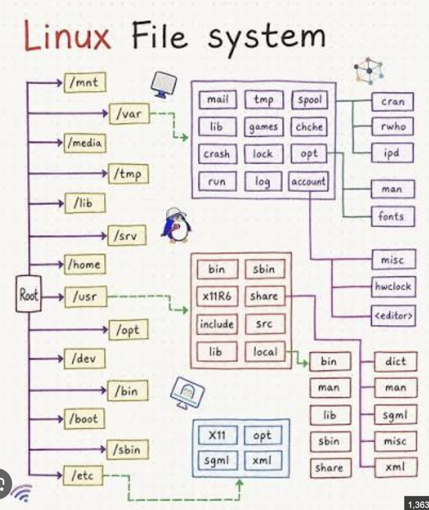

---
aliases:
tags:
  - linux
done: false
created: 2026-08-26
sourse:
---
# linux filesystem ( FHS )

 
.
### ძირითადი დირექტორიები

- **`/` (Root):** მთავარი (ძირეული) დირექტორია. მთელი ფაილური სისტემა იწყება აქედან; ყველა სხვა საქაღალდე მის შიგნით მდებარეობს.
    
- **`/bin`:** ძირითადი სავალდებულო შესასრულებელი ფაილები (პროგრამები), რომლებიც ესაჭიროება სისტემას და მომხმარებლებს სისტემის ჩართვისა და მუშაობისთვის (მაგ: `ls`, `cp`, `bash`).
    
- **`/boot`:** სისტემის ჩატვირთვისთვის აუცილებელი ფაილები, მათ შორის ბირთვი (Kernel) და GRUB-ის კონფიგურაციები.
    
- **`/dev`:** მოწყობილობების ფაილები (Devices). Linux-ში ჰარდვერი (მყარი დისკი, მაუსი, ტერმინალი) ფაილების სახითაა წარმოდგენილი (მაგ: `/dev/sda`).
    
- **`/etc`:** სისტემური კონფიგურაციის ფაილები. აქ ინახება მთელი სისტემის და მრავალი პროგრამის პარამეტრები (მხოლოდ ტექსტური ფაილები).
    
- **`/home`:** ჩვეულებრივი მომხმარებლების პირადი საქაღალდეები. თითოეულ მომხმარებელს აქვს თავისი სივრცე (მაგ: `/home/george`).
    
- **`/lib` და `/lib64`:** ბიბლიოთეკები. ფაილები, რომლებიც ესაჭიროებათ `/bin` და `/sbin` დირექტორიებში არსებულ პროგრამებს მუშაობისთვის (ძირითადი პროგრამული კოდის ბლოკები).
    
- **`/media`:** მოსახსნელი მედია-მოწყობილობების (ფლეშ-დრაივები, გარე მყარი დისკები, CD-ROM) ავტომატურად შეერთების ადგილი.
    
- **`/mnt`:** დროებითი მონტაჟის (Mount) წერტილი. ადმინისტრატორები იყენებენ ფაილური სისტემების დროებით მისამაგრებლად.
    
- **`/opt`:** დამხმარე პროგრამული უზრუნველყოფა. ხშირად აქ აყენებენ მესამე მხარის (Third-party) დიდ პროგრამებს, რომლებიც არ შედის სტანდარტულ პაკეტებში (მაგალითად, Google Chrome).
    
- **`/root`:** ზემომხმარებლის (root) პირადი საქაღალდე. არ აგერიოთ ძირეულ `/` დირექტორიაში.
    
- **`/sbin`:** სისტემური ადმინისტრატორის ბრძანებები. პროგრამები, რომლებიც ძირითადად განკუთვნილია სისტემის ადმინისტრირებისთვის და უსაფრთხოებისთვის (მაგ: `fdisk`, `reboot`).
    
- **`/srv`:** სერვისის მონაცემები. აქ ინახება სისტემაზე გაშვებული სერვისების (მაგ: ვებ-სერვერის) მონაცემები.
    
- **`/tmp`:** დროებითი ფაილები. სისტემა და პროგრამები აქ ინახავენ დროებით მონაცემებს, რომლებიც კომპიუტერის გადატვირთვისას ხშირად იშლება.
    
- **`/usr`:** მომხმარებლის პროგრამები და მონაცემები. შეიცავს წაკითხვად (Read-only) პროგრამებს, ბიბლიოთეკებსა და დოკუმენტაციას, რომლებიც არ არის კრიტიკული სისტემის საწყისი ჩატვირთვისთვის.
    
- **`/var`:** ცვლადი ფაილები (Variable). აქ ინახება მონაცემები, რომლებიც მუდმივად იცვლება მუშაობის პროცესში — ლოგები (Logs), მონაცემთა ბაზები, ელ-ფოსტის ეროვნული ბუფერები და ა.შ.
    

