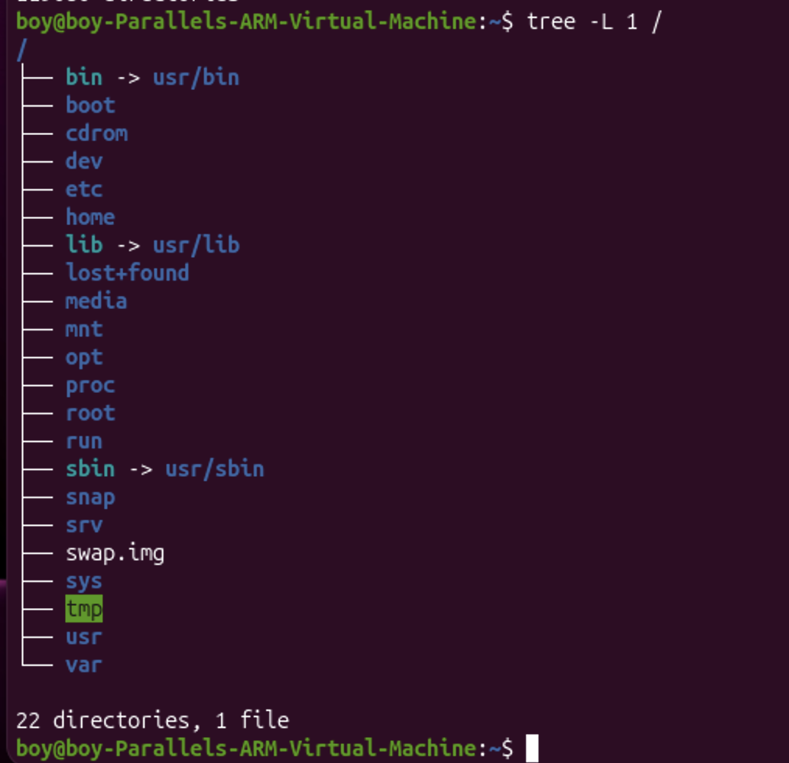
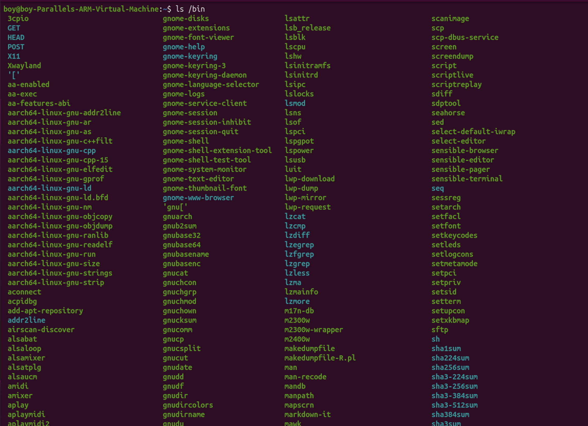
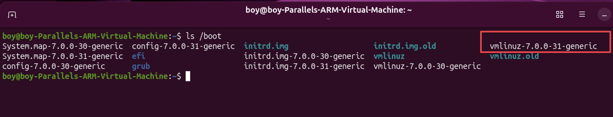
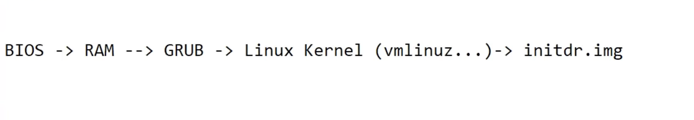
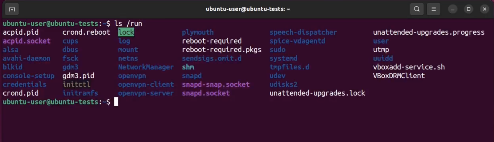
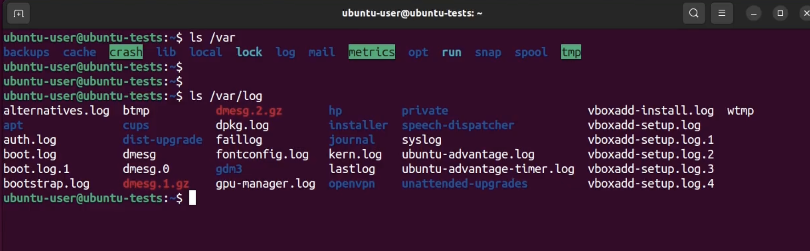

---
aliases:
  - linux filesystem ( FHS )
  - linux catalog
  - linux directory
  - დირექტორია
tags:
  - linux
done: false
created: 2026-09-16
sourse:
---
# Linux კატალოგები

[Classic SysAdmin: The Linux Filesystem Explained - Linux Foundation](https://www.linuxfoundation.org/blog/blog/classic-sysadmin-the-linux-filesystem-explained) 

**It makes sense to explore the Linux filesystem from a terminal window, not because the author is a grumpy old man and resents new kids and their pretty graphical tools — although there is some truth to that — but because a terminal, despite being text-only, has better tools to show the map of Linux’s directory tree.**
აზრი აქვს Linux-ის ფაილური სისტემის ტერმინალის ფანჯრიდან შესწავლას არა იმიტომ, რომ ავტორი ბუზღუნა მოხაცია და ახალგაზრდები და მათი ლამაზი გრაფიკული ინსტრუმენტები ეზარება (თუმცა ამაშიც არის გარკვეული სიმართლე), არამედ იმიტომ, რომ ტერმინალს, მიუხედავად იმისა, რომ მხოლოდ ტექსტურია, უკეთესი ინსტრუმენტები აქვს Linux-ის დირექტორიების ხის რუკის საჩვენებლად.

**In fact, that is the name of the first tool you’ll install to help you on the way: tree. If you are using Ubuntu or Debian, you can do:**
ფაქტობრივად, სწორედ ეს არის იმ პირველი ინსტრუმენტის სახელი, რომელსაც დააინსტალირებთ, რათა გზაში დაგეხმაროთ: ***tree***. თუ **Ubuntu**-ს ან **Debian**-ს იყენებთ, შეგიძლიათ გააკეთოთ შემდეგი:

`sudo apt install tree`

**On Red Hat or Fedora, do:**
Red Hat-ზე ან Fedora-ზე გააკეთეთ:

`sudo dnf install tree`

**For SUSE/openSUSE use zypper:**
SUSE/openSUSE-სთვის გამოიყენეთ zypper:

`sudo zypper install tree`

**For Arch-like distros (Manjaro, Antergos, etc.) use:**
Arch-ის მსგავსი დისტრიბუციებისთვის (Manjaro, Antergos და ა.შ.) გამოიყენეთ:

`sudo pacman -S tree`

**… and so on.**
… და ასე შემდეგ.

**Once installed, stay in your terminal window and run tree like this:**
ინსტალაციის შემდეგ, დარჩით ტერმინალის ფანჯარაში და გაუშვით **tree** შემდეგნაირად:

`tree` ბრძანებით ძირეული დირექტორიის (`/`) მხოლოდ პირველი დონის კატალოგების (საქაღალდეების) გამტანსატანად, ისე რომ ფაილები არ გამოჩნდეს, უნდა გამოიყენოთ `-L 1` და `-d` ფლაგები:

```bash
tree -L 1 -d /
```

- **`-L 1`** - - -  ზღუდავს ხის სიღრმეს მხოლოდ პირველი დონით (ანუ მხოლოდ ძირში არსებული საქაღალდეებით). ( `-L 2` ...  შესაბამისად ჩაშლის კატალოგების სიას. )
- **`-d`** - - -  ავალებს ბრძანებას, რომ გამოიტანოს **მხოლოდ დირექტორიები** (Directories) და გამოტოვოს ჩვეულებრივი ფაილები.


**The instruction above can be translated as “show me only the 1st Level of the directory tree starting at / (root)“. The -L option tells tree how many levels down you want to see.**
ზემოთ მოცემული ინსტრუქცია შეიძლება ითარგმნოს როგორც „მაჩვენე მხოლოდ დირექტორიების ხის მე-1 დონე, რომელიც იწყება /-დან (ძირიდან)“. -L ოფცია ეუბნება tree-ს, თუ რამდენად ღრმად გსურთ ქვემოთ ჩასვლა.

**Most Linux distributions will show you the same or a very similar layout to what you can see in the image above. This means that even if you feel confused now, master this, and you will have a handle on most, if not all, Linux installations in the whole wide world.**
Linux-ის დისტრიბუციების უმეტესობა გაგიჩვენებთ ზუსტად იმავე ან ძალიან მსგავს განლაგებას, რასაც ზემოთ მოცემულ სურათზე ხედავთ. ეს ნიშნავს, რომ მაშინაც კი, თუ ახლა თავი დათრგუნულად გრძნობთ, აითვისეთ ეს და გაგიმარტივდებათ Linux-ის უმეტეს, თუ არა ყველა, ინსტალაციასთან გამკლავება მთელ ფართო სამყაროში.  

**To get you started on the road to mastery, let’s look at what each directory is used for. While we go through each, you can peek at their contents using ls.**
იმისათვის, რომ დაგეხმაროთ დაუფლების გზაზე წასვლაში, მოდით ვნახოთ, რისთვის გამოიყენება თითოეული დირექტორია. სანამ თითოეულს განვიხილავთ, შეგიძლიათ ls-ის გამოყენებით შეიხედოთ მათ შიგთავსში.

## **Directories**
საწყისიდან ბოლომდე, დირექტორიები, რომლებსაც ხედავთ, შემდეგია:

[Linux ადმინისტრირება N3. ფაილური სისტემები. Linux-ის კატალოგების სტრუქტურა - YouTube](https://www.youtube.com/watch?v=EdAHXLrX3c8&list=PLbZtgfvYfOp2wzQoifSshcIxzajImRvsJ&index=3) 

## / (Root)
**`/` (Root):** მთავარი (ძირეული) დირექტორია. მთელი ფაილური სისტემა იწყება აქედან; ყველა სხვა საქაღალდე მის შიგნით მდებარეობს.

## /bin (Binaries)
**/bin** არის დირექტორია, რომელიც შეიცავს **ბინარულ ფაილებს**, ანუ ***ზოგიერთ*** იმ **აპლიკაციასა** და **პროგრამას**, რომელთა გაშვებაც შეგიძლიათ(შესრულებად ფაილებს). 

>**Linux** (FHS - Filesystem Hierarchy Standard) სტანდარტის მიხედვით, პროგრამები და შესასრულებელი ფაილები ნაწილდება სხვადასხვა დირექტორიაში იმის მიხედვით, თუ რა დანიშნულება აქვთ მათ და ვისთვის არის განკუთვნილი

შეიცავს სისტემისთვის აუცილებელ ძირითად ბრძანებებს (**მაგალითად**: `ls`, `cp`, `cat`, `bash`), რომლებიც ესაჭიროებათ როგორც ჩვეულებრივ მომხმარებლებს, ისე `root`-ს სისტემის მუშაობისა და ჩატვირთვის საწყის ეტაპზე.

.
მოკლედ რომ ვთქვათ, `/bin` მხოლოდ მცირე და ყველაზე კრიტიკული სისტემური ბრძანებებისთვის გამოიყენება, 
ხოლო ჩვეულებრივი პროგრამები ძირითადად `/usr/bin` ან სხვა მსგავს დირექტორიებში ნაწილდება.
## /sbin ( System Binaries )
**/sbin** ჰგავს **/bin**-ს, მაგრამ ის შეიცავს აპლიკაციებს, რომლებიც მხოლოდ **სუპერმომხმარებელს/root** (აქედან მოდის საწყისი **s**) დასჭირდება. შეგიძლიათ გამოიყენოთ ეს აპლიკაციები **sudo** ბრძანებით, რომელიც მრავალ დისტრიბუციაში დროებით გაძლევთ სუპერმომხმარებლის უფლებებს. **/sbin** ტიპურად შეიცავს ინსტრუმენტებს, რომლებსაც შეუძლიათ ნივთების დაინსტალირება, წაშლა და ფორმატირება.  (მაგალითად: `fdisk`, `reboot`, `iptables`),

## /lib ( libraries )
**/lib** არის ადგილი, სადაც ბიბლიოთეკები ცხოვრობენ. ბიბლიოთეკები არის ფაილები, რომლებიც შეიცავს კოდს, რომლის გამოყენებაც თქვენს აპლიკაციებს შეუძლიათ. ისინი შეიცავენ კოდის ფრაგმენტებს, რომლებსაც აპლიკაციები იყენებენ თქვენს სამუშაო მაგიდაზე ფანჯრების დასახატად, პერიფერიული მოწყობილობების სამართავად ან ფაილების მყარ დისკზე გასაგზავნად.

შეიცავს სისტემის საწყისი ჩატვირთვისთვის და ძირითადი ბრძანებებისთვის (`/bin` და `/sbin` დირექტორიებიდან) აუცილებელ კრიტიკულ ბიბლიოთეკებს (მაგალითად, ძირითადი სისტემური C ბიბლიოთეკა).

ფაილურ სისტემაში მიმობნეულია სხვა **lib** დირექტორიებიც, მაგრამ ეს ერთი, რომელიც პირდაპირ` / `დირექტორიიდან არის ჩამოკიდებული, განსაკუთრებულია იმით, რომ, სხვებთან ერთად, ის შეიცავს ყველაზე მნიშვნელოვან ბირთვის მოდულებს. 
**ბირთვის მოდულები** არის **დრაივერები**, რომლებიც აიძულებს ისეთ რაღაცებს, როგორიცაა თქვენი **ვიდეო ბარათი, ხმის ბარათი, WiFi, პრინტერი** და ა.შ., იმუშაონ.

## /boot
/boot დირექტორია შეიცავს თქვენი სისტემის ჩასართავად საჭირო ფაილებს. 
არ შეეხოთ! თუ აქედან რომელიმე ფაილი დააზიანეთ, შესაძლოა ვეღარ შეძლოთ თქვენი Linux-ის გაშვება და მისი აღდგენა დიდი თავის ტკივილია. 
მეორე მხრივ, ზედმეტად ნუ ინერვიულებთ სისტემის შემთხვევით განადგურებაზე: ამისათვის სუპერმომხმარებლის პრივილეგიები გჭირდებათ.


კომპიუტერის ჩართვისას პროცესები მიდის შედმეგი: 


**RAM** ჩატვირთვას **GRUB**-ს და მერე **boot** -ში არსებულ **Linux kernels** (შემოხაზული რაცაა სურათზე)
## /dev  ( device )
**/dev** შეიცავს **მოწყობილობების** ფაილებს. 
ბევრი მათგანი გენერირდება სისტემის ჩატვირთვისას ან თუნდაც რეალურ დროში. 
**მაგალითად**, თუ თქვენს კომპიუტერს ახალ ვებკამერას ან USB ფლეშ დრაივს მიერთებთ, **აქ ავტომატურად გაჩნდება ახალი მოწყობილობის ჩანაწერი.**

## /etc  ( საკონფიგურაციო ფაილები )
**/etc** არის დირექტორია, სადაც სახეები დამაბნეველი ხდება. 
**/etc**-მ სახელი მიიღო ადრეული **Unix**-ებიდან და ის სიტყვასიტყვით ნიშნავდა „**et cetera**“-ს, რადგან წარმოადგენდა ნაგავსაყრელს სისტემური ფაილებისთვის, რომელთა განთავსებაც ადმინისტრატორებს სხვაგან არ იცოდნენ.

დღესდღეობით, უფრო შესაფერისი იქნება ითქვას, რომ **etc** ნიშნავს „**Everything to configure**“-ს, რადგან ის შეიცავს სისტემის მასშტაბით არსებული ***კონფიგურაციის ფაილების უმეტესობას***, თუ არა მთლიანად ყველას. 
მაგალითად, ფაილები, რომლებიც შეიცავს თქვენი **სისტემის სახელს, მომხმარებლებს და მათ პაროლებს, თქვენს ქსელში არსებული მანქანების სახელებს და იმას, თუ როდის და სად უნდა დამონტაჟდეს თქვენს მყარ დისკებზე არსებული დანაყოფები, *ყველაფერი აქ არის***. 
კიდევ ერთხელ, თუ **Linux**-ში ახალი ხართ, შესაძლოა უმჯობესი იყოს, აქ ძალიან არაფერს შეეხოთ, სანამ უკეთ არ გაიგებთ, თუ როგორ მუშაობს ყველაფერი.

## /home
**/home** არის ადგილი, სადაც იპოვით თქვენი მომხმარებლების პირად დირექტორიებს. 
ჩემს შემთხვევაში, **/home**-ის ქვეშ არის ორი დირექტორია: 
- ***/home/boy***, რომელიც შეიცავს მთელ ჩემს ნივთებს;  
- ***/home/guest***, იმ შემთხვევისთვის, თუ ვინმეს კომპიუტერის სესხება დასჭირდება.

## /media
***/media***  დირექტორია არის ადგილი, სადაც გარე მეხსიერება ავტომატურად დამონტაჟდება, როდესაც მას მიერთებთ და მის გამოყენებას შეეცდებით. ამ სიაში არსებული სხვა ელემენტების უმეტესობისგან განსხვავებით, /media არ იღებს სათავეს 1970-იანი წლებიდან, ძირითადად იმიტომ, რომ კომპიუტერის მუშაობის დროს მეხსიერების (ფლეშ დრაივების, USB მყარი დისკების, SD ბარათების, გარე SSD-ების და ა.შ.) რეალურ დროში შეერთება და გამოვლენა შედარებით ახალი რამეა.

## /mnt
თუმცა, ***/mnt*** დირექტორია წარსული დროის გადმონაშთია. 
ეს არის ადგილი, სადაც მეხსიერების მოწყობილობებს ან დანაყოფებს ხელით დაამონტაჟებდით. დღესდღეობით მას ძალიან იშვიათად იყენებენ.

## /opt  ( options )
**/opt** დირექტორია ხშირად არის ადგილი, სადაც პროგრამული უზრუნველყოფა, რომელსაც კომპილირებთ (ანუ რომელსაც თავად აწყობთ საწყისი კოდიდან და არ აინსტალირებთ თქვენი დისტრიბუციის რეპოზიტორიებიდან), ზოგჯერ ხვდება. აპლიკაციები მოხვდება /opt/bin დირექტორიაში, ხოლო ბიბლიოთეკები ***/opt/lib*** დირექტორიაში.

მცირე გადახრა: კიდევ ერთი ადგილი, სადაც აპლიკაციები და ბიბლიოთეკები ხვდება, არის /usr/local. როდესაც პროგრამული უზრუნველყოფა აქ ყენდება, ასევე არსებობს /usr/local/bin და /usr/local/lib დირექტორიები. ის, თუ რა განსაზღვრავს, რომელი პროგრამა სად მიდის, არის ის, თუ როგორ დააკონფიგურეს დეველოპერებმა ფაილები, რომლებიც აკონტროლებენ კომპილირებასა და ინსტალაციის პროცესს.

ხშირად გამოიყენება მესამე მხარის დიდი, დამოუკიდებელი პროგრამების განსათავსებლად (მაგალითად, Google Chrome, Visual Studio Code და ა.შ.), რომლებსაც აქვთ საკუთარი იზოლირებული საქაღალდეები.
## /proc
/proc, /dev-ის მსგავსად, ვირტუალური დირექტორიაა. ის შეიცავს ინფორმაციას თქვენი კომპიუტერის შესახებ, როგორიცაა ინფორმაცია თქვენი CPU-ს და იმ ბირთვის შესახებ, რომელზეც თქვენი Linux სისტემა მუშაობს. /dev-ის მსგავსად, ფაილები და დირექტორიები გენერირდება კომპიუტერის ჩართვისას ან რეალურ დროში, სისტემის მუშაობისას და მოვლენების შეცვლისას.

## /root
**/root** არის სისტემის **სუპერმომხმარებლის** (ასევე ცნობილი როგორც „**ადმინისტრატორი**“) მთავარი დირექტორია. 
ის გამოყოფილია დანარჩენი მომხმარებლების მთავარი დირექტორიებისგან იმის გამო, რომ თქვენ არ უნდა შეეხოთ მას. 

## /run
***/run*** არის კიდევ ერთი ახალი დირექტორია. ის ინახავს ოპერაციული სისტემის მდგომარეობას.
სისტემაში რა  პროცესებია გაშვებული. 


## /usr
/usr დირექტორია იყო ადგილი, სადაც UNIX-ის ადრეულ დღეებში თავიდან ინახებოდა მომხმარებლების მთავარი დირექტორიები. თუმცა, ახლა /home არის ის ადგილი, სადაც მომხმარებლები ინახავენ თავიანთ ნივთებს, როგორც ზემოთ ვნახეთ. ამ დღეებში, /usr შეიცავს დირექტორიების ნაზავს, რომლებიც თავის მხრივ შეიცავს აპლიკაციებს, ბიბლიოთეკებს, დოკუმენტაციას, ფონებს, ხატულებს და სხვა ნივთების გრძელ სიას, რომლებიც უნდა გაიზიარონ აპლიკაციებმა და სერვისებმა.

/usr-ში ასევე იპოვით bin, sbin და lib დირექტორიებს. რა განსხვავებაა მათ ძირზე ჩამოკიდებულ ნათესავებთან? დღესდღეობით არც ისე დიდი. თავდაპირველად, /bin დირექტორია (რომელიც ძირზეა ჩამოკიდებული) შეიცავდა ძალიან ძირითად ბრძანებებს, როგორიცაა ls, mv და rm; იმ ტიპის ბრძანებებს, რომლებიც წინასწარ დამონტაჟებული იქნებოდა ყველა UNIX/Linux ინსტალაციაში, მინიმალურ მინიმუმს სისტემის გასაშვებად და შესანარჩუნებლად. მეორეს მხრივ, /usr/bin შეიცავდა იმას, რასაც მომხმარებლები დააინსტალირებდნენ და გაუშვებდნენ სისტემის სამუშაო სადგურად გამოსაყენებლად, ისეთ ნივთებს, როგორიცაა ტექსტური პროცესორები, ვებ ბრაუზერები და სხვა აპლიკაციები.

მაგრამ ბევრი თანამედროვე Linux დისტრიბუცია უბრალოდ ათავსებს ყველაფერს /usr/bin-ში და აკეთებს ისე, რომ /bin მიუთითებდეს /usr/bin-ზე იმ შემთხვევისთვის, თუ მის სრულად წაშლას რაღაცის გაფუჭება შეეძლო. ასე რომ, მიუხედავად იმისა, რომ Debian, Ubuntu და Mint კვლავ ინარჩუნებენ /bin-სა და /usr/bin-ს (და /sbin-სა და /usr/sbin-ს) ცალ-ცალკე; სხვები, როგორიცაა Arch და მისი წარმოებულები, უბრალოდ ფლობენ ერთ „რეალურ“ დირექტორიას ბინარული ფაილებისთვის, /usr/bin, ხოლო დანარჩენი *bin-ები არის „ყალბი“ დირექტორიები, რომლებიც მიუთითებენ /usr/bin-ზე.

### /usr/bin
**/usr/bin:** აქ ხვდება **პაკეტების მენეჯერით** (მაგალითად, `apt`-ით) ***დაყენებული პროგრამებისა და აპლიკაციების უმეტესობა*** (როგორიცაა `git`, `python`, `nano` და ა.შ.), რომლებიც არ არის კრიტიკული სისტემის საწყისი ჩატვირთვისთვის(სისტემის გასაშვებად).

### /usr/sbin
**/usr/sbin:** დამატებითი სისტემური პროგრამები, რომლებიც არ შედის `/sbin`-ში (მაგალითად, სერვერული დემონები).

### /usr/local/bin
**/usr/local/bin:** გამოიყენება იმ პროგრამებისთვის, რომლებსაც მომხმარებელი ხელით აყენებს ან აკომპილირებს წყარო კოდიდან (Source Code), რათა არ აირევა სისტემურ პაკეტებში.

### /usr/lib ( ან  /usr/lib64 ) 

Linux სისტემებში `/usr/lib` (და მიმდებარე ბიბლიოთეკების საქაღალდეები) არის ერთ-ერთი ყველაზე მნიშვნელოვანი ადგილი, სადაც ინახება არა თავად შესასრულებელი პროგრამები (ბინარული ფაილები), არამედ მათი მუშაობისთვის აუცილებელი **ბიბლიოთეკები (Libraries)**.

აქ ინახება აპლიკაციების უმეტესობისთვის საჭირო **გაზიარებული ბიბლიოთეკები (Shared Libraries - ფაილები გაფართოებით `.so`, მაგალითად `libc.so`)** და დამხმარე მონაცემთა ფაილები. 
როდესაც `/usr/bin`-ში მდებარე რომელიმე პროგრამა ეშვება, ის ხშირად ითხოვს ფუნქციებსა და კოდს სწორედ `/usr/lib`-ში არსებული **ბიბლიოთეკებიდან**.

#### /usr/local/lib 

განკუთვნილია იმ **ბიბლიოთეკებისთვის**,  ***რომლებიც მომხმარებელმა ხელით დააყენა ან თავად დააკომპილირა***, რათა არ მოხდეს სისტემური პაკეტების ნევროზული აღრევა.
## /srv
**/srv** დირექტორია შეიცავს მონაცემებს სერვერებისთვის. თუ თქვენი Linux კომპიუტერიდან ვებ სერვერს უშვებთ, თქვენი **HTML** ფაილები თქვენი საიტებისთვის წავა /srv/http-ში (ან /srv/www-ში). თუ FTP სერვერს უშვებდით, თქვენი ფაილები წავა **/srv/ftp**-ში.

## /sys
/sys არის კიდევ ერთი ვირტუალური დირექტორია /proc-ისა და /dev-ის მსგავსად და ასევე შეიცავს ინფორმაციას თქვენს კომპიუტერთან დაკავშირებული მოწყობილობებიდან.

ზოგჯერ თქვენ ასევე შეგიძლიათ მოწყობილობების მანიპულირება. მე შემიძლია, მაგალითად, შევცვალო ჩემი ლეპტოპის ეკრანის სიკაშკაშე /sys/devices/pci0000:00/0000:00:02.0/drm/card1/card1-eDP-1/intel_backlight/brightness ფაილში შენახული მნიშვნელობის მოდიფიცირებით (თქვენს მანქანაზე ალბათ განსხვავებული ფაილი გექნებათ). მაგრამ ამის გასაკეთებლად სუპერმომხმარებელი უნდა გახდეთ. ამის მიზეზი ის არის, რომ მრავალი სხვა ვირტუალური დირექტორიის მსგავსად, /sys-ის შიგთავსთან და ფაილებთან თამაში შეიძლება საშიში იყოს და სისტემა გაგიფუჭოთ. არ შეეხოთ, სანამ დარწმუნებული არ იქნებით, რომ იცით, რას აკეთებთ.

## /tmp
**/tmp** შეიცავს დროებით ფაილებს, რომლებიც ჩვეულებრივ იქ თავსდება თქვენს მიერ გაშვებული აპლიკაციების მიერ. ფაილები და დირექტორიები ხშირად (არა ყოველთვის) შეიცავს მონაცემებს, რომლებიც აპლიკაციას ახლა არ სჭირდება, მაგრამ შეიძლება მოგვიანებით დასჭირდეს.

თქვენ ასევე შეგიძლიათ გამოიყენოთ /tmp თქვენი საკუთარი დროებითი ფაილების შესანახად — /tmp არის ერთ-ერთი იმ მცირერიცხოვან დირექტორიათაგან, რომელიც ჩამოკიდებულია / დირექტორიიდან, რომელთანაც რეალურად შეგიძლიათ ურთიერთობა სუპერმომხმარებლად გახდომის გარეშე.

## /var
**/var**-ს თავდაპირველად სახელი დაერქვა იმის გამო, რომ მისი შიგთავსი ცვალებად მიჩნეულიყო, რადგან ის ხშირად იცვლებოდა. დღეს ეს გარკვეულწილად არასწორი სახელია, რადგან არსებობს მრავალი სხვა დირექტორია, რომელიც ასევე შეიცავს მონაცემებს, რომლებიც ხშირად იცვლება, განსაკუთრებით ზემოთ განხილული ვირტუალური დირექტორიები.



მიუხედავად ამისა, **/var** შეიცავს ისეთ ნივთებს, როგორიცაა **ლოგები** ***/var/log*** ქვედირექტორიებში. 
***ლოგები არის ფაილები, რომლებიც აფიქსირებენ სისტემაში მომხდარ მოვლენებს.*** 
- თუ ბირთვში რამე იშლება, ის ჩაიწერება **/var/log**-ის ფაილში; 
- თუ ვინმე შეეცდება გარედან თქვენს კომპიუტერში შემოჭრას, თქვენი ფაირვოლიც აქ დააფიქსირებს მცდელობას. 
- ის ასევე შეიცავს სფულებს დავალებებისთვის. ეს „დავალებები“ შეიძლება იყოს სამუშაოები, რომლებსაც უგზავნით საერთო პრინტერს, როდესაც ლოდინი გიწევთ იმის გამო, რომ სხვა მომხმარებელი ბეჭდავს გრძელ დოკუმენტს, ან ფოსტა, რომელიც ელოდება სისტემაში მომხმარებლებისთვის მიწოდებას.

### /var/lib
***/var/lib*** -- - არის **Linux** სისტემებში ერთ-ერთი ყველაზე მნიშვნელოვანი დირექტორია, რომელიც ინახავს აპლიკაციებისა და სისტემური სერვისების **ცვალებად მდგომარეობის მონაცემებს (State Data)**, რომლებიც იცვლება და გენერირდება პროგრამების მუშაობის პროცესში.

სახელწოდება `/var` მოდის სიტყვიდან _Variable_ (ცვლადი), ხოლო ქვეფოლდერი `lib` ინახავს იმ მუდმივ ფაილებს, რომლებიც პროგრამებს სჭირდებათ მუშაობის გასაგრძელებლად, მაგრამ თავად პროგრამის კოდს ან ბიბლიოთეკებს არ წარმოადგენს.

##### ძირითადი მახასიათებლები და შიგთავსი:

- **მონაცემთა ბაზები:** აპლიკაციების უმეტესობა თავის რეალურ მონაცემებს სწორედ აქ ინახავს. მაგალითად, MySQL/MariaDB ბაზების ფაილები სტანდარტულად ინახება `/var/lib/mysql` დირექტორიაში.
- **პაკეტების მენეჯერის მონაცემები:** აქ ინახება სისტემური პაკეტების მენეჯერების (`apt`, `dpkg`, `rpm`) ბაზები, ინფორმაცია დაინსტალირებული პაკეტებისა და მათი ისტორიის შესახებ.
- **Docker-ის კონტეინერები:** თუ სისტემაში Docker-ია ჩართული, კონტეინერების სურათები, ტომები (Volumes) და ქსელური კონფიგურაციები ნაგულისხმევად `/var/lib/docker` დირექტორიაში თავსდება.
- **სხვადასხვა სერვისის შიდა ფაილები:** სერვისები (როგორიცაა `systemd`, `NetworkManager`, `Apt` და ა.შ.) იყენებენ `/var/lib`-ში თავიანთ ქვეფოლდერებს მიმდინარე პარამეტრებისა და მდგომარეობის შესანახად.

##### რით განსხვავდება `/usr/lib`-ისგან?

- **`/usr/lib`** შეიცავს **სტატიკურ** ბიბლიოთეკებს და პროგრამულ კოდს, რომელიც უცვლელია და ძირითადად მხოლოდ პროგრამის ინსტალაციის ან განახლების დროს იცვლება.
- **`/var/lib`** შეიცავს **დინამიკურ, მუდმივად ცვლად** მონაცემებს (მომხმარებელთა მოქმედებების შედეგად შექმნილ ფაილებს, ბაზებს, ჟურნალების მდგომარეობას), რომლებიც აუცილებლად უნდა შენარჩუნდეს სისტემის გადატვირთვისას (განსხვავებით `/tmp` ან `/run` დირექტორიებისგან, რომლებიც ხშირად მეხსიერებაშია ან იშლება).

---

თქვენს სისტემას შეიძლება ჰქონდეს კიდევ რამდენიმე დირექტორია, რომელიც ზემოთ არ გვიხსენებია. **ეკრანის ანაბეჭდში**, მაგალითად, არის **/snap** დირექტორია. ეს იმიტომ ხდება, რომ ანაბეჭდი გადაღებულია **Ubuntu** სისტემაზე. **Ubuntu**-მ ახლახან დანერგა **snap პაკეტები**, როგორც პროგრამული უზრუნველყოფის განაწილების გზა. 
**/snap დირექტორია** შეიცავს ყველა ფაილს და პროგრამულ უზრუნველყოფას, რომელიც დაინსტალირებულია snap-ებიდან.
