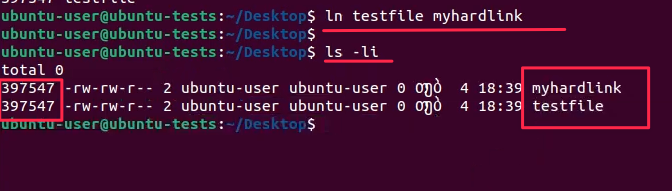
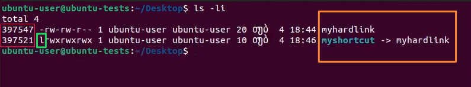
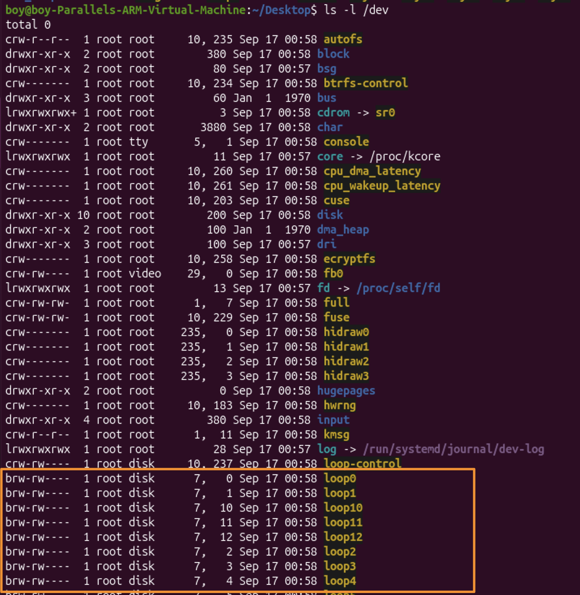
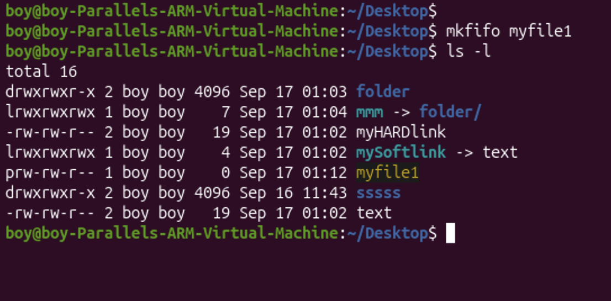
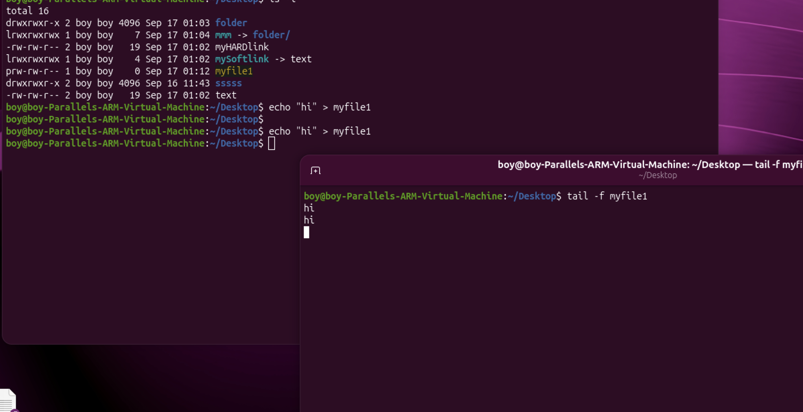
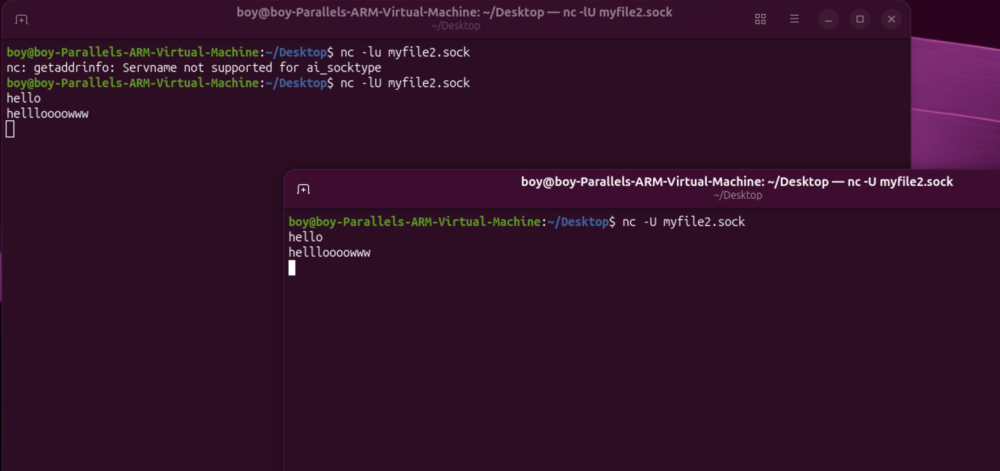

---
aliases:
  - Hard Link && Soft Link
  - inode
  - ინოდი
  - დისკრიპტორი
  - სოკეტები
  - ბლოკური ტიპები
  - sokets
  - დესკრიპტორი
  - იარლიყი ლინუქსში
  - ლინუხ იარლიყი
  - linux იარლიყი
tags:
  - linux
done: false
created: 2026-09-08
sourse:
---
# Linux ფაილების ტიპები (2)

[10:00 -  Часть 2 - YouTube](https://www.youtube.com/watch?v=5INZghkqzjA) 
[Linux ადმინისტრირება N4. ფაილების ტიპები - YouTube](https://www.youtube.com/watch?v=ZpYKgyVFiYw&list=PLbZtgfvYfOp2wzQoifSshcIxzajImRvsJ&index=4) 

**ფაილების ტიპები Linux-ში**

**Windows**-ის მომხმარებლები შეჩვეულნი არიან, რომ ფაილის ტიპს მისი გაფართოება (Extension) განსაზღვრავს. **Linux**-ში გაფართოება შეიძლება საერთოდ არ ჰქონდეს და ეს პრობლემა არ არის, რადგან ტიპი განსაზღვრავს თავად ფაილის არსს — იმას, თუ რა არის ის რეალურად (მონაცემთა ფაილი, კატალოგი თუ მოწყობილობა).
ლინუქსში „ყველაფერი ფაილია“ (**Everything is a file**). ოპერაციული სისტემა სხვადასხვა რესურსს, მოწყობილობასა და პროცესს ფაილების სახით მართავს.

მოცემულ სურათზე წარმოდგენილია ლინუქსის **7 ძირითადი ფაილის ტიპი**, რომელთაგან თითოეულს თავისი დანიშნულება და სპეციფიკა აქვს:

## 1. Regular (ჩვეულებრივი ფაილები)

* **აღწერა:** ყველაზე გავრცელებული ტიპი. შეიცავს მონაცემებს, ტექსტს, პროგრამის კოდს, სურათებს ან შესრულებელ ფაილებს.
* **მაგალითი:** `.txt`, `.sh`, სურათები და ა.შ.
* **გამოჩენა `ls -l` ბრძანებისას:** იწყება ტირათი (`-`).

### 1. Hard Link (მყარი ბმული) `ln`
[5:30 - 16:00. N4. ფაილების ტიპები - YouTube](https://www.youtube.com/watch?v=ZpYKgyVFiYw&list=PLbZtgfvYfOp2wzQoifSshcIxzajImRvsJ&index=9) 

* **შექმნა:** `ln original.txt hardlink.txt` - - - ანუ შეიქმნა ***original.txt*** ფაილის hard link-ი, სახლად ***hardlink.txt***.

```shell
ln <original_file> <hardlink_name>  - - -  შეიქმნა original_file-ის hardlink-ი
```

**Hard Link**-სა და **Soft Link**-ს (Symbolic Link) შორის ძირითადი განსხვავებები მდგომარეობს მათ არქიტექტურაში, იმუშაობის პრინციპსა და იმ ფაქტორში, თუ როგორ უკავშირდებიან ისინი ორიგინალ ფაილს.

* **როგორ მუშაობს:** მყარი ბმული არის ფაქტობრივად ორიგინალი ფაილის ზუსტი ასლი, რომელიც **იმავე Inode-ზე (index node / მონაცემთა ბლოკზე)** მიუთითებს დისკზე.  (ანუ **ორივე ფაილს შეიძლება სხვადასხვა სახელი ქონდეს, მაგრამ *შიგთავსი და inode ერთდაიგივე აქვს***.) ფაილურ სისტემაში ორივეს ერთნაირი პრიორიტეტი და მნიშვნელობა აქვს — რეალურად ორივე თავად ერთი ფაილია.
	* 
* **ორიგინალთან კავშირი:** ***თუ ორიგინალ ფაილს წაშლი, მყარი ბმულით შენახული მონაცემები სრულად ხელმისაწვდომი დარჩება***, სანამ სულ მცირე ერთი მყარი ბმული მაინც არსებობს.
* **hard link** ფაილს შეიძლება ქონდეს **ბევრი**.
* **ეს არ არის კოპირება**. კოპირებისას ფაილს უჩდება ცალკა, სხვა **inode**. 
* ***შეზღუდვები*:**
	* **არ შეიძლება დირექტორიებისთვის (Directories)** ჰარდ ლინკის შექმნა (ფაილური სისტემის ციკლების თავიდან ასაცილებლად).
	* მუშაობს **მხოლოდ ერთი და იმავე ფაილური სისტემის (Partition/Mount)** ფარგლებში — სხვა დისკზე ან დანაყოფზე გადატანა შეუძლებელია.

---
ფაილურ სისტემებში **inode** (index node) და ***დისკრიპტორი*** (უფრო ზუსტად, **ფაილის დისკრიპტორი** — _File Descriptor_, FD) ერთი და იგივე კონცეფცია არ არის, თუმცა ორივე ფაილების მართვას ეხება.

მათ შორის მთავარი განსხვავებები:

- **Inode (ინდექსური კვანძი):** არის სტრუქტურა დისკზე, რომელიც ინახავს ფაილის მეტამონაცემებს (უფლებებს, მფლობელს, ზომას, დროის შტამპებს და ფაილის მონაცემების ფიზიკურ მისამართებს დისკზე). თითოეულ ფაილს ან დირექტორიას თითქმის ყოველთვის აქვს საკუთარი inode.
- **ფაილის დისკრიპტორი (File Descriptor):** არის ოპერაციული სისტემის დონეზე არსებული მთელი რიცხვი (integer), რომელიც პროგრამისთვის წარმოადგენს უკვე გახსნილ ფაილს (ან სხვა I/O ნაკადს, მაგალითად სოკეტს). როდესაც პროგრამა კითხულობს ან წერს ფაილში, ის მიმართავს ფაილის დისკრიპტორს.

> [!NOTE] განსხვავება
> Inode ეხება ფაილის შენახვას და მის მეტამონაცემებს **დისკზე**, ხოლო ფაილის დისკრიპტორი ეხება უკვე გახსნილი ფაილის მართვას **ოპერატიულ მეხსიერებაში/პროცესში**.

### 2. Soft Link / Symbolic Link / Symlinks  ( სიმბოლური ბმული ) `ln -s`

**Soft Link** მსგავსია როგორც windows-ში **იარლიყები** ერთ გამონაკლისით. 

* **შექმნა:** `ln -s original.txt myshortcut` 
	* 
	* 
	* **როგორც სურათზე ჩანს**: ***დესკრიპტორი სხვადასხვა*** აქვთ;  ლინკი რომელიცაა იმას ბოლოში მითითებული აქვს რა ფაილს უკავშირდება(***მიუთითებს ორიგინალს***) ; და სიმბოლურ ლინკს ასევე უფლებების წინ დეფისის `-` მაგივრად აღვნიშნა აქვს - `L` ;

* **როგორ მუშაობს:** სიმბოლური ბმული არის ცალკეული ფაილი, რომელიც თავის მხრივ წარმოადგენს **ორიგინალი ფაილის გზის (Path) მაჩვენებელს** (იარლიყს). მას **თავისი ცალკე Inode აქვს**.
* **ორიგინალთან კავშირი:** თუ ორიგინალ ფაილს წაშლი ან გადაიტან სხვა ადგილას, სიმბოლური ბმული „***გაფუჭდება***“ (Broken Link) და აღარ იმუშავებს, რადგან ის ვეღარ მიაგნებს ორიგინალის მისამართს.
* **გამოჩენა `ls -l` ან ასევე  `ls -li` ბრძანებისას:** იწყება ასოთი `l`.
* ***უპირატესობები*:**
	* შეუძლია მიუთითოს **დირექტორიებზეც**.
	* მუშაობს **სხვადასხვა ფაილურ სისტემებსა და დანაყოფებს** შორისაც.


### შედარებითი ცხრილი

| მახასიათებელი                   | Hard Link                                           | Soft Link (Symlink)                          |
| ------------------------------- | --------------------------------------------------- | -------------------------------------------- |
| **რა არის რეალურად?**           | იგივე Inode-ზე მიმთითებელი სახელი                   | ცალკე ფაილი, რომელიც ორიგინალის გზას ინახავს |
| **ორიგინალის წაშლა**            | მონაცემები **ინახება** (სანამ სხვა ლინკიც არსებობს) | ბმული **ფუჭდება** (Broken link)              |
| **დირექტორიებზე მუშაობა**       | ❌ არა                                               | ✔️ კი                                        |
| **სხვადასხვა ფაილურ სისტემაზე** | ❌ არა                                               | ✔️ კი                                        |
| **ინოუდი (Inode)**              | იგივე, რაც ორიგინალს                                | სრულიად ახალი, საკუთარი Inode                |


## 2. Directory (დირექტორიები / ფოლდერები)

* **აღწერა:** ფაილი, რომელიც ინახავს სხვა ფაილებისა და დირექტორიების სიას (რუკას).
* **გამოჩენა `ls -l` ბრძანებისას:** იწყება ასოთი `d`.


## 3. Block Devices (ბლოკური მოწყობილობები)
[17:20 -  - YouTube](https://www.youtube.com/watch?v=ZpYKgyVFiYw&list=PLbZtgfvYfOp2wzQoifSshcIxzajImRvsJ&index=9) 

* **აღწერა:** ფიზიკური ან ვირტუალური მოწყობილობები, რომლებიც მონაცემებს ამუშავებენ და ინახავენ **ბლოკებად** (დიდი რაოდენობით ინფორმაცია ერთდროულად). ხშირად გამოიყენება მყარი დისკებისთვის.
* **მაგალითი:** მყარი დისკის დანაყოფები `/dev/sda`, `/dev/nvme0n1`.
* **გამოჩენა `ls -l` ბრძანებისას:** იწყება ასოთი `b`.
* 
* 

## 4. Character Devices files (სიმბოლური მოწყობილობები)

* **აღწერა:** მოწყობილობები, რომლებიც მონაცემებს ამუშავებენ **ნაკადის (stream) სახით** — სიმბოლო-სიმბოლოზე (ბაიტ-ბაიტზე).
* **მაგალითი:** კლავიატურა, მაუსი, ტერმინალები . ძირითადად ეს ფაილები არის დირექტორია : (`/dev/input`).
* **გამოჩენა `ls -l` ბრძანებისას:** იწყება ასოთი `c`.

## 5. Named Pipes / FIFO (დასახელებული არხები)

* **აღწერა:** გამოიყენება პროცესშორისი კომუნიკაციისთვის (IPC). ის საშუალებას აძლევს ორ სხვადასხვა პროცესს, რომ ერთმანეთს მონაცემები გადასცენ კონვეიერის (pipe) პრინციპით.
* **გამოჩენა `ls -l` ბრძანებისას:** იწყება ასოთი `p`.

.
ანუ ამ ფაილებში შემიძია თან ჩავწერო თან ეგრევე გამოიტანოს შედეგი : 

.

## 6. Sockets (სოკეტები)
ეს უკვე ორმხრივად მიმართლი ფაილები:  ( თუნდაც ჩატის ფუნქცია, როცა ერთი წერს, მეორეც ხედავს. )

`nc -lU myfile.sock` - - - შეიქმნა ფაილი ერთ ტერმინალშ. 
მეორე ტერმინალში ვწერ: - - - `nc -U myfile2.sock` ;
და ამის მერე რასაც ერთში წერ მეორეში ჩანს და პირიქით: 

.

* **აღწერა:** გამოიყენება ქსელური ან ადგილობრივი პროცესშორისი კომუნიკაციისთვის. განსხვავებით Named Pipe-ისგან, სოკეტებს შეუძლიათ მონაცემების გაცვლა სხვადასხვა კომპიუტერებს შორისაც (ქსელით) და ერთი მანქანის შიგნითაც (Unix Domain Sockets).
* **გამოჩენა `ls -l` ბრძანებისას:** იწყება ასოთი `s`.

ფაილის ტიპის შესამოწმებლად ყველაზე მარტივი გზაა ტერმინალში `ls -l` ბრძანების გამოყენება, სადაც თითოეული სტრიქონის პირველი სიმბოლო ზუსტად მიუთითებს ფაილის კატეგორიაზე (`-`, `d`, `l`, `b`, `c`, `p`, `s`).

## ფაილებისა და დესკრიპტორების მართვა (terminal)

* **`ls`** — მიმდინარე კატალოგის შიგთავსის ჩვენება. პარამეტრის მითითებით შესაძლებელია კონკრეტული გზის ნახვა (`ls /path/to/dir`, ხოლო ყველა პარამეტრის სანახავად გამოიყენება `ls --help`).
* **`ls -i`** — ფაილების **Inode** (**დესკრიპტორების**) ნომრების ჩვენება.
* **`ls -l`** — დეტალური ინფორმაცია ფაილების შესახებ (პირველ ხაზზე ჩანს დაკავებული ბლოკები, შემდეგ კი თითოეული ფაილის პარამეტრები).

**`ls -l` გამოყვანილი ველების სტრუქტურა:**

1. **ტიპი:** `-` (ჩვეულებრივი ფაილი), `d` (კატალოგი), `l` (სიმბოლური ბმული).
2. **უფლებები:** მფლობელი, ჯგუფი, დანარჩენები.
3. **მყარი ბმულების რაოდენობა** (ციფრი უფლებების შემდეგ).
4. **მფლობელი და ჯგუფი.**
5. **ზომა, ბოლო ცვლილების თარიღი და სახელი.**
