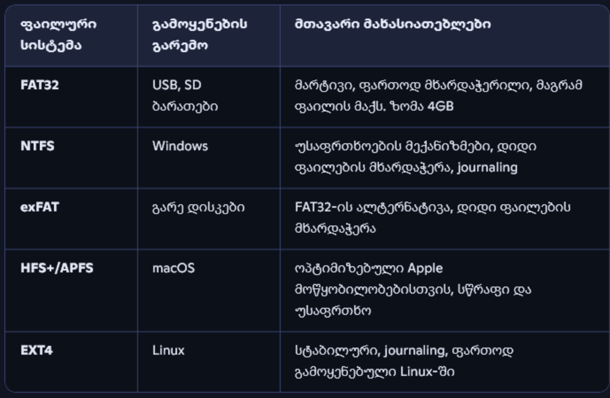

---
aliases:
  - fat32
  - ext4
  - ntfs
  - exfat
  - failuri sistemebi
tags:
  - linux
  - windows
done: false
created: 2026-09-08
sourse:
---
# Linux ფაილური სისტემა

[08:00 -  Часть 2 - YouTube](https://www.youtube.com/watch?v=5INZghkqzjA) 
[Linux ადმინისტრირება N3. 0:0 - 25:00 - YouTube](https://www.youtube.com/watch?v=EdAHXLrX3c8&list=PLbZtgfvYfOp2wzQoifSshcIxzajImRvsJ&index=3) 

**ფაილური სისტემის ძირითადი ცნება**
მიუხედავად იმისა, რომ ფაილურ სისტემას ხშირად უბრალოდ ფაილებისა და კატალოგების სტრუქტურას უწოდებენ, ეს განმარტება ბოლომდე სრული არ არის. 
ფაილები და კატალოგები ფიზიკურ მატარებელზე (მაგალითად, მყარ დისკზე — HDD) ინახება. თავისთავად, მყარი დისკები უბრალოდ აპარატურაა, რომელიც როგორც მეხსიერების მოწყობილობა რომ გამოვიყენოთ, მისი სივრცე საერთო წესით უნდა ორგანიზდეს. ზუსტად ამისთვის არსებობს ***ფაილური სისტემა***

> [!NOTE] ***ფაილური სისტემა***
> - ეს არის დისკური სივრცის(**მაგ. HDD, SSD, USB, CD/DVD**) გამოყენების წესების  ერთობლიობა, რომელიც განსაზღვრავს ინფორმაციის შენახვისა და მასზე წვდომის წესრიგს.
> - **ფაილური სისტემა - - - არის ის "წესები და სტრუქტურა", რომლის მიხედვითაც კომპიუტერი ხედავს და მართავს შენახულ მონაცემებს**.

### *ფაილური სისტემის არჩევანი: Windows vs Linux*

.
* **Windows:** მომხმარებელს არჩევანი არ აქვს, რადგან სისტემის დაყენება მხოლოდ **NTFS** ფაილურ სისტემაზეა შესაძლებელი.
* **Linux:** მომხმარებლებს აქვთ არჩევანის თავისუფლება. მიუხედავად იმისა, რომ უმეტეს შემთხვევაში ოპტიმალური არჩევანია **ext4**, არსებობს სხვა ვარიანტებიც.

### *Linux-ის ძირითადი ფაილური სისტემები*

* **ext (Extended File System / ext3 / ext4)**
	* **EXT (1992):** შეიქმნა 1992 წელს.
	* **EXT2 (1993):** გამოვიდა 1993 წელს, არ გააჩნია ჟურნალირება (journaling), მხარს უჭერს 2TB საცავს.
	* **EXT3 (2001):** გამოვიდა 2001 წელს, მთავარი სიახლე არის **ჟურნალირების მხარდაჭერა**.
	* **EXT4 (2008):** გამოვიდა 2008 წელს, მხარს უჭერს 1EB (Exabyte) მოცულობას, ერთი ფაილის მაქსიმალური ზომა არის 16TB, დამატებული აქვს ჟურნალირების ჩექსმი (checksum).
	* **ზოგადი მნიშვნელობა:** EXT (Extended File System) წარმოადგენს ლინუქსის (Linux) ძირითად და ტრადიციულ ფაილურ სისტემას.
	* Linux-ის სტანდარტული, ყველაზე სტაბილური და მრავალფუნქციური ფაილური სისტემა.
	* მე-3 ვერსიიდან მოყოლებული მხარს უჭერს **[ჟურნალირებას](Linux-ის%20ჟურნალირება%20და%20ლოგები%20ფაილურ%20სისტემებში.md)** ( Journaling).
	* წარმოადგენს უნივერსალურ და ყველაზე ოპტიმალურ არჩევანს შემთხვევების უმრავლესობაში.
	* **EXT4-ის დამატებითი შესაძლებლობები:** გარდა დიდი ზომისა და ჩექსმებისა, **EXT4** მხარს უჭერს ე.წ. *Extents* ტექნოლოგიას (რომელიც აუმჯობესებს დიდი ფაილების მუშაობას და ამცირებს ფრაგმენტაციას) და ფაილების სათავსოებში თარიღების ზუსტ მიკვლევას მილიწამების სიზუსტით.

* **JFS (Journaled File System)**
	* შემუშავებულია კომპანია IBM-ის მიერ, როგორც ext-ის ალტერნატივა.
	* მთავარი აქცენტი გადატანილია სტაბილურობასა და რესურსების მინიმალურ მოხმარებაზე.
	* არის ჟურნალირებადი, თუმცა ინახავს მხოლოდ ფაილების მეტამონაცემებს.

* **ReiserFS**
	* კიდევ ერთი მცდელობა ext-ის ალტერნატივის შესაქმნელად.
	* ითვლება უფრო წარმადვად, თუმცა ვრცელდება მოსაზრებები, რომ მას სტაბილურობასთან დაკავშირებით პრობლემები აქვს.

* **Btrfs (B-tree File System)**
	* შედარებით ახალი ფაილური სისტემა.
	* შემუშავებულია კომპანია Oracle-ის მიერ.
	* **უპირატესობები:** ადმინისტრირების სიმარტივე, მონაცემების აღდგენა, უკეთესი წარმადობა **ext4**-თან შედარებით, დანაყოფების „ფრენაზე“ შეცვლა (on-the-fly resizing) და მყისიერი სნეპშოტების შექმნა.
	* **კოპირება მუშაობისას (Copy-on-Write / CoW):** BTRFS იყენებს CoW პრინციპს, რაც ნიშნავს, რომ მონაცემების შეცვლისას თავიდან იქმნება ახალი ასლი და ძველი მხოლოდ მაშინ იშლება, როცა ახალი წარმატებით ჩაიწერება. ეს უზრუნველყოფს მონაცემთა უსაფრთხოებას.
	* **Snapshot-ები (ასლის მყისიერი აღება):** მხარს უჭერს მყისიერ და მსუბუქ სნეფშოტებს (snapshots), რაც საშუალებას გაძლევს მარტივად აღადგინო სისტემის ან ფაილების წინა მდგომარეობა.
	* სტაბილურობაზე აზრები იყოფა; გამოიყენება როგორც ნაგულისხმევი ფაილური სისტემა openSUSE დისტრიბუციაში.

## *ასევე:*
- **FAT / FAT32 / exFAT**
	* შექმნილია Microsoft-ის მიერ.
	* ძირითადი მახასიათებლები: არ გააჩნია ჟურნალირება, თავსებადია ოპერაციული სისტემების უმეტესობასთან (cross-OS), ფართოდ გამოიყენება **USB** მეხსიერების ბარათებსა და საცავებში.
	* **FAT32-ის მთავარი შეზღუდვა:** მიუხედავად უნივერსალური თავსებადობისა, FAT32 ვერ იწერს ფაილს, რომლის ზომა აღემატება **4 გიგაბაიტს (4GB)**, რაც თანამედროვე მაღალი ხარისხის ვიდეოებისა და დიდი ზომის თამაშებისთვის სერიოზული შეზღუდვაა. ამის გამოსასწორებლად შეიქმნა exFAT, რომელსაც აღარ აქვს ეს ლიმიტი.
	* **exFAT:** მორგებულია დიდი ზომის ფაილებსა და მეხსიერების ბარათებზე.

- **Swap**
	* სურათზე ბოლო ხაზზე მითითებულია როგორც დაუმთავრებელი ჩანაწერი (Swap ->), რომელიც Linux სისტემებში გამოიყენება ოპერატიული მეხსიერების (**RAM**) დატვირთვის შესამსუბუქებლად და ვირტუალური მეხსიერების გამოსაყენებლად.
	* **დანიშნულება:** Swap არ არის „კლასიკური“ ფაილური სისტემა ფაილების შესანახად. ის გამოიყენება როგორც ვირტუალური მეხსიერების სივრცე მყარ დისკზე ან SSD-ზე. როდესაც კომპიუტერს ოპერატიული მეხსიერება (RAM) ეწურება, ლინუქსი ნაკლებად აქტიურ პროცესებს დროებით Swap სივრცეში ათავსებს, რათა სისტემამ მუშაობა არ შეწყვიტოს.

- **NTFS (New Technology File System)** არის Microsoft-ის მიერ შემუშავებული თანამედროვე, საწარმოო დონის (Enterprise) ფაილური სისტემა, რომელიც პირველად წარმოდგენილი იქნა 1993 წელს Windows NT 3.1 ოპერაციულ სისტემასთან ერთად და დღემდე წარმოადგენს Windows-ის სტანდარტულ ძირითად ფაილურ სისტემას. 
	- ***ძირითადი მახასიათებლები:***
		- **ჟურნალირება (Journaling):** გააჩნია ჟურნალირების ფუნქცია (トランዛქციების ჟურნალი), რაც ნიშნავს, რომ სისტემის მოულოდნელი გათიშვის ან ავარიული გამორთვის შემთხვევაში, ფაილური სისტემა ავტომატურად აღადგენს მთლიანობას და თავიდან აიცილებს მონაცემთა კორუფციას.
		- **ფაილებისა და დანაყოფების ზომის ლიმიტები:** თეორიულად მხარს უჭერს უზარმაზარ მოცულობებს — ერთი ფაილის მაქსიმალური ზომა შეიძლება იყოს 8 Petabyte (პრაქტიკულად ლიმიტირებულია Windows-ის მიერ 16 TB-მდე ან მეტით), ხოლო დანაყოფის მაქსიმალური ზომაც ასევე პეტაბაიტების მასშტაბისაა.
		- **უსაფრთხოება და უფლებები (ACLs):** მხარს უჭერს ფაილებისა და საქაღალდეების წვდომის მკაცრ კონტროლს (Access Control Lists). შესაძლებელია კონკრეტული მომხმარებლებისთვის ან ჯგუფებისთვის წაკითხვის, ჩაწერის და შესრულების უფლებების ზუსტი მინიჭება.
		- **მონაცემთა დაშიფვრა (EFS):** გააჩნია ჩაშენებული Encrypting File System ტექნოლოგია, რომელიც საშუალებას აძლევს მომხმარებელს დაშიფროს ცალკეული ფაილები ან საქაღალდეები უსაფრთხოების მიზნით.
		- **შეკუმშვა (Compression):** შეუძლია ფაილებისა და საქაღალდეების რეალურ დროში შეკუმშვა დისკზე სივრცის დაზოგვის მიზნით.
		- **Hard Links და Symlinks:** მხარს უჭერს სიმბოლურ ბმულებსა და მყარ ბმულებს ფაილების მართვის გასარტივებლად.
	- ***თავსებადობა***:
		- **Windows:** სრულად მხარდაჭერილია (კითხვის და ჩაწერის სრული შესაძლებლობა) ყველა თანამედროვე და ძველ Windows სისტემაში.
		- **macOS:** ნაგულისხმევ რეჟიმში macOS-ს შეუძლია NTFS ფორმატის დისკების **მხოლოდ წაკითხვა** (Read-Only). ჩაწერისთვის ან სრული მხარდაჭერისთვის საჭიროა მესამე მხარის დამატებითი პროგრამების გამოყენება (მაგალითად, Paragon, Tuxera და ა.შ.).
		- **Linux:** თანამედროვე ლინუქს დისტრიბუტივებს `ntfs3` დრაივერის წყალობით აქვთ როგორც წაკითხვის, ისე ჩაწერის მხარდაჭერა.

### 📂 ფაილური სისტემის ძირითადი ფუნქციები

- **ფაილების ორგანიზება** – მონაცემები ინახება ფაილებში, რომლებიც შეიძლება გაერთიანდეს საქაღალდეებში (დირექტორიებში).
- **მისამართების მართვა** – სისტემა იცის სად მდებარეობს თითოეული ფაილი დისკზე.
- **წვდომის კონტროლი** – განსაზღვრავს ვინ და როგორ შეიძლება წაიკითხოს/ჩაწეროს ფაილი.
- **თავისუფალი სივრცის მართვა** – აკონტროლებს დისკზე თავისუფალ და დაკავებულ ადგილს.
- **მეტამონაცემები** – ინახავს ინფორმაციას ფაილის შესახებ (სახელი, ზომა, შექმნის თარიღი, უფლებები).

### ⚖️ რატომ არის მნიშვნელოვანი

- **უსაფრთხოება** – ფაილური სისტემა განსაზღვრავს წვდომის უფლებებს.
- **ეფექტურობა** – სწორად შერჩეული სისტემა უკეთესად იყენებს დისკის სივრცეს.
- **კომპატიბილურობა** – სხვადასხვა ოპერაციული სისტემები სხვადასხვა ფაილურ სისტემას იყენებენ, ამიტომ გარე დისკის არჩევისას მნიშვნელოვანია შესაბამისობა.

**სპეციალური და ვირტუალური ფაილური სისტემები**
არსებობს სპეციალური და ვირტუალური ფაილური სისტემებიც, თუმცა ამ ეტაპზე მათი განხილვა საჭირო არ არის. მათ აზრს მაშინ დავუბრუნდებით, როდესაც რეალური საჭიროება გაჩნდება.