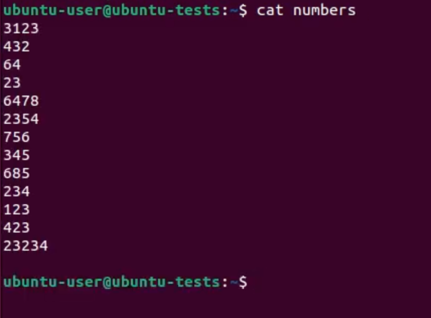
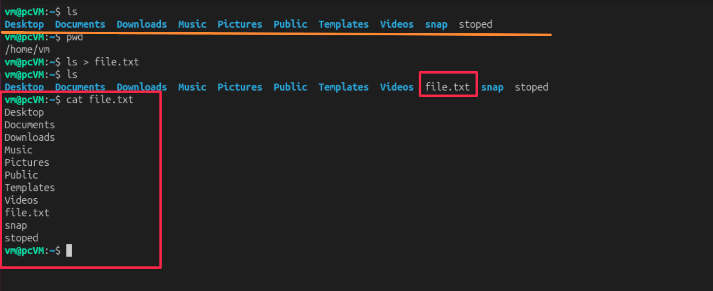
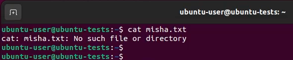
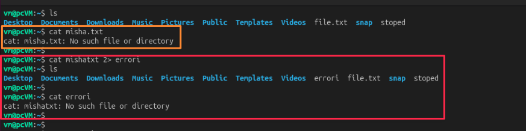

---
aliases:
  - Redirection
  - გადამისამართების ოპერატორები
  - STDIN
  - STDOUT
  - STDERR
  - ">"
  - ">>"
  - "|"
tags:
  - linux
done: false
created: 2026-09-17
sourse:
---
# დესკრიპტორები და გადამისამართება

[Linux ადმინისტრირება N7. ფაილური დესკრიპტორები. გადამისამართების ოპერატორები - YouTube](https://www.youtube.com/watch?v=NJF7VE_C4AI&list=PLbZtgfvYfOp2wzQoifSshcIxzajImRvsJ&index=7) 

- ***ფაილის დესკრიპტორი*** (*File Descriptor* - FD) წარმოადგენს **მთელ რიცხვს** (*integer*), რომელსაც
- **ოპერაციული სისტემა იყენებს**  - - ღია ფაილების, შეყვანა-გამოყვანის (**I/O**) ნაკადების, ქსელური სოკეტების და სხვა პერიფერიული ***მოწყობილობების იდენტიფიცირებისთვის და სამართავად***.

> როდესაც პროგრამა ხსნის ან ქმნის ფაილს, კარნელი (*kernel*) აბრუნებს ფაილის დესკრიპტორს. ამის შემდეგ ყველა ოპერაცია (წაკითხვა, ჩაწერა, დახურვა) ხორციელდება ამ ნომრის გამოყენებით და არა თავად ფაილის სახელით.

### მთავარი (სტანდარტული) დესკრიპტორები

ნებისმიერი ახლად გაშვებული პროცესისთვის ლინუქსში ავტომატურად იხსნება **სამი სტანდარტული დესკრიპტორი**:

| დესკრიპტორის ნომერი | სახელი                     | მახასიათებელი         | ნაგულისხმები მოწყობილობა |
| ------------------- | -------------------------- | --------------------- | ------------------------ |
| **0**               | `STDIN` (Standard Input)   | სტანდარტული შეყვანა   | კლავიატურა               |
| **1**               | `STDOUT` (Standard Output) | სტანდარტული გამოყვანა | ეკრანი (ტერმინალი)       |
| **2**               | `STDERR` (Standard Error)  | შეცდომების გამოყვანა  | ეკრანი (ტერმინალი)       |
### როგორ მუშაობს ის პრაქტიკაში?

1. **აბსტრაქცია:** პროცესისთვის სულ ერთია, ფაილთან მუშაობს, დისკთან, ქსელურ სოკეტთან თუ ტერმინალთან — მისთვის ყველაფერი დესკრიპტორია (*"Everything is a file"*).
2. **ცხრილები (Tables):** თითოეულ პროცესს აქვს საკუთარი **ფაილის დესკრიპტორების ცხრილი** სისტემურ მეხსიერებაში.
3. **ლიმიტები:** სისტემაში დაწესებულია შეზღუდვები იმის შესახებ, თუ ერთდროულად რამდენი დესკრიპტორი შეიძლება ჰქონდეს ღია თითოეულ პროცესს ან მთლიანად სისტემას (შეიძლება შემოწმდეს ბრძანებით `ulimit -n`).

### *გადამისამართების ოპერატორები - Redirection* 

როდესაც ბრძანებაში ვიყენებთ სიმბოლოებს  `|` ან`>` ან `>>`, `2>`  ჩვენ ფაქტობრივად ***ვმართავთ დესკრიპტორებს***:

#### 1. `|` ( pipe )

`|` (***pipe***) - - - მისი დახმარებით შეგვიძლია **რამდენიმე ბრძანება გავაერთანოთ**. 

**მაგალითი 1**: 
```shell
Ls - l /etc | less
```

`Is - l /etc` -ით გამოვიძახეთ ბრძანება და ამასთან ერთად გავაერთიანეთ ბრძანება `less` 

**მაგალითი 2**:  

შევქმენით რამე ტექსტური ფაილი **numbers** და შიგნით სხვადასხვა რიცხვები ჩანწერეთ. 
`cat numbers` - ასე უბრალოდ ყველაფერს გამომიტენს ეკრანზე. 


მაგალითად გვინდა გამოვიტანოთ ამ ფაილის დასორტირებული პირველი 3 რიცხვი : 

```shell
cat numbers | sort | head -3
```

გადავეცით ბრძანება **cat**, მერე **pipe**-ით  ვუთხარით დამილაგეთქო და მერე კიდევ `head -3`-ით გამოიტანე პირველი 3 -თქო. 

> ამ პრინციპით ხდება **pipe** -ის გამოყენება, ვაერთიანებთ რამოდენიმე ბრძანებას ერთმანეთშ. 


#### 2. `>` ( create, override ) 

`>` ( **create, override** ) - - - ნიშნავს, რომ სტანდარტული გამოყვანა (`1>` — **STDOUT**, უბრალოდ არ იწერება მაგრამ იგულიხმება) გადამისამართდა ფაილში.
```shell
ls -l ./ > file.txt
```

მიმდინარე საქაღალდის( `ls -l ./` ) შიგთავში შევიტანე **file.txt**-ში. ( რომელიც არ არსებობდა და თან შეიქმნა, **file.txt** რომ არსებულიყო - -  **შიგთავს გადააწერდა**. )




#### 3. `>>` ( **create**, **append** )

`>>` ( **create**, **append** ) - - - იგივე რაც წინა , განსხვავებით ***append***(არსებულს დაამატებს, ძველს არ წაშლის) ფუნქციისა. 


#### 4. `2>` ( error )

`2>` (***error***) - - - შეცდომების ნაკადი (`2>` — **STDERR**) იწერება ცალკე  ფაილში.

დავუშვათ რამე შეცდომა დავწერეთ და გამოიტანს **error**-ს: 

.
გვინდა რომ მაგალითად ეს შეცდომა სადმე ფაილში შევინახოთ და მერე ვიღაცას მიაწოდო ან რამე მსგავსი. 
ამისათვის უნდა გამოიყენო error-ის სწორი გადამისამართბა: 

```shell
cat misha.txt 2>  errori
```

**error**-ის სტანდარტულმა **დესკრიპტორმა** დაამუშავოს და ჩააგდოს ეს შეცდომა "**errori**" ფაილში( რომელიც არიყო და შეიქმნა ). 

.
ანუ შევქმენით ფაილი **errori** , რომელშიც შევიტანეთ "cat misha.txt"-ის გამოტანილი შეცდომის შეტყობინება.  


#### /dev/null დირექტორია...

სიტუაცია როცა ეკრანზე შეცდომის გამოტანა არ გვაწყობს, არ გვინდა რადგან შეიძლება ძალიან დიდიც იყოს და ტერმინალი გაავსოს.  ( თუ არაა შეცდომა  თავის საქმეს გააკეთებს ბრძანება... ) 

შეიძება შემდეგი რამ: 
```shell
cat misha 2> /dev/null
```
 ანუ ვუთხარით:
 > წაიკითხე "**misha**" ფაილი (რომელიც არამაქვს),  და თუ მოხდა **error**-ი, გადაამისამართე  **/dev/null** მისამართზე. 

**/dev/null** -- მისამართს ხშირად უწოდებენ "***შავ ხვრელს***".  - - -  მასში რასაც გადაისვრი, ისე ქრება რომ ვერ აღადგენ. 

