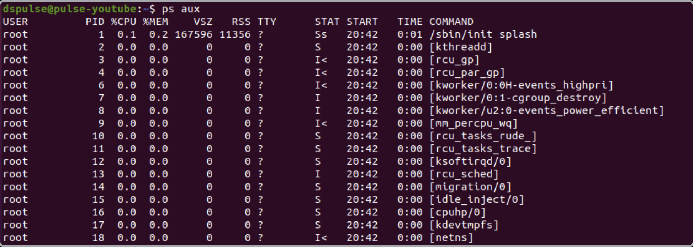

---
aliases:
  - პრეცესები
  - პროცესები process
tags:
  - linux
done: false
created: 2026-09-10
sourse:
---
# Linux Process

[Основы Linux. Управление процессами. Часть 1 - YouTube](https://www.youtube.com/watch?v=0-wFMegmw2U) 

***პროცესი*** ლინუქსში ( **Linux Process** ) - - -  არის გაშვებული პროგრამა, რომელიც იმყოფება შესრულების სტადიაში. როდესაც თქვენ უშვებთ რაიმე ბრძანებას ან აპლიკაციას, ოპერაციული სისტემა მეხსიერებაში ტვირთავს მის კოდს, გამოუყოფს საჭირო რესურსებს და ქმნის პროცესს.
**ყველა პროცესს** ლინუქსში აქვს თავისი **უნიკალური საიდენტიფიკაციო ნომერი**, რომელსაც ეწოდება ***PID (Process ID).***
## პროცესების ძირითადი მახასიათებლები

* **PID (Process ID):** უნიკალური ციფრული იდენტიფიკატორი, რომელსაც სისტემა ანიჭებს თითოეულ პროცესს.
* **PPID (Parent Process ID**): მშობელი პროცესის ID. ლინუქსში თითქმის ყველა პროცესს ჰყავს თავისი შემქმნელი (მშობელი) პროცესი.
	* მშობელი და შვილი პროცესები: სისტემის ჩატვირთვისას პირველად იშვება პროცესი **systemd** (ან ძველ ვერსიებში **init**), რომლის **PID** არის **1**. ყველა დანარჩენი პროცესი იქმნება მისი ან მისი "შვილების" მიერ.
* **UID (User ID):** პროცესის შემქმნელი მომხმარებლის იდენტიფიკატორი. პროცესის ატრიბუტების შეცვლა შეუძლია მხოლოდ მფლობელს ან `root`-ს.
* **GID (Group ID):** იმ ჯგუფის იდენტიფიკატორი, რომელსაც ეკუთვნის პროცესის მფლობელი.

## **პროგრამა, პროცესი და ბრძანება**

* **პროგრამის ფაილი:** სანამ პროგრამა გაშვებული არ არის, ის ჩვეულებრივი ფაილია, რომელიც სხვებისგან განსხვავდება აღსრულების ბიტით (`x`).
* **პროცესი:** როგორც კი ფაილი გაშვებულია, ის იქცევა **ბირთვის** კონტროლირებად პროცესად.
* **ბრძანება:** ტერმინალში ბრძანების შეყვანა ნიშნავს შესაბამისი პროგრამის გაშვებას და ახალი პროცესის გენერაციას.

## პროგრამების გაშვების მეთოდები

* **სახელით:** თუ პროგრამა მდებარეობს **`PATH`**  [გარემოს ცვლადში](🟡%20PATH%20გარემო%20ცვლადი%20(Environment%20Variable).md)  მითითებულ დირექტორიებში (სადაც ოპერაციული სისტემა ეძებს შესასრულებელ ფაილებს), საკმარისია მხოლოდ სახელის ჩწერა.
* **სრული გზით:** თუ პროგრამა `PATH`-ში არ არის, საჭიროა სრული მისამართის მითითება.
* **მიმდინარე დირექტორიიდან (`./`):** მიმდინარე საქაღალდეში არსებული ფაილის გასაშვებად გამოიყენება წერტილი და სლეში. ( მაგ: **./script.sh** )

## ძირითადი ბრძანებები პროცესების სამართავად:
[Процессы Linux. Управление процессами. Часть 1: Мониторинг - Подвальчик Хакера](https://hacker-basement.com/2021/11/26/processi-linux-upravlenie-processami-part1/)  - - - **საიტი**
## 1. პროცესების ნახვა და ძიება (`ps` ბრძანება)

ლინუქსში პროცესების სანახავად ძირითადი და საწყისი ინსტრუმენტი არის `ps` ბრძანება. ის აკეთებს სისტემის მიმდინარე მდგომარეობის ერთგვარ «ფოტოს» (სნეფშოტს) გაშვების მომენტისთვის.
[Основы Linux. Управление процессами. Часть 1 - YouTube](https://www.youtube.com/watch?v=0-wFMegmw2U) 

* **`ps`** (პარამეტრების გარეშე) — აჩვენებს მხოლოდ თქვენს საკუთარ პროცესებს (ხშირად არ არის საკმარისი).
* **`ps aux`** — ყველაზე გავრცელებული და პრაქტიკული ვარიანტი ყოველდღიური ამოცანებისთვის:
	* **`a`** — აჩვენებს ყველა მომხმარებლის პროცესს.
	* **`u`** — აჩვენებს დეტალურ ინფორმაციას მომხმარებლის მიხედვით (ფილტრაცია).
	* **`x`** — აჩვენებს პროცესებს, რომლებიც არ არიან დაკავშირებული მიმდინარე ტერმინალთან.
* **kill** [PID] — პროცესის იძულებითი შეწყვეტა მისი ID-ის მიხედვით.
* **bg** და **fg** — პროცესის გადაყვანა ფონურ (Background) ან წინა პლანზე (Foreground) რეჟიმში.

### ცხრილის სვეტების განმარტება (`ps aux` გამომავალი):

* **USER** — პროცესის მფლობელი მომხმარებელი.
* **PID** — პროცესის უნიკალური საიდენტიფიკაციო ნომერი (Process ID).
* **%CPU** — პროცესორის დროის წილის პროცენტი, რასაც პროცესი მოიხმარს.
* **%MEM** — ოპერატიული მეხსიერების (RAM) პროცენტული წილი.
* **VSZ** — ვირტუალური მეხსიერების ზომა.
* **RSS** — რეალურად დაკავებული ფიზიკური მეხსიერების რაოდენობა.
* **TTY** — მართვის ტერმინალის ნომერი.
* **STAT** — პროცესის მიმდინარე სტატუსი **მაგ**:
	* R : процесс выполняется в данный момент;  
	* S : процесс ожидает (т.е. спит менее 20 секунд);  
	* I : процесс бездействует (т.е. спит больше 20 секунд);  
	* Z : zombie, то есть завершившийся процесс, код возврата которого пока не считан родителем;  
	* T : процесс остановлен;  
	* D : ожидает записи на диск;  
	* < : процесс в приоритетном режиме;  
	* N : процесс в режиме низкого приоритета;  
	* L : real-time процесс, имеются страницы, заблокированные в памяти;  
	* s : лидер сессии.
* **START** — პროცესის გაშვების დრო.
* **TIME** — პროცესორის ჯამური დახარჯული დრო.
* **COMMAND** — ბრძანება, რომლითაც პროცესი გაეშვა (კვადრატულ ფრჩხილებში `[...]` მითითებული პროცესები არის ბირთვის ნაკადები - kernel threads).

### პროცესების სტატუსები (States)
მუშაობის პროცესში პროგრამამ შეიძლება შეიცვალოს მდგომარეობა: (**STAT** -ის მნიშვნელობები)

* **Running / Runnable (R):** პროცესი ამჟამად სრულდება ან მზად არის შესასრულებლად CPU-ს მიერ.
* **Sleeping (S / D):** პროცესი ელოდება რაიმე მოვლენას (მაგალითად, ფაილის წაკითხვას ან მომხმარებლის მიერ ღილაკზე დაჭერას). S არის შეწყვეტადი (Interruptible), ხოლო D — შეუწყვეტადი (Uninterruptible).
* **Stopped (T):** პროცესის მუშაობა შეჩერებულია (მაგალითად, მომხმარებლის მიერ Ctrl+Z-ის დაჭერით).
* **Zombie (Z):** პროცესი დასრულდა, მაგრამ მისმა მშობელმა პროცესმა ჯერ კიდევ არ წაიკითხა მისი დასრულების სტატუსი, რის გამოც ის დროებით რჩება პროცესების სიაში.

## 2. პროცესების იერარქია და დამატებითი ძიება

* **`psf` / პროცესების ხე (`ps3`):** რადგან ერთი პროცესი შობს მეორეს, იქმნება მშობელი (parent) და შვილობილი (child) პროცესების იერარქია (ხე). მთელი ამ სტრუქტურის ვიზუალიზაციისთვის გამოიყენება ბრძანება `ps3`.
* **კონკრეტული პროცესის ძებნა (`grep`-ით):** კონკრეტული პროცესის მოსაძებნად გამოიყენება `ps`-სა და `grep`-ის კომბინაცია (მაგალითად: `ps aux | grep სახელი`).
* **`pgrep`:** სპეციალური უტილიტა, რომელიც პირდაპირ აბრუნებს კონკრეტული პროცესის **PID**-ს.
* **`fuser`:** აჩვენებს, თუ რომელი პროცესები იყენებენ კონკრეტულ ფაილს ან დირექტორიას (მაგ: `fuser /home/user`).

## 3. პროცესების რეალურ დროში მონიტორიнгი

რადგან `ps` ბრძანება მხოლოდ ერთჯერად სნეფშოტს აკეთებს და სისტემაში სიტუაცია მუდმივად იცვლება, რეალური დროის მონიტორინგისთვის გამოიყენება სპეციალური უტილიტები:

### ა. `top` ბრძანება (საბაზისო მონიტორი)

* **ფუნქცია:** აჩვენებს რესურსების ზოგად მოხმარებას და აქტიურ პროცესებს სიის სახით (ყველაზე აქტიურები ზემოთაა).
* **განახლების სიხშირე:** სტანდარტულად ახლდება ყოველ 3 წამში (შეიძლება შეიცვალოს ღილაკით **`d`**).
* **ინტერფეისის მართვა:**
* სვეტების შესაცვლელად დააჭირეთ **`f`**.
* პროცესის მოსაკლავად/ჩასახშობად დააჭირეთ **`k`**, შეიყვანეთ **PID** და მიუთითეთ სიგნალი (ძირითად შემთხვევაში იგზავნება **სიგნალი 15**, ხოლო თუ პროცესი არ ითიშება — მკაცრი **სიგნალი 9**).

### ბ. `htop` ბრძანება (უფრო მოხერხებული და ვიზუალური)

* ბევრად უფრო მოსახერხებელი და ლამაზი ალტერნატივა, რომელიც მოითხოვს წინასწარ ინსტალაციას.
* პარამეტრების და ცხრილების მართვა ხდება მაუსით ან ღილაკით **`f2`**.

### გ. `gnome-system-monitor` (გრაფიკული ინტერფეისი)

* სისტემის მონიტორინგი გრაფიკული ინტერფეისით (მუშაობს დესკტოპ გარემოში). შესაძლებელია აქტიური პროცესების ნახვა, რესურსების გრაფიკების თვალყურის დევნება და გახსნილი ფაილების ძებნა.
* შეიძლება არიყოს და ინსტალაცია დაჭირდეს თავიდან: `sudo apt install gnome-system-monitor`
