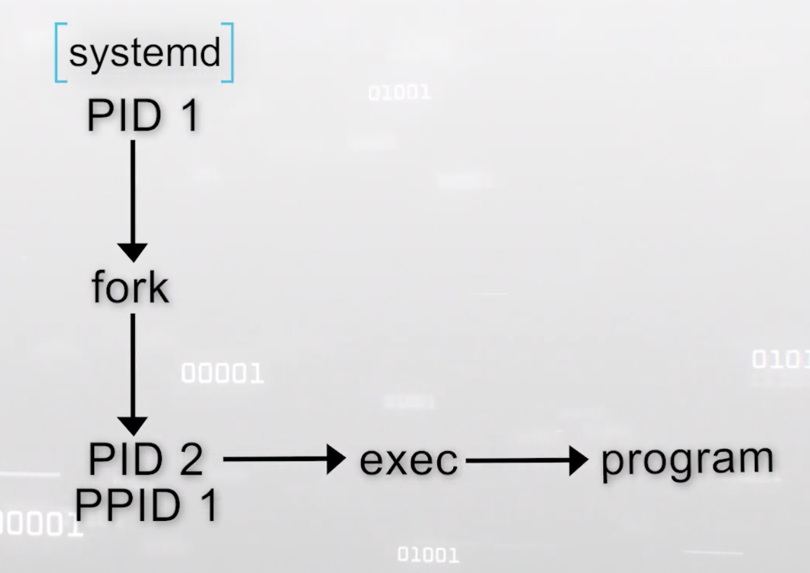
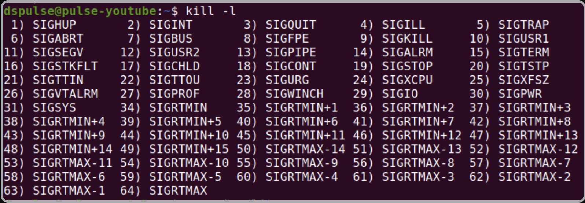
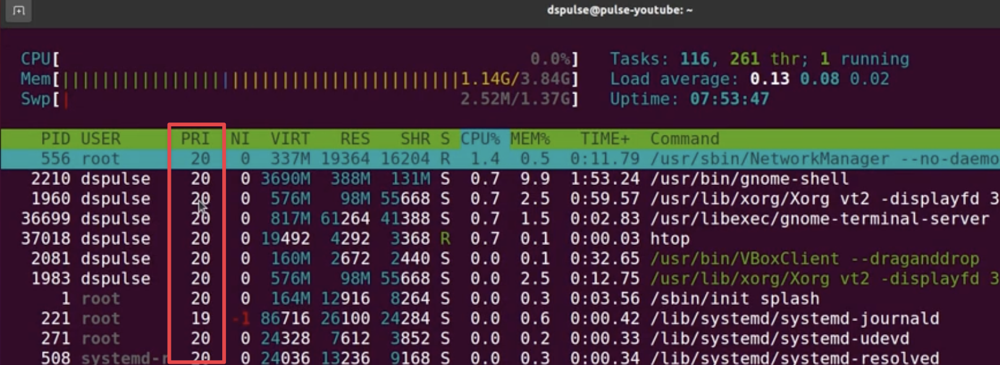
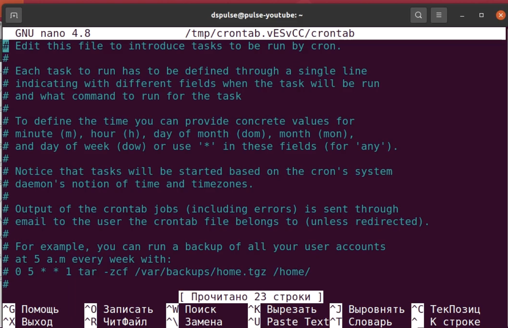
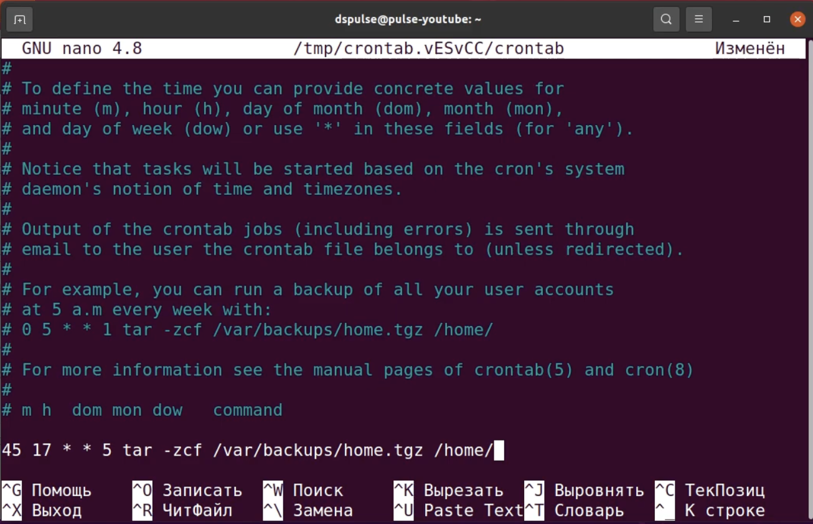
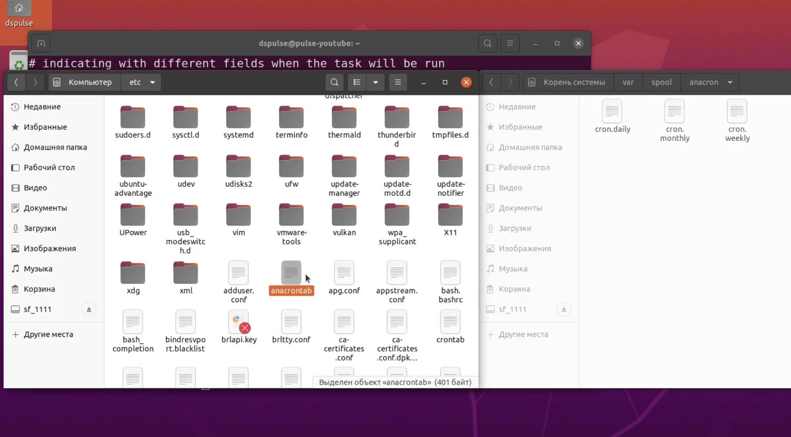

---
aliases:
  - პროცესები process
tags:
  - linux
done: false
created: 2026-09-15
sourse:
---
# Linux process management( მართვა )

- [Основы Linux. Управление процессами. Часть 2: Администрирование - YouTube](https://www.youtube.com/watch?v=s478aa-k6nQ&t=292s)
- [Процессы Linux. Управление процессами. Часть 2: Администрирование - Подвальчик Хакера](https://hacker-basement.com/2021/12/28/processi-linux-upravlenie-processami-part2/) - - - **ტექსტური საიტი** 

## 1. შესავალი პროცესებში და სისტემის ჩატვირთვაში 

სისტემის ჩატვირთვისას **ბირთვი (Kernel)** დამოუკიდებლად უშვებს ზოგიერთ პროცესს. საკვანძო პროცესი არის დემონი **systemd** ( მაგრამ არ დაივიწყო, რომ ზოგიერთ დისტრიბუციაში მისი პროცესია **init** და მისი **ID** ყოველთვის არის **1** ). ყველა სხვა პროცესი, გარდა ბირთვის მიერ შექმნილისა, მისი შთამომავალია.

იმისათვის, რომ ახალი პროცესი გაჩნდეს, არსებული პროცესი ქმნის საკუთარ კლონს სისტემური გამოძახების **`fork`** გამოყენებით. **შვილობილი** პროცესი **მშობლისგან** მხოლოდ იმით განსხვავდება, რომ აქვს საკუთარი პროცესის **ID (PID)** და მისთვის ცალკე აღირიცხება მოხმარებული რესურსები. მას შემდეგ, რაც `fork` იმუშავებს, შვილობილი პროცესი სისტემური გამოძახების **`exec`** გამოყენებით უშვებს ახალ პროგრამას.

იმისათვის, რომ პროცესი დასრულდეს, მან უნდა გამოიძახოს ფუნქცია **`exit`**, რათა აცნობოს ბირთვს მუშაობის შეწყვეტის მზაობის შესახებ. ფუნქცია `exit` გადასცემს დასრულების კודს (ეს არის რიცხვი, რომელიც ნიშნავს პროცესის შეწყვეტის მიზეზს). თუ ეს რიცხვი არის **0**, ე.ი. პროცესი წარმატებით დასრულდა. მაგრამ სანამ პროცესი ბოლომდე დასრულდება, მისი დასრულება უნდა დაადასტუროს მშობელმა პროცემს. ის ამას აკეთებს სისტემური გამოძახების **`wait`** გამოყენებით.

ხოლო თუ უეცრად მშობელი პროცესი უფრო ადრე დასრულდება, ვიდრე შვილობილი, მაშინ ისინი გადამისამართდებიან **`systemd`** დემონთან და ის გახდება მათთვის მშობელი. 


* **ძირითადი კონცეფცია:** სისტემის ჩატვირთვისას ბირთვი (Kernel) დამოუკიდებლად უშვებს საკვანძო პროცესს — **systemd** დემონს (ზოგიერთ ძველ დისტრიბუციაში ეს არის **init**, რომლის **PID** ყოველთვის არის **1**).
* **შთამომავალი პროცესები:** ყველა სხვა პროცესი ბირთვის მიერ შექმნილის შთამომავალია.
* **პროცესის შექმნა და დასრულება:**
* **`fork`:** არსებული **პროცესი** ქმნის საკუთარ კლონს (შვილობილი პროცესი იღებს საკუთარ PID-ს და ცალკე აღირიცხება მისი რესურსები).
* **`exec`:** სისტემური **გამოძახება**, რომლითაც შვილობილი პროცესი ახალ პროგრამას უშვებს.
* **`exit`:** ფუნქცია, რომლითაც პროცესი აცნობებს ბირთვს დასრულების მზაობის შესახებ (გადაცემული კოდი `0` ნიშნავს წარმატებულ დასრულებას).
* **`wait`:** მშობელი პროცესი ადასტურებს შვილობილის დასრულებას. თუ მშობელი უფრო ადრე დასრულდება, პროცესებს მშობლად **systemd** გადაეცემა.

## 2. პროცესების კომუნიკაცია და სიგნალები

* **სიგნალების არსი:** სიგნალები წარმოადგენს კომუნიკაციის საშუალებას პროცესებს, ბირთვსა და მომხმარებელს შორის.
* **სიგნალების სია:** ყველა სიგნალის სანახავად ტერმინალში გამოიყენება ბრძანება **`kill`**. 

იმისათვის, რომ გავიგოთ, როგორ, პირობითად რომ ვთქვათ, „ესაუბრებიან“ ერთმანეთს პროცესები, უნდა ვიცოდეთ, რომ არსებობს სიგნალები. 
არსით, **სიგნალები** კომუნიკაციის საშუალებაა. **სიგნალების გაგზავნა** შეუძლიათ როგორც თვითონ პროცესებს, ასევე ბირთვს და მომხმარებელსაც. 
უმეტეს შემთხვევაში, როდესაც სიგნალი შემოდის, ბირთვი ასრულებს ამ სიგნალის შესაბამის მოქმედებას.

სიგნალები საკმაოდ ბევრია. ყველას დამახსოვრება და სწავლა აუცილებელი არაა. ამიტომ ამ სტატიაში განვიხილავთ მხოლოდ რამდენიმე მაგალითს, რომლებიც აუცილებელია იმის გასაგებად, თუ როგორ მუშაობს ეს მთელი „სამზარეულო“.

იმისათვის, რომ უბრალოდ ვნახოთ სიგნალების სია, შეგვიძლია შევიყვანოთ ბრძანება:

```bash
kill -l
```

.
თავად **`kill`** არის ბრძანება, ***რომლითაც პროცესებს სიგნალებს ვუგზავნით***, 
ხოლო თავად სიგნალებს სახელი ან ნომერი აქვთ (მაგალითად, 9, 15). 
**Linux**-ში ათობით სიგნალი არსებობს, მაგრამ ყოველდღიურ ადმინისტრირებაში ყველაზე მნიშვნელოვანი და ხშირად გამოყენებადია შემდეგი:

> რადგან სიტყვა **kill** - მოკვლას ნიშნავს,   ყველა სიგნალი როდი თიშავს პროცესს. 
> მართალია, ყველაზე პოპულარული და ხშირად გამოყენებული სიგნალები (როგორიცაა `SIGTERM` ან `SIGKILL`) ზუსტად პროცესის დასასრულებლად გამოიყენება, მაგრამ სიგნალების ძირითადი არსი **მოვლენის შესახებ შეტყობინება** ან პროცესისთვის **რაიმე კონკრეტული ბრძანების მიცემაა** (მაგალითად: შეჩერება, გაგრძელება, კონფიგურაციის გადაკითხვა და ა.შ.).

### 1. სიგნალები, რომლებიც პროცესს თიშავენ (Terminating)

- **15 - SIGTERM (Terminate):**  
	- ***კორექტული დასრულების მოთხოვნა*** (ეს არის ნაგულისხმევად გამოყენებული სიგნალი, როდესაც უბრალოდ წერთ `kill [PID]`). პროგრამას ეძლევა დრო, რომ თავად დახუროს ფაილები და გამოასუფთავოს მეხსიერება.  `kill -сигнал pid процесса`
	- მაგ: კონკრეტული PID მნიშვნელობის პროგრამის გასათიშად წერ: `kill -15 3566` .
- **9 - SIGKILL (Kill):** 
	- **ბირთვის დონეზე თიშავს (კლავს) პროცესს დაუყოვნებლივ.** ბირთვი პროცესს ეგრევე თიშავს. პროცესს არ ეძლევა შანსი შეინახოს მონაცემები ან კორექტულად დაიხუროს. მისი იგნორირება ან „მოტყუება“ პროგრამას არ შეუძლია.
- **SIGQUIT (3):** ჰგავს `SIGINT`-ს, მაგრამ გარდა შეწყვეტისა, ასრულებს ე.წ. _Core Dump_-ს (იწერს მეხსიერების მდგომარეობას ფაილში დიაგნოსტიკისთვის), იგზავნება კლავიატურიდან `Ctrl + \` კომბინაციით.
- **killall**  (`sudo killall firefox`) - - - მნიშვნელოვანი ბრძანება, რომელსაც არ წიღდება **PID** -ის მითთება, **უნდა გადაცე პროგრამის დასახელება**
- `xkill` - - - კიდევ მნიშვნელოვანი. აკრიფავ ტერმინალში და მერე მაუსით დაკლიკავ პროგრამაზე რომლის გათიშვა გინდა.  (ამ პროგრამას გადაეცემა **სიგნალი 9**. )
- **`pkill [პროცესის_სახელი]`:** ათავსებს პროცესის სახელს PID-ის ნაცვლად.

### 2. სიგნალები, რომლებიც პროცესს აჩერებენ ან აგრძელებენ (Stopping / Continuing)

- **19 - SIGSTOP (Stop): / SIGTSTP (20):** 
	- აჩერებენ (პაუზაზე სვამენ) პროცესს. (`SIGTSTP` იგზავნება კლავიატურიდან `Ctrl + Z` კომბინაციით). პროცესი არ იშლება, უბრალოდ დროებით იყინება.
- **18 - SIGCONT (Continue):** 
	- აგრძელებს გაყინული/შეჩერებული პროცესის მუშაობას იმ ადგილიდან, სადაც გაჩერდა.

### 3. სიგნალები, რომლებიც სულ სხვა მიზნებს ემსახურებიან (არ თიშავენ)

- **1 - SIGHUP (Hangup):**  
- თავიდან კავშირის გაწყვეტას ნიშნავდა, ახლა კი უმეტეს სერვერულ პროგრამებში გამოიყენება ბრძანებად: **„თავიდან წაიკითხე შენი კონფიგურაციის ფაილები“** (Reload), პროცესის სრულად გამორთვის გარეშე.
- **SIGUSR1 / SIGUSR2 (მომხმარებლის მიერ განსაზღვრული სიგნალები):** ეს სპეციალური სიგნალებია, რომლებსაც პროგრამისტები კოდში თავად ანიჭებენ მნიშვნელობას. ბირთვი მათ არანაირ წინასწარ განსაზღვრულ მოქმედებას არ აკისრებს — პროგრამამ თავად უნდა იცოდეს, რა ქნას, თუ ეს სიგნალი მიიღო.

ასევე მნიშვნელოვანი სიგნალები: 
* **2 - SIGINT (Interrupt):**
	* *რას აკეთებს:* იგზავნება კლავიატურიდან **Ctrl + C** კომბინაციით. ის სთხოვს პროცესს მუშაობის შეწყვეტას (ჩვეულებრივ, კორექტულად თიშავს მიმდინარე ამოცანას).

### რა მოსდის პროცესს, როდესაც სიგნალი მიდის?

პროცესს სიგნალის მიღებისას სამი გზა აქვს:

1. **დაემორჩილოს (Default Action):** შეასრულოს ის მოქმედება, რაც ბირთვს აქვს განსაზღვრული ამ სიგნალისთვის (მაგალითად, გაითიშოს ან გაჩერდეს).
2. **დაიჭიროს და დაამუშაოს (Catch / Handle):** პროგრამის კოდში გაწერილია სპეციალური ფუნქცია (Signal Handler). როდესაც სიგნალი მიდის, პროგრამა აჩერებს მიმდინარე საქმეს, ასრულებს ამ ფუნქციას (მაგალითად, ცდილობს ფაილების შენახვას) და მერე წყვეტს, გაითიშოს თუ არა.
3. **იგნორირება გაუკეთოს (Ignore):** უბრალოდ ყურადღება არ მიაქციოს სიგნალს.

_(გამონაკლისია მხოლოდ `SIGKILL` და `SIGSTOP` — მათზე პროცესს არანაირი გავლენა არ აქვს, მათი იგნორირება ან „დაჭერა“ შეუძლებელია, ბირთვი მათ ისე ასრულებს, რომ პროგრამას აზრსაც არ კითხულობს)._


## 3. პროცესების პრიორიტეტები

როდესაც ვსაუბრობთ პროცესების პრიორიტეტებზე, ჩვენ ვგულისხმობთ ჩვენი ტექნიკის რესურსების გამოყენებას, ანუ დატვირთვის განაწილებას ამოცანებს შორის. 
როგორც წესი, სისტემა სავსებით ნორმალურად უმკლავდება ამ ამოცანას ჩვენი დახმარების გარეშეც (მით უმეტეს, თუ სისტემური ბლოკის ნაცვლად კოსმოსური ხომალდი გაქვს), მაგრამ სუსტ კომპიუტერებზე რესურსების განაწილების საკითხი შესაძლოა სავსებით აქტუალური იყოს. გარდა ამისა, ზოგადად, რადგან აქ Linux-ის პროცესებზე ვსაუბრობთ, პრიორიტეტების ცოდნა საჭიროა იმისათვის, რომ უფრო „ლინუქსოიდურად“ გამოვიყურებოდეთ.

**ნიცეობის ფაქტორი (Nice Factor):**
როდესაც ვუშვებთ პროგრამას `htop`, ჩვენ ვხედავთ იმავე პრიორიტეტს, რომელიც აღინიშნება ციფრით **-20-დან 20-მდე დიაპაზონში**.
ამ ციფრს ეწოდება **ფაქტორი (ნიცეობის ფაქტორი)**. სწორედ მის მიხედვით ადგენს ბირთვი, თუ ვის მისცეს მეტი პროცესორის რესურსი:

- **რაც უფრო პატარაა ეს ციფრი, მით უფრო მაღალია პრიორიტეტი.**
- შესაბამისად, პროცესს, რომელსაც აქვს `-20` ფაქტორი, აქვს მაქსიმალური პრიორიტეტი.
- ჩვეულებრივ მომხმარებელს მხოლოდ პრიორიტეტის დაწევა (ნიცეობის გაზრდა) შეუძლია, ხოლო `root`-ს ნებისმიერი მნიშვნელობის მითითება.

### პრიორიტეტების ხელით მართვა
პრიორიტეტის შეცვლის **ორი გზა არსებობს**: პროცესის გაშვებისას და მუშაობის პროცესში.

1. პრიორიტეტი **გაშვებისას**:  
	- გამოიყენება ბრძანება **`nice`**.  შემდეგ, პარამეტრ `-n`-ის გამოყენებით, უნდა მივუთითოთ **ნიცეობის** ფაქტორის (уступчивости) მნიშვნელობა, ხოლო შემდეგ — **პროცესის სახელი ან სრული გაშვების სტრიქონი**.
```bash
nice -n [მნიშვნელობა] [პროგრამის_სახელი_ან_ბრძანება]

nice -n 10 firefox
ან
nice -n 10 ./my_script.sh
```

2. გაშვებული **პროცესის პრიორიტეტის შეცვლა**:
	- ბრძანება **`renice`**.  ბრძანების შემდეგ უნდა მიუთთო ახალი პრიორიტეტი და პროცესის **PID**. 
```bash
sudo renice 0 37254
```
უკვე **გაშვებული პროცესის** პრიორიტეტის შეცვლა (საჭიროებს `sudo`-ს, თუ მომხმარებელი არ არის მფლობელი).


## 4. შეყვანა-გამომტანის (I/O) პრიორიტეტები

* გამოიყენება პროცესორის რესურსების პარალელურად დისკთან/I/O-სთან მუშაობის დასარეგულირებლად.
* **ბრძანება:** `ionice -n [0-7] -p [PID]` (მნიშვნელობები მერყეობს 0-დან 7-მდე).

პროცესორის რესურსების გამოყენების პრიორიტეტების გარდა, არსებობს **შეყვანა-გამომტანის (I/O) პრიორიტეტიც**.

მის შესაცვლელად გამოიყენება ბრძანება **`ionice`**, რის შემდეგაც `-n` პარამეტრის გამოყენებით უნდა მიუთითო საჭირო პრიორიტეტი (აქ გამოიყენება მნიშვნელობები **0-დან 7-მდე**). ხოლო `-p`-ს შემდეგ უნდა მიეთითოს საჭირო **პროცესის PID.**
**მაგალითად:**
```bash
ionice -n 3 -p 35524
```

## 5. პროცესების გრაფიკით გაშვება: Cron დემონი
* **დანიშნულება:** ბრძანებების ავტომატურად შესრულება განსაზღვრული განრიგით.
* **კონფიგურაციის ფაილები:**
* გლობალური: `/etc/cron.*`
* ლოკალური (მომხმარებლების მიხედვით): `/var/spool/cron/` (ფაილის სახელი ემთხვევა მომხმარებლის სახელს).


* **`crontab` ძირითადი ბრძანებები:**
* **`crontab -u [მომხმარებელი] -l`** — ამოცანების სიის ნახვა.
* **`crontab -e`** — განრიგის შექმნა/რედაქტირება.
* **`crontab -r`** — ყველა დავალების წაშლა.


* **დროის ფორმატი:** `წუთი სათი დღე თვეს კვირის_დღე` (გამოყოფილია ჰარარებით/სპეისებით).
* მაგალითად: `45 17 1-30 * * [ბრძანება]` ნიშნავს თვის 1-დან 30-მდე, ყოველ დღე 17:45 საათზე შესრულებას.

---

ზოგჯერ ჩნდება აუცილებლობა, რომ ზოგიერთი პროცესი ავტომატურად, განრიგის მიხედვით გავუშვათ, ადამიანის ჩარევის გარეშე. 

დემონ **cron** - - -  ეს არის ისეთი რამ, რომელიც საშუალებას გაძლევს შეასრულო ბრძანებები მითითებული განრიგით. მას აქვს **გლობალური კონფიგურაცია** მთელი სისტემისთვის და **ლოკალური** — თითოეული მომხმარებლისთვის ცალ-ცალკე.

- `/etc/cron.d` - - -  **გლობალური** კონფიგურაციის ფაილების  კატალოგი 
- `/var/spool/cron/crontabs` - - -  **ლოკალური**  

განვიხილოთ, როგორ მუშაობს ეს კონკრეტული მომხმარებლის ამოცანების მაგალითზე. 
კატალოგში `/var/spool/cron/crontabs` იქმნება ტექსტური ფაილი თითოეული მომხმარებლისთვის საჭირო პროცესების გაშვების განრიგით. ამ ფაილის სახელი არის **მომხმარებლის სახელი**. ეს საჭიროა იმისათვის, რომ **cron დემონმა** გაიგოს, რომელი მომხმარებლის სახელით უნდა შეასრულოს ბრძანება. ეს ყველაფერი კონფიგურირდება ბრძანებით `crontab`.

მაგალითად, იმისათვის, რომ ვნახოთ მომხმარებელ **dspulse**-ის ამოცანების სია, ვწერთ ბრძანებას:
```bash
crontab -u [user_name] -l
crontab -u dspulse -l
```
თავისთავად შიგნით არაფერი იქნება და რომ შევქმნათ განრიგი გამოიყენება პარამეტრი `-e`: 
```bash
crontab -u [user_name] -e
```

გაიხსნება ტექსტური ფაილი, რომელშიც საჭიროა განრიგის შექმნა:

.
ამისათვის ჯერ ვწერთ ჩაწერის დროს შემდეგი ფორმატით: **წუთი, საათი, დღე, თვე, კვირის დღე**.

მნიშვნელობები ერთმანეთისგან უნდა გამოიყო სივრცეებით (პროგელებით), ასევე შესაძლებელია დიაპაზონების გამოყენება დეფისის მეშვეობით. ვარსკვლავი (`*`) ნიშნავს ნებისმიერ მნიშვნელობას.

|              |                             |
| ------------ | --------------------------- |
| **Параметр** | **Допустимое значание**     |
| минута       | от 0 до 59                  |
| час          | от 0 до 23                  |
| день         | от 1 до 31                  |
| месяц        | от 1 до 12                  |
| день недели  | от 0 до 6 (0 — воскресенье) |
**მაგალითად თუ დავწერთ:**

```text
45 17 1-30 * *
```

ნიშნავს „თითოეული თვის 1-დან 30-ე დღის ჩათვლით, 17:45 საათზე“.

დროის მითითების შემდეგ საჭიროა მივუთითოთ ის ბრძანება, რომელიც უნდა შესრულდეს. **მაგალითად:**

```bash
45 17 * * 5 tar -zcf /var/backups/home.tgz /home/
```

ეს ნიშნავს, რომ ჩვენ გვინდა ყოველ პარასკევს, 17:45 საათზე, შევქმნათ მომხმარებლის საშინაო კატალოგის არქივი და მოვათავსოთ `/var/backups/` პაპკაში. არქივს დაერქმევა `home.tgz`.

.
იმისათვის, რომ **წავშალოთ ყველა მომხმარებლის** განრიგი, ვიყენებთ პარამეტრს `-r`:

```bash
crontab -u [user_name] -r
crontab -u dspulse -r
```

## 6. Anacron დემონი
დისტრიბუციების უმეტესობაში არსებობს კიდევ ერთი ამოცანების დამგეგმავი — anacron.

* **განსხვავება Cron-ისგან:** ითვალისწინებს იმ მომენტს, რომ კომპიუტერი დაგეგმილი ამოცანის დროს შესაძლოა გამორთული ყოფილიყო.
* **ფუნქცია:** ამოწმებს, შესრულდა თუ არა გამოტოვებული ამოცანა და საჭიროების შემთხვევაში ასრულებს მას, ხოლო ინფორმაციას ინახავს `/var/spool/anacron` კატალოგში (გამოიყენება დღიური, კვირეული და თვიური ამოცანებისთვის).
* **კონფიგურაცია:** `/etc/anacrontab`.

ეს, არსით, იგივეა, რაც **cron**, მხოლოდ იმ განსხვავებით, რომ ის ითვალისწინებს იმ ნიუანსს, რომ კომპიუტერი ზოგჯერ, როდესაც დაგეგმილია ამოცანა, შესაძლოა გამორთული იყოს. ის ამოწმებს, შესრულდა თუ არა საჭირო ამოცანა საჭირო დროს და თუ არ შესრულებულა, ის მას შეასრულებს, ხოლო შემდეგ ინფორმაციას შესრულების შესახებ ჩაწერს კატალოგში `/var/spool/anacron`

ეს საჭიროა იმისათვის, რომ ერთი და იგივე ამოცანა ორჯერ არ შესრულდეს. Anacron გამოიყენება დღიური, კვირეული და თვიური ამოცანების შესასრულებლად, ხოლო საათობრივ ამოცანებს ასრულებს исключительно cron. **Anacron**-ის კონფიგურაცია ძევს ფაილში `/etc/anacrontab`

.
