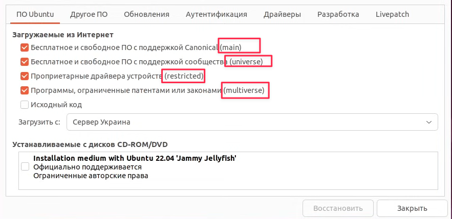
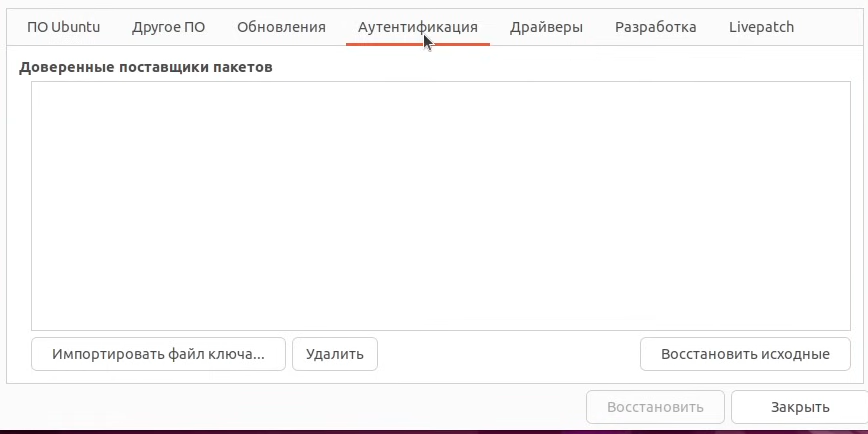
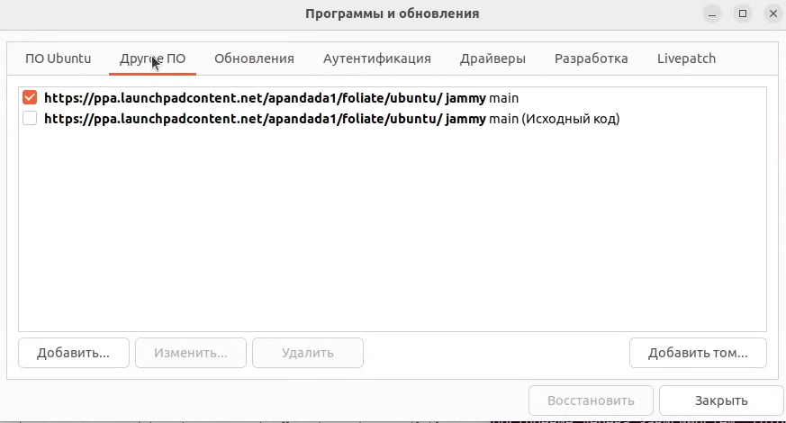
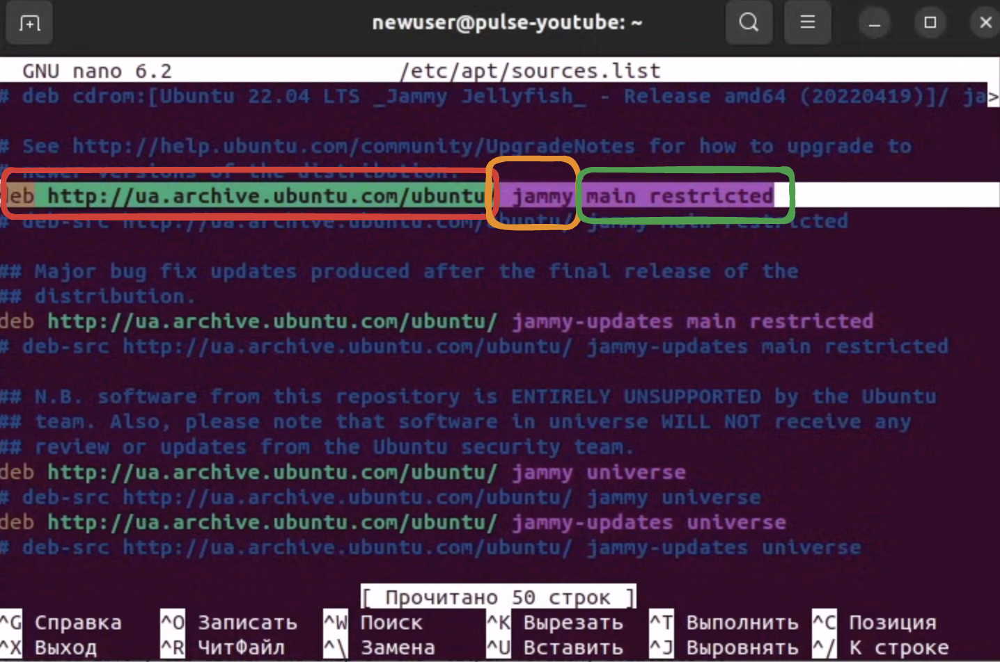

---
aliases:
  - რეპოზიტორიები
  - რეპოზიტორები
  - რეპოზიტორიუმი
  - репозиторий
tags:
  - linux
done: false
created: 2026-09-08
sourse:
---
# Repository ( საცავი )

[Обучение Linux. От новичка до профи. Часть 2 - YouTube](https://www.youtube.com/watch?v=5INZghkqzjA) 

`lsb_release -a` - - - იმის გასაგებად, **დისტრიბუტივის** რომელი ვერსია გიყენია. ასევე ფაილში ***etc/os/release*** . ან უტილიტა neofetch.  

***Repository*** (რეპოზიტორიუმი) - - - არის ე.წ. **საცავი**, სადაც ინახება ფაილები  შემდგომი ქსელით გავრცელებისთვის.

## რეპოზიტორიუმების მიმოხილვა Ubuntu-ში
რეპოზიტორიუმი წარმოადგენს ფაილების ნაკრებს, რომელიც შეიცავს ინფორმაციას პროგრამული უზრუნველყოფის შესახებ ( მაგალითად, ვერსიასა და საკონტროლო ჯამს ) და თავად პროგრამულ პაკეტებს. არსებობს დისტრიბუციის ოფიციალური და მესამე მხარის (დეველოპერების) რეპოზიტორიუმები.

## ოფიციალური რეპოზიტორების კატეგორიები Ubuntu-ში
**Ubuntu**-ს ოფიციალური რეპოზიტორიუმები **4 ძირითად სექციად** იყოფა. 
მათი ნახვა და მართვა შესაძლებელია გრაფიკული ინტერფეისიდან: 

პროგრამები და განახლებები ( **Software & Updates** ) -> ***პირველი ჩანართი:***


.
- **main** (მთავარი) — Canonical-ის მიერ ოფიციალურად მხარდაჭერილი, თავისუფალი და სტაბილური პროგრამული უზრუნველყოფა.
- **universe** (უნივერსალური) — საზოგადოების (Community) მიერ მხარდაჭერილი პროგრამები.
- **restricted** (შეზღუდული) — აპარატურული უზრუნველყოფის პროპრიეტარული (დახურული კოდის) დრაივერები.
- **multiverse** (მულტივერსი) — სრულად პროპრიეტარული პროგრამული უზრუნველყოფა (შეიძლება ჰქონდეს ლიცენზიასთან დაკავშირებული შეზღუდვები).

> **შენიშვნა**: თუ ღია კოდისა და თავისუფალი პროგრამული უზრუნველყოფის მკაცრი მიმდევარი არ ხართ, ბოლო ორი კატეგორია ჩართული უნდა დატოვოთ.

დამატებითი კონფიგურაციის ჩანართები ( Software & Updates )

***მეორე ჩანართი*** — „სხვა პროგრამები“ ( Other Software ):

თავდაპირველად ეს ველი ცარიელია. აქ გამოჩნდება სისტემაში დამატებული მესამე მხარის (**Third-party)** რეპოზიტორიუმები.

გრაფიკული ინტერფეისით მუშაობისას, **მესამე მხარის რეპოზიტორიუმების** დამატებისას ხშირად საჭიროა შესაბამისი **GPG გასაღების დამატებაც**, რაც უზრუნველყოფს პაკეტების ციფრული ხელმოწერის ვალიდაციას და უსაფრთხოებას.

ჩანართი „აუტენტიკაცია“ (**Authentication**):

.

აქ ინახება, ემატება ან იშლება სანდო **GPG** გასაღებები.

ჩანართი „განახლებები“ ( Updates ):

რეკომენდებულია სისტემური და უსაფრთხოების ავტომატური განახლებების თქვენთვის სასურველ რეჟიმზე მორგება ან, საჭიროებისამებრ, მათი სრულად გამორთვა.

## PPA Repository 

***PPA***  - - - **personal package arhive**.
რისთივსაა საჭირო: ubuntu და არამარტო, აკონტროლებს რა პროგრამები და რა ვერსიები თავსდება რეპოზიტორიებში , რაც სისტემის სტაბილური მუშაობის გარანტია. რასაც დრო ჭირდება , რამოდენიმე თვეებიც. 
ამიტომ შეიძლება საჭირო პროგრამა ოფიციალურ რეპოზიტორიებში დიდი ხნის განმავლობაში არ იყოს. ან თუ არის , არ არის აქტუალური ვერსია. 

ამიტომ გამოიყენება "არაოფიციალური რეპოზიტორიები". 
საამისოდ **ubuntu**-ს აქვს სპეციალური პლათფორმა **[Launchpad](https://launchpad.net/)** . 
სადაც პროგრამისტებს შეუძლიათ განათავსონ რეპოზიტორიები და ჩვენ მოვნახოთ და "დავუერთდეთ". 

> საბოლოოდ მნიშვნელოვანი განსხვავება **PPA Repository** და სხვა **Repository**-ის შორის არაა, გარდა იმისა რომ: 
> - ერთი ოფიციალურია და მეორე არაოფიციალური("არ შემოწმებული")
> - არაოფიციალური ჩვენი ხელით უნდა დავამატოთ სისტემაში და თუ საჭირო იქნა "გასაღებიც" დავამატოთ.

### რეპოზიტორიის დამატება : 
#### 1. 
 **[Launchpad](https://launchpad.net/)**  აქ ან სადმე სხვაგან მონახავ , სადაც ასევე ინსტრუქცია არის ხოლმე როგორ დაამატო: 
**Ubuntu**-ს მსგავს სისტემებში, ეს ყველაფერი ბრძანების გამოყენებით ხდება.

```bash
sudo add-apt-repository ppa:название репозитория
```

или

```bash
sudo add-apt-repository 'deb адрес репозитория'
```
ამის მერე მაგალითად **ubuntu**-ში შემდეგ გრაფაში დაემატება რეპოზიტორი და მერე ამ რეპოზიტორიაში არსებულ პროგრამას აყენებ.

.
#### 2. 
 **Debian** ოპერაციულ სისტემაში, ისევე როგორც მსგავს ოპერაციულ სისტემაში, **საცავები რეგისტრირებულია ფაილში**` /etc/apt/sources.list` 
 
 .
 რაც დაკომენტარებული არაა, ჩართლია და მუშაობს. 
 ის შედგება **მისამართისგან** ; მერე **დისტრიბუტივის ვერსია** და **ხაზი("ვეტკა")** რომელსაც ეკუთვნის ეს რეპოზიტორი.
ამ ლოგიკით შეიძლება ასეც დამატება (რეპოზიტორიის ჩაკოპირებით )


### ***რეპოზიტორიის წაშლა:***   **"--remove"**

```bash
sudo add-apt-repository --remove ppa:название репозитория
```


---
## მაგალითისთვის დავამატოთ wine-ის ბოლო ვერსია: 

Например, давайте установим ***самую последнюю версию Wine в Debian***. Для этого в конец файла добавьте следующую строку

```bash
deb https://dl.winehq.org/wine-builds/debian/ название main
```

**название** — это кодовое имя дистрибутива(например stretch — Debian 9, jessie — Debian 8, и т.д)

1. deb — указывает на то, что это пакет debian
2. Далее идет адрес хранилища
3. Кодовое имя дистрибутива
4. И компонент ***main*** указывает вам на то, что вы используете полностью свободное программное обеспечение(Также существует еще ***contrib*** — который использует свободное по, но зависимости могут содержать не свободное по, и ***non-free*** — которое использует полностью не свободное по).

Сохраняем и закрываем файл сочетанием клавишам — Ctrl+O и Ctrl+X
...
**Добавляем ключ**

```bash
wget -nc https://dl.winehq.org/wine-builds/Release.key
sudo apt-key add Release.key
```

Включаем возможность установки 32bit архитектур

```bash
sudo dpkg --add-architecture i386
```

Обновляем список пакетов, и устанавливаем последнюю версию wine

```bash
sudo apt-get update
sudo apt-get install --install-recommends winehq-devel
```

После установки, проверяем версию *Wine*

```bash
linux@PC:~$ wine --version
wine-2.13
```

Но можно сделать все намного проще, и установить  необходимые инструменты, чтобы мы могли добавлять репозитории как в  системах Ubuntu.

Открываем терминал, и вводим команду

```bash
sudo apt install software-properties-common python-software-properties
```

После этого мы можем добавлять репозитории из командной строки.

