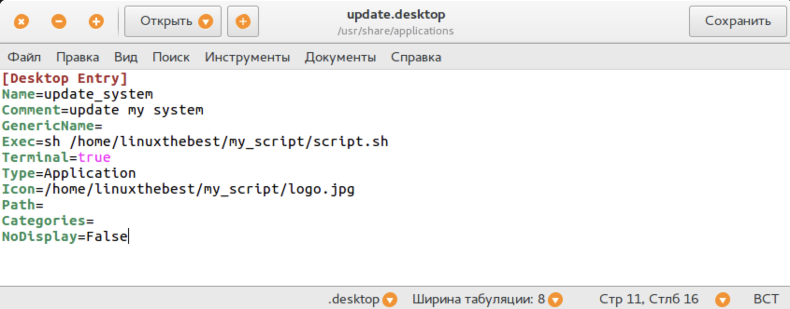
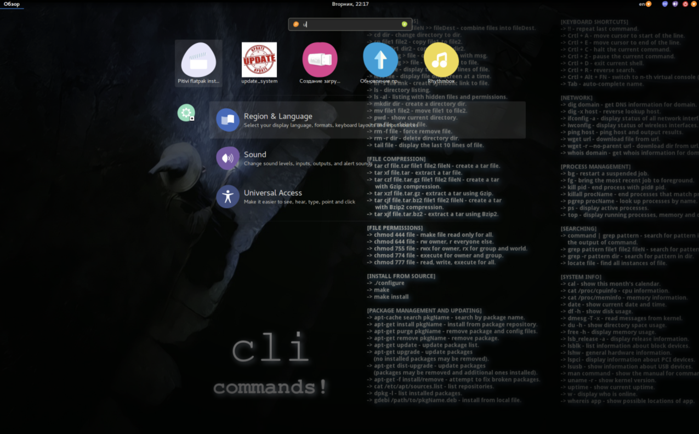

---
aliases:
tags:
  - linux
done: false
created: 2026-09-07
sourse:
---
# script -ის იარლიყი Linux-ში

 я бы хотел создать ярлык  запуска, так же как и обычное приложение. Для этого идем в интернет и  качаем любую **png** картинку, что соответствует нашему скрипту

Я нашел вот такую:


.
Теперь переходим в директорию где у нас лежат ярлыки всех приложений

```bash
cd /usr/share/applications/
```

и создаем новый файл приложения

```bash
sudo gedit update_system.desktop
```

и прописываем такие строчки

```shell
 [Desktop Entry]
 Name=      — имя приложения, которое будет отображаться под иконкой в Главном меню
 Comment=
 GenericName=
 Keywords=     — слова, по которым будет искаться данный ярлык в Главном меню
 Exec=.        — строка запуска приложения
 Terminal=true.      — (true или false)- запускать или нет приложение в окне терминала
 Type=Application    — определяет «раздел» в Главном меню, где будет находится ярлык приложения
 Icon=    — путь к иконке (poto)
 Path=     — путь к рабочему каталогу приложения
 Categories=    — категории, к которым будет относится ярлык вашего приложения при выборе в Главном меню фильтров.
 NoDisplay=(true или false)    — Не отображать иконку в Главном меню(если true)
```

Заполняем обязательные поля

.
Сохраняем и закрываем

теперь ищем наше так называемое «приложение для обновления системы» в главном меню запускаем и вводим пароль

.
Как видим наш скрипт успешно отработал.