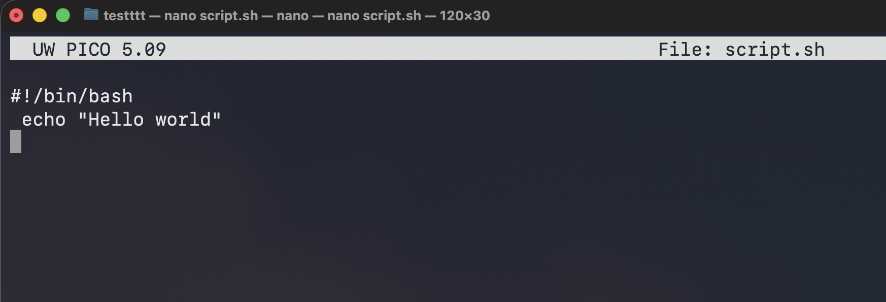

---
aliases:
tags:
  - linux
done: false
created: 2026-09-07
sourse:
---
# script -ის შექმნა

## Как создать script
### თეორია: 
Простейший пример скрипта для командной оболочки Bash:

```bash
#!/bin/bash 
echo "Hello world"
```

Утилита **echo** выводит строку, переданную ей в параметре на  экран. Первая строка особая, она задает программу, которая будет  выполнять команды.  - `#!/bin/bash`
Вообще говоря, мы можем создать скрипт на любом  другом языке программирования и указать нужный интерпретатор, например,  на python:

```python
#!/usr/bin/env python 
print("Hello world")
```

Или на PHP:

```PHP
#!/usr/bin/env php 
echo "Hello world";
```

**В первом случае** мы прямо указали на программу, которая будет  выполнять команды. 
**в двух следующих** мы не знаем точный адрес программы,  поэтому просим утилиту ***env*** найти ее по имени и запустить. 
Такой подход  используется во многих скриптах. Но это еще не все. 
В системе Linux,  чтобы система могла выполнить скрипт, нужно установить на файл с ним  флаг исполняемый. ( `-x` )

Этот флаг ничего не меняет в самом файле, только говорит системе, что это не просто текстовый файл, а программа и ее нужно выполнять, открыть файл, узнать интерпретатор и выполнить. 
Если интерпретатор не указан,  будет по умолчанию использоваться интерпретатор пользователя. 
Но  поскольку не все используют **bash**, нужно указывать это явно.

### პრაქტიკა: 
#### 1. შექმნა: 

Для создания скрипта не потребуется много усилий, но чтобы написать  
 сценарий(программу)   , то потребуется изучать дополнительную литературу.

Мы рассмотрим самую основу написания скриптов, итак приступим.

В самом начале чтобы писать скрипты нам нужно создать каталог для  наших скриптов и файл куда мы будем все писать, для этого открываем  терминал и создаем каталог

```bash
mkdir my_script
```

Переходим в только-что созданную директорию
```bash
cd my_script
```

И создаем файл
```bash
sudo gedit script.sh - - - gedit ტექსტური რედაქტორით 
sudo vim script.sh   - - - vim -ით
sudo nano script.sh  - - -  nano-თი
nano script.sh       - - -  nano-თი
```

**sudo** - თი თუ შექმნი, **root** მეპატრონე ყავს. მაგალითად **mac**-ზე პირდაპირ შემიძია გავუშვა რომ მერე ჩემი უზერის "საკუთრება" იყოს. `nano script.sh` .

у нас откроется текстовый редактор **gedit**, я люблю больше **vim**, но у  вас он больше всего не будет установлен, поэтому показываю на  стандартном.


> **p.s**. ავტორმა სხვა  ტექსტი შეიყვანა მე უბრალოდ ზემოთ რაც იყო ის: 

```bash
#!/bin/bash 
echo "Hello world"
```


.
#### 2. უფლებების მინიჭება: 

Так как  **[права](🔥%20შესრულებადი(исполняемый%20,%20Executable)%20ფაილი.md)**   на запуск по-умолчанию отсутствуют то добавляем командой.  ( Как сделать файл исполняемым в Linux )

```bash
chmod +x /home/fox/my_script/script.sh
```

Все наш **скрипт готов**, можно и запускать, 

```bash
./script.sh
```

[🧲 sh (shell) script-ის გაშვება (3)](🧲%20sh%20(shell)%20script-ის%20გაშვება%20(3).md) 

