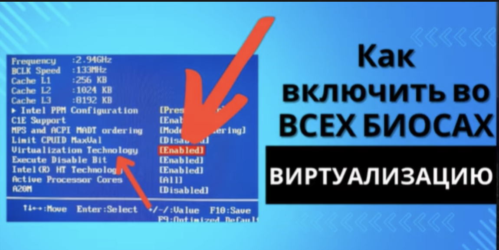
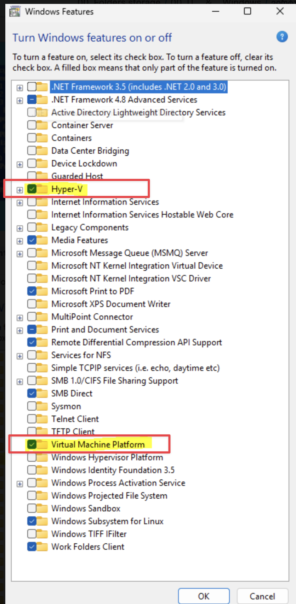
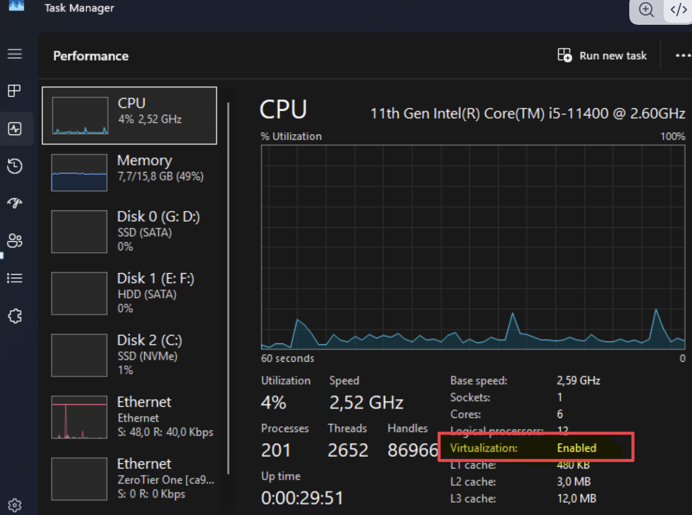

---
aliases:
tags:
  - windows
done: false
created: 2026-09-25
sourse:
---
# ვირტუალიზაცია

### როგორ ჩავრთო ვირტუალიზაცია ? 

[ВИРТУАЛИЗАЦИЯ НА ПАЛЬЦАХ - YouTube](https://www.youtube.com/watch?v=C8YkihDg30I) 

1. ბიოსში უნდა იყოს ჩართლი ვირტუალიზაცია:

.
2.  `control panel / programs and features / Turn windows features on or off`

.
### როგორ შევამოწმო ვირტუალიზაცია ?

როგორ შევამოწმო **windows**-დან ჩართლი მაქვს თუ არა ??

.
